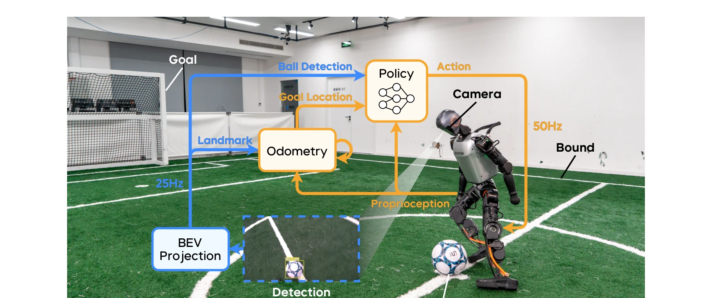
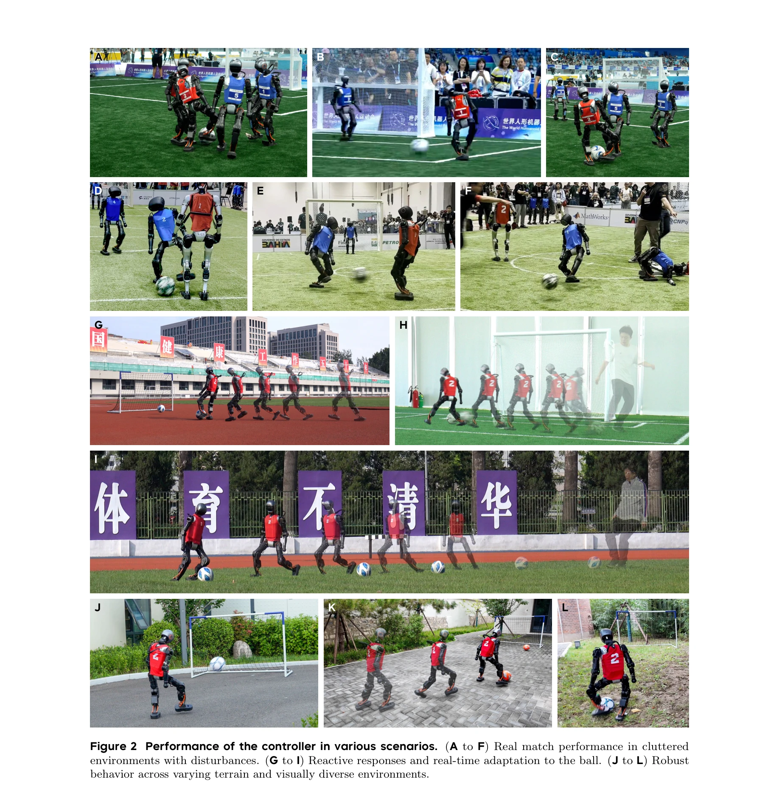
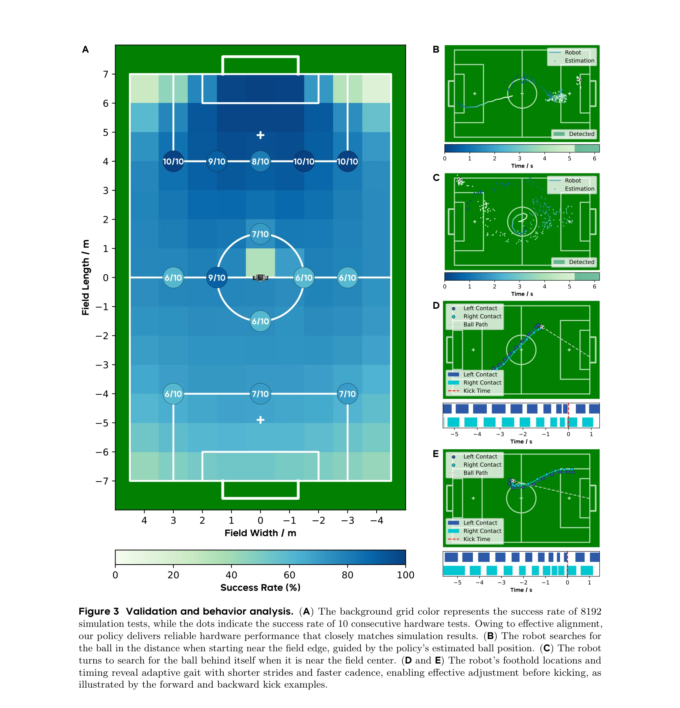

# Learning Vision-Driven Reactive Soccer Skills for Humanoid Robots

> **저자**: Yushi Wang, Changsheng Luo, Penghui Chen, Jianran Liu, Weijian Sun, Tong Guo, Kechang Yang, Biao Hu, Yangang Zhang, Mingguo Zhao | **날짜**: 2025-11-06 | **DOI**: [10.48550/arXiv.2511.03996](https://doi.org/10.48550/arXiv.2511.03996)

---

## Essence

*Figure 1 System overview. The real-world robot is equipped with an onboard camera for visual perception. Image*

본 논문은 시각 정보를 직접 제어 루프에 통합하여 휴머노이드 로봇이 강화학습 기반의 통합 컨트롤러를 통해 반응형 축구 스킬을 습득하도록 한다. Adversarial Motion Priors를 시각 기반 동적 제어로 확장하고, encoder-decoder 아키텍처와 가상 지각 시스템을 도입하여 불완전한 관측에서 특권 상태를 복구하고 지각-동작 협응을 구현한다.

## Motivation

- **Known**: 기존 로봇 축구 시스템은 모듈화된 접근법으로 인해 응답 지연과 부조화 거동이 발생하며, DeepMimic 기반 모션 모방은 엄격한 시간 정렬에 의존하여 동적 환경에서 유연성이 제한된다. GAN 기반 방법들은 고유수용성만을 이용한 정적 시나리오에 초점을 맞추고 있다.
- **Gap**: 시각 피드백을 통한 진정한 반응형 축구 스킬 습득과 현실의 지각 제약 조건 하에서의 일관되고 강건한 행동 생성 사이의 갭이 존재한다. 기존 RL 기반 축구 제어는 NeRF 기반 시각에 크게 의존하여 현실 상황의 일반화가 어렵다.
- **Why**: 로봇 축구는 지각-동작 루프의 긴밀한 결합, 고속 동적 환구현, 실시간 비전 기반 제어 등이 필요하여 구체화된 지능(embodied intelligence)의 종합적 벤치마크이다. 성공적인 시스템은 인간 수준의 로봇 제어 기술 발전을 크게 가속화할 수 있다.
- **Approach**: AMP를 확장하여 실제 동적 환경의 시각 기반 제어에 적용하고, encoder-decoder 네트워크와 실제 카메라의 특성을 모방하는 가상 지각 시스템을 결합한다. 다중-비평 프레임워크를 도입하여 보상 목표 간 간섭을 완화하고 훈련을 안정화한다.

## Achievement

*Figure 2 Performance of the controller in various scenarios. (A to F) Real match performance in cluttered*

- **단계 훈련 불필요한 통합 학습**: 기존 3단계 훈련과 달리 단일 단계 훈련으로 공 탐색, 추적, 다방향 킹 등의 적응적 행동을 습득
- **강강한 현실 성능**: RoboCup 2025 Adult-size Humanoid League 우승팀 및 2025 World Humanoid Robot Games 우승팀으로서 경쟁 환경에서의 검증된 성능
- **다양한 표면에서의 안정성**: 잔디, 석판, 흙, 아스팔트, 고무 등 다양한 지형에서 일관된 행동 생성
- **시각 반응성 입증**: encoder-decoder 설계와 가상 지각 시스템으로 지각 노이즈 완화 및 높은 반응성 달성

## How

*Figure 3 Validation and behavior analysis. (A) The background grid color represents the success rate of 8192*

- **Encoder-decoder 아키텍처**: 역사적 관측을 인코더로 압축하여 제어 관련 잠재 표현 생성, 디코더로 부분적 노이즈 입력에서 특권 상태 복구
- **가상 지각 시스템**: 시뮬레이션에서 온보드 비전의 특성(노이즈, 지연, 공간 제약)을 모방하여 sim-to-real 간격 축소
- **BEV 투영**: 카메라에서 획득한 공 검출 및 필드 랜드마크를 Bird's Eye View 공간으로 투영하여 정규화된 표현 제공", '**다중-비평 프레임워크**: 여러 보상 목표 간의 상호 간섭 완화 및 훈련 안정화
- **AMP 확장**: Adversarial Motion Priors를 고유수용성 기반 모션 모방에서 시각 피드백 기반 동적 제어로 확장
- **주행 및 지각 통합**: 정책이 공의 위치에 따라 보행을 역동적으로 조정하여 빠르고 강력한 킥 달성

## Originality

- **GAN 기반 방법의 확장**: AMP를 고유수용성만의 정적 시나리오에서 시각 기반 동적 제어로 확장한 첫 시도
- **실제 지각 특성 모델링**: 온보드 카메라의 노이즈, 지연, 공간 제약을 명시적으로 모방하는 가상 지각 시스템 도입
- **단일 단계 훈련 패러다임**: 기존 3단계 훈련 프로세스를 단일 단계로 통합하여 효율성 향상
- **실제 경쟁 환경에서의 검증**: RoboCup 2025 등 공식 대회에서의 우승으로 실제 환경에서의 실용성 입증

## Limitation & Further Study

- **온보드 컴퓨팅 제약**: Jetson AGX Orin의 제한된 연산 능력으로 인해 더 복잡한 비전 모델 통합의 어려움
- **단일 로봇 플랫폼**: Booster T1에만 검증되었으며 다른 휴머노이드 로봇으로의 일반화 가능성 미지수
- **정적 환경 가정**: 골 위치 추론에 odometry 모듈 사용으로 인해 GPS 거부 환경이나 극심한 지각 왜곡 상황에서의 성능 불명확
- **후속 연구 방향**: 다중 로봇 협력 전술 학습, 부분 관찰성(POMDP) 명시적 처리, 메타 학습을 통한 빠른 환경 적응

## Evaluation

- Novelty: 4/5
- Technical Soundness: 4/5
- Significance: 4/5
- Clarity: 4/5
- Overall: 4/5

**총평**: 본 논문은 시각 기반 동적 제어에서 GAN 방법론을 창의적으로 확장하고, 실제 지각 특성을 모델링하여 반응형 축구 스킬을 일관되게 습득하도록 한다. RoboCup 우승을 포함한 실제 환경에서의 검증은 로봇 제어 분야의 중요한 진전을 보여준다.

## Related Papers

- 🏛 기반 연구: [[papers/1536_Learning_Soccer_Skills_for_Humanoid_Robots_A_Progressive_Per/review]] — 시각 기반 반응형 축구 기술이 PAiD 프레임워크의 지각-행동 통합 아키텍처의 구체적인 적용 사례로서 이론적 토대를 제공함
- 🏛 기반 연구: [[papers/1518_Learning_Agile_Striker_Skills_for_Humanoid_Soccer_Robots_fro/review]] — 강화학습 기반 시각 제어 시스템의 기본 개념이 축구 로봇의 견고한 볼 킹 기술 학습에 방법론적 토대를 제공함
- 🔗 후속 연구: [[papers/1267_AMP_Adversarial_Motion_Priors_for_Stylized_Physics-Based_Cha/review]] — AMP 프레임워크를 시각 기반 동적 제어로 확장하여 지각-동작 협응을 구현한 발전된 형태임
- 🔗 후속 연구: [[papers/1518_Learning_Agile_Striker_Skills_for_Humanoid_Soccer_Robots_fro/review]] — 시각 기반 반응형 축구 기술의 기본 아이디어를 Teacher-student 증류와 제약 RL을 통해 더욱 견고하게 발전시킨 형태임
- 🔗 후속 연구: [[papers/1536_Learning_Soccer_Skills_for_Humanoid_Robots_A_Progressive_Per/review]] — 시각 기반 반응형 축구 기술의 기본 아이디어를 점진적 지각-행동 통합이라는 체계적인 학습 프레임워크로 발전시킨 형태임
- 🏛 기반 연구: [[papers/1380_Embodied-R1_Reinforced_Embodied_Reasoning_for_General_Roboti/review]] — Embodied chain-of-thought reasoning이 Embodied-R1의 포인팅 기반 perception-action gap 극복에 이론적 기반을 제공한다.
