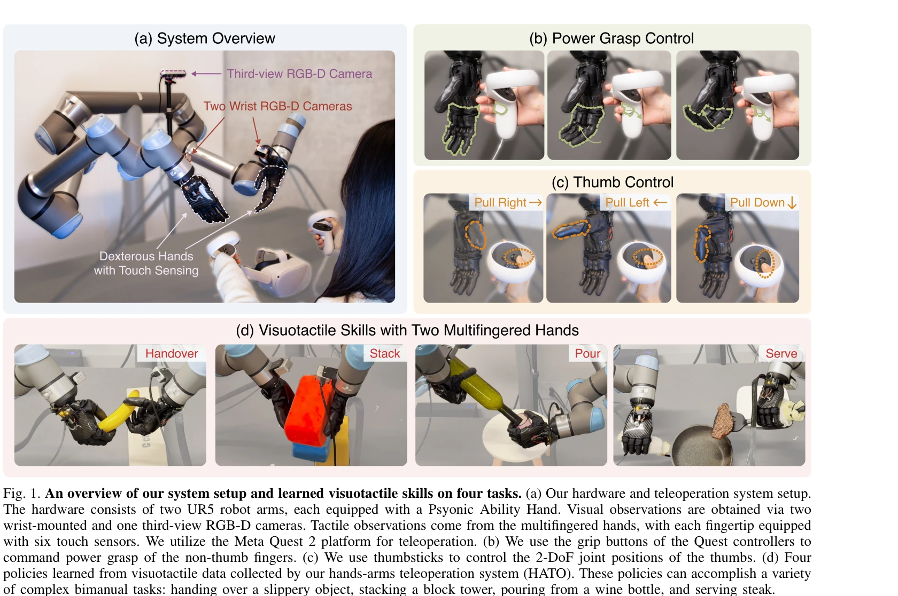
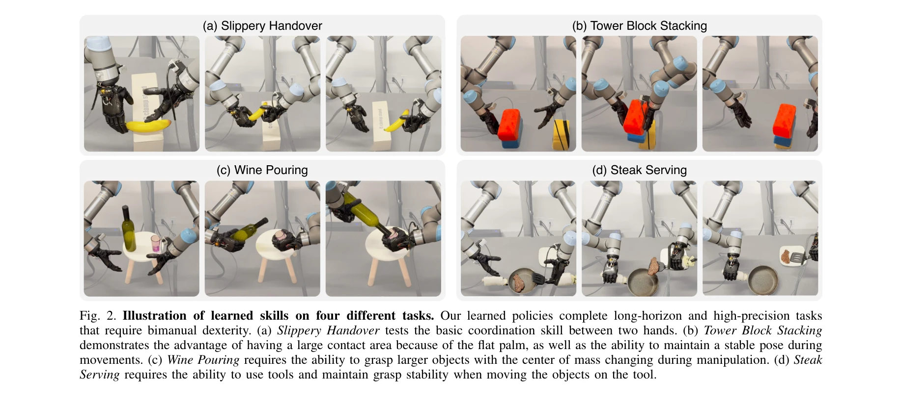

# Learning Visuotactile Skills with Two Multifingered Hands

> **저자**: Toru Lin, Yu Zhang, Qiyang Li, Haozhi Qi, Brent Yi, Sergey Levine, Jitendra Malik | **날짜**: 2024-04-25 | **URL**: [https://arxiv.org/abs/2404.16823](https://arxiv.org/abs/2404.16823)

---

## Essence

*Fig. 1. An overview of our system setup and learned visuotactile skills on four tasks. (a) Our hardware and teleoperatio*

VR 기반 원격조종 시스템 HATO와 의족 손을 활용한 다중 손가락 로봇 손의 양손 조작 시스템을 구축하고, visuotactile 데이터로부터 imitation learning을 통해 복잡한 양손 조작 기술을 학습한다.

## Motivation

- **Known**: 기존 양손 조작 시스템은 대부분 parallel-jaw gripper를 사용하며 제한된 운동 범위를 가진다. Imitation learning은 인간 시연으로부터 정책을 학습하는 유망한 접근법이다.
- **Gap**: 양손 다중 손가락 시스템을 위한 저비용 원격조종 시스템이 부족하고, 촉각 센싱이 장착된 다중 손가락 로봇 손 하드웨어의 가용성이 극히 제한적이다.
- **Why**: 인간 수준의 민첩성을 달성하기 위해서는 적응형 파지, 손가락 조작, 양손 협력 등이 필수적이며, 촉각 피드백은 미끄러운 물체 조작 같은 고정밀 작업에서 중요하다.
- **Approach**: Meta Quest 2 VR 컨트롤러를 활용한 HATO 원격조종 시스템을 개발하고 Psyonic Ability Hand를 repurpose하여 visuotactile 데이터를 수집한 후 end-to-end 신경망 정책 학습을 수행한다.

## Achievement

*Fig. 2. Illustration of learned skills on four different tasks. Our learned policies complete long-horizon and high-prec*

- **HATO 시스템**: 상용 VR 하드웨어 기반의 저비용 양손 원격조종 시스템으로 직관적인 제어와 효율적인 데이터 수집 지원
- **하드웨어 혁신**: 의족용 Psyonic Ability Hand를 6축 촉각 센서와 함께 로봇 연구용으로 재목적화
- **소프트웨어 스위트**: 다중모달 데이터 처리, 확장 가능한 정책 학습, 배포를 위한 포괄적인 소프트웨어 제공
- **학습 성과**: 30분~2시간의 원격조종 데이터로부터 손가락 협력, 부피가 큰 물체 조작, 도구 사용 등의 복잡한 양손 작업 정책 학습
- **ablation 연구**: 데이터셋 크기, 센싱 모달리티, 시각 전처리의 영향을 분석하여 vision과 touch의 시너지 효과 입증

## How

*Fig. 3. Fingertip Tactile Sensor Layout. There are six tactile*

- UR5e 로봇 팔 2개에 Psyonic Ability Hand 부착 (각 손가락당 6 DoF, 손가락 끝 6축 촉각 센서)
- Meta Quest 2 VR 컨트롤러의 pose를 로봇 암의 end-effector pose로 매핑, grip button과 thumbstick으로 손의 관절 위치 제어
- RGB-D 카메라 3개 (손목 장착 2개, 제3자 시점 1개)로 시각 정보 수집
- 각 손가락 끝에서 압력 비례 연속값 수집
- Imitation learning 기반 정책 학습: behavioral cloning 또는 diffusion policy 등의 신경망 모델 사용
- Wrist-mounted camera의 중요성 강조, depth 정보의 제한적 효과 확인

## Originality

- 양손 다중 손가락 조작과 visuotactile imitation learning의 첫 번째 통합 시스템
- 의족 로봇 손을 연구용으로 repurpose하는 하드웨어 혁신 접근
- VR 컨트롤러 기반의 직관적 teleoperation 매핑 방식 (morphology 차이를 손가락 분류로 해결)
- 양손 시스템에서 촉각 센싱의 중요성을 실증적으로 입증하는 포괄적 ablation study

## Limitation & Further Study

- 촉각 센서는 손가락 끝 6개 위치로 제한되어 손가락 측면이나 손가락 관절 부분의 접촉 정보 부재
- 학습된 정책은 특정 하드웨어(UR5e + Ability Hand)에 종속적이어서 다른 로봇 플랫폼으로의 전이 학습 미검증
- 4개의 고정된 작업으로만 평가되어 일반화 능력에 대한 증거 부족
- 실시간 원격조종으로 인한 operator fatigue 및 장시간 데이터 수집의 확장성 제약
- 후속 연구: 원격조종 없이 reinforcement learning 또는 self-supervised learning으로 더 복잡한 작업 학습, 타 로봇 플랫폼으로의 정책 전이, sim-to-real 기법 적용

## Evaluation

- Novelty: 4/5
- Technical Soundness: 3/5
- Significance: 4/5
- Clarity: 4/5
- Overall: 4/5

**총평**: 본 논문은 양손 다중 손가락 로봇 조작의 새로운 벤치마크를 제시하며, 저비용 VR 기반 원격조종 시스템과 재목적화된 의족 하드웨어를 통해 실용적인 솔루션을 제공한다. Visuotactile 데이터의 중요성을 명확히 입증하고 포괄적 ablation study를 제공하는 점에서 로봇 조작 분야에 상당한 기여를 한다.

## Related Papers

- 🔄 다른 접근: [[papers/1297_Bunny-VisionPro_Real-Time_Bimanual_Dexterous_Teleoperation_f/review]] — VR 기반 양손 조작 시스템 HATO와 실시간 양손 정교 텔레오퍼레이션 Bunny-VisionPro가 동일한 양손 제어 문제를 다룬다.
- 🏛 기반 연구: [[papers/1450_HITTER_A_HumanoId_Table_TEnnis_Robot_via_Hierarchical_Planni/review]] — visuotactile 데이터로 양손 조작을 학습하는 방법이 저비용 하드웨어로 정교한 양손 조작을 학습하는 기반이 된다.
- 🧪 응용 사례: [[papers/1355_DexGarmentLab_Dexterous_Garment_Manipulation_Environment_wit/review]] — 양손 visuotactile 기술 학습이 의복 조작과 같은 복잡한 정교 조작 환경에서 직접 활용될 수 있다.
- 🧪 응용 사례: [[papers/1357_Dexterous_Manipulation_through_Imitation_Learning_A_Survey/review]] — Two multifingered hands를 통한 visuotactile 스킬 학습이 dexterous manipulation imitation learning의 실제 적용 사례를 제공한다.
