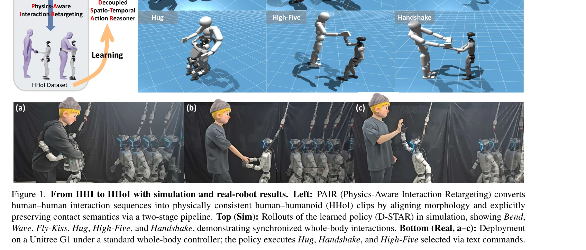
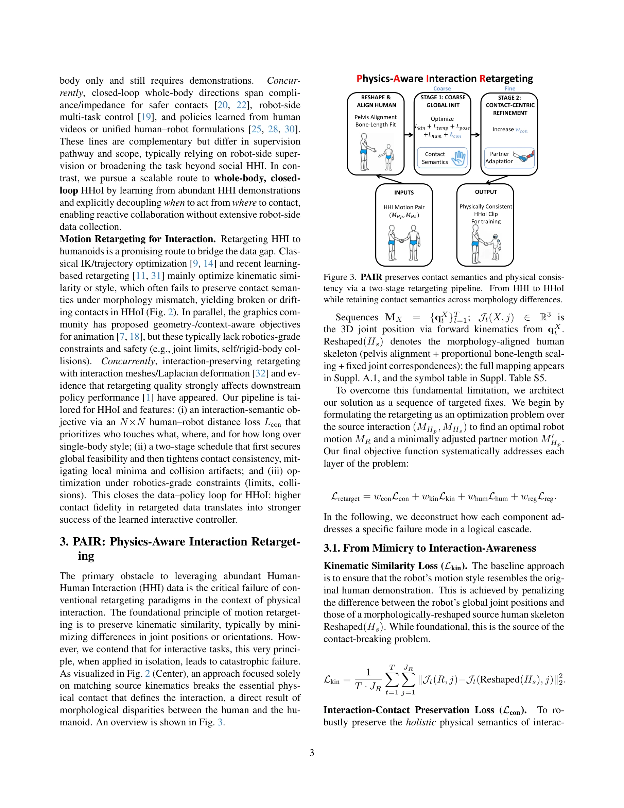

# Learning Whole-Body Human-Humanoid Interaction from Human-Human Demonstrations

> **저자**: Wei-Jin Huang, Yue-Yi Zhang, Yi-Lin Wei, Zhi-Wei Xia, Juantao Tan, Yuan-Ming Li, Zhilin Zhao, Wei-Shi Zheng | **날짜**: 2026-01-14 | **DOI**: [10.48550/arXiv.2601.09518](https://doi.org/10.48550/arXiv.2601.09518)

---

## Essence

*Figure 1. From HHI to HHoI with simulation and real-robot results. Left: PAIR (Physics-Aware Interaction Retargeting) co*

인간-인간 상호작용(HHI) 데이터를 물리적으로 일관성 있게 인간형 로봇 상호작용(HHoI)으로 변환하는 PAIR 파이프라인과, 시간적 의도와 공간적 선택을 분리하여 동기화된 전신 협력을 학습하는 D-STAR 정책을 제안한다.

## Motivation

- **Known**: 인간형 로봇의 로컬모션, 조작, 인간 데이터 학습은 발전했으나, HHoI는 데이터 부족과 정책 설계 복잡도로 인해 진전이 미흡하다. HHI 데이터 재타게팅은 유망하지만 기존 방법들은 접촉 의미론을 보존하지 못한다.
- **Gap**: 표준 재타게팅은 형태 차이로 인해 필수 접촉을 깨뜨리고, 기존 모방 학습 정책은 궤적 모방만 수행하여 상호작용 이해와 반응성이 부족하다.
- **Why**: 인간형 로봇의 자연스러운 인간 협력 능력은 인간 중심 환경에서의 통합과 직관적 상호작용을 가능하게 하므로 중요하며, 이는 로봇의 실용성을 크게 향상시킨다.
- **Approach**: PAIR는 접촉 중심의 2단계 최적화로 물리적 일관성을 보존하고, D-STAR는 Phase Attention(언제)과 Multi-Scale Spatial 모듈(어디)을 분리하여 diffusion head로 융합한다.

## Achievement

*Figure 1. From HHI to HHoI with simulation and real-robot results. Left: PAIR (Physics-Aware Interaction Retargeting) co*

- **PAIR(Physics-Aware Interaction Retargeting)**: 형태 정렬, 운동학적 가능성 확보, 상호작용 인식 목적 함수(Lcon)를 통해 접촉 의미론을 보존하는 2단계 파이프라인 개발
- **D-STAR(Decoupled Spatio-Temporal Action Reasoner)**: 시간적 의도와 공간적 위치 선택을 분리하여 단순 궤적 모방을 넘어 반응적 협력을 가능하게 하는 계층적 정책
- **대규모 물리적으로 일관성 있는 HHoI 데이터셋**: HHI에서 변환된 고품질 감독 신호 생성
- **시뮬레이션 및 실제 로봇 검증**: Unitree G1에 배포하여 Hug, Handshake, High-Five 등 6가지 상호작용 동작 실현

## How

*Figure 3. PAIR preserves contact semantics and physical consis-*

- PAIR 재타게팅: 소스 상호작용(MHp, MHs)에 대해 로봇 동작 MR과 조정된 파트너 동작 M'Hp를 최적화", '목적 함수 설계: Lretarget = wconLcon + wkinLkin + whumLhum + wregLreg로 구성하여 접촉(Lcon), 운동학(Lkin), 인간 표준(Lhum), 정규화(Lreg) 제약 통합
- 2단계 최적화: Stage 1에서 전역 운동학적 가능성 확보(Lkin + Ltemp + Lpose + Lhum + Lcon), Stage 2에서 wcon 증가로 접촉 일관성 정밀화
- D-STAR 정책: Phase Attention으로 언제 행동할지 결정하고 Multi-Scale Spatial 모듈로 어디서 접촉할지 결정하며 diffusion head로 두 스트림 융합
- 모노쿨러 SMPL 인식: 실제 로봇 배포를 위해 단안 RGB로부터 인간 포즈 추정

## Originality

- 접촉 의미론 보존을 위한 N×N 인간-로봇 거리 손실(Lcon) 설계로 '누가 어디를 얼마나 오래 터치하는가'를 우선시", '2단계 재타게팅 스케줄로 지역 최소값과 충돌 아티팩트 완화
- 로봇공학 등급 제약(joint limits, self/rigid-body collisions) 통합으로 기존 그래픽스 기반 방법과 차별화
- 시간 의도(Phase Attention)와 공간 선택(Multi-Scale Spatial)의 명시적 분리로 공간 노이즈에 강건한 정책 학습
- HHI-to-HHoI 데이터 변환과 대응하는 정책 설계의 통합적 솔루션

## Limitation & Further Study

- 시뮬레이션 중심의 정량 평가로 실제 환경의 예측 불가 요소(sensor noise, 동적 상황) 미반영 가능성
- 실제 로봇 시험이 제한된 동작(Hug, Handshake, High-Five)으로만 검증되어 일반화 능력 미확인
- HHI 데이터셋의 다양성 및 포함된 상호작용 유형의 범위 명시 부족
- 후속 연구: 동적 환경에서의 온라인 적응 메커니즘 개발, 더 복잡한 다인 상호작용 확장, 실시간 센서 노이즈 대응 강건성 개선

## Evaluation

- Novelty: 4/5
- Technical Soundness: 3/5
- Significance: 4/5
- Clarity: 4/5
- Overall: 4/5

**총평**: 이 논문은 HHI 데이터의 재활용을 위한 접촉 중심의 PAIR 재타게팅과 상호작용 이해를 위한 D-STAR 정책이라는 두 층위의 혁신적 해결책을 제시하여, 인간형 로봇의 자연스러운 협력을 가능하게 한다. 물리적 일관성 보존과 시간-공간 분리 분석의 조합은 설득력 있으며, 시뮬레이션과 실제 로봇 모두에서 검증하여 실용성을 입증했다.

## Related Papers

- 🔄 다른 접근: [[papers/1502_It_Takes_Two_Learning_Interactive_Whole-Body_Control_Between/review]] — 둘 다 인간-인간 상호작용을 로봇으로 변환하지만 1549는 인간-휴머노이드에, 1502는 이중-휴머노이드에 특화됨
- 🏛 기반 연구: [[papers/1594_OmniRetarget_Interaction-Preserving_Data_Generation_for_Huma/review]] — OmniRetarget의 interaction-preserving 기술이 HHI를 HHoI로 변환하는 기반 방법론을 제공함
- 🧪 응용 사례: [[papers/1487_HUMOTO_A_4D_Dataset_of_Mocap_Human_Object_Interactions/review]] — HUMOTO의 고품질 인간-객체 상호작용 데이터가 인간-휴머노이드 협력 학습의 훈련 데이터를 제공함
- 🔄 다른 접근: [[papers/1502_It_Takes_Two_Learning_Interactive_Whole-Body_Control_Between/review]] — 둘 다 인간-인간 상호작용을 로봇 상호작용으로 변환하지만 1502는 이중-휴머노이드에, 1549는 인간-휴머노이드에 특화됨
- 🔗 후속 연구: [[papers/1594_OmniRetarget_Interaction-Preserving_Data_Generation_for_Huma/review]] — PAIR 파이프라인의 HHI-to-HHoI 변환을 단일 시연 기반 데이터 증강으로 확장하여 효율성을 향상시킴
- 🏛 기반 연구: [[papers/1524_Learning_Human-Humanoid_Coordination_for_Collaborative_Objec/review]] — 인간-휴머노이드 상호작용 학습의 전반적인 방법론과 전신 협응 원리를 제공함
- 🔗 후속 연구: [[papers/1597_One-shot_Adaptation_of_Humanoid_Whole-body_Motion_with_Walki/review]] — 인간-휴머노이드 상호작용 학습에서 보행 사전을 활용한 전신 동작 적응이 상호작용 품질을 향상시킨다.
