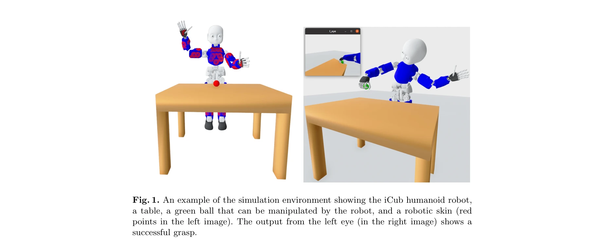
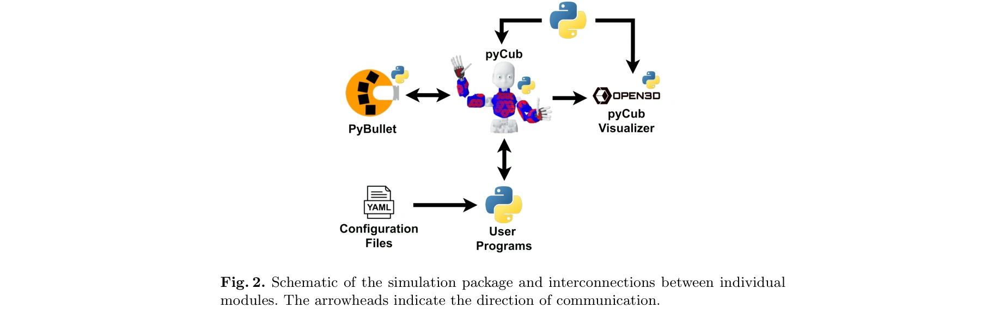

# Learning with pyCub: A Simulation and Exercise Framework for Humanoid Robotics

> **저자**: Lukas Rustler, Matej Hoffmann | **날짜**: 2025-06-02 | **URL**: [https://arxiv.org/abs/2506.01756](https://arxiv.org/abs/2506.01756)

---

## Essence

*Fig. 1. An example of the simulation environment showing the iCub humanoid robot,*

iCub 인문형 로봇의 Python 기반 물리 시뮬레이터 pyCub을 제시하며, C++와 YARP 미들웨어 없이도 학생들이 접근 가능한 교육용 연습 문제들을 제공한다.

## Motivation

- **Known**: 기존 iCub 시뮬레이터(iCub SIM, iCub Gazebo)들이 존재하지만 C++ 코드와 YARP 미들웨어를 필수로 요구하여 초급 사용자에게 진입 장벽이 높다. 로봇 교육용 도구들(Peter Corke의 Python Robotics Toolbox, ROS 기반 프레임워크 등)이 있으나 인문형 로봇에 특화된 저진입장벽 통합 프레임워크는 부족하다.
- **Gap**: 기존 iCub 시뮬레이터들은 복잡한 설정과 C++ 프로그래밍 지식을 요구하여 프로그래밍 경험이 적은 학생들의 학습을 저해한다. Python 기반의 사용자 친화적이면서도 iCub의 전체 기능(피부 센서, 카메라, 관절 제어)을 포함한 통합 교육 프레임워크가 필요하다.
- **Why**: 인문형 로봇 교육의 진입장벽을 낮추면 더 많은 학생들이 고급 로봇 제어 기술(운동학, 동역학, 파악, 응시 제어)을 학습할 수 있으며, Python의 접근성은 비전공 배경의 학습자도 포함할 수 있다.
- **Approach**: PyBullet 물리 엔진을 기반으로 Python 중심의 모듈식 시뮬레이션 환경을 구축하고, 난이도별 연습 문제(기초 제어부터 파악·응시·반응적 제어까지)를 설계하여 실제 과정에서 검증한다.

## Achievement

*Fig. 1. An example of the simulation environment showing the iCub humanoid robot,*

- **Python 기반 완전한 iCub 시뮬레이션**: YARP 미들웨어 없이 53개 자유도, 2개 카메라, 4000개 촉각 센서 포함
- **사용자 친화적 인터페이스**: 낮은 프로그래밍 경험도의 사용자를 위한 고수준 제어 함수(관절/속도/데카르트 공간 제어)
- **확장 가능한 교육 콘텐츠**: 난이도별 연습 문제로 기초부터 고급 작업(gazing, grasping, reactive control)까지 지원
- **실제 교육 검증**: 2학기 인문형 로봇 과정에서 배포 및 평가 완료
- **오픈소스 공개**: 시뮬레이션, 연습 문제, 문서, Docker 이미지, 예제 영상 공개 배포

## How

*Fig. 2. Schematic of the simulation package and interconnections between individual*

- PyBullet 물리 엔진 선정 (오픈소스, 크로스플랫폼, 저계산량)
- Open3D를 이용한 커스텀 GUI 개발 (PyBullet 내장 GUI의 제약 극복)
- YAML 기반 환경 설정으로 실험별 커스터마이징 가능
- 수동 시뮬레이션 스테핑으로 저사양 컴퓨터에서도 정확한 계산 보장
- 관절 공간(position/velocity) 및 데카르트 공간 제어 인터페이스 제공
- 시각(RGB, depth), 고유감각(proprioceptive), 촉각(4000개 센서) 데이터 접근
- 난이도별 연습 문제 세트 설계 및 배포

## Originality

- YARP 의존성 제거로 전 계층의 사용자 접근 가능성 향상
- Python 중심 설계로 교육 로봇 프레임워크의 진입장벽 혁신적 감소
- iCub의 전체 피부 센서(4000개) 시뮬레이션을 포함한 유일한 접근
- 기존 시뮬레이터와 달리 전문가 도구가 아닌 교육용 프레임워크로의 명확한 포지셔닝

## Limitation & Further Study

- **전이 제약**: 시뮬레이션에서 실제 iCub으로의 코드 전이 불가능 (YARP/C++ 변환 필요)
- **물리 정확도 미검증**: PyBullet 기반 물리 시뮬레이션의 iCub 대비 정확도 정량평가 부재
- **고급 계획자 부재**: 기존 시뮬레이터의 고수준 플래너 미포함
- **단일 코어 성능**: PyBullet의 단일 코어 구조로 대규모 강화학습(reinforcement learning) 실험에는 제약
- **후속 연구**: 더 고정확 물리 모델링, 실제 로봇과의 sim-to-real 전환 파이프라인, 멀티프로세싱 최적화 필요

## Evaluation

- Novelty: 4/5
- Technical Soundness: 3/5
- Significance: 4/5
- Clarity: 4/5
- Overall: 4/5

**총평**: pyCub은 인문형 로봇 교육의 접근성을 혁신적으로 개선한 실용적 프레임워크로, 기존 시뮬레이터의 복잡성을 Python으로 제거하면서도 iCub의 핵심 기능을 충실히 구현했다. 실제 교육 배포와 오픈소스 공개를 통해 재현성과 영향력이 높으나, sim-to-real 전이 불가능성과 물리 정확도 검증 부족은 향후 개선 대상이다.

## Related Papers

- 🔄 다른 접근: [[papers/1477_Humanoid-Gym_Reinforcement_Learning_for_Humanoid_Robot_with/review]] — iCub용 Python 시뮬레이터 pyCub과 휴머노이드 강화학습용 Humanoid-Gym이 모두 교육 및 연구용 시뮬레이션 환경을 제공한다.
- 🔗 후속 연구: [[papers/1421_Genie_Sim_30__A_High-Fidelity_Comprehensive_Simulation_Platf/review]] — iCub 교육용 프레임워크 pyCub이 고충실도 종합 시뮬레이션 플랫폼 Genie Sim으로 확장될 수 있다.
- 🏛 기반 연구: [[papers/1484_HumanPlus_Humanoid_Shadowing_and_Imitation_from_Humans/review]] — Python 기반 휴머노이드 시뮬레이션 pyCub이 MuJoCo Playground의 모듈형 시뮬레이션 프레임워크를 기반으로 한다.
- ⚖️ 반론/비판: [[papers/1458_LLM-Driven_Robots_Risk_Enacting_Discrimination_Violence_and/review]] — 로봇의 악성 고정관념 실행과 LLM 기반 로봇의 차별/폭력 위험이라는 관련된 사회적 문제를 제기한다.
- ⚖️ 반론/비판: [[papers/1286_Beyond_Tools_and_Persons_Who_Are_They_Classifying_Robots_and/review]] — 로봇의 분류와 거버넌스 논의에 대해 로봇이 실제로 악성 고정관념을 실행한다는 반대 관점을 제시한다
