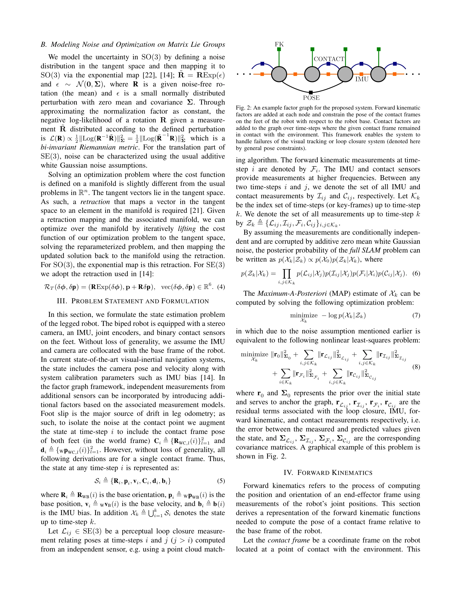
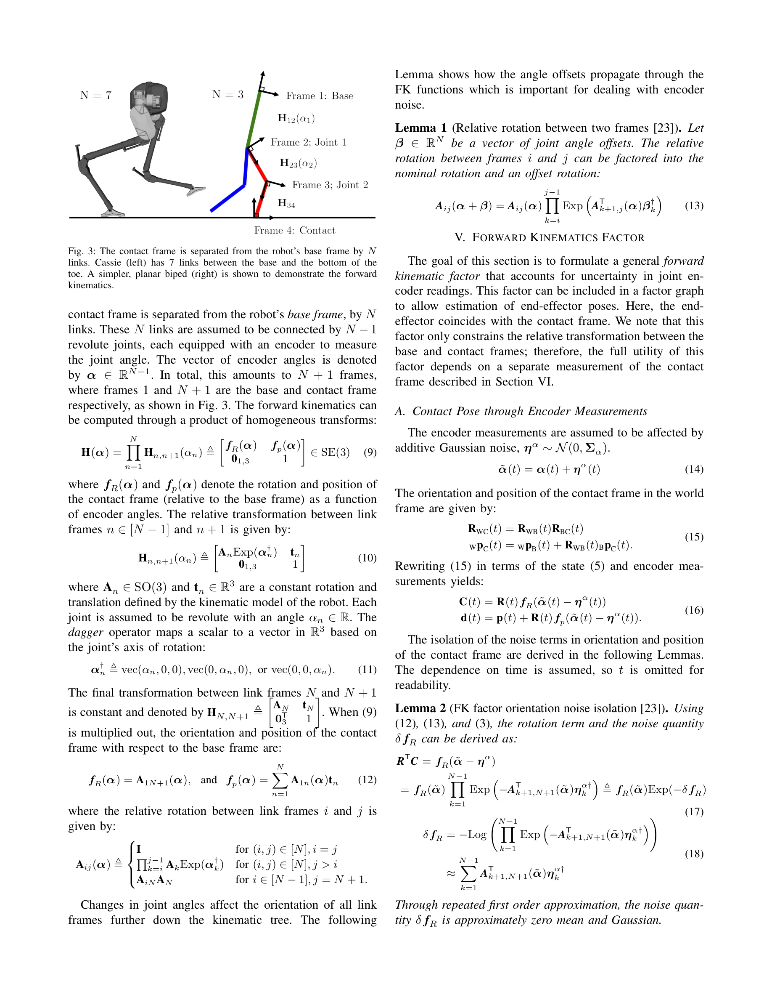

# Legged Robot State-Estimation Through Combined Forward Kinematic and Preintegrated Contact Factors

> **저자**: Ross Hartley, Josh Mangelson, Lu Gan, Maani Ghaffari Jadidi, Jeffrey M. Walls, Ryan M. Eustice, Jessy W. Grizzle | **날짜**: 2017-12-15 | **URL**: [https://arxiv.org/abs/1712.05873](https://arxiv.org/abs/1712.05873)

---

## Essence

*Fig. 2: An example factor graph for the proposed system. Forward kinematic*

다리 로봇의 상태 추정을 위해 forward kinematic factor와 preintegrated contact factor를 factor graph에 통합하여, 시각 추적 손실 시에도 IMU와 운동학 정보만으로 정확한 궤적 추정을 가능하게 하는 방법을 제안한다.

## Motivation

- **Known**: 최신 로봇 인식 시스템은 IMU와 카메라를 활용한 비선형 최적화로 좋은 성능을 달성했으나, 조명 부족이나 특징점 부족으로 시각 추적이 실패하는 경우가 많다. Factor graph 기반의 SLAM 방법이 성공적이지만 대부분 시각 정보에 크게 의존한다.
- **Gap**: 다리 로봇의 kinematic 모델과 환경과의 접촉 정보를 factor graph 프레임워크에 체계적으로 통합하여, 시각 센서 없이도 안정적인 상태 추정을 수행할 수 있는 방법이 부족했다.
- **Why**: 다리 로봇은 환경과의 직접적인 접촉을 활용할 수 있는 독특한 특성을 가지고 있으므로, 이를 활용하면 시각 센서 실패 상황에서도 robust한 상태 추정이 가능하여 실제 운영 환경에서의 안정성이 크게 향상된다.
- **Approach**: Forward kinematic factor는 noisy encoder 측정을 통해 로봇의 base pose와 contact frame을 연결하고, preintegrated contact factor는 foot slippage를 고려하면서 contact frame의 운동을 odometry 측정으로 표현한다. 두 factor를 결합하여 factor graph 최적화 문제를 구성하고 실시간으로 해결한다.

## Achievement

*Fig. 5: Estimated trajectory of Cassie experiment data using IMU, forward*

- **Forward Kinematic Factor**: Encoder 노이즈를 고려하여 임의의 시점에서 end-effector pose를 추정하는 factor 개발
- **Preintegrated Contact Factor**: Foot slip을 수용하는 rigid 및 point contact factor로 contact frame의 시간 경과에 따른 pose 변화를 모델링
- **Leg Odometry 통합**: 다리 운동학 정보를 factor graph smoothing 프레임워크에 통합
- **실시간 구현**: Cassie 이족 로봇에서 제안된 FK 및 contact measurement 모델의 실시간 동작 검증
- **성능 개선**: IMU와 함께 사용 시 drift를 감소시키고 localization accuracy를 향상시킴

## How

*Fig. 3: The contact frame is separated from the robot’s base frame by N*

- SE(3) 및 SO(3) Lie group 이론을 기반으로 rotation 및 translation의 노이즈를 manifold 상에서 모델링
- Forward kinematics를 통해 로봇의 base frame에서 contact frame까지의 transformation을 encoder 측정값으로 표현
- 고주파 foot contact 측정을 preintegration 기법으로 누적하여 contact frame의 상대 운동 계산
- Factor graph 최적화에서 retraction 맵을 사용하여 manifold 제약 조건 하에서 비선형 최적화 수행
- Simulated 및 실제 IMU와 kinematic 데이터를 사용하여 Cassie 로봇에서 평가

## Originality

- Forward kinematic factor의 novel 개발로 encoder 노이즈를 고려한 multi-link FK를 factor graph에 직접 통합
- Foot slip을 명시적으로 모델링하는 preintegrated contact factor의 창안으로 leg odometry의 정확성 향상
- ON-Manifold IMU preintegration 기법을 leg odometry에 적용하여 고주파 contact 정보를 효율적으로 활용
- 시각 정보 없이 kinematic 및 IMU 정보만으로 long-term state estimation이 가능함을 실증적으로 입증

## Limitation & Further Study

- 실험이 Cassie 이족 로봇에만 수행되어 다양한 다리 로봇 플랫폼에서의 일반화 가능성 미확인
- Foot slip의 모델링이 단순화된 형태이며, 복잡한 접촉 동역학(contact dynamics)은 미처리
- Loop closure 정보가 없을 경우 yaw와 절대 위치의 drift가 여전히 발생 가능
- 향후 연구: 다양한 지형 및 로봇 형태에 대한 확장, 복잡한 contact dynamics 모델 통합, 시각 정보와의 더 견고한 fusion 방법 개발

## Evaluation

- Novelty: 4/5
- Technical Soundness: 4/5
- Significance: 4/5
- Clarity: 4/5
- Overall: 4/5

**총평**: 이 논문은 다리 로봇의 특성을 활용한 innovative한 factor graph 구성을 제시하여, 시각 센서 실패 상황에서의 robust한 상태 추정 문제를 실질적으로 해결하는 중요한 기여를 한다. 수학적 엄밀성과 실증적 검증이 우수하며, 실시간 구현 가능성을 입증한 점이 강점이다.

## Related Papers

- 🔄 다른 접근: [[papers/1495_InEKFormer_A_Hybrid_State_Estimator_for_Humanoid_Robots/review]] — 두 논문 모두 휴머노이드 상태 추정을 다루지만, factor graph vs transformer 기반이라는 서로 다른 아키텍처 접근법을 제시함
- 🏛 기반 연구: [[papers/1316_Contact-Aided_Invariant_Extended_Kalman_Filtering_for_Robot/review]] — contact-aided invariant EKF의 이론적 배경이 factor graph 기반 상태 추정에서 접촉 정보 활용의 토대를 제공함
- 🔗 후속 연구: [[papers/1276_AutoOdom_Learning_Auto-regressive_Proprioceptive_Odometry_fo/review]] — AutoOdom의 자기회귀적 고유감각 측정법을 forward kinematic과 contact factor로 보완한 더욱 견고한 상태 추정 시스템으로 발전시킨 형태임
- 🔄 다른 접근: [[papers/1316_Contact-Aided_Invariant_Extended_Kalman_Filtering_for_Robot/review]] — 접촉 기반 상태 추정에서 InEKF 대신 순방향 운동학 결합 방법을 제시한다
- 🏛 기반 연구: [[papers/1276_AutoOdom_Learning_Auto-regressive_Proprioceptive_Odometry_fo/review]] — 다리 로봇의 상태 추정에서 운동학과 센서 융합의 기본 원리를 제공한다
- 🧪 응용 사례: [[papers/1540_RoboGen_Towards_Unleashing_Infinite_Data_for_Automated_Robot/review]] — RoboTwin 2.0의 확장 가능한 데이터 생성 및 벤치마크 플랫폼이 RoboGen의 자동화된 로봇 학습 파이프라인을 실제 환경에서 검증하는 도구를 제공한다.
- 🔗 후속 연구: [[papers/1495_InEKFormer_A_Hybrid_State_Estimator_for_Humanoid_Robots/review]] — InEKFormer의 floating base 상태 추정은 forward kinematics와 결합된 legged robot 상태 추정으로 확장될 수 있다.
