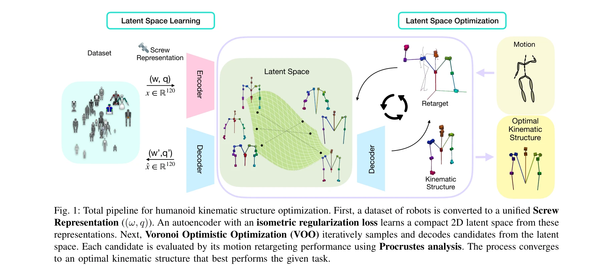
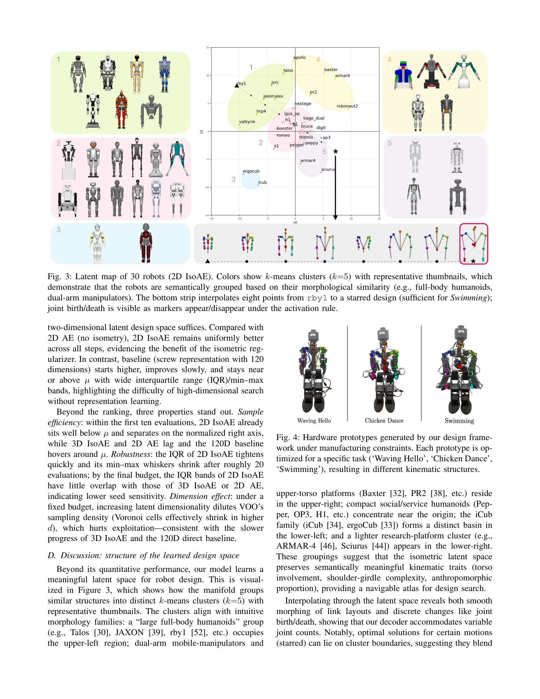

# LEGO: Latent-space Exploration for Geometry-aware Optimization of Humanoid Kinematic Design

> **저자**: Jihwan Yoon, Taemoon Jeong, Jeongeun Park, Chanwoo Kim, Jaewoon Kwon, Yonghyeon Lee, Kyungjae Lee, Sungjoon Choi | **날짜**: 2026-04-09 | **DOI**: [10.48550/arXiv.2604.08636](https://doi.org/10.48550/arXiv.2604.08636)

---

## Essence

*Fig. 1: Total pipeline for humanoid kinematic structure optimization. First, a dataset of robots is converted to a unifi*

로봇 상반신 운동학 설계를 자동화하기 위해 기존 로봇 설계에서 학습한 컴팩트한 latent space를 구성하고, 인간 동작 데이터로부터 직접 정의된 손실 함수를 통해 gradient-free 최적화를 수행하는 프레임워크.

## Motivation

- **Known**: 로봇 형태학 및 운동학 설계는 전통적으로 인간의 직관에 의존했으며, 동작-설계 공동 최적화(motion-design co-optimization)가 자동화의 유망한 경로로 제시되어 왔다.
- **Gap**: 설계 공간이 광대하고 비구조화되어 있으며, 작업별 손실 함수 정의가 어렵고 인간의 개입이 필요하다는 두 가지 주요 문제가 해결되지 않았다.
- **Why**: 로봇 설계 자동화는 개발 비용과 시간을 크게 절감할 수 있으며, 인간 동작 데이터를 활용하면 자연스럽고 효율적인 로봇 형태를 발견할 수 있기 때문이다.
- **Approach**: Screw theory 기반 관절 축 표현과 isometric manifold learning을 통해 기하학적 성질을 보존하는 저차원 latent space를 구성하고, 인간 동작 retargeting과 Procrustes analysis로부터 손실 함수를 정의한 후 Voronoi Optimistic Optimization (VOO)으로 최적화를 수행한다.

## Achievement

*Fig. 4: Hardware prototypes generated by our design frame-*

- **Screw theory 기반 표현**: (ω, q) 6D 벡터로 관절을 직관적이고 확장 가능하게 인코딩
- **학습 기반 설계 공간**: 합성 데이터가 아닌 실제 로봇 설계로부터 검색 공간 자동 학습
- **자동화된 손실 함수**: 인간 동작 데이터로부터 직접 정의되어 수동 설계 최소화
- **통합 파이프라인**: Isometric autoencoder, 동작 retargeting 기반 손실, VOO 결합
- **실제 로봇 설계 시연**: 시뮬레이션을 넘어 실제 하드웨어 프로토타입 제작 및 동작 실증

## How

*Fig. 1: Total pipeline for humanoid kinematic structure optimization. First, a dataset of robots is converted to a unifi*

- 기존 로봇 설계 데이터셋을 Screw representation으로 변환하여 R^(6N) 공간에 표현
- Encoder-decoder 프레임워크를 사용하여 저차원 latent space로 매핑
- Isometric regularization (L_iso = E_z[Tr((J_g^T J_g)^2)] / E_z[Tr(J_g^T J_g)]^2)을 적용하여 기하학적 왜곡 감소
- 인간 골격 운동학과 로봇 운동학의 불일치를 motion retargeting과 Procrustes analysis로 해결
- Latent space에서 VOO (gradient-free optimization)를 사용하여 최적 설계 탐색
- 최적화된 설계로부터 인간 동작(예: 춤)을 로봇이 수행 가능하도록 유도

## Originality

- Screw theory 기반 표현: 기존 그래프/복셀 표현과 달리 기하학적 직관성과 확장성 제공
- 실제 로봇 설계 데이터 활용: 합성 데이터셋이 아닌 기존 설계로부터 패턴 학습
- 인간 동작 데이터 기반 손실 함수: 휴리스틱이나 수동 설계 없이 동작 retargeting으로 직접 정의
- Isometric regularization과 VOO의 결합: Smooth하고 geometry-preserving한 latent space에서의 효율적 최적화

## Limitation & Further Study

- 제한된 데이터셋 규모: 비전이나 언어 데이터에 비해 로봇 설계 데이터가 소수(약 30개 로봇)
- 상반신 설계 중심: 전체 신체 설계로의 확장 시 차원성 증가로 인한 복잡성 증가 가능
- 인간-로봇 동역학 차이: Kinematic 최적화만 수행되어 동역학적 실현 가능성 검증 필요
- 후속 연구: 더 큰 설계 데이터셋 수집, 전신 설계 확장, 동역학 제약 통합, 다양한 작업(보행, 조작 등) 적용

## Evaluation

- Novelty: 4/5
- Technical Soundness: 3/5
- Significance: 4/5
- Clarity: 4/5
- Overall: 4/5

**총평**: 본 논문은 로봇 설계 자동화에 screw theory, isometric manifold learning, 인간 동작 retargeting을 창의적으로 결합하여 인간의 개입을 최소화하는 원칙적인 프레임워크를 제시하며, 실제 하드웨어 구현으로 실용성을 입증했다.

## Related Papers

- 🏛 기반 연구: [[papers/1344_CoT-VLA_Visual_Chain-of-Thought_Reasoning_for_Vision-Languag/review]] — 비전-언어-행동 모델의 의도 인식 방법론이 LEGO의 인간 동작 데이터 기반 설계 최적화에 핵심 이론적 기반을 제공한다
- 🔗 후속 연구: [[papers/1293_A_Distributional_Treatment_of_Real2Sim2Real_for_Object-Centr/review]] — 생체역학적 비교 분석 방법을 LEGO의 기하학적 최적화에 통합하여 인간과 휴머노이드의 동작 차이를 최소화할 수 있다
- 🧪 응용 사례: [[papers/1241_A_Framework_for_Optimal_Ankle_Design_of_Humanoid_Robots/review]] — 휴머노이드 로봇 발목 최적 설계 프레임워크가 LEGO의 상반신 운동학 설계 자동화에 직접적으로 적용 가능하다
