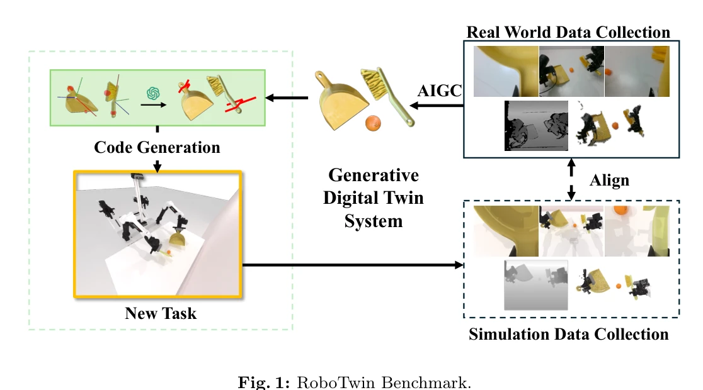
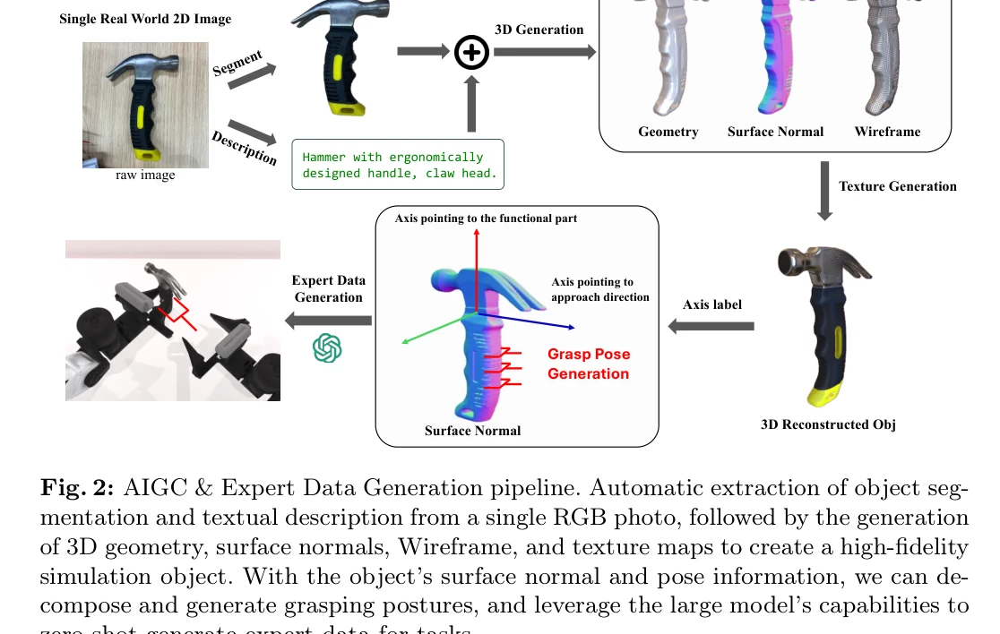

# RoboTwin: Dual-Arm Robot Benchmark with Generative Digital Twins (early version)

> **저자**: Yao Mu, Tianxing Chen, Shijia Peng, Zanxin Chen, Zeyu Gao, Yude Zou, Lunkai Lin, Zhiqiang Xie, Ping Luo | **날짜**: 2024-09-04 | **URL**: [https://arxiv.org/abs/2409.02920](https://arxiv.org/abs/2409.02920)

---

## Essence

*Fig. 1: RoboTwin Benchmark.*

RoboTwin은 3D generative foundation model과 LLM을 활용한 generative digital twin 프레임워크로, 2D 이미지로부터 다양한 3D 객체 모델을 생성하고 dual-arm 로봇 작업을 위한 synthetic 데이터셋과 real-world-aligned 벤치마크를 제공한다.

## Motivation

- **Known**: 로봇 조작 학습은 human teleoperation과 behavioral cloning, offline RL, diffusion policy 등의 방법이 있으며, 이들은 고품질 데이터셋에 의존한다. 기존 벤치마크들은 real-world 데이터 수집의 어려움과 synthetic 데이터의 sim-to-real gap 문제를 안고 있다.
- **Gap**: Dual-arm 로봇 협력과 tool use에 특화된 고품질, 다양한 데이터셋의 부족으로 advanced manipulation 시스템 개발이 제한되고 있다. 또한 traditional digital twin 생성 방식은 고비용의 센서와 수동 설정을 요구하여 확장성이 낮다.
- **Why**: Dual-arm 로봇의 협력과 도구 사용 능력은 manufacturing, healthcare, home 등 다양한 실제 환경에서 필수적이며, 효과적인 training data와 evaluation benchmark가 있으면 로봇 개발을 크게 가속화할 수 있다.
- **Approach**: AIGC 기술(Deemos Rodin)을 이용해 단일 2D RGB 이미지에서 3D 모델을 생성하고, 객체의 functional part에 좌표축을 할당하여 grasp pose를 자동 계산한다. GPT4-V를 활용해 spatial relation-aware code generation으로 task decomposition과 robotic movement code를 자동 생성하고, COBOT Magic 플랫폼에서 수집한 real-world data와 synthetic data를 결합한 벤치마크를 구성한다.

## Achievement

*Fig. 2: AIGC & Expert Data Generation pipeline. Automatic extraction of object seg-*

- **RoboTwin 벤치마크 데이터셋**: Real-world teleoperated data와 high-fidelity synthetic data를 포함하며, dual-arm tool use와 human-robot interaction에 특화된 포괄적 벤치마크 제공
- **Real-to-simulation 파이프라인**: 단일 RGB 이미지로부터 3D mesh, texture, functional axes를 자동 생성하는 cost-effective 방식으로 digital twin 구축
- **LLM 기반 expert data 생성**: Spatial relation-aware code generation으로 task-specific pose sequences와 trajectory planning을 자동화
- **성능 향상**: Pre-trained 정책의 fine-tuning으로 single-arm 작업 70% 이상, dual-arm 작업 40% 이상의 success rate 개선 달성

## How

*Fig. 2: AIGC & Expert Data Generation pipeline. Automatic extraction of object seg-*

- 2D 이미지 입력 → AIGC (Rodin)를 통해 3D geometry, surface normal, texture 생성
- 객체의 functional part와 approach direction을 나타내는 좌표축 정의
- Surface normal과 축 정보로부터 grasp pose 자동 계산
- GPT4-V의 vision-language capability와 simulation environment 정보를 활용한 spatial relation 분석
- Code generation framework로 task decomposition → spatial constraint 결정 → robotic movement code 생성
- COBOT Magic 플랫폼에서 real-world data 수집 (4개 arms, 4개 RGBD cameras)
- Synthetic data와 real data 결합하여 학습 후 limited real-world samples로 fine-tuning

## Originality

- AIGC 기반 cost-effective digital twin 생성으로 high-precision sensors의 의존성 제거
- Functional part 중심의 coordinate axis 할당으로 grasp pose 자동화
- GPT4-V와 simulation 정보를 결합한 spatial relation-aware code generation의 혁신적 접근
- Real-world teleoperated data와 synthetic data의 체계적 결합으로 sim-to-real transfer 강화
- Dual-arm coordination과 tool use에 특화된 최초의 comprehensive benchmark 제시

## Limitation & Further Study

- Early version으로 dataset 규모와 다양성이 제한적일 수 있으며, 다양한 로봇 플랫폼에 대한 generalization 검증 부족
- AIGC 생성 모델의 품질이 복잡한 객체나 세부 구조에서 완벽하지 않을 수 있고, grasp pose 계산의 정확도가 surface normal 추정에 의존
- LLM 기반 code generation의 오류 rate와 edge case 처리에 대한 평가 부족
- Real-world data 수집이 특정 플랫폼(COBOT Magic)에 국한되어 다른 dual-arm 로봇으로의 전이 가능성 미검증
- **후속 연구**: 더 많은 객체와 task에 대한 데이터 확대, 다양한 로봇 플랫폼에서의 validation, LLM 오류에 대한 robust error handling, sim-to-real gap 감소 방안 연구

## Evaluation

- Novelty: 4/5
- Technical Soundness: 4/5
- Significance: 4/5
- Clarity: 4/5
- Overall: 4/5

**총평**: RoboTwin은 AIGC와 LLM을 창의적으로 결합하여 dual-arm 로봇 학습을 위한 scalable data generation과 evaluation 프레임워크를 제시한 의미 있는 연구이다. 단일 이미지에서 digital twin을 생성하는 cost-effective 방식과 40-70% 성능 향상은 실용적 가치가 높으나, early version 단계에서 dataset 규모, 다양한 플랫폼 검증, LLM reliability에 대한 추가 연구가 필요하다.

## Related Papers

- 🏛 기반 연구: [[papers/1551_RoboTwin_20_A_Scalable_Data_Generator_and_Benchmark_with_Str/review]] — 기본적인 generative digital twin 프레임워크를 MLLM과 자동화된 파이프라인을 통해 더욱 확장 가능한 시스템으로 발전시킨다.
- 🔗 후속 연구: [[papers/1323_BridgeData_V2_A_Dataset_for_Robot_Learning_at_Scale/review]] — 기존 로봇 학습 데이터셋의 한계를 극복하기 위해 3D generative model을 활용한 synthetic 데이터 생성 방법을 제시한다.
- 🏛 기반 연구: [[papers/1290_3D_Gaussian_Splatting_for_Real-Time_Radiance_Field_Rendering/review]] — 3D Gaussian Splatting 기술을 활용하여 실시간으로 현실적인 dual-arm 로봇 작업을 위한 3D 객체 모델을 생성한다.
- 🏛 기반 연구: [[papers/1541_RoboMIND_Benchmark_on_Multi-embodiment_Intelligence_Normativ/review]] — dual-arm 로봇 벤치마크의 기본 구조를 다중 embodiment 환경으로 확장하여 더 일반적인 intelligence 평가를 가능하게 한다.
- 🔗 후속 연구: [[papers/1551_RoboTwin_20_A_Scalable_Data_Generator_and_Benchmark_with_Str/review]] — RoboTwin의 generative digital twin 개념을 MLLM 기반 자동 코드 생성과 대규모 데이터 생성이 가능한 확장 가능한 프레임워크로 발전시킨다.
