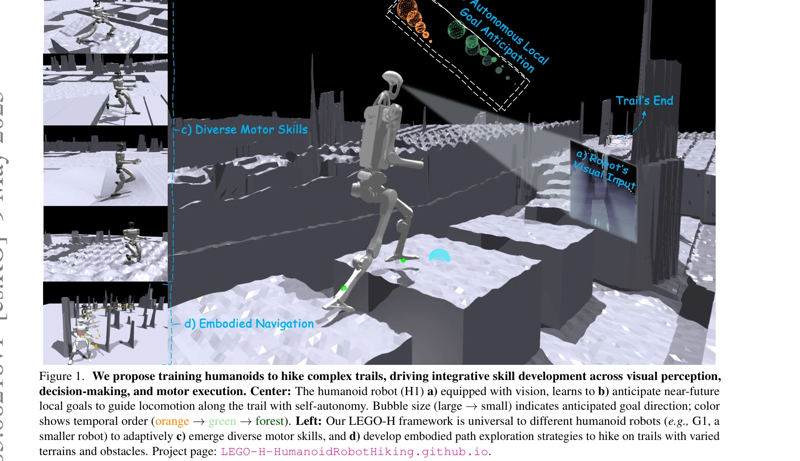
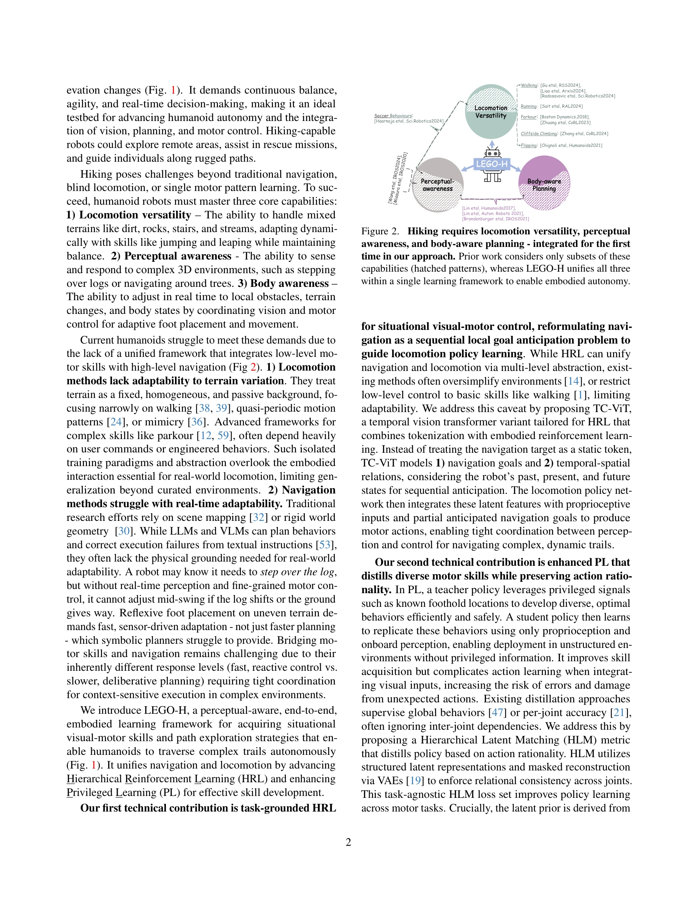
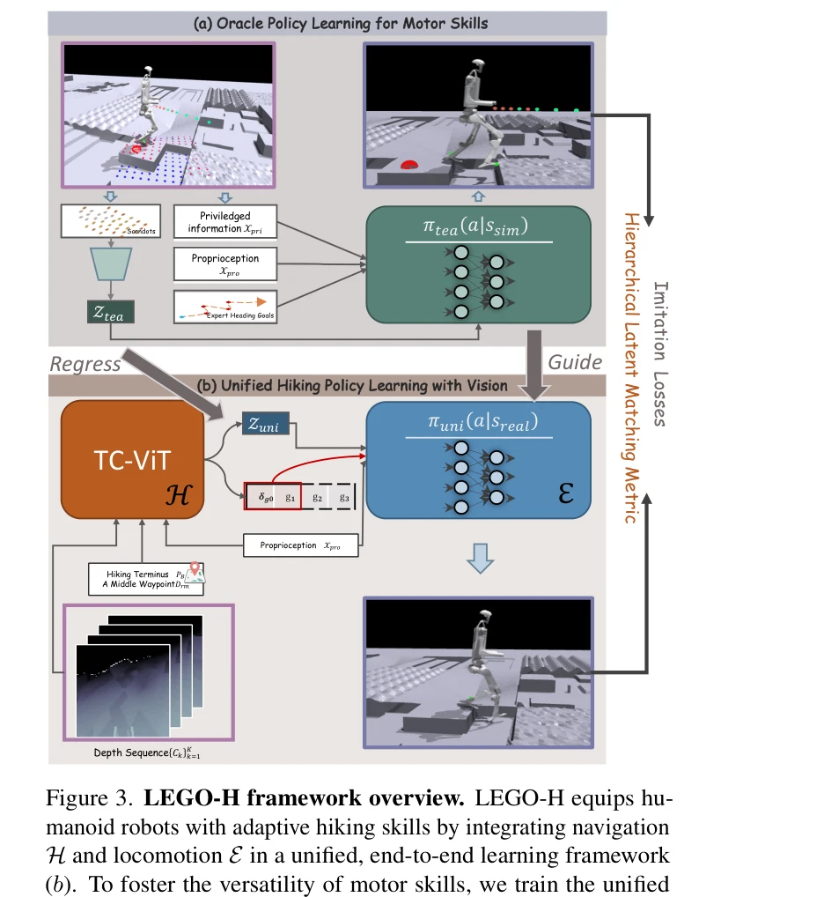

# Let Humanoids Hike! Integrative Skill Development on Complex Trails

> **저자**: Kwan-Yee Lin, Stella X. Yu | **날짜**: 2025-05-09 | **URL**: [https://arxiv.org/abs/2505.06218](https://arxiv.org/abs/2505.06218)

---

## Essence

*Figure 1. We propose training humanoids to hike complex trails, driving integrative skill development across visual perc*

본 논문은 복잡한 산책로에서 인간형 로봇이 자율적으로 하이킹할 수 있도록 시각 인식, 의사결정, 운동 실행을 통합하는 LEGO-H 학습 프레임워크를 제안한다.

## Motivation

- **Known**: 인간형 로봇 연구는 보행, 달리기, 파쿠르 등 특정 운동 기술이나 경로 계획에 집중해왔으나, 이들은 대개 분절되어 있고 복잡한 지형에 대한 적응력이 부족하다.
- **Gap**: 기존 보행 연구는 장기 목표와 상황 인식 없이 운동 기술에만 초점을 맞추고, 의미론적 네비게이션은 실제 신체화와 지역 지형 가변성을 간과하고 있다. 네비게이션과 보행을 통합하는 통일된 프레임워크가 부재하다.
- **Why**: 하이킹은 균형, 민첩성, 적응적 의사결정을 동시에 요구하므로 인간형 로봇의 자율성을 평가하는 이상적인 벤치마크이며, 실제 구조화되지 않은 환경에서의 로봇 활용(구조 대응, 원격 탐사)을 가능하게 한다.
- **Approach**: Hierarchical Reinforcement Learning 프레임워크 내에서 temporal vision transformer 변형(TC-ViT)을 사용하여 미래 로컬 목표를 예상하고, Hierarchical Latent Matching을 통한 enhanced Privileged Learning으로 정책 전이를 개선한다.

## Achievement

*Figure 2. Hiking requires locomotion versatility, perceptual*

- **통합 프레임워크**: 보행 다양성, 지각 인식, 신체 인식 계획을 단일 학습 프레임워크로 통합한 첫 시도
- **TC-ViT 아키텍처**: 시간-공간 관계와 순차적 목표 예상을 모델링하여 네비게이션과 보행 정책을 긴밀하게 조율
- **Hierarchical Latent Matching**: VAE 기반 마스크된 재구성으로 관절 간 의존성을 보존하며 운동 기술을 증류
- **다양한 지형 및 로봇에서의 검증**: 시뮬레이션된 산책로와 여러 인간형 로봇(H1, G1) 형태에서 로버스트성과 다목적성 입증

## How

*Figure 3. LEGO-H framework overview. LEGO-H equips hu-*

- TC-ViT를 사용하여 로봇의 과거, 현재, 미래 상태를 고려한 네비게이션 목표와 시간-공간 관계 모델링
- 보행 정책 네트워크에서 시각 특징, proprioceptive 입력, 예상된 네비게이션 목표를 통합하여 운동 행동 생성
- Privileged Learning에서 oracle 정책으로부터 유도된 잠재 표현을 사용하여 학생 정책 훈련
- Hierarchical Latent Matching 손실 함수로 관절 간 관계적 일관성을 강제하여 행동 합리성 유지
- Hierarchical Reinforcement Learning의 다단계 추상화로 고차 네비게이션과 저차 보행 제어 연결

## Originality

- 하이킹을 인간형 로봇의 통합 기술 개발 벤치마크로 제시한 첫 연구
- HRL 프레임워크 내에서 temporal vision transformer를 새롭게 설계하여 순차적 로컬 목표 예상 문제로 네비게이션 재정의
- 관절 간 의존성을 보존하는 Hierarchical Latent Matching 손실로 기존 Privileged Learning 개선
- 임의의 인간형 로봇 형태에 적응 가능한 자기중심적(oracle이 아닌) 행동 학습 방식

## Limitation & Further Study

- 실제 하드웨어 실험 부재: 모든 평가가 시뮬레이션 환경에서만 수행되어 sim-to-real 전이 가능성 미검증
- 환경 다양성 제한: 시뮬레이션 산책로의 지형 변화 범위와 복잡도가 실제 자연 환경에 비해 제한적일 가능성
- 계산 복잡도 미분석: TC-ViT와 HLM 손실의 실시간 온보드 실행 가능성에 대한 구체적 성능 분석 부족
- 정책 전이의 한계: Privileged Learning에서 privileged 신호(정확한 발판 위치)의 현실적 수집 방법 미제시
- 후속 연구: (1) 실제 로봇 하드웨어에서의 검증, (2) 더 다양한 자연 환경에서의 평가, (3) 온보드 임베디드 시스템에서의 계산 최적화, (4) 약화된 privileged 신호 조건에서의 강건성 검토

## Evaluation

- Novelty: 4/5
- Technical Soundness: 3/5
- Significance: 4/5
- Clarity: 4/5
- Overall: 4/5

**총평**: 본 논문은 하이킹을 인간형 로봇의 통합 기술 개발 벤치마크로 제시하고, TC-ViT와 Hierarchical Latent Matching을 통해 네비게이션과 보행의 긴밀한 조율을 실현한 의미 있는 기여를 한다. 시뮬레이션 기반 검증으로 프레임워크의 다목적성을 입증했으나, 실제 로봇 실험과 현실 환경 적용 가능성 검증이 진행되면 더욱 강력한 연구가 될 것이다.

## Related Papers

- 🔗 후속 연구: [[papers/1449_Learned_Perceptive_Forward_Dynamics_Model_for_Safe_and_Platf/review]] — 지각 기반 파쿠르 프레임워크의 개념을 복잡한 산책로라는 특수한 자연 환경에서의 하이킹에 특화시켜 통합적으로 발전시킨 형태임
- 🔄 다른 접근: [[papers/1608_Perceptive_Humanoid_Parkour_Chaining_Dynamic_Human_Skills_vi/review]] — 두 논문 모두 지각 기반 파쿠르를 다루지만, 하이킹 특화 vs 일반적 동적 기술 연결이라는 서로 다른 적용 범위를 제시함
- 🔗 후속 연구: [[papers/1529_Learning_Humanoid_Locomotion_over_Challenging_Terrain/review]] — 도전적 지형에서의 휴머노이드 locomotion을 복잡한 산책로 환경에서의 통합적 기술 개발로 더욱 구체화하고 발전시킨 형태임
- 🔗 후속 연구: [[papers/1449_Learned_Perceptive_Forward_Dynamics_Model_for_Safe_and_Platf/review]] — Hiking in the Wild의 야외 지형 navigation은 Let Humanoids Hike의 복잡한 지형에서의 통합 스킬 개발로 확장된다.
- 🔗 후속 연구: [[papers/1395_FastStair_Learning_to_Run_Up_Stairs_with_Humanoid_Robots/review]] — Let Humanoids Hike의 복잡한 지형 스킬과 FastStair의 고속 계단 등반을 결합하면 다양한 야외 환경에서의 고속 이동이 가능하다.
