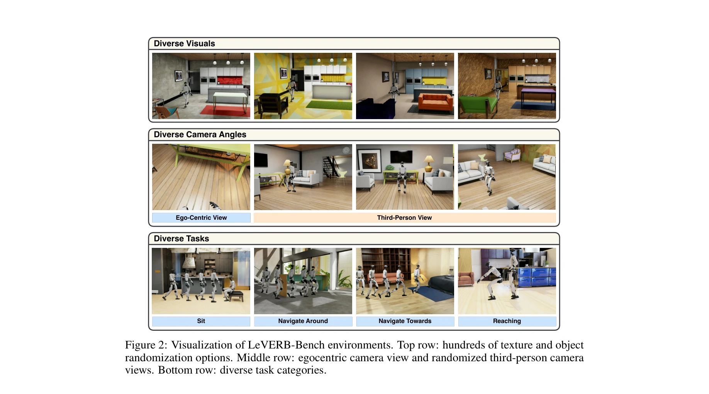

# LeVERB: Humanoid Whole-Body Control with Latent Vision-Language Instruction

> **저자**: Haoru Xue, Xiaoyu Huang, Dantong Niu, Qiayuan Liao, Thomas Kragerud, Jan Tommy Gravdahl, Xue Bin Peng, Guanya Shi, Trevor Darrell, Koushil Sreenath, Shankar Sastry | **날짜**: 2025-06-16 | **URL**: [https://arxiv.org/abs/2506.13751](https://arxiv.org/abs/2506.13751)

---

## Essence

*Figure 1: Overview of our contributions. Top: we create a photorealistic and dynamically accurate*

LeVERB는 합성 데이터로 학습된 계층적 latent vision-language-action 모델로, humanoid 전신 제어(WBC)에서 처음으로 latent verb 인터페이스를 통해 고차원 동역학 명령을 생성한다. 150개 이상의 과제로 구성된 sim-to-real 벤치마크와 함께 zero-shot 실세계 배포를 달성한다.

## Motivation

- **Known**: Vision-Language-Action (VLA) 모델은 의미론적 이해와 zero-shot 일반화 능력을 보여주었으나, 기존 대부분의 시스템은 hand-crafted된 저수준 action vocabulary (end-effector pose, root velocity 등)를 가정하여 준정적 과제에만 제한된다.
- **Gap**: VLA 모델과 동역학 기반 humanoid 제어 사이의 정보 격차가 존재하며, 기존 work는 명시적 action 인터페이스에 의존하여 복잡한 전신 동작과 장면 상호작용을 포함하는 표현성 있는 행동 학습이 어렵다. 또한 humanoid WBC를 위한 photorealistic vision-language 벤치마크와 시뮬레이션-현실 전이 가능한 데이터가 부족하다.
- **Why**: Humanoid 로봇이 복잡한 장면을 인지하고 자연어 명령을 해석하며 민첩한 전신 행동을 실행할 수 있도록 하는 것은 로봇공학의 장기적 목표이며, hierarchical latent interface를 통한 효율적 제어는 실시간 안정성과 적응성을 동시에 달성하는 핵심이다.
- **Approach**: CVAE 기반 hierarchical latent instruction-following 프레임워크를 제안하며, 상위 수준에서 vision-language policy가 합성 kinematic demonstrations로부터 latent action vocabulary를 학습하고, 하위 수준에서 RL 기반 WBC policy가 이 latent verbs를 dynamics-level 명령으로 변환한다. 합성 데이터 생성 파이프라인으로 human motion을 humanoid에 retarget하고 photorealistic rendering한다.

## Achievement

*Figure 2: Visualization of LeVERB-Bench environments. Top row: hundreds of texture and object*

- **LeVERB-Bench**: 10개 범주, 150개 이상의 과제로 구성된 첫 photorealistic, physics-based, sim-to-real-ready humanoid WBC 벤치마크 제시
- **Hierarchical Latent Architecture**: Vision-language 모듈(System 2)과 proprioception 기반 WBC 컨트롤러(System 1)로 이루어진 CVAE 기반 구조로 structured latent space 학습
- **Zero-shot Sim-to-Real Transfer**: 합성 데이터만으로 학습하여 실제 humanoid 로봇에 zero-shot 배포 가능
- **성능**: 간단한 시각 네비게이션에서 80% 성공률, 전체적으로 58.5% 성공률 달성하여 naive hierarchical VLA 대비 7.8배 향상
- **언어 강건성**: 의미론적으로 유사한 다양한 자연어 표현에 대한 강건성 입증 (Figure 4)

## How

*Figure 3: Details of our data collection and training pipeline. Step 1: we collect a synthetic,*

- 합성 데이터 생성: Human motion capture 데이터를 humanoid에 retarget한 후 randomized 장면에서 photorealistic rendering
- Vision-Language 모듈 (System 2): CVAE 아키텍처로 structured latent space를 학습하며, kinematics reconstruction 손실로 시각과 동작의 의미론적 정렬 달성
- WBC 컨트롤러 (System 2): Proprioception-only 입력으로 training하여 robot dynamics 마스터링 및 latent verb 디코딩
- Decoupled Training: 렌더링 비용 절감을 위해 vision-language 학습과 dynamics 학습을 분리하되, frozen latent space를 공유
- Hierarchical Control: 10 Hz vision-language policy가 50 Hz WBC 컨트롤러에 latent action 명령을 발급
- VLM 기반 라벨링: Semantically 유사한 언어 명령 집합을 자동 annotate하여 다양한 표현 처리

## Originality

- **첫 latent vision-language interface for humanoid WBC**: 기존 work는 명시적 action vocabulary (velocity, pose 등)에 의존했으나, 본 논문은 학습된 latent verb를 도입
- **Structured latent space via CVAE**: Vision-language 정렬과 overfitting 완화를 위해 CVAE 기반 구조화된 latent space 설계
- **Synthetic data pipeline for humanoid visual control**: Photorealistic rendering과 physics-based simulation을 결합한 scalable humanoid 데이터 생성 방식
- **첫 sim-to-real humanoid WBC 벤치마크**: 150개 이상의 다양한 과제를 포함한 photorealistic, dynamically accurate, closed-loop 벤치마크 제시
- **Real-world zero-shot deployment**: 합성 데이터만으로 학습하여 실제 humanoid에 즉시 배포 가능함을 입증

## Limitation & Further Study

- 합성-현실 간 지각 차이: Photorealistic rendering에도 불구하고 실세계 조명, 재질, 이동 물체 등의 복잡성을 완벽히 모사하지 못할 수 있음
- 제한된 과제 범위: 벤치마크가 10개 범주에 집중되어 있으며, 더 복잡한 도구 조작이나 협력 작업으로의 확장 가능성 미검증
- 동역학 모델 정확성: Retargeted human motion에서 humanoid의 실제 동역학 제약이 완벽히 반영되지 않을 수 있음
- Latent space 해석성: CVAE 기반 latent space의 의미론적 해석과 조작이 제한적이어서 fine-grained 제어 어려움
- 계산 비용: Photorealistic rendering 기반 데이터 생성의 높은 계산 비용으로 인한 확장성 제약
- 후속 연구: (1) Multi-embodiment latent space 학습으로 다양한 humanoid 플랫폼 지원, (2) Real-world 상호작용 데이터 피드백 루프 통합, (3) Vision encoder의 더 강력한 사전학습(예: 대규모 embodied AI 모델) 활용

## Evaluation

- Novelty: 4/5
- Technical Soundness: 3/5
- Significance: 4/5
- Clarity: 4/5
- Overall: 4/5

**총평**: LeVERB는 humanoid WBC를 위한 vision-language 제어의 주요 갭을 해결하는 novel hierarchical latent 아키텍처와 함께 첫 실용적 sim-to-real 벤치마크를 제시하여 로봇공학 분야에 의미 있는 기여를 한다. 합성 데이터 기반 학습으로 실세계 배포를 달성했으나, 동역학 정확성과 복잡한 상호작용으로의 확장 가능성 검증이 필요하다.

## Related Papers

- 🏛 기반 연구: [[papers/1555_RT-2_Vision-Language-Action_Models_Transfer_Web_Knowledge_to/review]] — RT-1의 robotics transformer 아키텍처를 확장하여 web-scale vision-language 사전학습의 이점을 로봇 제어에 통합한다.
- 🏛 기반 연구: [[papers/1556_RT-H_Action_Hierarchies_Using_Language/review]] — RT-1의 real-world control at scale이 RT-H의 action hierarchies 구현의 기초 플랫폼을 제공한다.
- 🔗 후속 연구: [[papers/1467_Humanoid_Locomotion_as_Next_Token_Prediction/review]] — RT-1의 robotics transformer 개념을 휴머노이드 보행 제어에 특화하여 적용했다
