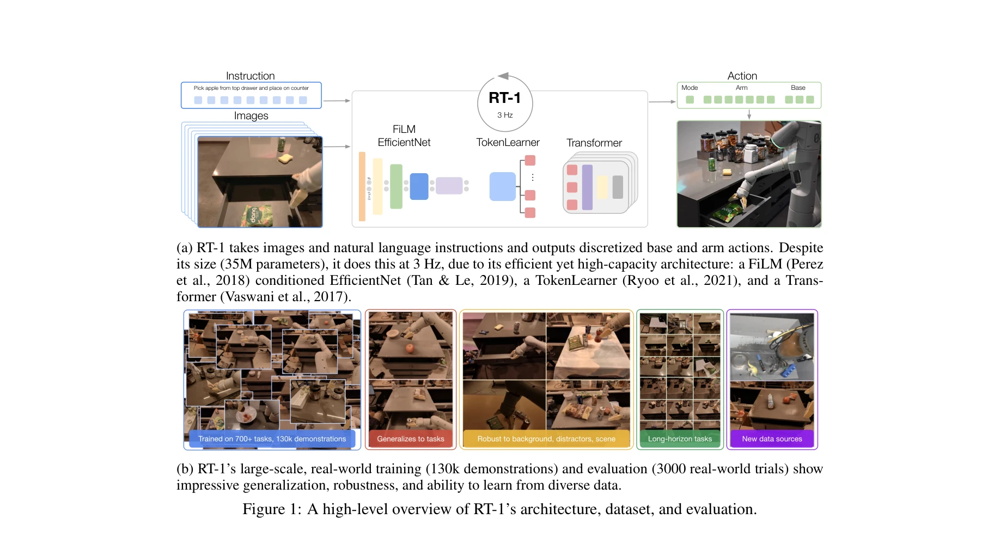
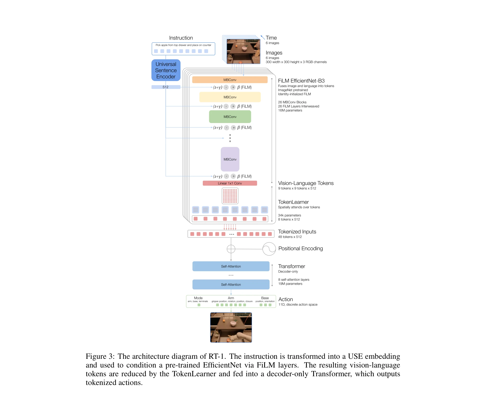

# RT-1: Robotics Transformer for Real-World Control at Scale

> **저자**: Anthony Brohan, Noah Brown, Justice Carbajal, Yevgen Chebotar, Joseph Dabis, Chelsea Finn, Keerthana Gopalakrishnan, Karol Hausman, Alex Herzog, Jasmine Hsu, Julian Ibarz, Brian Ichter, Alex Irpan, Tomas Jackson, Sally Jesmonth, Nikhil J Joshi, Ryan Julian, Dmitry Kalashnikov, Yuheng Kuang, Isabel Leal, Kuang-Huei Lee, Sergey Levine, Yao Lu, Utsav Malla, Deeksha Manjunath, Igor Mordatch, Ofir Nachum, Carolina Parada, Jodilyn Peralta, Emily Perez, Karl Pertsch, Jornell Quiambao, Kanishka Rao, Michael Ryoo, Grecia Salazar, Pannag Sanketi, Kevin Sayed, Jaspiar Singh, Sumedh Sontakke, Austin Stone, Clayton Tan, Huong Tran, Vincent Vanhoucke, Steve Vega, Quan Vuong, Fei Xia, Ted Xiao, Peng Xu, Sichun Xu, Tianhe Yu, Brianna Zitkovich | **날짜**: 2022-12-13 | **URL**: [https://arxiv.org/abs/2212.06817](https://arxiv.org/abs/2212.06817)

---

## Essence

*Figure 1: A high-level overview of RT-1’s architecture, dataset, and evaluation.*

Robotics Transformer (RT-1)는 대규모 다양한 실제 로봇 데이터(130k 에피소드, 700+ 태스크)를 학습하여 새로운 태스크와 환경에 대한 뛰어난 일반화 능력을 보이는 언어-조건부 로봇 제어 모델이다.

## Motivation

- **Known**: Vision, NLP, Speech Recognition에서 대규모 사전학습 모델의 일반화 능력이 입증되었으며, 최근 몇몇 Transformer 기반 로봇 정책이 제안되었으나 실제 다양한 태스크에 대한 평가가 부족했다.
- **Gap**: 로봇 분야에서 고용량 모델이 대규모 다양한 데이터로 학습될 때 zero-shot 일반화와 실시간 제어 효율성을 동시에 달성할 수 있는지 검증되지 않았으며, 실제 로봇으로 대규모 평가한 연구가 부족했다.
- **Why**: 로봇 데이터 수집이 매우 어렵고 비용이 높기 때문에 다양한 태스크에 대한 일반화 가능성은 실제 배포 시 매우 중요하며, 다양한 환경과 객체에 대한 강건성이 필수적이다.
- **Approach**: FiLM-conditioned EfficientNet, TokenLearner, Transformer를 결합한 고효율 고용량 아키텍처를 설계하고, 17개월에 걸쳐 13개 로봇으로 수집한 대규모 다양한 실제 데이터에서 언어-조건부 end-to-end 학습을 수행했다.

## Achievement

*Figure 1: A high-level overview of RT-1’s architecture, dataset, and evaluation.*

- **높은 성공률**: 700개 이상의 학습된 명령어에 대해 97% 성공률 달성
- **우수한 일반화**: 새로운 태스크(25%), 방해물(36%), 배경(18%)에 대해 다음 최고 기준선 대비 성능 향상
- **장기 수행**: SayCan 프레임워크에서 최대 50 단계의 장시간 태스크 실행 가능
- **실시간 제어**: 35M 파라미터 규모로 3Hz의 효율적 추론 수행
- **도메인 확장**: 시뮬레이션 데이터와 다른 로봇 유형의 데이터 통합 가능

## How

*Figure 3: The architecture diagram of RT-1. The instruction is transformed into a USE embedding*

- FiLM-conditioned EfficientNet을 사용하여 이미지와 언어 지시사항을 인코딩
- TokenLearner를 통해 고차원 입출력(카메라 이미지, 명령어, 모터 명령)을 컴팩트한 토큰으로 압축
- Transformer 디코더가 토큰 시퀀스를 처리하여 이산화된 베이스와 암 액션 생성
- 17개월간 13대 로봇으로 수집한 130k 에피소드, 700+ 태스크 데이터셋으로 학습
- 3000개의 실제 로봇 시연을 통해 다양한 시나리오에서 평가(방해물, 새로운 배경, 새로운 태스크)
- 데이터 크기, 모델 크기, 데이터 다양성의 함수로 일반화 능력 분석

## Originality

- 로봇 제어에서 언어-비전-액션 매핑을 sequence modeling 문제로 프레임화한 첫 시도
- TokenLearner를 활용한 Transformer 기반 로봇 제어의 효율적 실시간 추론 달성
- 단일 모델로 700개 이상의 다양한 실제 로봇 태스크를 수행하는 규모의 달성
- 실제 로봇 3000회 이상의 대규모 평가를 통한 엄격한 검증

## Limitation & Further Study

- 평가가 특정 로봇 형태(Google의 팔 로봇)에 제한되어 있어 다른 로봇 형태로의 일반화 미검증
- 시뮬레이션-현실 격차(sim-to-real) 연구가 추가 필요
- 실패 사례와 한계 조건에 대한 자세한 분석 부족
- 다중 로봇 형태 학습을 위한 확장 연구가 필요
- 다른 모달리티(포인트 클라우드, 깊이 맵 등)와의 통합 추가 탐색 필요

## Evaluation

- Novelty: 4/5
- Technical Soundness: 4/5
- Significance: 4/5
- Clarity: 4/5
- Overall: 4/5

**총평**: RT-1은 대규모 실제 로봇 데이터와 효율적인 Transformer 아키텍처를 결합하여 로봇 제어에서 전례 없는 규모의 다중 태스크 일반화를 달성한 획기적인 연구로, 실제 로봇 시스템에서의 강건하고 일반화 가능한 제어의 가능성을 명확히 입증했다.

## Related Papers

- 🔗 후속 연구: [[papers/1499_OmniVLA_An_Omni-Modal_Vision-Language-Action_Model_for_Robot/review]] — omni-modal VLA의 다중 조건화 방법을 LeVERB의 latent verb 인터페이스에 통합하여 명령 표현 능력을 강화할 수 있다
- 🧪 응용 사례: [[papers/1510_OpenVLA_An_Open-Source_Vision-Language-Action_Model/review]] — 오픈소스 VLA 모델의 효율적인 미세조정 방법이 RT-1의 대규모 로봇 데이터 학습에 직접 적용 가능하다
- 🏛 기반 연구: [[papers/1249_A_Unified_and_General_Humanoid_Whole-Body_Controller_for_Ver/review]] — 통합된 휴머노이드 전신 제어 프레임워크가 LeVERB의 계층적 latent VLA 시스템에 핵심 제어 이론을 제공한다
- 🏛 기반 연구: [[papers/1510_OpenVLA_An_Open-Source_Vision-Language-Action_Model/review]] — 대규모 로봇 시연 데이터 학습 방법론이 RT-1의 다양한 태스크 일반화 능력 구현에 핵심 이론적 기반을 제공한다
