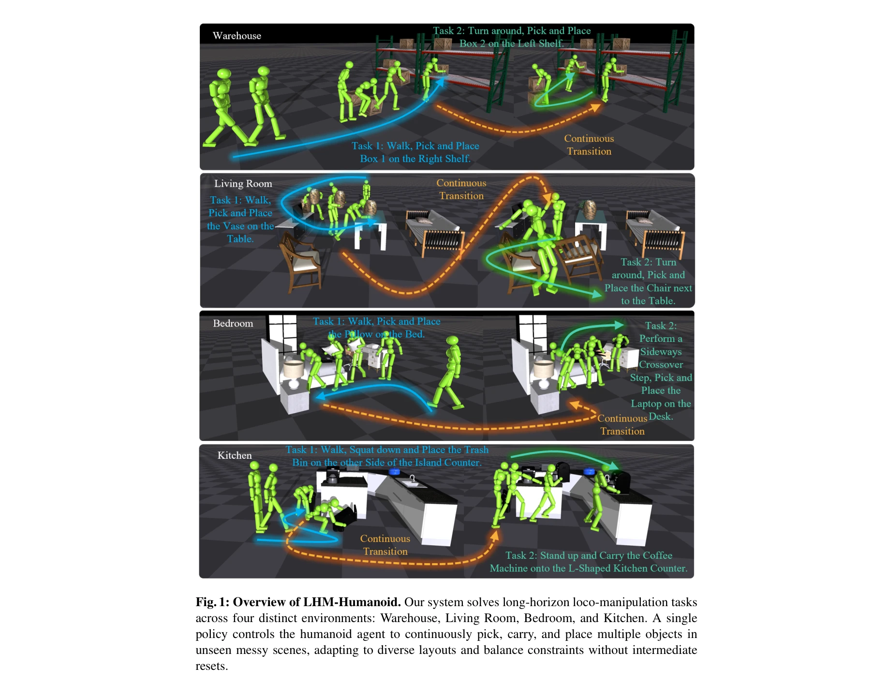
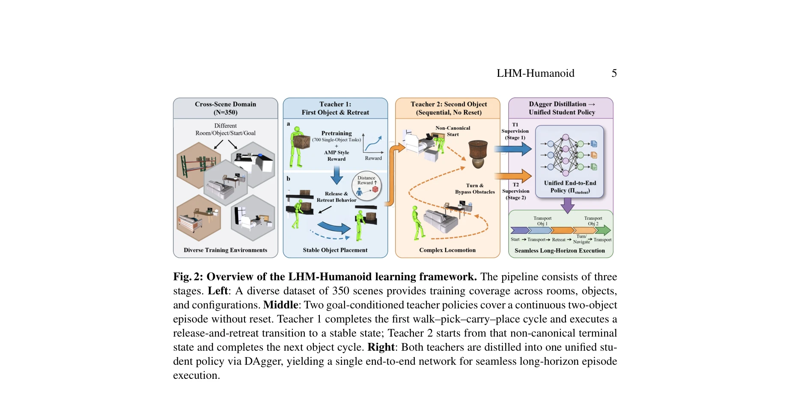

# LHM-Humanoid: Learning a Unified Policy for Long-Horizon Humanoid Whole-Body Loco-Manipulation in Diverse Messy Environments

> **저자**: Haozhuo Zhang, Jingkai Sun, Michele Caprio, Jian Tang, Shanghang Zhang, Qiang Zhang, Wei Pan | **날짜**: 2026-03-05 | **DOI**: [10.48550/arXiv.2508.16943](https://doi.org/10.48550/arXiv.2508.16943)

---

## Essence

*Fig. 1: Overview of LHM-Humanoid. Our system solves long-horizon loco-manipulation tasks*

LHM-Humanoid는 복잡한 실내 환경에서 장기간 로봇 이동과 조작을 동시에 수행하는 휴머노이드 로봇을 위해 단일 통합 정책을 학습하는 벤치마크 및 프레임워크이다. Dual-teacher distillation과 DAgger를 통해 다양한 장면에서 높은 일반화 성능을 달성한다.

## Motivation

- **Known**: 휴머노이드 로봇의 동작 합성, 장면 상호작용, 물체 조작에 대한 개별 연구는 다수 존재한다. 그러나 대부분의 기존 연구는 단일 물체 상호작용이나 고정된 장면 분포로 제한되어 있다.
- **Gap**: 장기 지평(long-horizon)에서 전신 조작, 크로스-씬 일반화, 단일 통합 정책 제어를 동시에 요구하는 복잡한 환경에서의 휴머노이드 로코-조작 작업에 대한 연구 부족하다.
- **Why**: 실제 환경에서 휴머노이드 로봇이 배포되려면 장애물을 피하면서 여러 물체를 반복적으로 집고, 운반하고, 놓을 수 있어야 하며, 이는 산업 및 가정용 로봇 자동화에 광범위한 실질적 가치를 제공한다.
- **Approach**: 350개의 다양한 장면으로 구성된 벤치마크 데이터셋을 구축하고, 첫 번째 fetch-carry-place 사이클을 담당하는 Teacher 1과 그 후속 사이클을 담당하는 Teacher 2를 RL로 학습한 후, 이들을 DAgger를 통해 단일 end-to-end 학생 정책으로 증류한다.

## Achievement

*Fig. 1: Overview of LHM-Humanoid. Our system solves long-horizon loco-manipulation tasks*

- **LHM-Humanoid 벤치마크**: 침실, 거실, 주방, 창고 4가지 환경 유형에 걸쳐 350개의 다양한 실내 장면/작업 데이터셋 구성
- **Dual-teacher distillation 프레임워크**: 릴리스-리트릿(release-and-retreat) 행동을 명시적으로 훈련하는 두 개의 목표 조건부 RL 교사를 단일 end-to-end 정책으로 통합
- **VLA 확장**: 통합 정책을 RGB 관찰과 자연어로 조건화된 vision-language-action 모델로 추가 증류
- **강력한 일반화 성능**: 본 학 장면과 미학습 장면 모두에서 end-to-end RL 기준 및 기존 휴머노이드 방법을 상당히 능가하는 장기 견고성과 크로스-씬 일반화 입증

## How

*Fig. 2: Overview of the LHM-Humanoid learning framework. The pipeline consists of three*

- 1단계: 350개 다양한 장면으로부터 700개의 단일-물체 작업을 생성하여 Adversarial Motion Prior(AMP) 스타일 보상과 함께 Teacher 1 사전학습
- 2단계: Teacher 1을 릴리스-리트릿 세부조정하여 안정적인 핸드오프 상태 생성 및 Teacher 2가 시작할 수 있는 비표준 말단 상태 도출
- 3단계: DAgger 알고리즘을 사용하여 Teacher 1과 Teacher 2를 단일 end-to-end 학생 정책으로 증류
- 4단계: 학생 정책을 egocentric RGB 관찰과 자연언어로 조건화된 VLA 모델로 추가 증류
- 5단계: Isaac Gym 시뮬레이션 환경에서 광범위한 실험을 통해 성능 검증

## Originality

- 장기 지평 전신 휴머노이드 로코-조작을 크로스-씬 일반화와 함께 다루는 첫 번째 종합적 벤치마크 및 프레임워크 제시
- Scene-specific ground-truth 동작 없이 순수 작업 목표에서 학습하는 task-and-scene 벤치마크 설계로 모방 학습 제약 회피
- Release-and-retreat 행동을 명시적 훈련 목표로 제시하여 다중 물체 에피소드에서 정책 연속성 문제 해결
- Dual-teacher 메커니즘으로 직접 end-to-end RL의 수렴 실패 문제를 극복하고 안정적인 학습 가능하게 함

## Limitation & Further Study

- Isaac Gym 시뮬레이션 환경에서만 평가되었으며, 실제 로봇에서의 sim-to-real 전이 성능 검증 부재
- 현재 접근법은 사전 훈련된 기술 라이브러리 없이 순수 end-to-end 정책에 의존하므로 더 복잡한 다단계 작업으로의 확장 가능성 불명확
- VLA 모델의 자연언어 이해 능력이 제한될 수 있으며, 복잡한 자연언어 지시에 대한 성능 평가 필요
- 후속 연구: (1) 실제 휴머노이드 플랫폼에서 정책 검증, (2) 더 많은 물체와 장기 에피소드로의 확장, (3) 계층적 강화학습과의 결합을 통한 구조화된 기술 학습 탐색

## Evaluation

- Novelty: 4/5
- Technical Soundness: 3/5
- Significance: 4/5
- Clarity: 4/5
- Overall: 4/5

**총평**: LHM-Humanoid는 장기 지평 휴머노이드 로코-조작을 위한 최초의 종합 벤치마크를 제시하고, Dual-teacher distillation과 DAgger를 통해 실질적으로 효과적인 학습 프레임워크를 제공한다. 다양한 장면에서의 강력한 일반화 성능과 VLA 확장은 실제 배포 가능성을 보여주지만, 실제 로봇 검증의 부재가 실용적 영향력 평가의 주요 과제이다.

## Related Papers

- 🏛 기반 연구: [[papers/1578_MoRE_Mixture_of_Residual_Experts_for_Humanoid_Lifelike_Gaits/review]] — SPRINT의 확장 가능한 정책 사전학습 개념이 LHM-Humanoid의 장기간 통합 정책 학습에 이론적 토대를 제공함
- 🔄 다른 접근: [[papers/1414_General_Humanoid_Whole-Body_Control_via_Pretraining_and_Fast/review]] — 두 논문 모두 사전학습을 통한 일반적 휴머노이드 제어를 다루지만, 장기간 통합 정책 vs 빠른 적응이라는 서로 다른 접근법을 제시함
- 🔗 후속 연구: [[papers/1563_MASH_Cooperative-Heterogeneous_Multi-Agent_Reinforcement_Lea/review]] — MASH의 협력적 다중 에이전트 접근법을 장기간 로코-매니퓰레이션 task에 적용하여 통합 정책으로 발전시킨 형태임
- 🧪 응용 사례: [[papers/1510_OpenVLA_An_Open-Source_Vision-Language-Action_Model/review]] — web 지식 전이 방법론이 OpenVLA의 오픈소스 모델 성능 향상에 직접적으로 활용 가능하다
- 🔗 후속 연구: [[papers/1556_RT-H_Action_Hierarchies_Using_Language/review]] — RT-2의 web knowledge transfer가 RT-H의 언어 기반 행동 계층을 더 광범위한 지식으로 확장한다.
- 🏛 기반 연구: [[papers/1563_MASH_Cooperative-Heterogeneous_Multi-Agent_Reinforcement_Lea/review]] — 협력적 다중 에이전트 기반 전신 제어가 LHM-Humanoid의 장기간 통합 정책 학습에 방법론적 토대를 제공함
