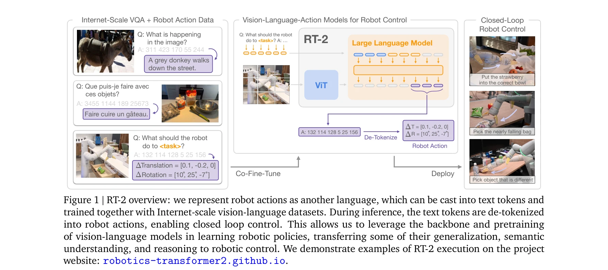
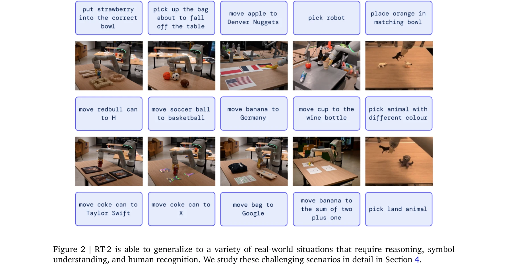

# RT-2: Vision-Language-Action Models Transfer Web Knowledge to Robotic Control

> **저자**: Anthony Brohan, Noah Brown, Justice Carbajal, Yevgen Chebotar, Xi Chen, Krzysztof Choromanski, Tianli Ding, Danny Driess, Avinava Dubey, Chelsea Finn, Pete Florence, Chuyuan Fu, Montse Gonzalez Arenas, Keerthana Gopalakrishnan, Kehang Han, Karol Hausman, Alexander Herzog, Jasmine Hsu, Brian Ichter, Alex Irpan, Nikhil Joshi, Ryan Julian, Dmitry Kalashnikov, Yuheng Kuang, Isabel Leal, Lisa Lee, Tsang-Wei Edward Lee, Sergey Levine, Yao Lu, Henryk Michalewski, Igor Mordatch, Karl Pertsch, Kanishka Rao, Krista Reymann, Michael Ryoo, Grecia Salazar, Pannag Sanketi, Pierre Sermanet, Jaspiar Singh, Anikait Singh, Radu Soricut, Huong Tran, Vincent Vanhoucke, Quan Vuong, Ayzaan Wahid, Stefan Welker, Paul Wohlhart, Jialin Wu, Fei Xia, Ted Xiao, Peng Xu, Sichun Xu, Tianhe Yu, Brianna Zitkovich | **날짜**: 2023-07-28 | **URL**: [https://arxiv.org/abs/2307.15818](https://arxiv.org/abs/2307.15818)

---

## Essence

*Figure 1 | RT-2 overview: we represent robot actions as another language, which can be cast into text tokens and*

인터넷 규모의 데이터로 학습한 vision-language 모델을 로봇 제어에 직접 통합하여 end-to-end 로봇 정책을 학습하는 RT-2 모델을 제안한다. 로봇 액션을 텍스트 토큰으로 표현하여 VLM의 사전학습 이점을 활용하면서도 저수준의 로봇 제어를 가능하게 한다.

## Motivation

- **Known**: Vision-language 모델은 이미지 캡셔닝, VQA, 시각적 추론 등의 작업에서 뛰어난 성능을 보이며, 대규모 웹 데이터 사전학습으로 풍부한 의미론적 지식을 습득한다. 그러나 기존 로봇 공학 방법은 VLM을 고수준 계획에만 사용하고 저수준 제어는 별도의 컨트롤러가 담당한다.
- **Gap**: VLM의 의미론적 추론 능력을 저수준 로봇 제어에 직접 통합하는 방법이 부재하며, 웹 스케일 데이터의 이점을 로봇이 폐루프 제어 과정에서 활용할 수 없다. 로봇 데이터의 부족을 웹 데이터로 보완하면서도 정확한 제어 신호를 생성해야 한다는 과제가 있다.
- **Why**: 대규모 로봇 데이터 수집이 현실적으로 어려운 반면 웹 기반 VLM은 수십억 토큰으로 학습되어 있어, 웹 지식을 로봇 제어에 전이할 수 있다면 로봇의 일반화 능력과 의미론적 추론 능력을 크게 향상시킬 수 있다.
- **Approach**: 기존 vision-language 모델을 로봇 궤적 데이터와 VQA 등의 웹 규모 작업으로 공동 미세조정하며, 로봇 액션을 텍스트 토큰으로 인코딩하여 자연어와 동일하게 훈련 데이터에 포함시킨다. 이를 통해 사전학습된 VLM 가중치를 활용하면서 새로운 파라미터 추가 없이 로봇 정책을 학습한다.

## Achievement

*Figure 2 | RT-2 is able to generalize to a variety of real-world situations that require reasoning, symbol*

- **6k 평가 시험을 통한 광범위한 검증**: 6000회의 로봇 평가를 통해 제안된 방법의 성능과 일반화 능력을 체계적으로 입증했다.
- **미학습 객체에 대한 현저한 일반화 개선**: 로봇 훈련 데이터에 없는 새로운 객체에 대해 RT-2가 기존 방법보다 훨씬 높은 성공률을 달성한다.
- **훈련 데이터 미포함 명령 해석**: 특정 숫자나 아이콘 근처에 객체를 배치하는 등 로봇 훈련 데이터에 없는 의미론적 지시를 해석할 수 있다.
- **객체 관계 기반 추론**: 가장 작은/큰 객체를 선택하거나 다른 객체에 가장 가까운 객체를 선택하는 등의 상대적 추론이 가능하다.
- **체인오브소트를 통한 다단계 추론**: 대체 망치로 사용할 돌을 선택하거나 피로한 사람을 위해 에너지 음료를 추천하는 등의 복잡한 의미론적 추론을 수행한다.

## How

*Figure 1 | RT-2 overview: we represent robot actions as another language, which can be cast into text tokens and*

- Vision Transformer(ViT) 기반 비전 인코더와 대규모 언어 모델 백본으로 구성된 기존 vision-language 모델 활용
- 로봇 액션(translation, rotation 등)을 정수 토큰 시퀀스로 인코딩하여 텍스트 토큰처럼 처리
- VQA, 이미지 캡셔닝 등의 웹 규모 vision-language 작업과 로봇 궤적 데이터를 혼합하여 공동 미세조정
- 추론 시점에 텍스트 토큰을 역토큰화하여 연속 로봇 액션으로 변환
- 폐루프 로봇 제어를 통해 시각 피드백을 기반으로 순차적으로 액션 생성
- Chain of thought 프롬팅을 추가하여 다단계 추론 능력 강화

## Originality

- **로봇 액션의 토큰화 아이디어**: 로봇 제어 신호를 자연어 토큰과 동일한 형식으로 표현하는 간단하지만 효과적인 방법으로, 기존 VLM을 로봇 정책으로 직접 전환할 수 있게 함
- **웹 규모 사전학습의 직접 전이**: VLM을 고수준 계획에만 사용하는 기존 방식 대신 저수준 폐루프 제어에 직접 통합하여 의미론적 지식을 활용
- **아키텍처 수정 최소화**: 기존 모델에 새로운 파라미터를 추가하지 않고 미세조정만으로 로봇 정책 학습이 가능한 우아한 접근법
- **긴급 능력(emergent capabilities) 발현**: 웹 사전학습으로부터 로봇 훈련 데이터에 명시되지 않은 새로운 의미론적 추론 능력이 자발적으로 나타남

## Limitation & Further Study

- **물리적 기술 제약**: 모델이 학습할 수 있는 물리적 조작 능력은 로봇 데이터의 분포로 제한되며, 웹 데이터만으로 새로운 제어 스킬을 습득할 수 없다.
- **토큰화 정밀도**: 연속 로봇 액션(translation, rotation)을 정수 토큰으로 양자화할 때 정보 손실이 발생할 수 있으며, 이것이 제어 정밀도에 미치는 영향에 대한 분석이 부족하다.
- **평가 환경의 한계**: 6k 평가 시험이 모두 통제된 실험실 환경에서 수행되어, 실제 야외 환경에서의 성능은 미지수이다.
- **데이터셋 편향**: 로봇 훈련 데이터가 특정 로봇과 작업에 편향되어 있을 가능성이 있으며, 다양한 로봇 플랫폼으로의 일반화 가능성은 제시되지 않았다.
- **후속 연구 방향**: (1) 더 큰 규모의 다양한 로봇 데이터 수집, (2) 다중 로봇 플랫폼에 대한 전이 학습 연구, (3) 실시간 성능 향상을 위한 온라인 학습 기법, (4) 불확실성 추정과 안전성 보장 메커니즘

## Evaluation

- Novelty: 4/5
- Technical Soundness: 3/5
- Significance: 4/5
- Clarity: 4/5
- Overall: 4/5

**총평**: RT-2는 웹 규모 vision-language 모델의 의미론적 지식을 로봇 제어에 직접 통합하는 우아하고 효과적인 방법을 제시하며, 광범위한 실험을 통해 미학습 객체 일반화와 의도한 추론 능력을 입증한다. 로봇 공학에서 대규모 사전학습 활용의 새로운 패러다임을 제안한 것으로 산업적, 학문적 기여도가 크다.

## Related Papers

- 🏛 기반 연구: [[papers/1554_LeVERB_Humanoid_Whole-Body_Control_with_Latent_Vision-Langua/review]] — RT-1의 robotics transformer 아키텍처를 확장하여 web-scale vision-language 사전학습의 이점을 로봇 제어에 통합한다.
- 🧪 응용 사례: [[papers/1533_RLRC_Reinforcement_Learning-based_Recovery_for_Compressed_Vi/review]] — RT-2의 대규모 VLA 모델을 실제 배포를 위해 압축과 최적화 기법을 적용하는 구체적 사례를 제시한다.
- 🏛 기반 연구: [[papers/1548_Robotic_Skill_Acquisition_via_Instruction_Augmentation_with/review]] — vision-language model의 로봇 적용 가능성을 보여주어 자동 instruction augmentation 연구의 이론적 기반을 제공한다.
- 🔗 후속 연구: [[papers/1287_π_0_A_Vision-Language-Action_Flow_Model_for_General_Robot_Co/review]] — 웹 지식을 로봇 제어에 전이하는 RT-2의 접근을 flow model을 통해 더 연속적이고 정밀하게 발전시킨다
- 🏛 기반 연구: [[papers/1533_RLRC_Reinforcement_Learning-based_Recovery_for_Compressed_Vi/review]] — RT-2의 VLA 아키텍처를 압축하고 최적화하는 방법론을 제시하여 실제 배포 가능성을 높인다.
- 🔗 후속 연구: [[papers/1542_RoboMonkey_Scaling_Test-Time_Sampling_and_Verification_for_V/review]] — RT-2 모델의 성능을 테스트 시간에 샘플링과 검증을 통해 추가로 향상시키는 방법을 제시한다.
- 🔗 후속 연구: [[papers/1548_Robotic_Skill_Acquisition_via_Instruction_Augmentation_with/review]] — RT-2의 vision-language 통합 아이디어를 주석이 없는 데이터에서 자동으로 언어 조건부 정책을 학습하는 방향으로 발전시킨다.
- 🔗 후속 연구: [[papers/1592_TraceVLA_Visual_Trace_Prompting_Enhances_Spatial-Temporal_Aw/review]] — RT-2의 vision-language-action 모델에 visual trace prompting을 추가하여 spatial-temporal 인식 능력을 향상시킨다.
