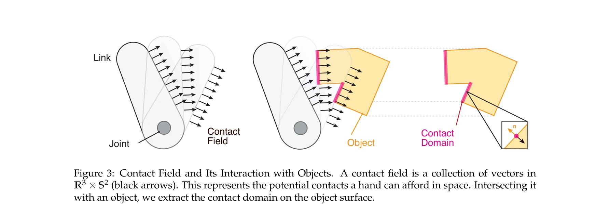
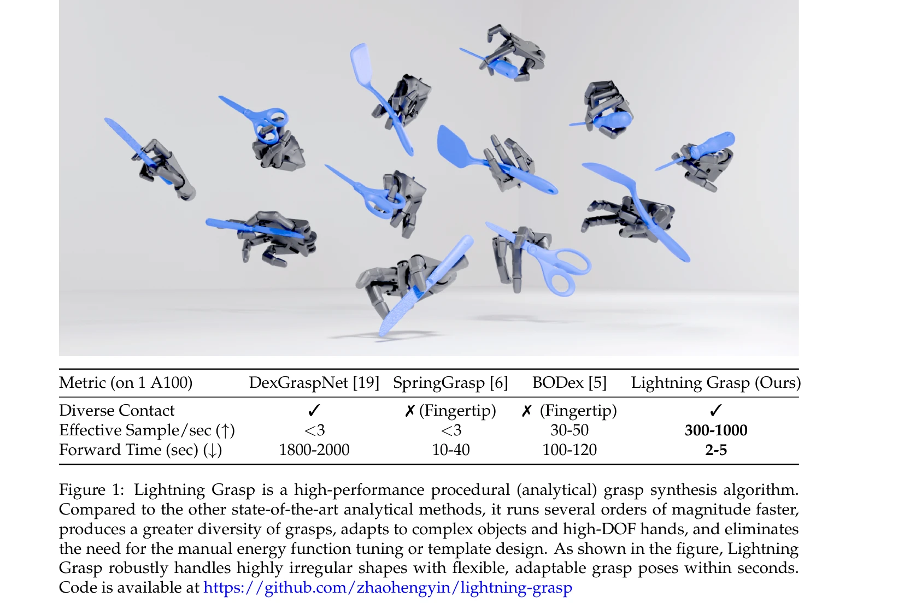
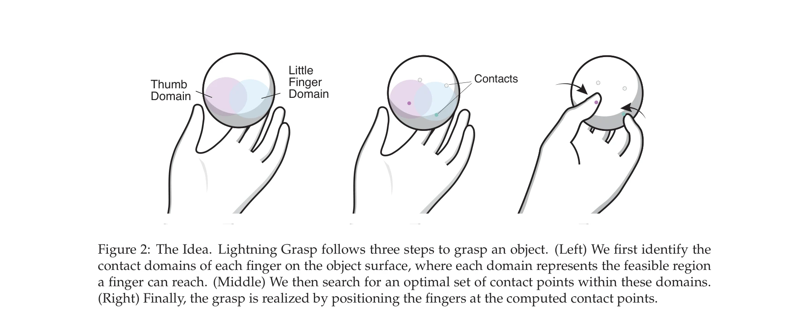

# Lightning Grasp: High Performance Procedural Grasp Synthesis with Contact Fields

> **저자**: Zhao-Heng Yin, Pieter Abbeel | **날짜**: 2025-11-10 | **URL**: [https://arxiv.org/abs/2511.07418](https://arxiv.org/abs/2511.07418)

---

## Essence

*Figure 3: Contact Field and Its Interaction with Objects. A contact field is a collection of vectors in*

Lightning Grasp는 Contact Field라는 효율적인 데이터 구조를 통해 기하학적 계산과 최적화를 분리하여 기존 대비 수 배 빠른 속도로 다양한 손가락 그래스프를 생성하는 절차적 알고리즘이다.

## Motivation

- **Known**: 기존 grasp synthesis 방법들은 에너지 함수 튜닝과 민감한 초기화가 필요하며, real-time diverse grasp synthesis는 여전히 미해결 과제이다. 병렬 jaw gripper가 주류이며 dexterous hand를 위한 효율적인 방법이 부족하다.
- **Gap**: 기존 analytical grasp synthesis 방법(DexGraspNet, SpringGrasp, BODex 등)은 느린 속도(forward time 100초 이상), 제한된 grasp 다양성, 복잡한 객체 적응 불가능이라는 한계가 있다. Contact domain 검출과 contact point 최적화를 위한 효율적인 decoupling 기법이 부재하다.
- **Why**: 빠르고 다양한 grasp synthesis는 data-driven manipulation policy 학습을 위한 핵심 데이터 엔진이며, dexterous manipulation의 실용화를 위해 필수적이다.
- **Approach**: Contact Field를 통해 각 손가락이 도달 가능한 영역(contact domain)을 collision detection으로 추출한 후, block-wise zeroth-order optimization으로 안정적인 contact point를 찾고, kinematic optimization으로 최종 grasp를 실현한다.

## Achievement

*Figure 1: Lightning Grasp is a high-performance procedural (analytical) grasp synthesis algorithm.*

- **성능**: A100 GPU에서 2-5초 내 1,000-10,000개의 diverse, valid grasp 생성 (기존 대비 300배 이상 빠름)
- **다양성**: 불규칙한 도구형 객체에 대한 diverse contact 지원
- **유연성**: 수동 hand-initialization template과 민감한 objective weight tuning 불필요
- **일반화**: 다양한 hand model(thumb, little finger 등)에 적응 가능
- **접근성**: TITAN X 같은 legacy GPU에서도 real-time 추론 달성, 오픈소스 공개

## How

*Figure 2: The Idea. Lightning Grasp follows three steps to grasp an object. (Left) We first identify the*

- Contact Field 정의: 6D geometry (R³ × S²) 객체로 hand link mesh의 contact patch에서 joint configuration에 따른 모든 가능한 contact를 인코딩
- Contact Field 표현: BVH(Bounding Volume Hierarchy) 구조로 sampled contact field를 효율적으로 저장 및 쿼리
- Contact Domain 검출: object mesh와 contact field를 교집합하여 각 손가락이 닿을 수 있는 영역 추출
- Contact Point 최적화: block-wise zeroth-order optimization으로 contact domain 내에서 Frictionless/General Self-balancing Wrench Optimization (FSWO/GSWO) 목적함수 최소화
- Grasp 실현: iterative kinematic optimization으로 계산된 contact point에 손가락 배치 및 최종 grasp 생성
- 안정성 검증: 계산된 grasp에 대해 no-penetration constraint와 grasp stability (self-balancing ε-wrench) 조건 만족 확인

## Originality

- 기하학적 계산과 검색/최적화의 명시적 decoupling을 통한 근본적인 구조 개선
- Contact Field라는 novel 6D data structure로 contact domain detection을 collision detection 문제로 환원
- BVH 기반 compact representation으로 메모리 효율성과 쿼리 속도 동시 달성
- manual energy function tuning과 template 설계 제거로 방법론의 자동화 및 robust 달성

## Limitation & Further Study

- 현재 frictionless/friction cone 기반 stability metric에만 적용 가능 (form/force closure 등 다른 metric 확장 필요)
- grasp quality metric의 다양성 부재 (stability만 고려, contact force distribution 등 추가 고려 가능)
- sim-to-real transfer에 대한 검증 부재 (시뮬레이션 기반만 평가)
- 대규모 손가락(>6DOF) hand에 대한 확장성 미검증
- 후속 연구: real robot manipulation 실험 추가, 다양한 stability metric 통합, force distribution 최적화

## Evaluation

- Novelty: 4/5
- Technical Soundness: 4/5
- Significance: 4/5
- Clarity: 4/5
- Overall: 4/5

**총평**: Lightning Grasp는 Contact Field를 통한 혁신적인 decoupling으로 기존 방법 대비 수 배 성능 향상을 달성하면서도 유연성과 일반화를 확보한 우수한 연구이다. practical dexterous manipulation을 위한 실질적 기여로 매우 높은 가치를 지닌다.

## Related Papers

- 🏛 기반 연구: [[papers/1469_ManiSkill3_GPU_Parallelized_Robotics_Simulation_and_Renderin/review]] — ManiSkill3의 GPU 가속 시뮬레이션 기술이 고성능 절차적 그래스프 생성의 기반 플랫폼을 제공함
- 🧪 응용 사례: [[papers/1413_GBC_Generalized_Behavior-Cloning_Framework_for_Whole-Body_Hu/review]] — GraspVLA의 foundation model 기반 그래스프가 Lightning Grasp의 절차적 알고리즘과 상호보완적 접근법을 보여줌
- 🔗 후속 연구: [[papers/1355_DexGarmentLab_Dexterous_Garment_Manipulation_Environment_wit/review]] — DexGarmentLab의 정교한 조작 환경이 Contact Field 기반 고성능 그래스프 생성의 확장된 적용 영역을 제시함
- 🔄 다른 접근: [[papers/1429_GraspSense_언어_기반_인지와_힘_맵을_활용한_손재주_로봇_파지_계획/review]] — 로봇 grasping을 다른 procedural synthesis 방법으로 접근한다
