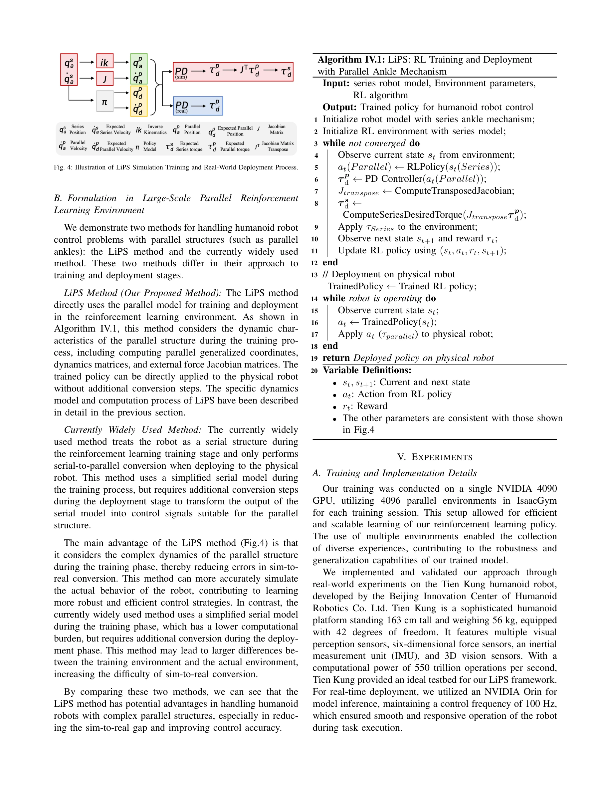
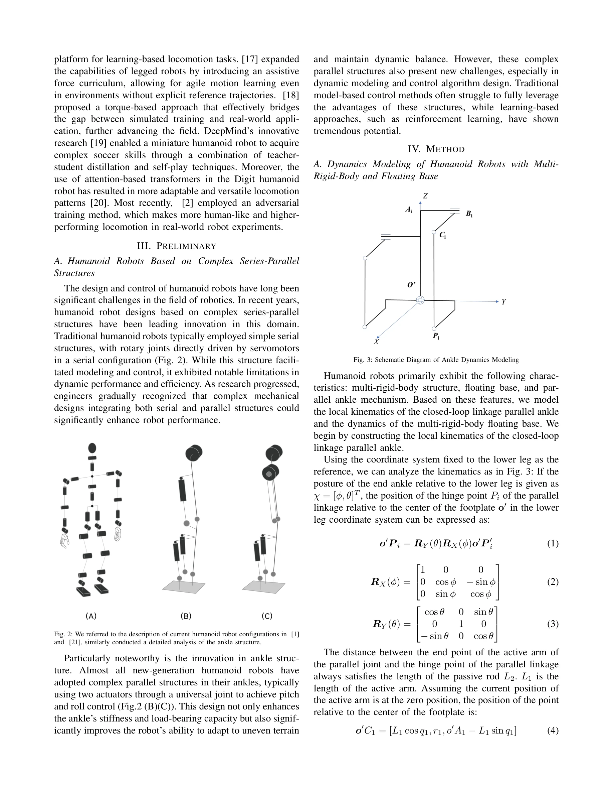

# LiPS: Large-Scale Humanoid Robot Reinforcement Learning with Parallel-Series Structures

> **저자**: Qiang Zhang, Gang Han, Jingkai Sun, Wen Zhao, Jiahang Cao, Jiaxu Wang, Hao Cheng, Lingfeng Zhang, Yijie Guo, Renjing Xu | **날짜**: 2025-03-11 | **URL**: [https://arxiv.org/abs/2503.08349](https://arxiv.org/abs/2503.08349)

---

## Essence

*Fig. 4: Illustration of LiPS Simulation Training and Real-World Deployment Process.*

LiPS는 인간형 로봇의 강화학습 훈련을 위해 GPU 기반 병렬 시뮬레이션 환경에서 다중강체 동역학 모델링을 최적화하여, 직렬-병렬 메커니즘을 훈련 단계에서 직접 모델링하고 sim2real 갭을 감소시키는 방법론이다.

## Motivation

- **Known**: 현재 인간형 로봇 강화학습 제어 알고리즘은 IsaacGym과 URDF 포맷을 활용하여 대규모 병렬 훈련을 수행하고 있으나, 대부분 개루프 토폴로지로 훈련하고 sim2real 단계에서 직렬-병렬 구조로 변환한다.
- **Gap**: 현재 GPU 기반 물리엔진들은 URDF 기반 다중강체 폐루프 토폴로지의 동역학을 정확하게 시뮬레이션할 수 없어, 훈련-배포 간 큰 괴리가 발생하고 병렬 메커니즘 변환이 어렵다.
- **Why**: 인간형 로봇은 복잡한 직렬-병력 메커니즘을 포함하여 훈련이 이족 보행 로봇보다 훨씬 느리므로, 정확한 동역학 시뮬레이션은 훈련 효율성과 실제 배포 성능을 크게 향상시킬 수 있다.
- **Approach**: LiPS는 시뮬레이션 환경에서 다중강체 동역학을 URDF 기반으로 재모델링하여 폐루프 토폴로지의 동적 특성을 정확하게 표현하고, 이를 통해 훈련-배포 간 괴리를 줄인다.

## Achievement

*Fig. 4: Illustration of LiPS Simulation Training and Real-World Deployment Process.*

- **복잡한 다중강체 동역학 모델링**: URDF 포맷을 유지하면서 직렬-병렬 메커니즘의 동역학 특성을 정확하게 표현하여 물리엔진의 한계 극복
- **sim2real 갭 감소**: 훈련 단계에서 실제 로봇 구조와 동일한 병렬 메커니즘으로 학습하여 배포 시 구조 변환의 어려움 제거
- **훈련 및 추론 효율성 향상**: GPU 기반 대규모 병렬 훈련 환경을 유지하면서 동역학 정확성을 확보하여 수렴 속도와 정책 품질 개선
- **일반화 가능성**: URDF 기반 다양한 로봇 형태에 적용 가능한 범용 방법론으로 로보틱스 연구 커뮤니티에 기여

## How

*Fig. 3: Schematic Diagram of Ankle Dynamics Modeling*

- 직렬-병렬 메커니즘(예: 발목 구조)을 다중강체 동역학으로 재구성하여 기존 URDF의 기하학적 표현을 동역학적 표현으로 확장
- IsaacGym 기반 GPU 병렬 시뮬레이션에서 최적화된 동역학 계산을 수행하여 대규모 샘플 효율성 유지
- 개루프 토폴로지 대신 폐루프 토폴로지 동역학을 직접 모델링하여 훈련 단계부터 실제 로봇의 제약과 특성 반영
- 훈련된 정책을 실제 로봇에 직접 배포할 때 구조 변환 없이 적용 가능하도록 설계

## Originality

- URDF 포맷의 근본적인 한계(동역학 표현 부족)를 다중강체 동역학 재모델링으로 해결하는 혁신적 접근
- 시뮬레이션 환경에서 폐루프 토폴로지를 직접 훈련하여 sim2real 갭을 구조적으로 제거하는 새로운 관점
- 기존 IsaacGym 기반 프레임워크와의 호환성을 유지하면서 동역학 정확성을 대폭 향상시킨 실용적 혁신

## Limitation & Further Study

- 다중강체 동역학 모델링의 추가 계산 비용이 실제로 측정되지 않아 시뮬레이션 속도 영향 정량화 필요
- 현재 발목 메커니즘 중심의 사례 연구로, 다양한 병렬 구조(예: 손목, 무릎)에 대한 일반화 검증 부족
- 실제 로봇 실험을 통한 sim2real 성능 비교가 상세하게 제시되지 않아 실제 배포 성능 개선 정량화 필요
- 다른 GPU 기반 물리엔진(예: IsaacLab)과의 비교 또는 통합 방안에 대한 논의 부재

## Evaluation

- Novelty: 4/5
- Technical Soundness: 3/5
- Significance: 4/5
- Clarity: 4/5
- Overall: 4/5

**총평**: LiPS는 URDF 기반 인간형 로봇 강화학습의 오래된 문제인 동역학 모델링 부정확성과 sim2real 갭을 구조적으로 해결하며, 높은 실용성과 일반화 가능성을 갖춘 중요한 기여다. 다만 실제 로봇 실험을 통한 성능 검증이 강화되면 더욱 설득력 있는 연구가 될 것으로 판단된다.

## Related Papers

- 🔄 다른 접근: [[papers/1412_GR00T_N1_An_Open_Foundation_Model_for_Generalist_Humanoid_Ro/review]] — GPU 병렬 시뮬레이션으로 휴머노이드 강화학습을 최적화하는 LiPS와 3D Gaussian 기반 실시간 학습 환경이 동일한 대규모 시뮬레이션 문제를 다룬다.
- 🏛 기반 연구: [[papers/1295_Booster_Gym_An_End-to-End_Reinforcement_Learning_Framework_f/review]] — 대규모 휴머노이드 강화학습을 위한 LiPS의 병렬 시뮬레이션 방법론이 종단간 강화학습 프레임워크 Booster Gym의 기반이 된다.
- 🧪 응용 사례: [[papers/1469_Humanoid_Occupancy_Enabling_A_Generalized_Multimodal_Occupan/review]] — LiPS의 병렬 시뮬레이션 최적화 기법이 대규모 로봇 시뮬레이션 ManiSkill3에서 실제 활용될 수 있다.
- 🧪 응용 사례: [[papers/1617_VLA-Cache_Efficient_Vision-Language-Action_Manipulation_via/review]] — Running VLAs at Real-time Speed가 VLA-Cache의 KV 캐싱 최적화를 실제 실시간 실행에 적용한 사례다
