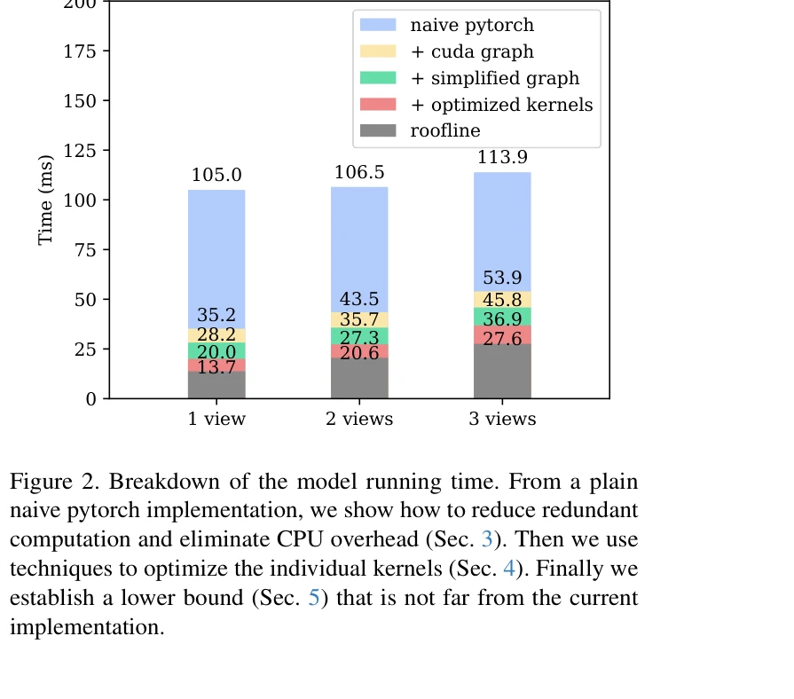
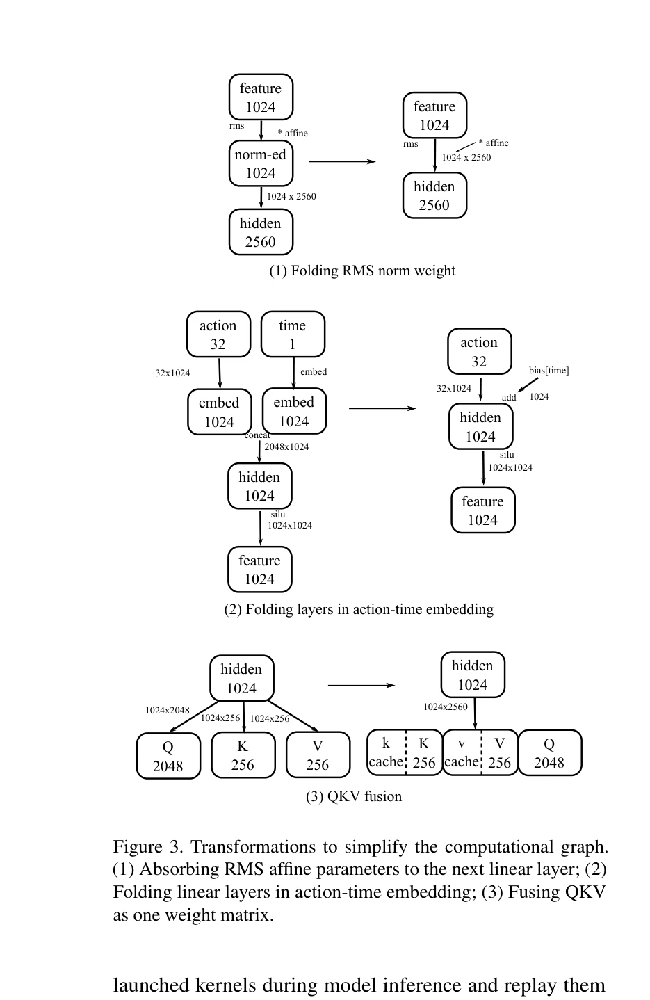

# Running VLAs at Real-time Speed

> **저자**: Yunchao Ma, Yizhuang Zhou, Yunhuan Yang, Tiancai Wang, Haoqiang Fan | **날짜**: 2025-10-30 | **URL**: [https://arxiv.org/abs/2510.26742](https://arxiv.org/abs/2510.26742)

---

## Essence

*Figure 2. Breakdown of the model running time. From a plain*

π0 레벨의 multi-view VLA를 단일 소비자 GPU에서 30Hz 프레임 레이트로 실행하기 위해 모델 추론 오버헤드를 제거하는 최적화 기법들을 제시하고, 실시간 로봇 제어를 위한 Full Streaming Inference 프레임워크를 제안한다.

## Motivation

- **Known**: VLA 모델은 일반화 성능이 뛰어나지만 전형적으로 수백 밀리초의 지연시간이 필요해 동적 작업에 부적합하다. π0는 3B 파라미터의 PaliGemma VLM과 300M 파라미터의 action expert로 구성된 강력한 로봇 조작 정책이다.
- **Gap**: 기존 VLA는 33ms 이하의 추론 시간(30 FPS)을 달성하지 못해 실시간 동작 감지 및 빠른 반응이 필요한 작업들을 수행할 수 없다. 현재 official openpi 구현은 2 views에서 53.7ms의 지연시간을 보인다.
- **Why**: 펜 낙하 캐칭 같은 동적 작업은 매우 엄격한 시간 제약이 있으며, 평균 인간 수준의 반응 시간(약 200ms)을 달성하려면 프레임 드롭 없이 모든 30 FPS 프레임을 처리해야 한다. 이를 통해 VLA가 고주파 로봇 제어에 실용적으로 활용될 수 있다.
- **Approach**: CUDA graph를 사용하여 CPU 오버헤드를 제거하고, 계산 그래프 변환으로 중복 계산을 제거하며, 개별 커널 최적화를 통해 병렬성을 향상시킨다. 아키텍처의 다층 입출력 구조를 Full Streaming Inference 프레임워크로 매핑하여 최대 480Hz 제어 신호 생성을 가능하게 한다.

## Achievement

*Figure 2. Breakdown of the model running time. From a plain*

- **추론 속도 향상**: 2 views 기준 53.7ms(openpi/jax)에서 27.3ms로 약 1.97배 가속화, 3 views에서 67.6ms에서 36.8ms로 달성
- **실시간 성능 달성**: 30Hz 이상의 프레임 레이트로 30 FPS RGB 비디오 스트림을 완전히 처리 가능
- **실세계 검증**: 떨어지는 펜 캐칭 작업에서 π0 정책이 100% 성공률 달성
- **Full Streaming Inference 프레임워크**: 최대 480Hz 제어 신호 생성으로 고주파 로봇 제어 가능성 제시
- **엔지니어링 기여**: CUDA graph, 그래프 단순화, 커널 최적화 등의 체계적 최적화 기법 제시

## How

*Figure 3. Transformations to simplify the computational graph.*

- CUDA graph 메커니즘을 사용하여 추론 중 발생하는 1000개 이상의 커널 실행에 따른 Python 오버헤드 제거
- RMS norm의 affine 파라미터를 후속 선형 레이어에 융합하여 선형성을 이용한 가중치 재계산
- action time encoder의 두 선형 레이어를 fold하고, 10개 타임스텝 결과를 테이블화하여 SiLU 이전 bias에 융합
- Q, K, V 프로젝션을 단일 대형 행렬로 결합하고 RoPE를 행렬 곱셈에 융합하여 커널 수 감소 및 병렬화 증가
- 카메라 ISP의 다양한 출력 해상도를 활용하여 이미지 리사이징 최적화 (60μs 이하)
- pinned memory 사용 및 정적 CPU 버퍼 할당으로 CPU-GPU 데이터 전송 최적화

## Originality

- VLA 모델의 실시간 실행을 위한 체계적이고 실용적인 최적화 파이프라인 제시 (CUDA graph → 그래프 단순화 → 커널 최적화)
- π0 모델의 특수성을 활용한 맞춤형 최적화 (동적 분기 없음, 고정 타임스텝 등)
- Full Streaming Inference 프레임워크라는 새로운 제어 아키텍처 패러다임 제안
- 실시간 로봇 제어의 다층 계층 구조 재해석 (기존 1-10Hz VLM + VLA → VLA 내부의 다층 빈도 구조)

## Limitation & Further Study

- 단일 모델(π0)과 단일 작업(펜 낙하 캐칭)에 대한 검증으로 일반화 가능성 미흡
- RTX 4090 고사양 GPU 기준 최적화로 다른 하드웨어에서의 성능 불명확
- 이미지 리사이징과 같은 전처리 시간을 측정에서 제외하여 end-to-end 지연시간이 실제보다 낙관적일 가능성
- 480Hz Full Streaming Inference의 실제 로봇 제어 성능 검증 부재
- 멀티센서 정보(force, visual-tactile) 통합에 대한 구체적 제시 부족
- **후속연구**: 다양한 VLA 모델 및 복잡한 실시간 작업으로 확장 필요, 고주파 force/torque 제어 통합 검증, 경량 하드웨어에서의 성능 평가

## Evaluation

- Novelty: 4/5
- Technical Soundness: 4/5
- Significance: 4/5
- Clarity: 4/5
- Overall: 4/5

**총평**: 본 논문은 VLA의 실시간 실행이 불가능하다는 기존 인식을 깨고, 체계적인 엔지니어링 기법들을 통해 30Hz 실시간 처리를 달성함으로써 로봇 제어의 새로운 가능성을 제시한다. 단순하지만 효과적인 최적화 기법들과 Full Streaming Inference 프레임워크는 실용적 가치가 높으며, 구체적인 코드 공개는 재현성을 보장한다.

## Related Papers

- 🔄 다른 접근: [[papers/1533_RLRC_Reinforcement_Learning-based_Recovery_for_Compressed_Vi/review]] — VLA 모델의 실시간 실행을 압축 기법과 스트리밍 추론이라는 서로 다른 최적화 방법으로 달성한다.
- 🧪 응용 사례: [[papers/1287_π_0_A_Vision-Language-Action_Flow_Model_for_General_Robot_Co/review]] — π0 VLA 모델의 실시간 추론 최적화를 통해 실제 로봇 환경에서 30Hz 제어를 가능하게 한다.
- 🔄 다른 접근: [[papers/1479_MoLe-VLA_Dynamic_Layer-skipping_Vision_Language_Action_Model/review]] — VLA 모델의 추론 효율성 향상에서 스트리밍 기법과 동적 layer-skipping이라는 다른 접근법을 사용한다.
- 🧪 응용 사례: [[papers/1479_MoLe-VLA_Dynamic_Layer-skipping_Vision_Language_Action_Model/review]] — 실시간 VLA 실행의 필요성과 동적 layer-skipping을 통한 계산 효율성 향상이 직접적으로 연결된다.
- 🔄 다른 접근: [[papers/1533_RLRC_Reinforcement_Learning-based_Recovery_for_Compressed_Vi/review]] — VLA 모델의 실시간 실행이라는 동일한 목표를 압축과 스트리밍이라는 다른 접근법으로 해결한다.
