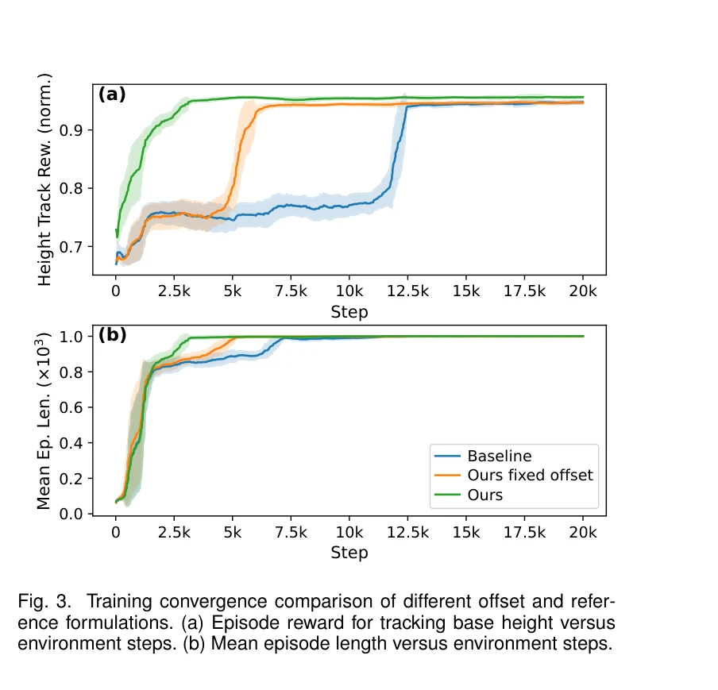
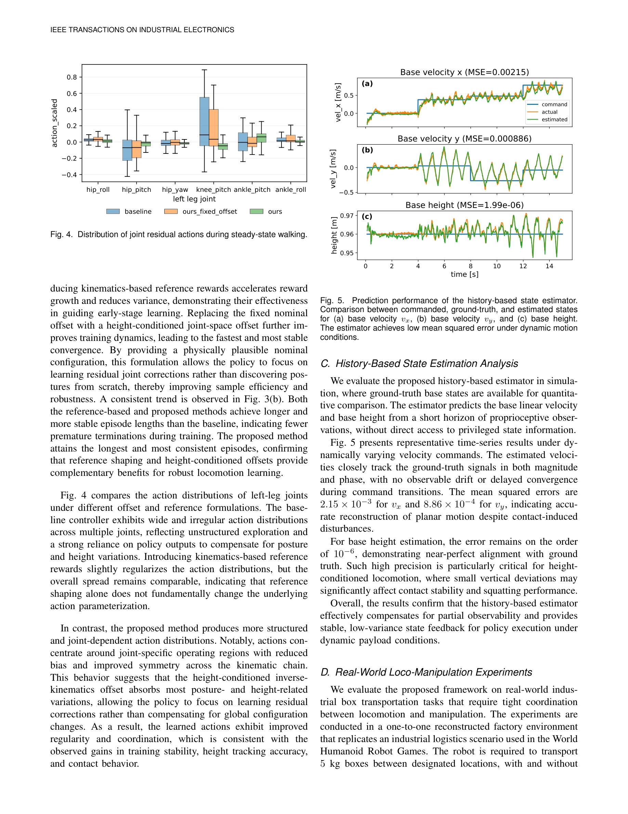

# Load-Aware Locomotion Control for Humanoid Robots in Industrial Transportation Tasks

> **저자**: Lequn Fu, Yijun Zhong, Xiao Li, Yibin Liu, Zhiyuan Xu, Jian Tang, Shiqi Li | **날짜**: 2026-03-15 | **URL**: [https://arxiv.org/abs/2603.14308](https://arxiv.org/abs/2603.14308)

---

## Essence

*Fig. 1. Overview of the proposed load-aware humanoid loco-manipulation framework. Upper-body manipulation is generated b*

산업용 휴머노이드 로봇의 다양한 하중 조건에서 안정적인 물품 운반 보행을 위해, 상체 조작과 하체 이동을 분리하면서도 RL 기반 상태 추정기로 동적 결합을 처리하는 load-aware 로코-매니퓰레이션 프레임워크를 제안한다.

## Motivation

- **Known**: 기존 연구는 순수 model-based 제어의 높은 튜닝 비용이나 whole-body RL의 불충분한 하중 변동 대응 또는 decoupled 접근의 부족한 동적 결합 모델링 등으로 산업 환경의 신뢰성 높은 보행을 달성하지 못했다.
- **Gap**: 상체의 시간-변동 페이로드 운동으로 인한 COM 변화와 접지력 변동을 명시적으로 처리하면서도, 미지의 페이로드 특성과 부분 관찰성(partial observability) 하에서 자율적 높이 조절과 안정적 loco-manipulation을 동시에 달성하는 통합 프레임워크가 부족했다.
- **Why**: 산업 로지스틱 환경에서 미리 정의되지 않은 페이로드와 동적 팔 움직임은 보행 안정성을 지속적으로 위협하므로, 이를 적응적으로 보상하는 실시간 제어 기술이 필수적이다.
- **Approach**: kinematics 기반 참조 궤적과 높이-조절 joint-space 오프셋으로 구조화된 RL 학습을 가이드하고, history-based 상태 추정기가 기저 속도·높이를 추정하며 하중-조작 교란을 compact latent representation으로 인코딩한다.

## Achievement

*Fig. 3. Training convergence comparison of different offset and refer-*

- **Decoupled yet coordinated architecture**: 하체 RL 제어와 상체 kinematic 제어를 분리하되, 관찰 설계를 통해 동적 결합을 유지하여 훈련 안정성과 배포 유연성을 동시에 확보
- **Structured residual learning**: Kinematics 참조 + height-conditioned offset이 RL 학습 공간을 축소시켜 수렴 속도 향상 및 접촉 품질 개선
- **Partial observability 해결**: History-based state estimator가 기저 속도·높이를 명시적으로 복원하고 32-dim latent feature로 미지 페이로드 교란 캡슐화
- **Sim-to-real 전이 성공**: 전체 프레임워크를 시뮬레이션에서만 학습 후 실제 full-size 휴머노이드에 fine-tuning 없이 배포, 안정적 보행 및 정확한 높이 추적 달성

## How

*Fig. 4. Distribution of joint residual actions during steady-state walking.*

- Floating-base 동역학 모델링: q = [q_b, q_leg, q_arm]으로 상하체 자유도 명시
- RL 관찰 설계: Phase input, 중력 투영(projected gravity), angular velocity, 27-dim joint positions/velocities, 명령, 최근 action, 추정 기저 속도·높이, 32-dim latent feature 포함 (총 113-dim)
- Kinematics-based 참조 궤적: 명령 속도·높이로 조절되는 nominal configuration 제공
- Height-conditioned joint-space offset: 상체 자세 변화에 따른 COM 편이를 보상하는 구조화된 사전정보
- History-based state estimator: IMU·joint 정보의 시계열 입력으로 기저 상태 추정 및 disturbance latent code 학습
- Domain randomization: 페이로드 질량·위치·분포, 마찰, 모델 파라미터 변동 포함한 시뮬레이션 훈련
- PPO 기반 RL 훈련: 안정적 보행, 균형 유지, 높이 추적, 에너지 효율 보상항으로 정책 최적화

## Originality

- 기존 decoupled 접근의 한계를 명시적 disturbance modeling (latent representation)으로 극복하여, 페이로드-조작 교란을 RL 학습에 명시적으로 통합
- Kinematics 참조 + height-conditioned offset 조합으로 구조화된 residual learning 프레임워크 제시, 기존 hard height constraint와 달리 유연성 확보
- Partial observability 환경에서 history-based state estimator로 COM 변동, 미지 페이로드 특성을 적응적으로 추정하는 방법론 제안
- Perception-driven IK 기반 상체 제어와 RL 하체 제어의 관찰 레벨 fusion으로 truly autonomous loco-manipulation 실현 (기존 teleoperation 의존성 탈피)

## Limitation & Further Study

- 상체 궤적이 perception 기반 IK 모듈에 의존하므로, 목표 pose 인식 오류 시 하체 제어 강건성이 감소할 수 있음
- Latent feature (32-dim)의 해석 가능성 부족—정확히 어떤 disturbance 특성이 인코딩되는지 명확히 분석되지 않음
- 현재 실험이 단일 robot 플랫폼 (full-size humanoid)에만 수행됨—다양한 형태/사이즈의 box와 더 극단적 페이로드 범위에 대한 일반화 검증 필요
- 전이 학습(transfer learning) 가능성 미탐색—서로 다른 로봇이나 상완 구성으로의 정책 재사용 성능 평가 필요
- 후속연구: (1) Latent feature 해석 강화 및 페이로드 parameter 역추정, (2) 불안정한 또는 변형 가능한 물품 다루기, (3) Multi-humanoid 협력 loco-manipulation

## Evaluation

- Novelty: 4/5
- Technical Soundness: 3/5
- Significance: 4/5
- Clarity: 4/5
- Overall: 4/5

**총평**: 산업 환경의 현실적 과제(미지 페이로드, 부분 관찰성, 동적 상하체 결합)를 체계적으로 해결하는 well-motivated decoupled yet coordinated 프레임워크로, 구조화된 학습 설계와 state estimation 기법이 우수하며 sim-to-real 전이 성공이 실용성을 입증한다.

## Related Papers

- 🔄 다른 접근: [[papers/1392_FALCON_Learning_Force-Adaptive_Humanoid_Loco-Manipulation/review]] — 두 논문 모두 load-aware 휴머노이드 제어를 다루지만, 산업용 운반 vs 일반적 힘 적응이라는 서로 다른 적용 영역에 집중함
- 🔗 후속 연구: [[papers/1435_HAFO_A_Force-Adaptive_Control_Framework_for_Humanoid_Robots/review]] — HAFO의 힘 적응 제어 프레임워크를 산업 환경에서의 물품 운반이라는 구체적인 task에 특화시켜 발전시킨 형태임
- 🏛 기반 연구: [[papers/1524_Learning_Human-Humanoid_Coordination_for_Collaborative_Objec/review]] — 인간-휴머노이드 협력 물체 운반의 경험이 산업용 로봇의 load-aware locomotion 설계에 방법론적 토대를 제공함
- 🏛 기반 연구: [[papers/1413_GraspVLA_a_Grasping_Foundation_Model_Pre-trained_on_Billion-/review]] — RVT-2의 소수 시연 기반 정밀 조작이 GraspVLA의 소수샷 적응성 기반을 제공한다.
- 🔄 다른 접근: [[papers/1508_Kinematics-Aware_Multi-Policy_Reinforcement_Learning_for_For/review]] — 두 논문 모두 산업 환경에서의 load-aware control을 다루지만, 하나는 force-capable manipulation에, 다른 하나는 locomotion에 초점을 둔다.
