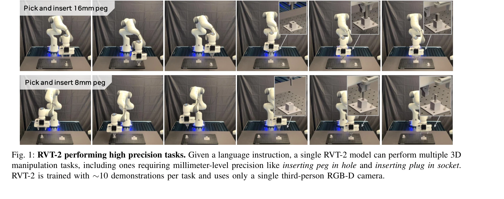
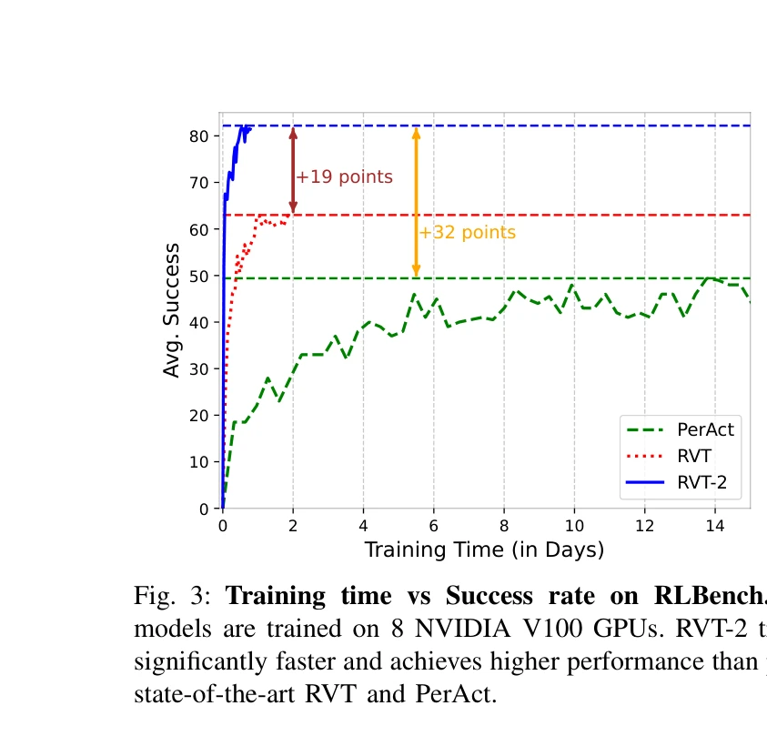
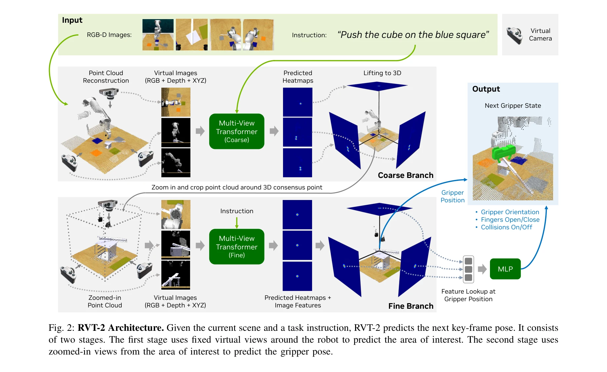

# RVT-2: Learning Precise Manipulation from Few Demonstrations

> **저자**: Ankit Goyal, Valts Blukis, Jie Xu, Yijie Guo, Yu-Wei Chao, Dieter Fox | **날짜**: 2024-06-12 | **URL**: [https://arxiv.org/abs/2406.08545](https://arxiv.org/abs/2406.08545)

---

## Essence

*Fig. 1: RVT-2 performing high precision tasks. Given a language instruction, a single RVT-2 model can perform multiple 3*

RVT-2는 적은 수의 시연으로부터 고정밀 3D 조작 작업을 학습할 수 있는 멀티태스크 로봇 조작 모델로, 이전 RVT 대비 6배 빠른 학습 속도와 2배 빠른 추론 속도를 달성하면서 RLBench에서 82%의 최고 성능을 달성했다.

## Motivation

- **Known**: PerAct과 RVT 같은 선행 연구들이 언어 지시를 통한 3D 조작 학습을 연구했으나, 밀리미터 수준의 정밀도가 필요한 작업에서는 성능이 제한적이었다.
- **Gap**: 기존 방법들은 높은 정밀도가 필요한 작업(예: 페그 삽입, 플러그 삽입)에서 어려움을 겪고 있으며, 적은 수의 시연으로 이러한 고정밀 작업을 학습할 수 있는 효율적인 방법이 부족하다.
- **Why**: 산업 제조, 가정용, 소매 등의 도메인에서 로봇이 적은 시연으로 새로운 작업을 빠르게 학습하고 높은 정밀도로 수행할 수 있는 능력이 필수적이기 때문이다.
- **Approach**: 아키텍처 개선(다단계 추론 파이프라인, convex upsampling, 위치-조건부 특성)과 시스템 레벨 최적화(커스텀 virtual image renderer, 최적화된 트레이닝 기법)를 결합하여 RVT를 개선한다.

## Achievement

*Fig. 3: Training time vs Success rate on RLBench. All*

1. **성능 향상**: RLBench에서 성공률을 65%에서 82%로 향상 (state-of-the-art)
2. **속도 개선**: 학습 속도 6배 향상 (2.4M → 16M samples/day), 추론 속도 2배 향상 (11.6 fps → 20.6 fps)
3. **실세계 검증**: 10개의 시연만으로 밀리미터 수준 정밀도가 필요한 플러그 삽입, 페그 삽입 작업 수행
4. **일반화**: 단일 RGB-D 카메라와 단일 멀티태스크 모델로 여러 조작 작업 처리 가능

## How

*Fig. 2: RVT-2 Architecture. Given the current scene and a task instruction, RVT-2 predicts the next key-frame pose. It c*

- Multi-stage coarse-to-fine 추론 파이프라인으로 관심 영역에 대한 고해상도 예측 구현
- Convex upsampling 기법 도입으로 GPU 메모리 사용량 감소 및 학습 속도 개선
- 전역 특성 대신 위치-조건부 특성(location-conditioned features)을 이용한 end-effector 회전 예측 개선
- PyTorch3D를 대체하는 커스텀 virtual image renderer 개발
- Fast optimizer와 mixed-precision training 같은 최신 transformer 학습 기법 적용

## Originality

- 개별 기법들은 기존 문헌에서 나타났으나, 이들을 효과적으로 결합하여 고정밀 3D 조작 시스템 구축한 점
- Multi-stage virtual view 렌더링과 location-conditioned features 조합의 새로운 활용
- 비전 기반 정책이 실세계 고정밀 작업(밀리미터 수준)에 적용된 첫 사례
- 적은 시연(~10개)으로 고정밀 멀티태스크 학습을 달성한 점

## Limitation & Further Study

- RLBench 벤치마크 중심의 평가로 실세계 다양한 환경에서의 일반화 미검증
- 단일 third-person RGB-D 카메라 사용으로 폐쇄된 환경이나 카메라 가시성 제약 상황에서의 성능 미평가
- 고정밀 작업의 경우에만 실세계 검증되어 다양한 유형의 실제 작업에서의 성능 미확인
- 10개 시연의 데이터 특성(환경, 로봇 종류, 카메라 설정)이 실제 배포 상황과 얼마나 일치하는지 불명확
- 후속 연구: 다양한 로봇 플랫폼 및 카메라 구성에서의 전이 학습 연구, 더 복잡한 멀티-스텝 작업으로의 확장, 촉감 피드백 통합

## Evaluation

- Novelty: 3/5
- Technical Soundness: 4/5
- Significance: 4/5
- Clarity: 4/5
- Overall: 4/5

**총평**: RVT-2는 아키텍처와 시스템 최적화를 통해 고정밀 3D 조작에서 유의미한 성능 개선을 달성했으며, 적은 시연으로 실세계 정밀 작업을 수행할 수 있음을 처음 입증했다는 점에서 로봇 조작 분야에 중요한 기여를 한다.

## Related Papers

- 🔗 후속 연구: [[papers/1559_RVT_Robotic_View_Transformer_for_3D_Object_Manipulation/review]] — RVT의 multi-view transformer 아키텍처를 기반으로 더 빠른 학습과 추론이 가능한 개선된 버전을 제시한다.
- 🧪 응용 사례: [[papers/1591_Towards_Diverse_Behaviors_A_Benchmark_for_Imitation_Learning/review]] — 적은 시연으로부터의 학습이라는 공통 과제를 3D 조작과 행동 다양성이라는 서로 다른 관점에서 해결한다.
- 🏛 기반 연구: [[papers/1354_Dex1B_Learning_with_1B_Demonstrations_for_Dexterous_Manipula/review]] — 대규모 demonstration 학습의 원리를 적은 수의 시연으로도 효과적인 학습이 가능한 방법론으로 발전시킨다.
- 🏛 기반 연구: [[papers/1559_RVT_Robotic_View_Transformer_for_3D_Object_Manipulation/review]] — RVT의 multi-view transformer 구조가 RVT-2의 더 빠르고 정확한 3D 조작 학습의 기초가 된다.
- 🔄 다른 접근: [[papers/1591_Towards_Diverse_Behaviors_A_Benchmark_for_Imitation_Learning/review]] — imitation learning에서 적은 데이터로부터의 정밀 조작과 인간 행동 다양성 학습이라는 서로 다른 과제를 다룬다.
