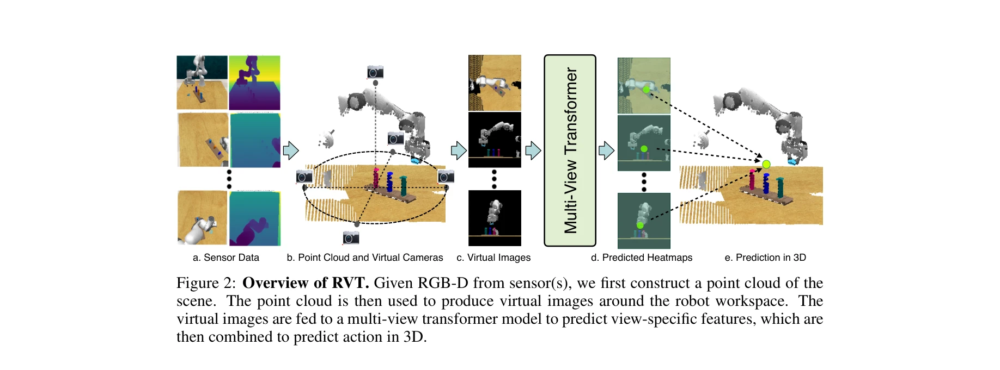
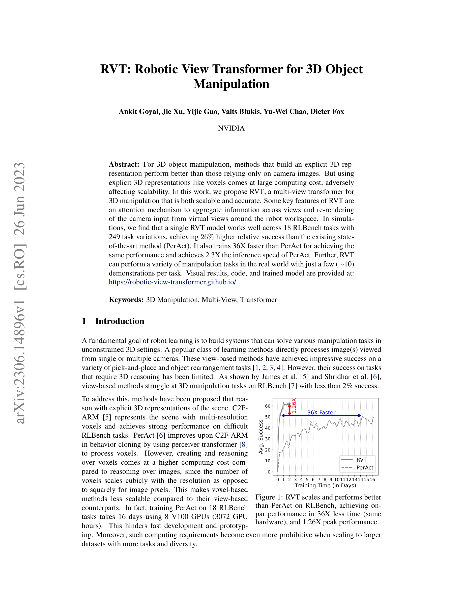

# RVT: Robotic View Transformer for 3D Object Manipulation

> **저자**: Ankit Goyal, Jie Xu, Yijie Guo, Valts Blukis, Yu-Wei Chao, Dieter Fox | **날짜**: 2023-06-26 | **URL**: [https://arxiv.org/abs/2306.14896](https://arxiv.org/abs/2306.14896)

---

## Essence

*Figure 2: Overview of RVT. Given RGB-D from sensor(s), we first construct a point cloud of the*

RVT는 3D 물체 조작을 위해 multi-view transformer를 사용하여 명시적 3D 표현의 계산 비용 문제를 해결하면서 높은 정확도와 확장성을 동시에 달성한다.

## Motivation

- **Known**: 3D 물체 조작에서 voxel 기반의 명시적 3D 표현은 view 기반 방법보다 성능이 우수하지만, 계산 비용이 높아 확장성이 제한된다.
- **Gap**: 기존 voxel 기반 방법(PerAct)은 정확하지만 훈련 시간이 매우 길고(16일) 메모리 효율이 낮으며, view 기반 방법은 3D 추론 능력이 부족하다.
- **Why**: 로봇 조작의 실제 활용을 위해서는 높은 정확도와 함께 빠른 훈련 속도 및 배포 효율이 필수적이며, 이는 로봇 학습의 실용성을 크게 향상시킨다.
- **Approach**: RGB-D 입력으로부터 포인트 클라우드를 구성하고 로봇 workspace 주변의 가상 뷰로 재렌더링한 후, multi-view transformer의 attention 메커니즘을 이용하여 뷰 간 정보를 통합한다.

## Achievement

*Figure 1: RVT scales and performs better*

- **성능 향상**: RLBench의 18개 작업(249개 변형)에서 PerAct 대비 26% 상대적 성공률 향상 달성
- **훈련 효율성**: 동일 성능 달성 시 PerAct 대비 36배 빠른 훈련 속도(16일 → 10시간)
- **추론 속도**: 2.3배 빠른 추론 속도 달성(11.6 fps vs 4.9 fps)
- **다중 작업 일반화**: 단일 RVT 모델이 18개 RLBench 작업 모두에서 우수한 성능 발휘
- **실제 환경 적용**: 약 10개 데모만으로 실제 로봇에서 다양한 조작 작업 수행 가능(5개 작업, 13개 변형)

## How

*Figure 2: Overview of RVT. Given RGB-D from sensor(s), we first construct a point cloud of the*

- RGB-D 센서 입력으로부터 포인트 클라우드 생성
- 로봇 workspace 주변에 가상 카메라를 배치하여 최적의 뷰포인트(예: 테이블 위 직상방)에서 이미지 재렌더링
- 재렌더링된 다중 뷰 이미지를 transformer에 입력
- Transformer 내에서 패치 단위의 self-attention을 먼저 수행한 후 뷰 간 cross-attention 실행
- 뷰별 heatmap과 feature를 생성하여 3D 공간에서 로봇 end-effector pose 예측
- Language 조건을 포함하여 다중 작업 학습 수행
- 키프레임 단위로 target pose와 gripper 상태 예측

## Originality

- 카메라 이미지와 transformer 입력 이미지를 분리하여 가상 뷰로 재렌더링하는 혁신적 접근
- Voxel 기반 방법의 장점을 유지하면서 view 기반 방법의 확장성을 결합한 최초의 효율적 설계
- Multi-view transformer의 계층적 attention 구조(within-image → cross-view) 도입 및 효과 입증
- 단일 카메라만으로도 가상 뷰 생성을 통해 multi-view 표현을 활용 가능하게 한 실용적 설계

## Limitation & Further Study

- RLBench와 제한된 실제 환경(5개 작업)에서만 평가되어 더 다양한 실제 조작 작업에서의 성능 검증 필요
- 가상 뷰 재렌더링 과정에서 정확한 포인트 클라우드 생성이 필수적이므로 RGB-D 센서의 품질에 의존
- Language 조건부 학습을 위해 추가적인 설명 데이터가 필요할 수 있으며, 언어 이해 능력의 한계가 있을 수 있음
- 장기적인 다단계 조작 작업(multi-step horizon)에서의 성능 평가 부족
- 후속 연구로 더 큰 규모의 실제 로봇 데이터셋에서의 검증, 동적 환경에서의 성능 평가, 매니퓰레이션 다양성 확장 필요

## Evaluation

- Novelty: 4/5
- Technical Soundness: 3/5
- Significance: 4/5
- Clarity: 4/5
- Overall: 4/5

**총평**: RVT는 voxel 기반의 높은 성능과 view 기반의 확장성을 효과적으로 결합한 혁신적 방법으로, 실질적인 훈련 시간 단축과 성능 향상을 동시에 달성하여 로봇 조작 연구의 발전에 상당한 기여를 한다.

## Related Papers

- 🏛 기반 연구: [[papers/1558_RVT-2_Learning_Precise_Manipulation_from_Few_Demonstrations/review]] — RVT의 multi-view transformer 구조가 RVT-2의 더 빠르고 정확한 3D 조작 학습의 기초가 된다.
- 🔄 다른 접근: [[papers/1395_FlowPolicy_Enabling_Fast_and_Robust_3D_Flow-based_Policy_via/review]] — 3D 조작에서 multi-view transformer와 3D flow-based policy라는 서로 다른 3D 표현 학습 방법을 제시한다.
- 🏛 기반 연구: [[papers/1365_DINOv2_Learning_Robust_Visual_Features_without_Supervision/review]] — DINOv2의 robust visual feature 학습 방법론을 3D 물체 조작을 위한 multi-view 표현 학습에 적용한다.
- 🏛 기반 연구: [[papers/1514_Perceiver-Actor_A_Multi-Task_Transformer_for_Robotic_Manipul/review]] — RVT의 robotic view transformer가 PerAct의 Perceiver Transformer 구조의 이론적 기반을 제공한다.
- 🔗 후속 연구: [[papers/1558_RVT-2_Learning_Precise_Manipulation_from_Few_Demonstrations/review]] — RVT의 multi-view transformer 아키텍처를 기반으로 더 빠른 학습과 추론이 가능한 개선된 버전을 제시한다.
