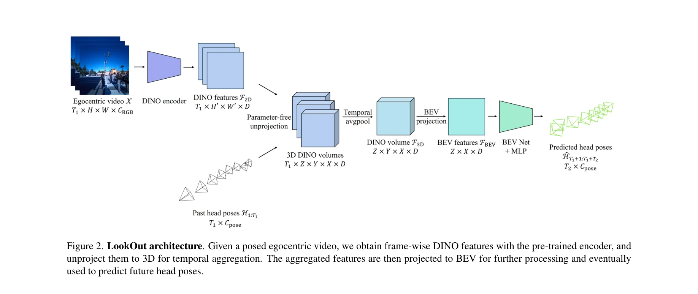

# LookOut: Real-World Humanoid Egocentric Navigation

> **저자**: Boxiao Pan, Adam W. Harley, C. Karen Liu, Leonidas J. Guibas | **날짜**: 2025-08-20 | **URL**: [https://arxiv.org/abs/2508.14466](https://arxiv.org/abs/2508.14466)

---

## Essence

*Figure 1. Problem formulation. Given a posed egocentric video (black-outlined frustums, with frames shown in detail on t*

이고센트릭 비디오에서 정적/동적 장애물을 회피하면서 6D 헤드 포즈(위치+회전)를 예측하는 휴머노이드 네비게이션 모델 LookOut을 제안하고, Project Aria 안경을 활용한 데이터 수집 파이프라인 및 AND 데이터셋을 공개한다.

## Motivation

- **Known**: VLN은 시뮬레이션 환경의 장기 경로 계획에 집중하고, 기존 휴머노이드 이고센트릭 네비게이션 연구(EgoNav, EgoCast)는 정적 환경만 다룬다.
- **Gap**: 실제 세계의 동적 장애물을 포함한 휴머노이드 이고센트릭 네비게이션, 헤드 회전을 통한 능동적 정보 수집, 규모화된 실시간 훈련 데이터 수집이 부재하다.
- **Why**: 휴머노이드 로봇, VR/AR, 시각 보조 네비게이션 등에서 충돌 회피와 인간 같은 행동이 필수적이며, 실제 배포 가능한 정책 개발에는 현실의 다양한 시나리오 학습이 필수이다.
- **Approach**: DINO 특징을 3D로 역사영하여 시간 축으로 집계된 3D latent feature volume으로 기하학적·의미론적 제약을 모델링하고, Project Aria 안경 기반 데이터 수집 파이프라인으로 대규모 실세계 네비게이션 데이터를 효율적으로 수집한다.

## Achievement

*Figure 2. LookOut architecture. Given a posed egocentric video, we obtain frame-wise DINO features with the pre-trained *

- **6D 헤드 포즈 예측 문제 정의**: 정적·동적 장애물이 있는 실세계에서 헤드 위치와 회전을 동시에 예측하는 새로운 과제 제시
- **LookOut 모델**: 시간 집계된 3D DINO 특징 기반의 효과적인 아키텍처로 능동적 정보 수집(헤드 회전) 학습
- **데이터 수집 파이프라인**: Project Aria 안경을 활용한 최소 설정 비용의 확장 가능한 파이프라인 개발
- **AND 데이터셋**: 18개 장소에서 수집한 4시간 규모의 실세계 이고센트릭 네비게이션 데이터로 대기, 우회, 주변 확인 등 인간 같은 행동 포함

## How

*Figure 2. LookOut architecture. Given a posed egocentric video, we obtain frame-wise DINO features with the pre-trained *

- 프레임별 DINO 특징을 3D로 역사영(unproject)하여 feature volume 생성
- 시간 축으로 여러 프레임의 3D feature volume을 집계하여 환경의 기하학적·의미론적 이해 획득
- 6D 헤드 포즈(translation + 6D continuous rotation representation)를 손실 함수로 직접 예측
- Project Aria MPS로부터 카메라 포즈, 포인트 클라우드, 아이 개즈 등 다중 모달 데이터 추출
- 헤드-센트릭 캐노니컬 프레임 정의로 좌표 일관성 유지
- 데이터 수집 시 정보 수집 전략(횡단 전 차량 확인 등) 지도로 능동적 행동 학습 촉진

## Originality

- 기존 연구(EgoNav, EgoCast)는 정적 환경만 다루는 반면, 동적 장애물(보행자, 차량)이 있는 실세계 환경에서의 이고센트릭 네비게이션을 최초로 다룸
- 헤드 회전을 통한 능동적 정보 수집을 6D 포즈 예측으로 모델링하는 혁신적 접근
- Project Aria 기반 최소 오버헤드 데이터 수집 파이프라인으로 현장성과 확장성을 동시에 확보
- 시간 축 3D feature volume 집계 방식으로 기하학·의미론적 제약을 통합적으로 처리

## Limitation & Further Study

- 예측 지평(T2=8프레임)이 짧아 장기 경로 계획 능력은 제한적
- AND 데이터셋 규모(4시간)가 현대 딥러닝 기준으로는 소규모이며 일부 환경 편향 가능성
- 동적 장애물의 미래 궤적 예측 능력이 모델에 명시적으로 포함되지 않아 충돌 회피 한계 가능
- 시뮬레이션과 실제 환경의 domain gap 및 다양한 신체 형태에 대한 일반화 능력 검증 부족
- **후속 연구**: 더 큰 규모 데이터셋 수집, 동적 장애물 예측 통합, 실제 휴머노이드 로봇 배포 검증, 다양한 환경/신체 형태에 대한 전이학습 강화

## Evaluation

- Novelty: 4/5
- Technical Soundness: 3/5
- Significance: 4/5
- Clarity: 4/5
- Overall: 4/5

**총평**: 실세계 휴머노이드 이고센트릭 네비게이션의 중요한 갭을 정의하고, 효율적 데이터 수집 파이프라인과 실용적인 모델을 제시하며, 인간 같은 능동적 정보 수집 행동까지 학습하는 포괄적 솔루션을 제공하는 높은 가치의 연구이다.

## Related Papers

- 🔄 다른 접근: [[papers/1273_ARMOR_Egocentric_Perception_for_Humanoid_Robot_Collision_Avo/review]] — 휴머노이드 자기중심 네비게이션에서 ToF 라이다와 일반 시각의 다른 센서 접근이다
- 🔄 다른 접근: [[papers/1446_Hierarchical_visuomotor_control_of_humanoids/review]] — 두 논문 모두 시각 기반 제어를 다루지만, 하나는 일반적 visuomotor control에, 다른 하나는 egocentric navigation에 특화되어 있다.
