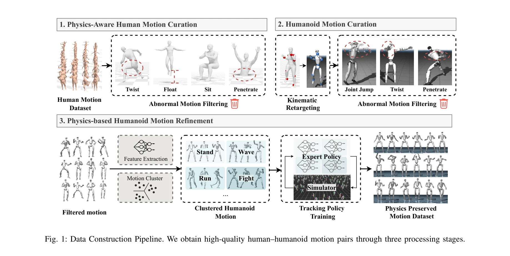
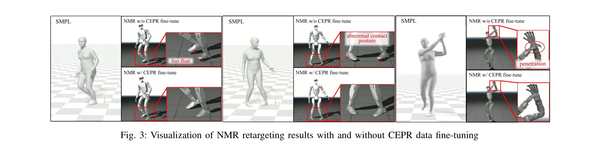

# Make Tracking Easy: Neural Motion Retargeting for Humanoid Whole-body Control

> **저자**: Qingrui Zhao, Kaiyue Yang, Xiyu Wang, Shiqi Zhao, Yi Lu, Xinfang Zhang, Wei Yin, Qiu Shen, Xiao-Xiao Long, Xun Cao | **날짜**: 2026-03-23 | **URL**: [https://arxiv.org/abs/2603.22201](https://arxiv.org/abs/2603.22201)

---

## Essence

*Fig. 1: Data Construction Pipeline. We obtain high-quality human–humanoid motion pairs through three processing stages.*

Neural Motion Retargeting (NMR)은 최적화 기반 모션 리타겟팅의 비볼록 문제를 해결하기 위해 분포 학습으로 문제를 재정의하며, Clustered-Expert Physics Refinement (CEPR) 파이프라인을 통해 고품질 인간-로봇 쌍 데이터를 자동 생성한다.

## Motivation

- **Known**: 기존 최적화 기반 모션 리타겟팅(IK, GMR, PHC 등)은 관절 점프, 자기 관통, 발 미끄러짐 등의 아티팩트를 유발하며, 이는 비볼록 최적화의 국소 최솟값 문제에서 비롯된다.
- **Gap**: 데이터 기반 리타겟팅 방법도 최적화 기반 감독을 상속받거나 물리적 정당성 필터링을 부족하며, 특히 전신 동적 동작에 대한 고품질 쌍 데이터 부족 문제가 존재한다.
- **Why**: 휴머노이드 로봇이 복잡한 인간 환경에 통합되려면 다양한 모터 기술이 필요하며, 인간 데이터를 로봇에 효과적으로 전달하는 것이 핵심 병목이다.
- **Approach**: VAE 기반 모션 클러스터링으로 이질적 움직임을 잠재 모티프로 그룹화하고, 병렬 RL 전문가 정책들이 물리 시뮬레이터에서 추적 태스크를 수행하여 고충실도 데이터를 생성한다. 그 후 비자동회귀 CNN-Transformer 아키텍처가 이를 감독으로 글로벌 시간 문맥을 추론한다.

## Achievement

*Fig. 3: Visualization of NMR retargeting results with and without CEPR data fine-tuning*

- **분포 매핑 재정의**: 프레임별 최적 상태 탐색에서 인간 모션 공간과 로봇 실현 가능 모션 다양체 간 분포 매핑으로 문제 재정의하여 국소 최솟값 함정 회피
- **CEPR 파이프라인**: VAE 클러스터링, 병렬 RL 전문가, 물리 기반 시뮬레이션 정제를 통해 약 30,000개의 물리 보존 SMPL-로봇 쌍 데이터 자동 생성
- **아티팩트 감소**: Unitree G1에서 다양한 동적 작업(무술, 춤 등)에서 관절 불연속성, 자기 충돌, 관절 한계 위반이 기존 방법 대비 현저히 감소
- **정책 수렴 가속화**: NMR 생성 참조가 다운스트림 전신 제어 정책의 학습 효율성 및 추적 성능 개선

## How

*Fig. 1: Data Construction Pipeline. We obtain high-quality human–humanoid motion pairs through three processing stages.*

- **Phase 1 (Physics-Aware Human Motion Curation)**: 인간 SMPL 모션 데이터에서 비정상 동작(자기 관통, 부동성 등) 필터링
- **Phase 2 (Humanoid Motion Curation)**: VAE를 통해 클러스터된 인간 모션 세트에 맞춰 운동학적 리타겟팅 및 비정상 동작 재필터링
- **Phase 3 (Physics-based Refinement)**: 병렬 RL 전문가 정책들이 클러스터별로 로봇이 정제된 모션을 물리 시뮬레이터에서 추적하도록 훈련
- **신경망 훈련**: 비자동회귀 CNN-Transformer가 생성된 고품질 쌍 데이터에서 인간 SMPL 시퀀스를 로봇 모션으로 직접 매핑 학습
- **이단계 훈련 전략**: 광범위한 모션 커버리지와 물리적 정당성을 동시에 확보하기 위한 Detail-to-Physical 훈련 스킴 적용

## Originality

- **분포 학습으로의 패러다임 전환**: 기존 프레임별 최적화에서 전체 모션 분포 매핑으로의 혁신적 재정의
- **자동 데이터 생성 파이프라인**: VAE 클러스터링과 병렬 RL 전문가를 결합한 CEPR로 감독 데이터의 bootstrapping 문제 해결
- **Hessian 분석 기반 동기**: 최적화 기반 리타겟팅의 비볼록성을 수학적으로 분석하여 신경망 기반 방식의 당위성 강화
- **전신 동적 작업 검증**: 기존 데이터 기반 방법들이 다루지 않던 전신 조정과 동적 작업(춤, 무술 등)에 대한 광범위한 검증

## Limitation & Further Study

- **데이터 생성 비용**: CEPR 파이프라인 자체가 병렬 RL 훈련을 요구하므로 초기 계산 비용이 상당함
- **시뮬레이션-실제 간극**: 물리 시뮬레이터에서 생성된 데이터가 실제 로봇 하드웨어 특성을 완전히 반영하지 못할 가능성
- **모션 다양성 범위**: VAE 클러스터링이 데이터 공간을 압축하므로 극단적으로 새로운 또는 드문 모션에 대한 일반화 능력 제한 가능
- **후속 연구 방향**: (1) 실제 로봇 실험을 통한 Sim2Real 성능 검증, (2) 더 큰 규모 모션 데이터셋으로의 확장성 평가, (3) 다른 휴머노이드 형태에 대한 전이 학습 능력 연구

## Evaluation

- Novelty: 4/5
- Technical Soundness: 4/5
- Significance: 4/5
- Clarity: 4/5
- Overall: 4/5

**총평**: 본 논문은 모션 리타겟팅을 분포 학습으로 재정의함으로써 최적화 기반 방법의 근본적 한계를 우회하며, CEPR 파이프라인을 통해 고품질 감독 데이터 자동 생성의 chicken-and-egg 문제를 창의적으로 해결한 강력한 기여이다. 동적 작업에 대한 광범위한 실험 검증과 명확한 기술적 혁신으로 휴머노이드 로봇 제어의 실용화에 중요한 진전을 이룬다.

## Related Papers

- 🔄 다른 접근: [[papers/1493_Implicit_Kinodynamic_Motion_Retargeting_for_Human-to-humanoi/review]] — 둘 다 kinodynamic motion retargeting을 다루지만 1561은 neural 분포 학습으로, 1493은 implicit 방법으로 접근함
- 🏛 기반 연구: [[papers/1442_Heracles_Bridging_Precise_Tracking_and_Generative_Synthesis/review]] — Heracles의 state-conditioned diffusion이 neural motion retargeting의 분포 학습 기반을 제공함
- 🧪 응용 사례: [[papers/1600_Opt2Skill_Imitating_Dynamically-feasible_Whole-Body_Trajecto/review]] — Opt2Skill의 DDP 궤적 추적이 neural retargeting으로 생성된 고품질 참조 궤적의 실제 활용 사례를 보여줌
- 🔗 후속 연구: [[papers/1254_AdaMimic_Towards_Adaptable_Humanoid_Control_via_Adaptive_Mot/review]] — motion tracking 기반 humanoid 제어를 neural retargeting으로 확장한 방법론이다
- 🔄 다른 접근: [[papers/1442_Heracles_Bridging_Precise_Tracking_and_Generative_Synthesis/review]] — 둘 다 인간-휴머노이드 모션 리타겟팅을 다루지만 1442는 state-conditioned diffusion으로, 1561은 neural 접근법으로 해결함
- 🔄 다른 접근: [[papers/1493_Implicit_Kinodynamic_Motion_Retargeting_for_Human-to-humanoi/review]] — 둘 다 모션 리타겟팅을 다루지만 1493은 implicit kinodynamic 접근으로, 1561은 neural 분포 학습으로 해결함
- 🔄 다른 접근: [[papers/1600_Opt2Skill_Imitating_Dynamically-feasible_Whole-Body_Trajecto/review]] — 둘 다 동역학적으로 실현 가능한 궤적을 다루지만 1600은 DDP 최적화로, 1561은 neural retargeting으로 생성함
