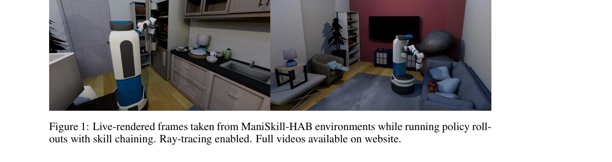
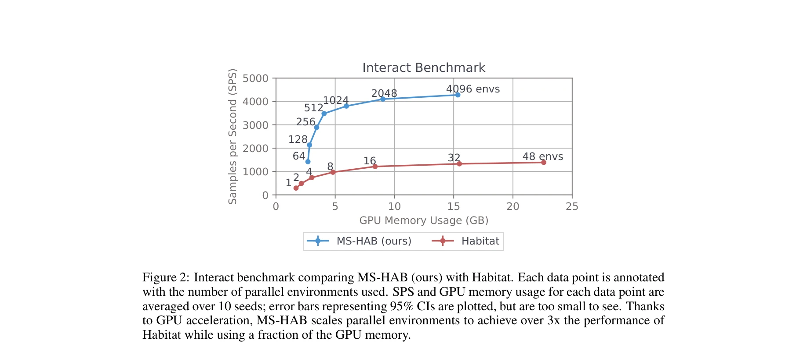
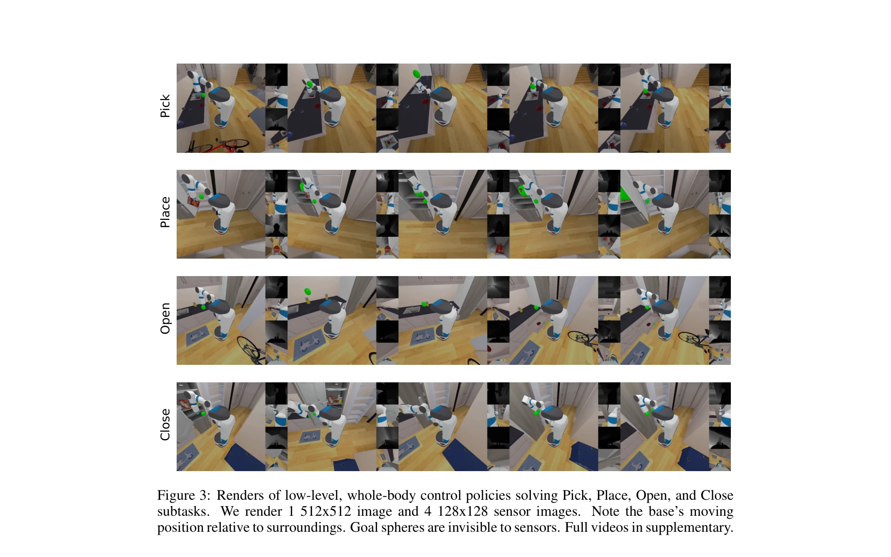

# ManiSkill-HAB: A Benchmark for Low-Level Manipulation in Home Rearrangement Tasks

> **저자**: Arth Shukla, Stone Tao, Hao Su | **날짜**: 2024-12-09 | **URL**: [https://arxiv.org/abs/2412.13211](https://arxiv.org/abs/2412.13211)

---

## Essence

*Figure 1: Live-rendered frames taken from ManiSkill-HAB environments while running policy roll-*

MS-HAB는 GPU 가속화된 Home Assistant Benchmark 구현으로, 현실적인 저수준 조작(low-level manipulation)을 지원하면서 3배 이상의 시뮬레이션 속도를 달성하고, RL/IL 기준선과 자동화된 궤적 필터링을 통한 대규모 데이터 생성을 가능하게 한다.

## Motivation

- **Known**: Habitat 2.0은 홈 스케일 재배치 벤치마크를 제공하지만 magical grasp만 지원하고 시뮬레이션 속도가 느리며, ManiSkill3은 빠른 GPU 시뮬레이션을 제공하지만 단순한 작업만 포함한다.
- **Gap**: 현존 벤치마크는 현실적인 저수준 제어, 빠른 시뮬레이션, 복잡한 테스트 환경, 대규모 데모 데이터셋을 모두 통합하지 못하고 있다.
- **Why**: 빠르고 현실적인 시뮬레이션과 대규모 데이터는 홈 환경에서의 복잡한 조작 작업을 학습하는 체구화된 AI 에이전트 개발에 필수적이다.
- **Approach**: ManiSkill3을 기반으로 HAB를 GPU 가속화하여 현실적인 저수준 제어를 지원하고, 광범위한 RL/IL 기준선을 학습하며, 시뮬레이터 특권 정보를 이용한 규칙 기반 궤적 필터링으로 제어된 데이터 생성을 구현한다.

## Achievement

*Figure 2: Interact benchmark comparing MS-HAB (ours) with Habitat. Each data point is annotated*

- **GPU 가속화 HAB 구현**: 4300 SPS의 시뮬레이션 속도로 Habitat 2.0보다 3배 빠르면서 현실적인 저수준 제어와 RGB-D 렌더링을 지원
- **광범위한 기준선**: 1.83 억 개의 환경 샘플을 사용하여 150개의 RL 정책과 IL 기준선을 학습, 기하학적 특성에 맞춘 개체별 조작 정책 개발
- **자동화된 궤적 필터링**: 특권 정보를 활용한 사건 라벨링 및 궤적 분류로 수동 작업 없이 특정 동작과 안전 제약을 만족하는 대규모 데모 생성
- **포괄적인 벤치마크**: TidyHouse, PrepareGroceries, SetTable의 세 가지 장기 작업으로 구성된 통합 플랫폼으로 데이터, 코드, 모델 공개

## How

*Figure 3: Renders of low-level, whole-body control policies solving Pick, Place, Open, and Close*

- ManiSkill3의 GPU 병렬화를 활용하여 multiple dynamic objects와의 충돌 시뮬레이션 및 RGB-D 렌더링 동시 처리
- Pick, Place, Open/Close Fridge/Drawer, Navigate 등 기본 기술(skill)에 대해 밀도 높은 보상 함수 설계 및 저수준 제어 최적화
- 시뮬레이터에서 Contact, Grasped, Dropped, Success, Excessive Collisions 등의 사건을 추출하여 성공/실패 모드 정의
- 궤적 분류 통계를 활용하여 특정 동작 편향(행동 제약, 안전 임계값)을 만족하는 데모만 자동 선택
- RL 정책으로부터 생성된 경험에서 필터링된 데모를 추출하여 IL 기준선 학습에 사용

## Originality

- 기존 Habitat 2.0의 magical grasp를 현실적인 저수준 제어로 대체하면서 GPU 가속화를 통해 3배 속도 향상 달성
- 특권 정보 기반 자동화된 궤적 필터링으로 수동 라벨링 없이 제어된 데모 데이터 생성 시스템 개발
- 개체별(per-object) 조작 정책과 모든 개체 정책(all-object policy)의 비교를 통해 기하학적 특성의 영향을 분석
- 기술 연결(skill chaining)에서 저수준 제어의 고려사항(grasp pose 샘플링, 세부 작업 성공 조건)을 명시적으로 다룸

## Limitation & Further Study

- 현재 벤치마크는 Fetch 모바일 매니퓨레이터에만 집중되어 있어 다양한 로봇 형태로의 확장성 불명확
- 규칙 기반 궤적 필터링은 사전 정의된 기준에만 적용되므로 새로운 행동 패턴이나 예상치 못한 실패 모드 발견에 제한
- 시뮬레이션과 실제 환경의 sim-to-real gap에 대한 분석 부재로 실제 로봇 배포 가능성 미평가
- 향후 연구는 다양한 로봇 플랫폼 지원, 학습 기반 궤적 필터링, sim-to-real transfer 방법론 개발을 포함해야 함

## Evaluation

- Novelty: 4/5
- Technical Soundness: 4/5
- Significance: 4/5
- Clarity: 4/5
- Overall: 4/5

**총평**: MS-HAB는 홈 스케일 조작 연구의 세 가지 핵심 요구사항(빠른 시뮬레이션, 현실적 제어, 대규모 데이터)을 통합하여 해결한 포괄적이고 실용적인 벤치마크이며, 광범위한 기준선과 자동화된 데이터 생성 시스템으로 향후 연구의 강력한 기초를 제공한다.

## Related Papers

- 🧪 응용 사례: [[papers/1291_BiGym_A_Demo-Driven_Mobile_Bi-Manual_Manipulation_Benchmark/review]] — 가정 환경 저수준 조작에서 BiGym의 양팔 이동 조작 벤치마크가 적용된다
- 🧪 응용 사례: [[papers/1279_BEHAVIOR_Robot_Suite_Streamlining_Real-World_Whole-Body_Mani/review]] — 가정 환경 저수준 조작 벤치마크에서 BRS의 일상 작업 수행 능력이 적용된다
- 🔗 후속 연구: [[papers/1531_RLBench_The_Robot_Learning_Benchmark__Learning_Environment/review]] — ManiSkill-HAB의 가정 환경 조작 벤치마크가 RLBench의 로봇 학습 벤치마크를 실제 가정 환경으로 확장한다.
- 🧪 응용 사례: [[papers/1537_RoboCat_A_Self-Improving_Generalist_Agent_for_Robotic_Manipu/review]] — Scaling Cross-Embodied Learning이 RoboCat의 다중 embodiment 학습 원리를 대규모로 적용한 구체적 사례이다.
- 🔄 다른 접근: [[papers/1633_X-VLA_Soft-Prompted_Transformer_as_Scalable_Cross-Embodiment/review]] — 둘 다 cross-embodiment이지만 Scaling Cross-Embodied Learning은 단일 정책, X-VLA는 soft prompt 기반의 다른 접근법이다
- 🏛 기반 연구: [[papers/1318_Being-H05_Scaling_Human-Centric_Robot_Learning_for_Cross-Emb/review]] — Scaling Cross-Embodied Learning은 Being-H0.5의 cross-embodiment 일반화를 위한 이론적 토대를 제공한다
