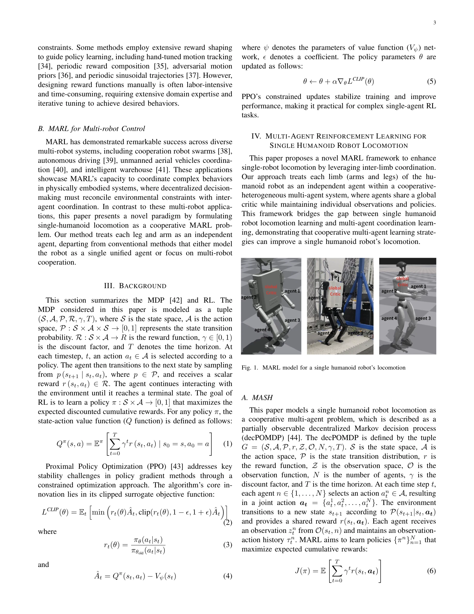
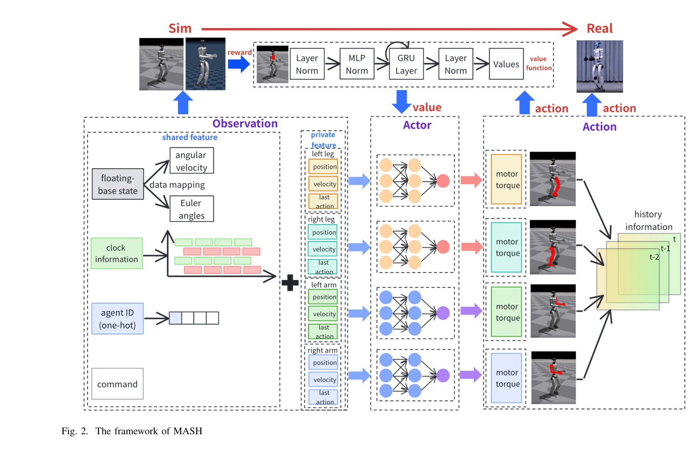

# MASH: Cooperative-Heterogeneous Multi-Agent Reinforcement Learning for Single Humanoid Robot Locomotion

> **저자**: Qi Liu, Xiaopeng Zhang, Mingshan Tan, Shuaikang Ma, Jinliang Ding, Yanjie Li | **날짜**: 2025-08-14 | **URL**: [https://arxiv.org/abs/2508.10423](https://arxiv.org/abs/2508.10423)

---

## Essence

*Fig. 1. MARL model for a single humanoid robot’s locomotion*

단일 휴머노이드 로봇의 각 사지를 독립적 에이전트로 모델링하여 cooperative-heterogeneous MARL을 적용하는 MASH 프레임워크를 제안하여 전신 협력 운동 학습의 효율성을 향상시킨다.

## Motivation

- **Known**: 휴머노이드 로봇 운동학습은 주로 단일 에이전트 RL이나 모방학습을 사용하며, MARL은 다중 로봇 시스템 태스크에만 적용되어 왔다.
- **Gap**: 단일 휴머노이드 로봇의 복잡한 신체 협력 문제를 해결하기 위해 MARL 원리를 직접 적용하는 패러다임이 미개척되어 있다.
- **Why**: 휴머노이드 로봇의 높은 자유도 제어에서 사지 간 효과적 협력학습을 통해 수렴속도 개선과 정책 일반화 능력을 향상시킬 수 있기 때문이다.
- **Approach**: 각 사지(팔 2개, 다리 2개)를 독립적 에이전트로 취급하면서 공유 글로벌 critic을 통해 cooperative learning을 수행하는 MASH 프레임워크를 제시한다.

## Achievement

*Fig. 4. Reward growth trends for (a) leg training and (b) whole-body training, comparing MASH with the Single Agent PPO *

- **훈련 수렴 가속화**: MASH가 단일 에이전트 RL 대비 더 빠른 학습 수렴을 달성
- **전신 협력 능력 향상**: 사지 간 협력 메커니즘을 통해 전체 신체 운동의 조화도 증대
- **표본 효율성 개선**: 공유 경험과 cooperative policy learning으로 샘플 복잡도 감소
- **동적 환경 강건성**: 구조화되지 않은 환경에서의 일반화 성능 개선
- **보행 성능 우월성**: 기존 방법 대비 더 나은 보행 실행 품질과 최종 성능 달성

## How

*Fig. 2. The framework of MASH*

- 각 사지를 독립적 에이전트로 모델링하여 이질적(heterogeneous) 행동 공간 정의
- 공유 글로벌 critic 네트워크를 통해 에이전트 간 협력 신호 전달
- MDP 기반 cooperative-heterogeneous MARL 알고리즘 적용
- 다리 훈련 단계와 전신 훈련 단계로 구분하여 점진적 학습 수행
- 시뮬레이션 환경에서 보상 함수 설계 및 정책 최적화

## Originality

- 단일 로봇에 MARL을 적용하는 새로운 패러다임 제시 - 기존의 단일 에이전트 RL vs 다중 로봇 MARL 이분법을 넘어섬
- 사지 간 이질성을 명시적으로 모델링하면서도 공유 critic으로 협력하는 구조 설계
- Quadruped 로봇 대상 선행 연구(Liu et al. 2024)를 휴머노이드 시스템으로 확장하면서 복잡도 증대 해결

## Limitation & Further Study

- 시뮬레이션 환경에서만 검증 - 실제 물리 휴머노이드 로봇에 대한 실험 미수행
- 보상 함수 설계의 휴리스틱 의존성 - task-specific 보상 함수 구성의 일반화 어려움
- critic 공유 메커니즘의 수렴성 이론적 증명 부재
- 다양한 로봇 모형(모피 크기, 질량 분포 등)에 대한 일반화 검증 필요
- 후속 연구: 실제 로봇 플랫폼 검증, 더 복잡한 다중 태스크(조작+운동) 학습, 비균질 에이전트 설정 확장

## Evaluation

- Novelty: 4/5
- Technical Soundness: 3/5
- Significance: 4/5
- Clarity: 4/5
- Overall: 4/5

**총평**: 단일 휴머노이드 로봇에 cooperative-heterogeneous MARL을 적용하는 참신한 패러다임을 제시하며, 훈련 효율성 및 운동 성능 향상을 실증했으나 실제 로봇 검증이 필요하다.

## Related Papers

- 🔄 다른 접근: [[papers/1527_Learning_Humanoid_Arm_Motion_via_Centroidal_Momentum_Regular/review]] — 두 논문 모두 사지별 독립 제어를 다루지만, cooperative MARL vs centroidal momentum이라는 서로 다른 조율 메커니즘을 제시함
- 🔗 후속 연구: [[papers/1401_GauDP_Reinventing_Multi-Agent_Collaboration_through_Gaussian/review]] — GauDP의 가우시안 기반 다중 에이전트 협력 개념을 휴머노이드의 이종 사지 협력에 특화시켜 적용한 발전된 형태임
- 🏛 기반 연구: [[papers/1555_LHM-Humanoid_Learning_a_Unified_Policy_for_Long-Horizon_Huma/review]] — 협력적 다중 에이전트 기반 전신 제어가 LHM-Humanoid의 장기간 통합 정책 학습에 방법론적 토대를 제공함
- 🔄 다른 접근: [[papers/1629_Whom_to_Trust_Elective_Learning_for_Distributed_Gaussian_Pro/review]] — 이질적 다중 에이전트 강화학습과 신뢰도 기반 선택적 학습이 다중 에이전트 협력에서 서로 다른 접근법을 제시합니다.
- 🔄 다른 접근: [[papers/1527_Learning_Humanoid_Arm_Motion_via_Centroidal_Momentum_Regular/review]] — 두 논문 모두 사지별 독립 에이전트 접근법을 사용하지만, centroidal momentum vs cooperative MARL이라는 서로 다른 조율 메커니즘을 제시함
- 🔗 후속 연구: [[papers/1555_LHM-Humanoid_Learning_a_Unified_Policy_for_Long-Horizon_Huma/review]] — MASH의 협력적 다중 에이전트 접근법을 장기간 로코-매니퓰레이션 task에 적용하여 통합 정책으로 발전시킨 형태임
- 🧪 응용 사례: [[papers/1581_Multi-task_Deep_Reinforcement_Learning_with_PopArt/review]] — 다중 에이전트 강화학습에서 PopArt 정규화를 적용하여 이종 에이전트 간의 학습 성능 차이를 조정하고 협력 효율성을 향상시킬 수 있다.
