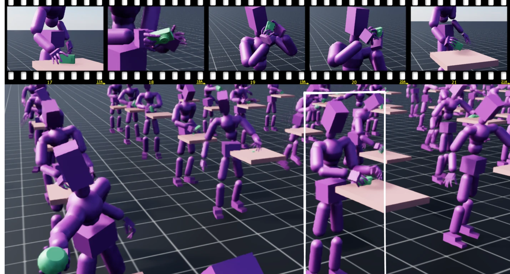
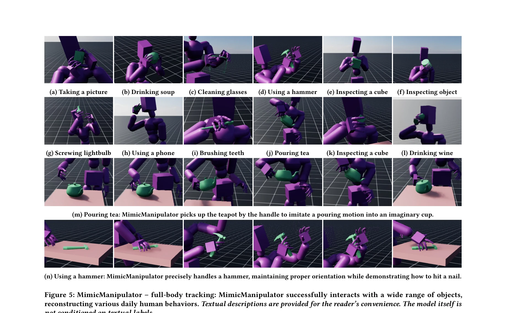

# MaskedManipulator: Versatile Whole-Body Manipulation

> **저자**: Chen Tessler, Yifeng Jiang, Erwin Coumans, Zhengyi Luo, Gal Chechik, Xue Bin Peng | **날짜**: 2025-05-25 | **URL**: [https://arxiv.org/abs/2505.19086](https://arxiv.org/abs/2505.19086)

---

## Essence

*Figure 1: MaskedManipulator enables physics-based humanoids to perform intricate, object interactions from sparse spatio*

MaskedManipulator는 고수준 목표(예: 객체 위치, 신체 자세)로부터 다양한 전신 조작 행동을 생성하는 generative control policy로, 두 단계 학습 과정을 통해 추적 정밀도와 제어 다양성의 균형을 맞춘다.

## Motivation

- **Known**: 기존 방법들은 motion tracking, trajectory following, teleoperation에 집중했으며, 일부는 정교한 조작을 잘 수행하지만 제어 유연성이 제한적이고, 다른 일부는 다양한 신체 제어를 지원하지만 정밀한 객체 상호작용에서 부족하다.
- **Gap**: 전신 운동과 정교한 조작을 통합하면서 동시에 sparse 고수준 목표로부터 다양한 해결책을 생성할 수 있는 통합 제어 프레임워크가 부재하다.
- **Why**: 로봇공학과 캐릭터 애니메이션에서 인간 같은 조작 행동의 생성은 자동화, 게임/영화 제작, 로봇 제어 등 다양한 응용에 필수적이며, 특히 정밀도와 유연성의 균형은 실용적 시스템 개발의 핵심이다.
- **Approach**: 두 단계 학습: (1) MimicManipulator로 대규모 human motion capture 데이터(GRAB)를 기반으로 정밀한 추적 컨트롤러를 training, (2) 이를 MaskedManipulator에 distill하여 spatio-temporal goal-conditioning을 통해 sparse 목표로부터 다양한 조작 행동을 생성한다.

## Achievement

*Figure 5: MimicManipulator – full-body tracking: MimicManipulator successfully interacts with a wide range of objects,*

- **MaskedMimic 확장**: 기존 전신 컨트롤러를 전신 조작(full-body-manipulation)으로 확장하여 human demonstrations를 활용한 다양하고 물리적으로 타당한 해결책 생성
- **MimicManipulator 개발**: motion capture 데이터로부터 정교한 손가락 조작(dexterous manipulation) 시퀀스를 정확히 추적하고 물리 시뮬레이션에서 재구성하는 physics-based motion tracker
- **MaskedManipulator 개발**: 인간형 로봇의 신체 부위와 조작 객체 모두에 대한 다양한 spatio-temporal goal-conditioning을 지원하는 unified generative policy로, sparse 제약 조건으로부터 장시간 조작 행동 생성 가능

## How

*Figure 2: Phased contact reward for precise manipulation.*

- Goal-conditioned MDP 프레임워크에서 정책 π(a_t|s_t,g_t) 학습으로 상태와 목표로부터 행동 선택
- Motion capture 데이터의 kinematic 정보와 reference motion으로부터 physics-based tracker training
- Phased contact reward 설계로 접촉 상호작용의 정확성 확보
- Object retargeting으로 morphological 차이 극복
- Policy distillation을 통해 추적 전문성을 sparse goal-conditioned 제어로 변환
- MaskedMimic의 motion inpainting 프레임워크 확장으로 객체 목표 포함

## Originality

- 조작과 운동을 통합하는 두 단계 distillation 접근법으로 정밀도-유연성 trade-off 해결
- 대규모 human motion capture 데이터(GRAB)를 physics-based tracking을 통해 활용하여 자연스럽고 정교한 조작 행동 획득
- Sparse spatio-temporal goal-conditioning이 신체 부위와 객체 상태 모두를 포함하도록 확장
- OmniGrasp 등 기존 방법의 dense reward 제한을 극복하고 장시간 목표 조건화 지원

## Limitation & Further Study

- 대규모 human motion capture 데이터에 의존으로 데이터 수집 비용과 coverage 제한
- Physics simulation의 정확도 한계로 실제 로봇 전이(sim-to-real) 시 추가 적응 필요 가능
- 복잡한 두 단계 학습 과정으로 계산 비용과 학습 시간 증가
- 후속 연구: (1) 더 다양한 객체와 상호작용 유형에 대한 일반화 개선, (2) 실제 로봇에서의 검증 및 sim-to-real 전이 전략, (3) 실시간 인터랙티브 제어를 위한 추론 속도 최적화

## Evaluation

- Novelty: 4/5
- Technical Soundness: 3/5
- Significance: 4/5
- Clarity: 4/5
- Overall: 4/5

**총평**: MaskedManipulator는 전신 조작 제어에서 정밀도와 다양성의 균형을 혁신적으로 달성한 강력한 프레임워크로, 두 단계 distillation 접근법과 human motion capture 활용이 우수하며, 캐릭터 애니메이션과 로봇공학 모두에 중요한 기여를 제공한다.

## Related Papers

- 🔄 다른 접근: [[papers/1565_MaskedMimic_Unified_Physics-Based_Character_Control_Through/review]] — 전신 조작 제어에서 generative control policy와 motion inpainting이라는 서로 다른 생성 모델 접근법을 사용한다.
- 🔗 후속 연구: [[papers/1275_ASE_Large-Scale_Reusable_Adversarial_Skill_Embeddings_for_Ph/review]] — ASE의 adversarial skill embedding 개념을 전신 조작이라는 더 복잡한 과제에서의 다양한 행동 생성으로 확장한다.
- 🏛 기반 연구: [[papers/1422_GENMO_A_GENeralist_Model_for_Human_MOtion/review]] — GENMO의 일반적인 인간 모션 생성 모델을 로봇의 전신 조작이라는 특정 과제에 적용한다.
- 🔗 후속 연구: [[papers/1298_A_Survey_of_Embodied_Learning_for_Object-Centric_Robotic_Man/review]] — MaskedManipulator의 whole-body manipulation 능력이 object-centric embodied learning의 구체적인 구현 사례를 제공한다.
- 🔄 다른 접근: [[papers/1581_Multi-task_Deep_Reinforcement_Learning_with_PopArt/review]] — 다중 작업 학습에서 PopArt의 보상 정규화 방식과 MaskedManipulator의 whole-body 조작 방식을 범용성 확보 측면에서 비교할 수 있다.
- 🔄 다른 접근: [[papers/1565_MaskedMimic_Unified_Physics-Based_Character_Control_Through/review]] — 전신 제어에서 masked motion generation과 goal-conditioned manipulation이라는 서로 다른 생성 모델 접근법을 제시한다.
