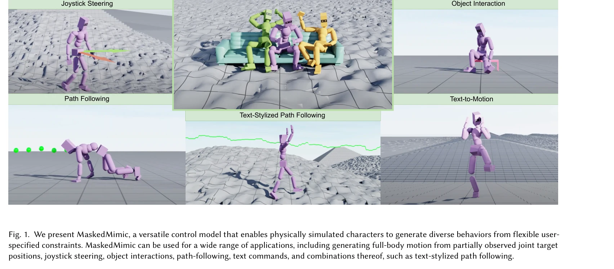
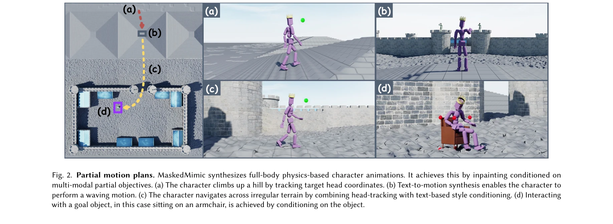
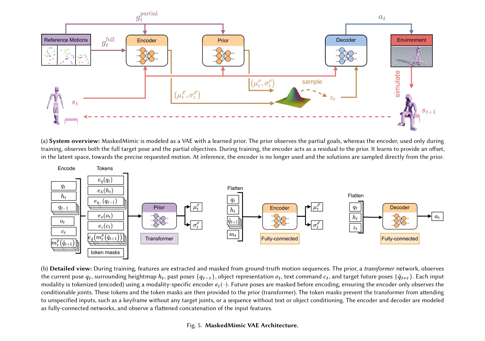

# MaskedMimic: Unified Physics-Based Character Control Through Masked Motion Inpainting

> **저자**: Chen Tessler, Yunrong Guo, Ofir Nabati, Gal Chechik, Xue Bin Peng | **날짜**: 2024-09-22 | **URL**: [https://arxiv.org/abs/2409.14393](https://arxiv.org/abs/2409.14393)

---

## Essence

*Fig. 1. We present MaskedMimic, a versatile control model that enables physically simulated characters to generate diver*

MaskedMimic은 motion inpainting 문제로 physics-based character control을 통합하여, 단일 모델이 masked keyframes, text, 객체 정보 등 다양한 partial motion descriptions로부터 full-body animation을 생성할 수 있게 하는 방법이다.

## Motivation

- **Known**: Physics-based character animation은 복잡한 장면 상호작용과 불규칙한 지형 적응이 가능하지만, 기존 방법들은 각 작업마다 전문화된 task-specific 컨트롤러를 따로 학습해야 하고 복잡한 reward engineering이 필요하다.
- **Gap**: 단일의 versatile unified 모델로 diverse control modalities를 지원하면서도 reward engineering을 최소화하고 task-specific 학습을 제거할 수 있는 방법이 부재하다.
- **Why**: 일반적인 가상 캐릭터는 text 지시, VR 추적, 객체 상호작용, 지형 적응 등 다양한 시나리오를 처리해야 하므로, 통합된 제어 프레임워크는 개발 효율성과 확장성을 크게 향상시킨다.
- **Approach**: Motion capture 데이터를 활용하여 randomly masked motion sequences에 대해 학습하고, masked input으로부터 원본 full-motion을 inpaint하는 방식으로 unified controller를 훈련한다. Goal-engineering 기법으로 다양한 constraints를 제공하여 원하는 작업을 유도한다.

## Achievement

*Fig. 2. Partial motion plans. MaskedMimic synthesizes full-body physics-based character animations. It achieves this by *

- **Unified motion control framework**: 단일 MaskedMimic 모델이 full-body tracking, VR tracking, object interaction, text-to-motion, path following, terrain traversal 등 8가지 이상의 작업을 수행 가능
- **General motion inpainting formulation**: Masked keyframes, joint positions/rotations, text instructions, 객체 정보 또는 이들의 임의 조합으로부터 motion synthesis를 통합적으로 처리
- **Positive transfer learning**: Task-specific 모델보다 우수한 성능 달성 (예: VR tracking에서 prior methods 능가)
- **Seamless task transition**: 서로 다른 제어 modalities 간의 부드러운 전환 및 복합 목표 (text-stylized path following) 지원
- **Scalable training methodology**: Diverse motion descriptions을 효과적으로 활용하여 reward engineering 최소화

## How

*Fig. 5. MaskedMimic VAE Architecture.*

- Motion capture 데이터에 대해 random masking을 적용하여 partial motion descriptions 생성
- Masked sequence를 input으로 하여 원본 motion을 predict하는 inpainting task로 학습
- Goal-engineering 기법으로 target keyframes, text prompts, object constraints 등을 partial specifications로 인코딩
- VAE 기반 architecture를 통해 latent space에서 motion synthesis 수행
- Physics simulation을 통해 생성된 motion이 물리적 법칙을 만족하도록 강제

## Originality

- Physics-based character control을 motion inpainting 문제로 재해석하는 novel formulation
- Multi-modal partial constraints (keyframes, text, objects, 조합)를 통합적으로 처리하는 unified framework 제안
- Goal-engineering이라는 intuitive interface 도입으로 prompt-engineering 패러다임을 character control에 적용
- Task-specific reward function 설계를 피하고 partial motion descriptions 기반 학습으로 scalability 달성

## Limitation & Further Study

- Motion capture 데이터의 diversity와 coverage에 대한 의존성 (논문에서 구체적 데이터셋 한계 미상세)
- Inpainting 성능이 masked region의 비율과 패턴에 따라 달라질 수 있는 잠재적 제한
- 복잡한 multi-agent scenarios나 매우 novel한 task 조합에 대한 generalization 성능 미검증
- Physics simulation의 computational cost로 인한 실시간 interactive applications 적용 가능성 미명시

## Evaluation

- Novelty: 4/5
- Technical Soundness: 3/5
- Significance: 4/5
- Clarity: 4/5
- Overall: 4/5

**총평**: MaskedMimic은 physics-based character control에서 task-specific 설계를 제거하고 unified inpainting 프레임워크로 다양한 제어 modality를 통합한 혁신적 접근법이며, 실제 animation 파이프라인에서 높은 실용성을 제공한다.

## Related Papers

- 🔄 다른 접근: [[papers/1564_MaskedManipulator_Versatile_Whole-Body_Manipulation/review]] — 전신 제어에서 masked motion generation과 goal-conditioned manipulation이라는 서로 다른 생성 모델 접근법을 제시한다.
- 🔗 후속 연구: [[papers/1330_DeepMimic_Example-Guided_Deep_Reinforcement_Learning_of_Phys/review]] — DeepMimic의 physics-based character control을 motion inpainting 문제로 통합하여 더 유연한 제어 방법론을 개발한다.
- 🏛 기반 연구: [[papers/1361_Diffusion_Models_for_Robotic_Manipulation_A_Survey/review]] — diffusion model의 로봇 조작 적용 원리를 masked motion generation을 통한 통합 캐릭터 제어로 확장한다.
- 🔄 다른 접근: [[papers/1275_ASE_Large-Scale_Reusable_Adversarial_Skill_Embeddings_for_Ph/review]] — masked learning을 통해 physics-based character control을 다른 방식으로 접근한다
- 🔄 다른 접근: [[papers/1267_AMP_Adversarial_Motion_Priors_for_Stylized_Physics-Based_Cha/review]] — physics-based character control에서 adversarial learning과 masked autoencoder라는 서로 다른 self-supervised 접근법을 제시한다
- 🔄 다른 접근: [[papers/1539_RoboFactory_Exploring_Embodied_Agent_Collaboration_with_Comp/review]] — 복잡한 전신 제어를 위해 정책 구성과 마스킹 기반 모션 생성이라는 서로 다른 접근법을 사용한다.
- 🔄 다른 접근: [[papers/1609_Perpetual_Humanoid_Control_for_Real-time_Simulated_Avatars/review]] — 마스크된 물리 기반 캐릭터 제어와 PMCP가 모션 모방에서 서로 다른 학습 접근법을 제시합니다.
- 🔄 다른 접근: [[papers/1564_MaskedManipulator_Versatile_Whole-Body_Manipulation/review]] — 전신 조작 제어에서 generative control policy와 motion inpainting이라는 서로 다른 생성 모델 접근법을 사용한다.
