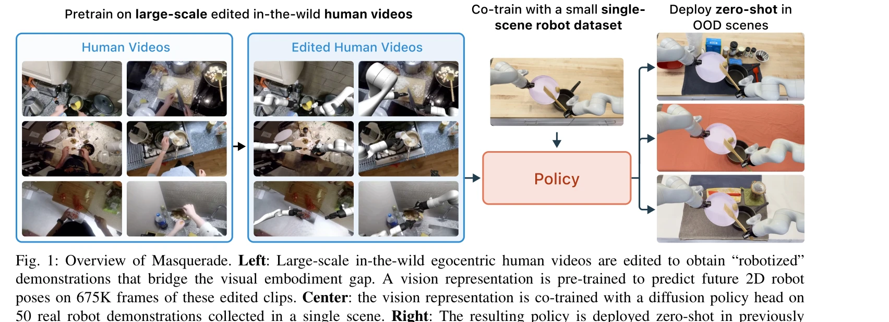

# Masquerade: Learning from In-the-wild Human Videos using Data-Editing

> **저자**: Marion Lepert, Jiaying Fang, Jeannette Bohg | **날짜**: 2025-08-13 | **URL**: [https://arxiv.org/abs/2508.09976](https://arxiv.org/abs/2508.09976)

---

## Essence

*Fig. 1: Overview of Masquerade. Left: Large-scale in-the-wild egocentric human videos are edited to obtain “robotized”*

Masquerade는 in-the-wild 인간 비디오를 로봇화된 데모로 편집하여 인간-로봇 간 시각적 embodiment 갭을 줄이고, 이를 통해 로봇 조작 정책을 학습하는 방법론을 제시한다.

## Motivation

- **Known**: 로봇 조작 학습은 데이터 부족이 심각한 문제이며, in-the-wild 인간 비디오는 대규모 다양한 데이터를 제공할 수 있다. 기존 방법들은 인간 비디오에서 보상 함수 추론, world model 학습, motion prior 추출 등을 수행하지만 embodiment 갭을 명시적으로 해결하지 않는다.
- **Gap**: 기존 연구들은 인간-로봇 간 시각적 embodiment 갭을 암묵적으로만 다루었으며, in-the-wild 비디오에서 이 갭을 명시적으로 닫고 대규모로 활용하는 방법이 부재했다.
- **Why**: 로봇 데이터 부족은 로봇 정책의 일반화 성능을 심각하게 제한하므로, in-the-wild 인간 비디오를 효과적으로 활용할 수 있다면 로봇 학습의 데이터 다양성과 규모를 획기적으로 확대할 수 있다.
- **Approach**: 3D 손 자세 추정, 인간 팔 inpainting, bimanual 로봇 렌더링 및 오버레이를 통해 인간 비디오를 로봇화한 후, 675K 프레임의 편집된 비디오로 vision encoder를 pretrain하고 소량의 로봇 데모(태스크당 50개)로 diffusion policy를 co-train한다.

## Achievement

*Fig. 4: Average success rate (%) on three bimanual*

- **성능 향상**: 3개의 장기 bimanual 키친 태스크에서 3개의 unseen 장면 각각에 대해 기존 방법 대비 5-6배 성능 우위 달성
- **데이터 효율성**: 675K 프레임의 편집된 인간 비디오와 50개의 로봇 데모만으로 robust한 out-of-distribution 정책 학습 가능
- **확장성 검증**: performance가 편집된 인간 비디오 양에 대해 로그 스케일로 증가함을 실증
- **필수 요소 확인**: ablation 분석으로 robot overlay와 co-training이 모두 필수임을 증명

## How

*Fig. 2: Overview of Masquerade. (1) In-the-wild egocentric human videos are converted into “robotized” clips by extracti*

- Epic Kitchens 데이터셋의 in-the-wild egocentric 인간 비디오 수집
- MediaPipe hand pose estimation으로 3D 손 자세 추출
- Inpainting을 통해 인간 팔 제거 및 bimanual 로봇 렌더링 오버레이
- ViT-Base vision encoder를 2D robot keypoint regression loss로 pretrain
- 로봇 데모와 편집된 인간 비디오를 함께 사용하여 diffusion policy head와 encoder를 co-train
- BC loss(behavior cloning)와 auxiliary 2D keypoint loss를 결합한 multi-task 학습
- Pretrain 목표를 finetuning 중에도 유지하여 OOD 강건성 확보

## Originality

- Phantom의 data-editing 파이프라인을 처음으로 in-the-wild 규모의 비디오에 적용
- 시각적 embodiment 갭을 명시적으로 닫는 것이 implicit transfer보다 훨씬 효과적임을 실증적으로 증명
- Pretraining objective를 finetuning 중에 co-train으로 유지하는 전략의 효과성 입증
- 대규모 in-the-wild 데이터(675K 프레임)와 소량의 로봇 데모(50개)의 조합이 강력한 일반화를 이끌 수 있음을 처음 보임

## Limitation & Further Study

- Inpainting 품질이 완벽하지 않으며, 2D 오버레이만 사용하므로 3D 기하학적 오류 가능성 존재
- hand pose estimation의 부정확성이 downstream 성능에 미치는 영향을 분석하지 않음
- 평가가 3개 태스크와 특정 로봇(bimanual 로봇)에 제한되어 일반화 가능성 검증 필요
- 다른 embodiment(모바일 로봇, 휴머노이드 등)에 대한 확장성 미검토
- 인간 비디오와 로봇 데모 간의 시각적 도메인 갭 외 다른 형태의 갭(액션 스페이스, 역학 등) 미분석

## Evaluation

- Novelty: 4/5
- Technical Soundness: 3/5
- Significance: 4/5
- Clarity: 4/5
- Overall: 4/5

**총평**: Masquerade는 인간-로봇 visual embodiment 갭을 명시적으로 해결하는 간단하면서도 효과적인 접근으로, 대규모 in-the-wild 비디오를 로봇 학습에 실질적으로 활용할 수 있음을 보여주는 중요한 기여이다. 실험 결과와 ablation이 견고하며, 로봇 조작 학습의 데이터 부족 문제 해결에 유의미한 진전을 제시한다.

## Related Papers

- 🏛 기반 연구: [[papers/1372_EgoMimic_Scaling_Imitation_Learning_via_Egocentric_Video/review]] — 대규모 이고센트릭 비디오 데이터에서 로봇 조작 학습의 기본 데이터셋과 방법론을 제공한다.
- 🔄 다른 접근: [[papers/1484_HumanPlus_Humanoid_Shadowing_and_Imitation_from_Humans/review]] — 인간 비디오에서 휴머노이드 조작 학습의 다른 접근법으로 섀도잉과 모방 학습을 비교할 수 있다.
- 🔗 후속 연구: [[papers/1634_ZeroMimic_Distilling_Robotic_Manipulation_Skills_from_Web_Vi/review]] — 웹 비디오에서 로봇 조작 기술을 추출하는 발전된 형태로 데이터 편집 기법을 보완한다.
- 🔗 후속 연구: [[papers/1425_Human2Robot_Learning_Robot_Actions_from_Paired_Human-Robot_V/review]] — Masquerade의 in-the-wild human video 학습을 human-robot paired setting으로 확장하여 더 정밀한 correspondence learning을 제공합니다.
- 🏛 기반 연구: [[papers/1634_ZeroMimic_Distilling_Robotic_Manipulation_Skills_from_Web_Vi/review]] — Masquerade의 in-the-wild video learning이 ZeroMimic에서 EpicKitchens 데이터 활용의 핵심 기반 방법론
- 🏛 기반 연구: [[papers/1588_OKAMI_Teaching_Humanoid_Robots_Manipulation_Skills_through_S/review]] — 단일 비디오에서 휴머노이드 조작 학습하는 OKAMI의 접근법이 야생 인간 비디오로 마스크된 학습을 하는 Masquerade의 기반이 된다.
