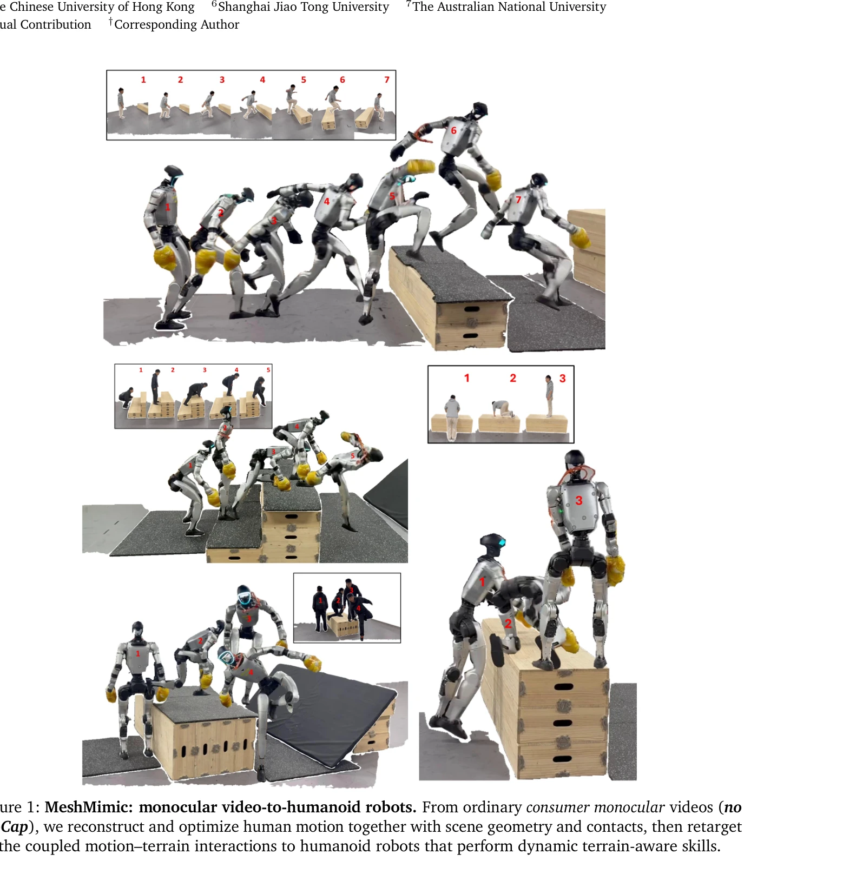
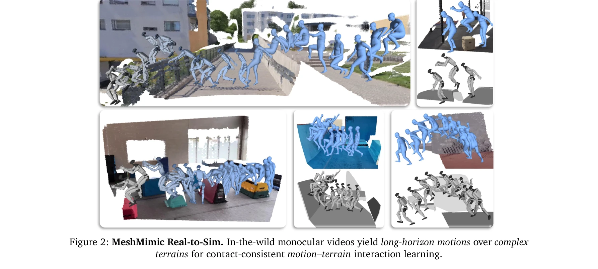
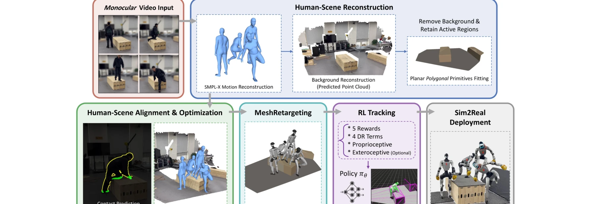

# MeshMimic: Geometry-Aware Humanoid Motion Learning through 3D Scene Reconstruction

> **저자**: Qiang Zhang, Jiahao Ma, Peiran Liu, Shuai Shi, Zeran Su, Zifan Wang, Jingkai Sun, Wei Cui, Jialin Yu, Gang Han, Wen Zhao, Pihai Sun, Kangning Yin, Jiaxu Wang, Jiahang Cao, Lingfeng Zhang, Hao Cheng, Xiaoshuai Hao, Yiding Ji, Junwei Liang, Jian Tang, Renjing Xu, Yijie Guo | **날짜**: 2026-02-17 | **DOI**: [10.48550/arXiv.2602.15733](https://doi.org/10.48550/arXiv.2602.15733)

---

## Essence

*Figure 1: MeshMimic: monocular video-to-humanoid robots. From ordinary consumer monocular videos (no*

MeshMimic은 모노큘러 비디오로부터 3D 장면 복원과 인간 운동을 동시에 추출하여, 휴머노이드 로봇이 지형을 인식하며 상호작용하는 복잡한 운동을 학습할 수 있게 하는 프레임워크이다.

## Motivation

- **Known**: 기존 휴머노이드 모션 모방 학습은 비용이 많이 드는 MoCap 데이터에 의존하며, 환경 기하학 정보의 부재로 인해 발과 지면 사이의 물리적 불일치(접촉 미끄러짐, 메시 관통)가 발생한다.
- **Gap**: 기존 방법들은 운동과 장면을 분리하여 처리하거나(VideoMimic), 단순한 기하학 프리미티브만 처리(OmniRetarget)하며, 복잡한 비정형 지형에서 환경 인식 모션 재타게팅을 제공하지 못한다.
- **Why**: 환경과 결합된 고품질 모션 데이터를 저비용으로 수집할 수 있다면, 휴머노이드 로봇의 비용 장벽을 낮추고 다양한 미정형 환경에서 자율적으로 발전할 수 있다.
- **Approach**: 3D Gaussian Splatting과 SAM3D 같은 최신 3D 비전 모델을 활용하여 모노큘러 비디오에서 인간 궤적과 지형 기하학을 동시에 복원하고, Kinematic Consistency Optimization으로 노이즈를 제거한 후, 접촉 인식 재타게팅(MeshRetarget)으로 인간-환경 상호작용을 로봇 형태에 매핑한다.

## Achievement

*Figure 2: MeshMimic Real-to-Sim. In-the-wild monocular videos yield long-horizon motions over complex*

- **통합 Real-to-Sim 파이프라인**: 소비자 등급 모노큘러 센서만으로 3D 장면 복원과 동작 추출을 동시에 수행하는 저비용 파이프라인 제시
- **Kinematic Consistency Optimization**: 시각적 재구성의 노이즈를 처리하여 물리적으로 타당한 참조 운동 생성
- **MeshRetarget**: 다양한 신체 크기의 인간 운동을 로봇 형태에 매핑하면서 접촉 제약을 보존하는 환경 인식 재타게팅 방법
- **검증**: 불규칙 지형에서 다양한 고역학 과제를 수행하여 장면 비인식 기준선 대비 우수한 강건성과 물리적 현실성 달성

## How

*Figure 3: MeshMimic Real-Sim-Real Pipeline. Starting from a monocular video, we reconstruct the scene*

- 3D Gaussian Splatting 또는 NeRF를 사용하여 비디오로부터 밀집 환경 재구성
- SAM3D와 HQ-SAM으로 인간 배우를 환경 맥락에서 분리하는 인스턴스 수준 분할
- 분할된 인스턴스를 고해상도 충돌 메시로 변환하여 물리적 제약 제공
- Kinematic Consistency Optimization 알고리즘으로 포즈 추정값 정제 및 물리 타당성 확보
- Depth-edge–guided contact prediction으로 접촉점 식별
- MeshRetarget 최적화로 인간-지형 상호작용 특징을 휴머노이드 형태에 전이
- RL 파이프라인에 재타게팅된 운동을 통합하여 환경 인식 제어 정책 학습

## Originality

- 모노큘러 비디오에서 인간 운동과 환경 기하학을 **동시에** 추출하여 coupled motion-terrain 상호작용을 가능하게 한 최초의 통합 접근법
- Kinematic Consistency Optimization을 통해 시각적 노이즈를 물리적 타당성으로 전환하는 혁신적 최적화 전략
- 접촉 제약을 명시적으로 보존하면서 복잡한 비정형 지형에서 작동하는 MeshRetarget 재타게팅 메커니즘
- 3D 비전 모델(3DGS, SAM3D)과 구체화된 지능(embodied RL)을 통합하여 실용적인 Real-to-Sim 파이프라인 구축

## Limitation & Further Study

- 모노큘러 비디오의 깊이 모호성으로 인한 재구성 부정확성이 남아있을 수 있으며, 매우 복잡한 동역학이나 빠른 운동에서의 성능 평가 부족
- 현재 프레임워크는 정적 환경을 가정하며, 동적 장애물이나 변형 가능한 표면에 대한 확장성 미제시
- 재타게팅 과정에서 인간과 로봇 간 형태학적 차이가 클수록 상호작용 특징 전이의 정확성 저하 가능성
- 다양한 환경과 휴머노이드 플랫폼에서의 광범위한 실제 배포 실험이 논문에 제시되지 않음
- 후속 연구로 동적 환경, 다중 에이전트 상호작용, 실제 로봇 배포 검증 필요

## Evaluation

- Novelty: 4/5
- Technical Soundness: 3/5
- Significance: 4/5
- Clarity: 4/5
- Overall: 4/5

**총평**: MeshMimic은 3D 비전과 구체화된 지능을 창의적으로 통합하여, 비용 효율적인 모노큘러 비디오로부터 지형 인식 휴머노이드 제어를 가능하게 하는 상당한 기여를 제시한다. 다만 실제 로봇 배포 검증과 동적 환경 확장에 대한 추가 증거가 있다면 더욱 완성도 높은 연구가 될 것이다.

## Related Papers

- 🔄 다른 접근: [[papers/1458_HuBE_Cross-Embodiment_Human-like_Behavior_Execution_for_Huma/review]] — 둘 다 geometry-aware humanoid learning을 다루지만 1568은 3D 장면 복원 기반으로, 1458은 bi-level framework로 접근함
- 🏛 기반 연구: [[papers/1290_3D_Gaussian_Splatting_for_Real-Time_Radiance_Field_Rendering/review]] — 3D Gaussian Splatting의 실시간 렌더링 기술이 모노큘러 비디오로부터 3D 장면 복원의 기반을 제공함
- 🧪 응용 사례: [[papers/1573_SimpleVLA-RL_Scaling_VLA_Training_via_Reinforcement_Learning/review]] — Mimicking-Bench의 휴머노이드-장면 상호작용 벤치마크가 geometry-aware motion learning의 평가 기준을 제시함
- 🧪 응용 사례: [[papers/1573_SimpleVLA-RL_Scaling_VLA_Training_via_Reinforcement_Learning/review]] — MeshMimic의 3D 장면 인식 운동 학습이 Mimicking-Bench의 실제 구현 방법론을 제시함
- 🔄 다른 접근: [[papers/1458_HuBE_Cross-Embodiment_Human-like_Behavior_Execution_for_Huma/review]] — 둘 다 cross-embodiment adaptation을 다루지만 1458은 bi-level framework로, 1568은 geometry-aware learning으로 접근함
