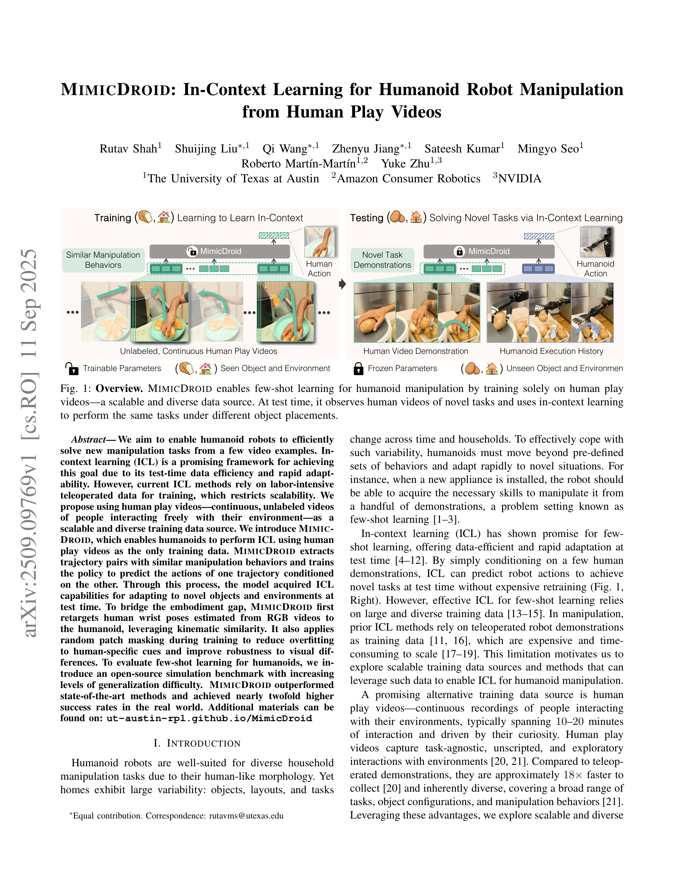
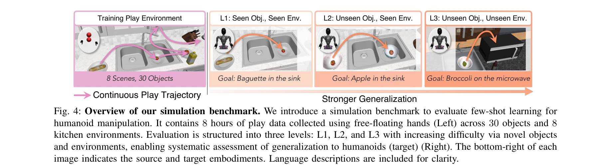

# MimicDroid: In-Context Learning for Humanoid Robot Manipulation from Human Play Videos

> **저자**: Rutav Shah, Shuijing Liu, Qi Wang, Zhenyu Jiang, Sateesh Kumar, Mingyo Seo, Roberto Martín-Martín, Yuke Zhu | **날짜**: 2025-09-11 | **URL**: [https://arxiv.org/abs/2509.09769](https://arxiv.org/abs/2509.09769)

---

## Essence

*Fig. 1: Overview. MIMICDROID enables few-shot learning for humanoid manipulation by training solely on human play*

MimicDroid는 인간의 자유로운 플레이 비디오만을 학습 데이터로 사용하여 In-Context Learning(ICL)을 통해 휴머노이드 로봇이 소수의 예제로부터 조작 작업을 빠르게 학습할 수 있게 하는 방법을 제안한다.

## Motivation

- **Known**: In-Context Learning은 효율적인 few-shot 학습을 가능하게 하지만, 기존 방법들은 비용이 많이 드는 텔레오퍼레이션 로봇 데이터에 의존하고 있다. 휴머노이드 로봇은 인간과의 운동학적 유사성으로 인해 인간 비디오로부터 학습할 잠재력이 있다.
- **Gap**: 자유로운 인간 플레이 비디오로부터 ICL을 위한 메타-학습 샘플을 자동으로 구성하는 방법이 부족하며, 인간-로봇 간 신체 구조 차이(운동학적 및 시각적 간격)를 효과적으로 극복하는 방법이 필요하다.
- **Why**: 휴머노이드 로봇이 가정 환경에서 다양한 작업에 신속하게 적응하려면 확장 가능하고 다양한 학습 데이터로부터 효율적으로 새로운 작업을 습득할 수 있어야 한다. 인간 플레이 비디오는 텔레오퍼레이션 데이터보다 약 18배 빠르게 수집할 수 있고 더 풍부한 다양성을 제공한다.
- **Approach**: MimicDroid는 인간 플레이 비디오에서 유사한 조작 행동을 보이는 궤적 쌍을 자동으로 추출하여 Meta-ICL 학습 샘플을 구성하고, 테스트 시점에 인간 손목 포즈를 휴머노이드로 retarget하며, random patch masking을 적용하여 인간-로봇 간격을 극복한다.

## Achievement

*Fig. 4: Overview of our simulation benchmark. We introduce a simulation benchmark to evaluate few-shot learning for*

- **확장 가능한 데이터 소스**: 기존의 비용이 많이 드는 텔레오퍼레이션 데이터 대신 자유로운 인간 플레이 비디오만을 학습 데이터로 사용하여 Meta-ICL을 가능하게 함
- **우수한 실제 세계 성능**: 기존 최고 성능 방법 대비 거의 2배 높은 성공률을 달성하고, parameter-efficient fine-tuning 대비 26% 높은 성공률 달성
- **확장성 입증**: 훈련 데이터를 64k에서 320k 프레임으로 증가시킬 때 20% 성능 향상 달성
- **벤치마크 기여**: 휴머노이드 조작 작업의 few-shot 학습 평가를 위한 개방 소스 시뮬레이션 벤치마크 제공 (8시간의 플레이 데이터)

## How

*Fig. 2: Method Overview. MIMICDROID performs meta-training for in-context learning (Meta-ICL) by constructing context-*

- Hand pose estimation을 사용하여 RGB 인간 비디오로부터 행동 정보 추출
- Trajectory segment 간 observation-action 유사성을 기반으로 유사한 조작 행동을 보이는 쌍을 자동 검색
- 유사한 궤적 쌍을 context-target으로 구성하여 long-context transformer 정책에 Meta-ICL 훈련 적용
- Human wrist pose를 humanoid wrist pose로 retarget하여 운동학적 간격 극복 (task space에서 작업)
- Random patch masking 적용으로 인간-특화 시각 단서에 대한 과적합 감소 및 시각적 차이에 대한 강건성 향상
- Pretrained vision model과 attention pooling을 사용한 특징 추출 및 action 예측

## Originality

- 자유로운 인간 플레이 비디오를 Meta-ICL의 유일한 훈련 데이터 소스로 사용하는 최초의 시도로, 기존의 비용이 많이 드는 텔레오퍼레이션 데이터 의존성 제거
- Observation-action 유사성 기반의 자동 메타-학습 샘플 구성 방식으로, 자유로운 비디오로부터 확장 가능하고 자동화된 메타-훈련 쌍 생성
- 인간과 로봇 간의 운동학적 유사성을 활용한 task space retargeting 전략으로 인간-로봇 embodiment gap 극복
- ICL을 휴머노이드 조작에 특화된 방식으로 적용하며, visual robustness를 위한 random patch masking 통합

## Limitation & Further Study

- 현재 방법은 손목 중심의 조작에 제한되어 있으며, 전신 신체 움직임이 필요한 작업으로의 확장 필요
- 유사 궤적 검색의 효율성 문제로, 대규모 비디오 데이터에서의 검색 비용 최적화 필요
- Retargeting 정확도가 복잡한 손 상호작용이 필요한 작업에서 제한될 수 있으며, 더 정교한 손 자세 추정 기술 필요
- 시뮬레이션과 실제 환경 간의 domain gap 여전히 존재하며, sim-to-real transfer 성능 향상 필요
- 현재 평가는 제한된 작업 집합에 대해서만 수행되었으며, 더 다양한 일상적 조작 작업에 대한 평가 필요

## Evaluation

- Novelty: 4/5
- Technical Soundness: 4/5
- Significance: 4/5
- Clarity: 4/5
- Overall: 4/5

**총평**: MimicDroid는 휴머노이드 로봇의 few-shot 학습을 위해 확장 가능한 인간 플레이 비디오 데이터를 활용하는 혁신적인 접근법을 제시하며, Meta-ICL, 운동학적 retargeting, visual robustness 기법의 효과적인 조합으로 실제 세계에서 우수한 성능을 달성했다.