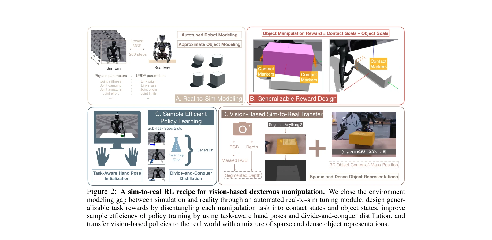
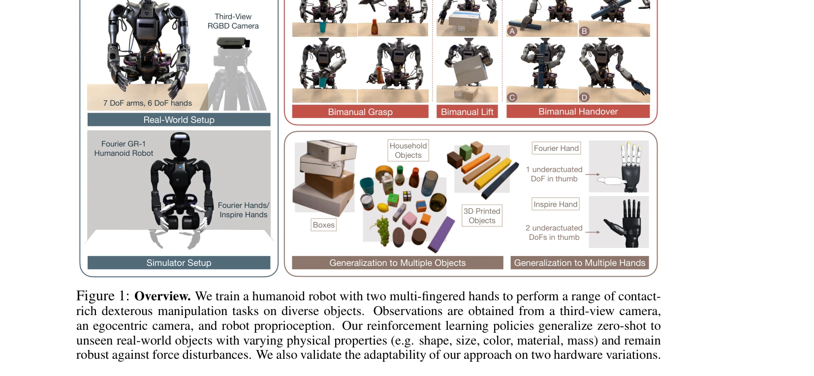

# Sim-to-Real Reinforcement Learning for Vision-Based Dexterous Manipulation on Humanoids

> **저자**: Toru Lin, Kartik Sachdev, Linxi Fan, Jitendra Malik, Yuke Zhu | **날짜**: 2025-02-27 | **URL**: [https://arxiv.org/abs/2502.20396](https://arxiv.org/abs/2502.20396)

---

## Essence

*Figure 2: A sim-to-real RL recipe for vision-based dexterous manipulation. We close the environment*

본 논문은 휴머노이드 로봇의 다중 손가락 손을 이용한 시각 기반 정교한 조작을 위해 sim-to-real RL을 적용하는 실용적인 레시피를 제시하며, 자동화된 실-시뮬레이션 튜닝, 일반화된 보상 설계, 분할-정복 정책 증류, 하이브리드 객체 표현을 통합한다.

## Motivation

- **Known**: Sim-to-real RL은 네비게이션, 로코모션 등에서 성공했으나, 기존 연구는 주로 단일 손이나 상태 기반 설정에 제한되어 있다. 시각 기반 이중 손 조작 학습은 주로 모방 학습에 의존하며 비용이 크다.
- **Gap**: 시각 기반, 접촉이 풍부한 이중 손 조작 작업으로 RL을 효과적으로 확장하는 방법이 명확하지 않으며, 저비용 조작 시스템에서 정확한 실-시뮬레이션 모델링이 부족하다.
- **Why**: 휴머노이드 로봇의 정교한 조작 능력은 제조, 돌봄, 위험 작업 등 현실적 응용에 필수적이며, 확장 가능한 학습 방법은 대규모 로봇 배포를 가능하게 한다.
- **Approach**: 본 논문은 네 가지 핵심 모듈을 통합한다: (1) 4분 미만의 실제 데이터로 파라미터를 자동 조정하는 real-to-sim 모듈, (2) 접촉 및 객체 목표 기반 일반화 보상, (3) 작업 인식 초기화와 divide-and-conquer 정책 증류를 통한 탐색 가속화, (4) sparse/dense 객체 표현과 modality-specific augmentation을 통한 도메인 이동 해결.

## Achievement

*Figure 1: Overview. We train a humanoid robot with two multi-fingered hands to perform a range of contact-*

- **높은 성공률**: 보이지 않은 실제 객체에 대해 본 객체 90%, 미본 객체 60~80% 성공률 달성
- **다양한 작업 학습**: grasp-and-reach, bimanual lift, bimanual handover 세 가지 정교한 조작 작업 성공
- **하드웨어 적응성**: Fourier Hand와 Inspire Hand 두 종류의 다중 손가락 손에서 성능 검증
- **객체 일반화**: 형태, 크기, 색상, 재질, 질량이 다양한 미본 객체에 대한 zero-shot 전이 달성
- **강건성**: 외력 교란에 대한 견고하고 적응적인 정책 행동 입증

## How

*Figure 2: A sim-to-real RL recipe for vision-based dexterous manipulation. We close the environment*

- **Real-to-Sim 자동 튜닝**: 200 스텝의 joint target 추적 오차 MSE를 최소화하는 파라미터 그리드 서치로 물리 파라미터 및 URDF 파라미터 조정
- **보상 설계**: 접촉 마커 기반 접촉 목표와 3D 객체 중심 위치 기반 객체 목표를 결합하여 이중 손 협력 수행
- **작업 인식 초기화**: 각 작업별 손의 초기 포즈를 설정하여 탐색 효율 향상
- **Divide-and-Conquer 증류**: 단일 작업 specialists 학습 후 generalist 정책으로 증류하여 다중 객체 학습 효율화
- **하이브리드 객체 표현**: Segment Anything 2로 분할된 RGB와 깊이 기반 sparse 표현(객체 중심 위치)과 high-dimensional 특성 결합
- **Modality-specific 증강**: RGB masked augmentation과 깊이 segmentation을 통한 도메인 랜더마이제이션

## Originality

- 저비용 휴머노이드 플랫폼을 위한 자동화된 real-to-sim 시스템 식별 방법으로 4분 미만의 데이터로 충분한 결과 도출
- 접촉-객체 목표 이중 구조를 통한 이중 손 협력 보상 설계의 새로운 접근
- Divide-and-Conquer 정책 증류 프레임워크로 다중 객체 학습 시 탐색 병목 해결
- Sparse/Dense 하이브리드 객체 표현과 modality-specific augmentation 조합으로 80~100% 성공률 개선
- 다중 손가락 손 하드웨어 변형에 대한 최초의 robustness 검증

## Limitation & Further Study

- Real-to-Sim 튜닝이 4분 데이터 필요하므로 완전히 zero-shot이 아니며, 새로운 로봇 플랫폼마다 재튜닝 필요
- 미본 객체에서 60~80% 성공률은 본 객체 대비 상당한 하락을 보이며, 더 복잡한 형태의 객체 일반화 성능이 미흡할 수 있음
- 방법론이 여러 모듈의 조합으로 구성되어 각 컴포넌트의 독립적 기여도 분석이 제한적
- **후속 연구**: (1) 메타 러닝 또는 few-shot adaptation으로 더 빠른 새 플랫폼 적응, (2) 더 강력한 객체 표현 학습으로 일반화 성능 개선, (3) 추상적 스킬 학습으로 다양한 작업 간 지식 전이

## Evaluation

- Novelty: 4/5
- Technical Soundness: 3/5
- Significance: 4/5
- Clarity: 4/5
- Overall: 4/5

**총평**: 본 논문은 sim-to-real RL을 실제 휴머노이드 다중 손가락 조작으로 처음 확장하는 실용적이고 포괄적인 솔루션을 제시하며, 자동화된 시스템 식별과 정책 증류 등 여러 혁신을 통해 높은 성공률과 일반화 능력을 입증한다. 다만 미본 객체 성능과 방법의 복잡성 개선에는 여지가 있다.

## Related Papers

- 🏛 기반 연구: [[papers/1433_H-Zero_Cross-Humanoid_Locomotion_Pretraining_Enables_Few-sho/review]] — 인간 플레이 비디오로 ICL 기반 휴머노이드 조작 학습이 차세대 토큰 예측을 통한 맥락 내 모방학습을 기반으로 한다.
- 🔗 후속 연구: [[papers/1288_3D_Diffusion_Policy_Generalizable_Visuomotor_Policy_Learning/review]] — 자유로운 플레이에서 조작 학습하는 MimicDroid가 대규모 인간 시연으로 행동 기반 모델을 사전훈련하는 BFM-Zero로 확장된다.
- 🧪 응용 사례: [[papers/1476_Humanoid_World_Models_Open_World_Foundation_Models_for_Human/review]] — 인간 비디오 기반 ICL 조작 학습이 MimicPlay의 장기 모방학습 관찰 프레임워크에서 실제 적용될 수 있다.
