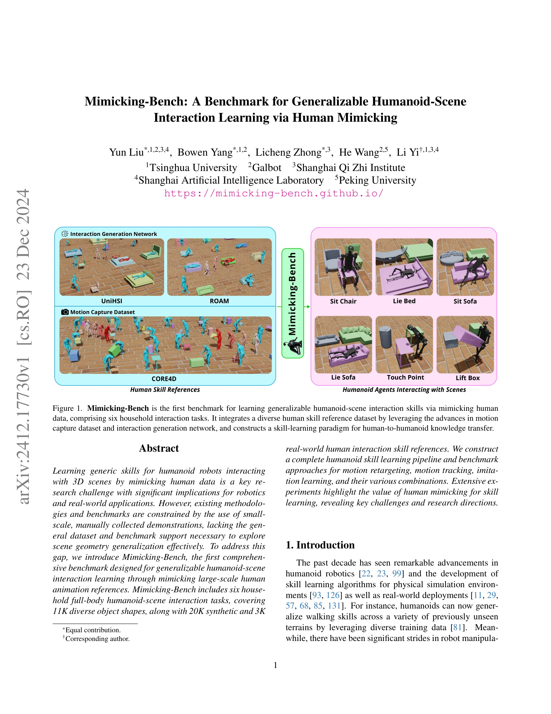
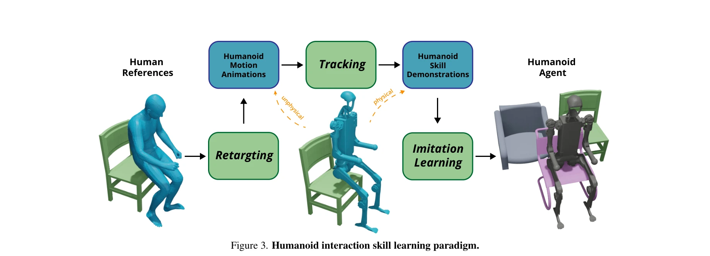

# Mimicking-Bench: A Benchmark for Generalizable Humanoid-Scene Interaction Learning via Human Mimicking

> **저자**: Yun Liu, Bowen Yang, Licheng Zhong, He Wang, Li Yi | **날짜**: 2024-12-23 | **URL**: [https://arxiv.org/abs/2412.17730](https://arxiv.org/abs/2412.17730)

---

## Essence

*Figure 1. Mimicking-Bench is the first benchmark for learning generalizable humanoid-scene interaction skills via mimick*

인간 동작 모방을 통해 휴머노이드 로봇이 다양한 3D 장면과 상호작용하는 일반화된 기술을 학습할 수 있도록 설계된 첫 번째 포괄적 벤치마크인 Mimicking-Bench를 제시한다. 23K의 인간-장면 상호작용 데이터(20K 합성 + 3K 실제)와 6개의 가사 작업 과제, 11K의 다양한 객체 형태를 포함한다.

## Motivation

- **Known**: 휴머노이드 로봇의 기술 학습과 관련하여 locomotion이나 조작 기술에 대한 벤치마크가 존재하고, 인간 동작 캡처 및 합성 기술이 발전했으며, imitation learning을 통한 휴머노이드 기술 학습이 활발히 연구되고 있다.
- **Gap**: 기존 벤치마크들(HumanoidBench, BiGym)은 소규모 수작업 시연 데이터에 의존하거나 RL 기반으로 일반화 능력이 제한되어 있어, 다양한 객체 형태에 대한 장면 기하학 일반화를 체계적으로 탐구할 수 없다.
- **Why**: 휴머노이드 로봇이 현실 세계에서 광범위한 작업을 수행하려면 다양한 장면과 객체에 일반화되는 상호작용 기술 학습이 필수이며, 이는 노동력 절감과 효율성 향상에 직결된다.
- **Approach**: Motion capture 데이터셋과 interaction generation network를 활용하여 대규모 다양한 인간 동작 참조 데이터를 구축하고, motion retargeting, motion tracking, imitation learning의 3가지 핵심 기술 모듈을 연결한 일반화된 기술 학습 파이프라인을 구성한다.

## Achievement

*Figure 4. Qualitative comparisons on data-driven human mim-*

- **첫 인간 모방 기반 휴머노이드-장면 상호작용 벤치마크 제시**: Mimicking-Bench는 6개 가사 작업 과제, 11K 다양한 객체 형태, 25K 인간 참조 데이터를 포함하는 포괄적 벤치마크이다.
- **대규모 다양한 인간 기술 참조 데이터셋 구축**: 20K 합성 및 3K 실제 인간-장면 상호작용 동작 시퀀스를 통합하여 기존 수작업 데이터의 한계를 극복했다.
- **일반화된 기술 학습 파이프라임 개발**: Motion retargeting, motion tracking, imitation learning을 모듈화하여 파이프라인 수준과 모듈 수준의 평가를 모두 지원한다.
- **인간 모방 패러다임의 효과성 입증**: 최적의 알고리즘 조합 시 데이터 없는 RL 대비 더 자연스러운 동작 생성과 유의미하게 높은 작업 성공률을 달성했다.

## How

*Figure 3. Humanoid interaction skill learning paradigm.*

- Motion capture 데이터셋(CORE4D, ROAM 등)과 interaction generation network를 활용하여 실제 및 합성 인간-장면 상호작용 데이터 수집
- 6개 가사 작업(Sit Chair, Sit Sofa, Lie Bed, Lie Sofa, Touch Point, Lift Box) 정의 및 11K 다양한 객체 형태 구성
- 3가지 핵심 기술 모듈 정의: 1) Human-to-humanoid motion retargeting, 2) Skill animation tracking in physical simulation, 3) Imitation learning from demonstrations
- 파이프라인 수준 비교(기존 완전한 파이프라인 평가)와 모듈 수준 비교(각 모듈별 알고리즘 평가) 실시
- Humanoid agent의 task success rate, motion naturalness 등 정량적 지표와 정성적 비교를 통한 광범위한 실험 수행

## Originality

- 인간 동작 모방을 통한 휴머노이드-장면 상호작용 학습을 위한 첫 번째 포괄적 벤치마크로, 기존의 demonstration-free RL 또는 소규모 수작업 기반 벤치마크와 구별된다.
- Vision/Graphics 분야의 motion generation 기술을 robotics 분야와 연결하여 대규모 다양한 인간 참조 데이터 구축의 새로운 경로 제시
- Motion retargeting, tracking, imitation learning을 통합한 모듈화 파이프라인 설계로 다양한 알고리즘 조합과 비교 가능
- 파이프라인 수준과 모듈 수준의 이중 평가 체계로 기술별 기여도 분석 가능

## Limitation & Further Study

- 벤치마크는 물리 시뮬레이션 환경에서만 구현되어 있으며, 실제 로봇 하드웨어에 대한 일반화 능력은 직접 검증되지 않았다.
- 6개 작업은 주로 가사 환경에 제한되어 있어 다른 도메인으로의 확장성 평가가 필요하다.
- Motion generation network의 합성 데이터 품질이 실제 데이터와 차이가 있을 수 있으며, 이러한 도메인 갭이 학습 성능에 미치는 영향 분석 필요
- **후속 연구**: 1) 실제 로봇 플랫폼으로의 기술 이전 연구, 2) 더 넓은 범위의 상호작용 작업 및 환경으로의 벤치마크 확장, 3) 합성 및 실제 데이터 간 도메인 갭 해소 방법 개발

## Evaluation

- Novelty: 4/5
- Technical Soundness: 3/5
- Significance: 4/5
- Clarity: 4/5
- Overall: 4/5

**총평**: Mimicking-Bench는 휴머노이드-장면 상호작용 학습을 위한 첫 포괄적 벤치마크로, 대규모 다양한 인간 데이터와 모듈화된 파이프라인을 통해 인간 모방 패러다임의 효과성을 체계적으로 검증하며, 로보틱스 분야의 중요한 연구 자산이 된다.

## Related Papers

- 🔄 다른 접근: [[papers/1532_RLinf-VLA_A_Unified_and_Efficient_Framework_for_Reinforcemen/review]] — VLA 모델 강화학습 훈련에서 통합 프레임워크와 단순화된 RL 접근법이라는 서로 다른 방식을 보여준다.
