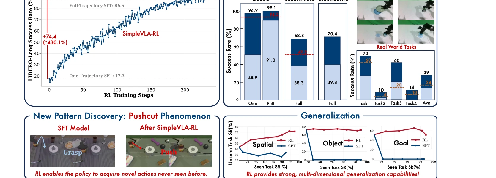
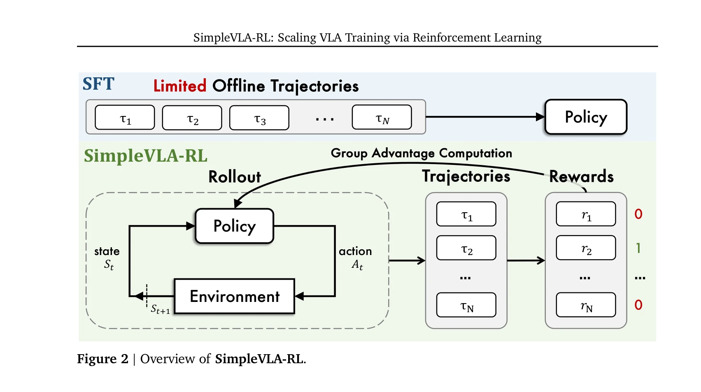

# SimpleVLA-RL: Scaling VLA Training via Reinforcement Learning

> **저자**: Haozhan Li, Yuxin Zuo, Jiale Yu, Yuhao Zhang, Zhaohui Yang, Kaiyan Zhang, Xuekai Zhu, Yuchen Zhang, Tianxing Chen, Ganqu Cui, Dehui Wang, Dingxiang Luo, Yuchen Fan, Youbang Sun, Jia Zeng, Jiangmiao Pang, Shanghang Zhang, Yu Wang, Yao Mu, Bowen Zhou, Ning Ding | **날짜**: 2025-09-11 | **URL**: [https://arxiv.org/abs/2509.09674](https://arxiv.org/abs/2509.09674)

---

## Essence

*Figure 1 | Overview of SimpleVLA-RL. SimpleVLA-RL is an efficient RL framework for VLA that im-*

SimpleVLA-RL은 Vision-Language-Action 모델의 학습을 강화학습(RL)을 통해 확장하는 효율적인 프레임워크로, 데이터 부족 문제를 해결하고 실제 로봇 작업에서 SFT를 능가하는 성능을 달성한다.

## Motivation

- **Known**: VLA 모델은 대규모 사전학습과 감독 학습(SFT)을 통해 로봇 조작 작업에 상당한 진전을 이루었으나, 인간이 조작한 로봇 궤적의 부족과 분포 이동에 대한 제한된 일반화 능력이라는 두 가지 근본적인 문제를 지니고 있다.
- **Gap**: 기존 SFT 기반 접근법은 대규모의 비용이 높은 로봇 궤적 데이터에 의존하며 새로운 상황으로의 일반화가 제한적인 반면, 최근 Large Reasoning Model(예: DeepSeek-R1)에서 RL의 효과가 입증되었으나 VLA에 대한 RL 적용이 체계적으로 탐색되지 않았다.
- **Why**: RL 기반 학습은 제한된 데이터로도 장기 계획 능력을 향상시킬 수 있으며, 실제 로봇 작업 배포에서 SFT보다 더 나은 성능을 기대할 수 있어 로봇 학습의 실용성을 높일 수 있다.
- **Approach**: SimpleVLA-RL은 veRL 프레임워크를 기반으로 VLA-특화 대화형 궤적 샘플링, 확장 가능한 병렬화, 다중 환경 렌더링, 최적화된 손실 계산을 구현하며, outcome reward modeling과 exploration 강화 전략을 적용한다.

## Achievement

*Figure 1 | Overview of SimpleVLA-RL. SimpleVLA-RL is an efficient RL framework for VLA that im-*

- **효율적인 온라인 RL 프레임워크**: veRL을 기반으로 VLA에 맞게 최적화된 안정적이고 샘플 효율적인 end-to-end 온라인 RL 프레임워크를 개발했다.
- **최첨단 성능**: LIBERO에서 최고 성능을 달성했으며, exploration 강화 전략으로 10-15% 일관적인 성능 개선을 이루고 RoboTwin 1.0&2.0에서 π₀를 능가했다.
- **데이터 효율성**: 작업당 단일 시연만으로 LIBERO-Long 성공률을 17.1%에서 91.7%로 상향시켰으며, 공간/객체/작업 일반화에서 SFT를 크게 능가했다.
- **실제 배포 능력**: 시뮬레이션 학습 정책이 실제 로봇으로 효과적으로 전이되어 실제 로봇 데이터 없이도 우수한 sim-to-real 성능을 달성했다.
- **새로운 현상 발견**: RL 학습 중 "pushcut" 현상을 발견했으며, 이는 정책이 훈련 데이터에 없는 이전에 보지 못한 패턴을 발견하는 현상을 지칭한다.

## How

*Figure 2 | Overview of SimpleVLA-RL.*

- Interactive VLA Rollout: VLA 모델이 환경과 다중 라운드 상호작용을 통해 궤적을 생성하며, 각 단계에서 시각/언어 관찰을 기반으로 행동을 선택한다.
- Outcome Reward Modeling: 작업 완료 여부를 기반한 이진 또는 연속 보상 신호를 학습 신호로 사용하여 hand-crafted process reward의 필요성을 제거한다.
- Exploration Enhancements: 온도 파라미터 조정, 확률적 샘플링, 다양한 탐색 전략을 통해 정책이 새로운 행동 패턴을 발견하도록 유도한다.
- Group Relative Policy Optimization: veRL의 GRPO 알고리즘을 VLA에 적용하여 정책 최적화를 수행한다.
- Parallel Multi-Environment Rendering: 렌더링 병렬화를 통해 샘플링 속도를 향상시켜 빠른 학습과 확장성을 달성한다.
- VLA-Specific Loss Computation: VLA의 특성에 맞게 손실 함수를 최적화하여 효율적인 그래디언트 계산을 지원한다.

## Originality

- LLM용 RL 프레임워크(veRL)를 VLA라는 전혀 다른 도메인으로 처음 체계적으로 적응시켰으며, VLA-특화 궤적 샘플링과 다중 환경 렌더링이라는 기술적 혁신을 도입했다.
- pushcut" 현상의 발견은 RL을 통해 정책이 훈련 데이터 범위를 초월하는 새로운 행동을 학습할 수 있음을 보여주는 흥미로운 발견으로, VLA 연구에서 미탐험된 영역이다.
- Outcome reward만으로 장기 로봇 조작 작업을 효과적으로 학습할 수 있음을 최초로 입증했으며, hand-crafted process reward의 필요성을 제거했다.
- 실제 로봇 환경으로의 sim-to-real 전이를 실제 로봇 데이터 없이 달성했으며, 이는 데이터 수집 비용 절감에 기여한다.

## Limitation & Further Study

- **계산 비용**: 다중 라운드 환경 상호작용은 LLM 토큰 생성보다 훨씬 느리므로, 대규모 병렬화에도 불구하고 확장성이 제한적이다.
- **Failure modes**: 논문에서 몇 가지 실패 모드를 언급하지만 상세한 분석과 대처 방안이 부족하다.
- **보상 설계의 제한**: Outcome reward만 사용하므로 중간 단계의 오류나 비효율을 감지하기 어려울 수 있다.
- **실제 로봇 실험의 제한성**: 4가지 실제 작업에 대한 제한된 실험으로, 더 다양한 실제 로봇 환경에서의 검증이 필요하다.
- **일반화 경계**: 현재 실험은 LIBERO와 RoboTwin 시뮬레이터에 초점이 맞추어져 있으며, 다른 로봇 플랫폼과 환경에 대한 일반화 가능성은 불명확하다.
- **후속 연구 방향**: (1) 다중 보상 신호의 조합을 통한 학습 효율 향상, (2) 메타 강화학습을 통한 빠른 적응, (3) 인간 피드백을 포함한 보상 모델 개선, (4) 더 복잡한 장기 작업에 대한 확장

## Evaluation

- Novelty: 4/5
- Technical Soundness: 3/5
- Significance: 4/5
- Clarity: 4/5
- Overall: 4/5

**총평**: SimpleVLA-RL은 RL을 VLA 학습에 효과적으로 적용하여 데이터 부족 문제를 해결하고 실제 로봇 성능을 향상시킨 중요한 기여이며, "pushcut" 현상의 발견은 새로운 연구 방향을 제시한다. 다만 계산 비용과 실제 환경 검증의 확대가 향후 과제이다.

## Related Papers

- 🏛 기반 연구: [[papers/1487_HUMOTO_A_4D_Dataset_of_Mocap_Human_Object_Interactions/review]] — HUMOTO의 고품질 4D 상호작용 데이터가 휴머노이드-장면 상호작용 벤치마크의 기반 데이터를 제공함
- 🧪 응용 사례: [[papers/1568_MeshMimic_Geometry-Aware_Humanoid_Motion_Learning_through_3D/review]] — MeshMimic의 3D 장면 인식 운동 학습이 Mimicking-Bench의 실제 구현 방법론을 제시함
- 🔗 후속 연구: [[papers/1317_BEHAVIOR-1K_A_Human-Centered_Embodied_AI_Benchmark_with_1000/review]] — BEHAVIOR-1K의 1000개 인간 활동 벤치마크를 휴머노이드 시뮬레이션 환경으로 확장함
- 🧪 응용 사례: [[papers/1458_HuBE_Cross-Embodiment_Human-like_Behavior_Execution_for_Huma/review]] — Mimicking-Bench가 제공하는 벤치마크가 cross-embodiment behavior execution의 평가 기준을 제시함
- 🔗 후속 연구: [[papers/1487_HUMOTO_A_4D_Dataset_of_Mocap_Human_Object_Interactions/review]] — HUMOTO의 고품질 4D 상호작용 데이터가 Mimicking-Bench의 휴머노이드-장면 상호작용 벤치마크를 보완함
- 🧪 응용 사례: [[papers/1519_Learning_Athletic_Humanoid_Tennis_Skills_from_Imperfect_Huma/review]] — Mimicking-Bench의 다양한 가사 작업이 테니스 스킬 학습의 확장된 적용 영역을 보여줌
- 🧪 응용 사례: [[papers/1568_MeshMimic_Geometry-Aware_Humanoid_Motion_Learning_through_3D/review]] — Mimicking-Bench의 휴머노이드-장면 상호작용 벤치마크가 geometry-aware motion learning의 평가 기준을 제시함
