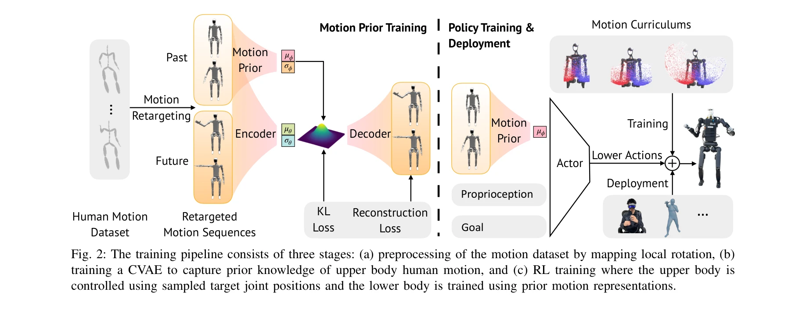
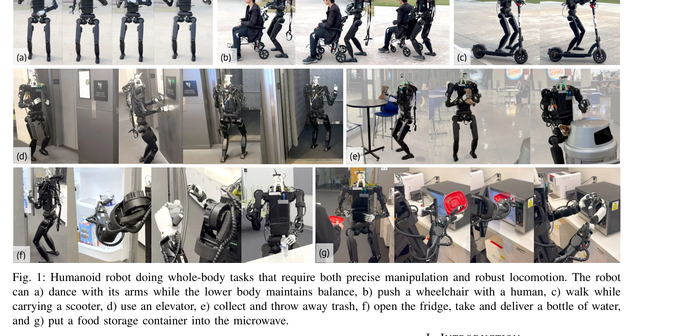

# Mobile-TeleVision: Predictive Motion Priors for Humanoid Whole-Body Control

> **저자**: Chenhao Lu, Xuxin Cheng, Jialong Li, Shiqi Yang, Mazeyu Ji, Chengjing Yuan, Ge Yang, Sha Yi, Xiaolong Wang | **날짜**: 2024-12-10 | **URL**: [https://arxiv.org/abs/2412.07773](https://arxiv.org/abs/2412.07773)

---

## Essence

*Fig. 2: The training pipeline consists of three stages: (a) preprocessing of the motion dataset by mapping local rotatio*

인간형 로봇의 전신 제어를 위해 상체 조작과 하체 보행을 분리하고, CVAE 기반 Predictive Motion Priors (PMP)를 사용하여 상체의 정밀 조작과 하체의 견고한 보행을 동시에 달성하는 방법을 제안한다.

## Motivation

- **Known**: RL 기반의 전신 인간형 로봇 제어는 강건한 보행을 제공하지만 고자유도 팔의 정밀한 조작에는 부족하다. 상체와 하체를 완전히 분리하면 불안정성이 발생한다.
- **Gap**: 상체의 정밀 조작 능력과 하체의 보행 안정성을 동시에 만족하면서도 서로 다른 제어 메커니즘을 통합하는 방법이 부재하다.
- **Why**: 인간형 로봇이 실제 환경에서 물건을 집으면서 동시에 이동하는 loco-manipulation 작업을 수행하려면 두 가지 상충하는 요구사항을 모두 충족해야 하기 때문이다.
- **Approach**: 상체는 IK와 motion retargeting으로 직접 제어하고, 하체는 RL로 학습하되 CVAE로 추출한 상체 동작의 잠재 표현(motion prior)을 하체 정책의 입력으로 조건화하여 두 제어기 간 상호작용을 유지한다.

## Achievement

*Fig. 1: Humanoid robot doing whole-body tasks that require both precise manipulation and robust locomotion. The robot*

* **정밀한 상체 조작**: 7 DoF 팔을 직접 제어하여 기존 RL 기반 방법들(ExBody, OmniH2O, HumanPlus)보다 우수한 정밀도 달성
* **견고한 하체 보행**: 다양한 크기의 하중을 견디면서도 안정적인 보행 유지
* **통합된 전신 제어**: 상체와 하체의 독립적 제어를 통합하여 불안정성 없이 강건성 확보
* **실제 로봇 검증**: Unitree H1과 Fourier GR1에서 시뮬레이션 및 실물 실험으로 입증
* **다양한 작업 수행**: 춤, 휠체어 밀기, 물품 나르기, 엘리베이터 이용, 냉장고 열기 등 7가지 이상의 복합 작업 시연

## How

*Fig. 2: The training pipeline consists of three stages: (a) preprocessing of the motion dataset by mapping local rotatio*

* Human motion dataset을 로봇의 관절각도로 retargeting
* CVAE를 상체 모션 시퀀스(과거 W 프레임 → 미래 W 프레임)에 학습하여 잠재 벡터 z_t ∈ R^64 추출
* Prior distribution R과 Encoder E를 diagonal Gaussian으로 모델링하고 ELBO 손실함수로 최적화
* 추출된 motion prior (μ_ϕ)를 하체 RL 정책의 상태 입력에 포함
* RL 정책은 proprioception(관절각도, 속도, 각속도, 중력, 이전 액션)과 motion prior를 관찰하여 하체 모터만 제어
* Curriculum learning으로 점진적으로 상체 동작의 난이도를 증가시키면서 정책 학습

## Originality

* **분리 제어의 새로운 통합**: 상체의 IK 기반 직접 제어와 하체의 RL 기반 제어를 단순 분리가 아닌 motion prior를 통해 통합하는 아이디어
* **CVAE 기반 motion prior**: 단순 재구성이 아닌 조건부 생성 모델로 미래 상체 동작을 예측하여 하체 제어에 정보 제공
* **Teleoperation과의 결합**: 상체 조작을 텔레오퍼레이터가 직접 제어하고 하체 보행을 RL로 자동화하는 실용적 시스템 구성
* **고자유도 팔 지원**: 기존 방법들의 4-5 DoF에서 7 DoF 팔을 정밀 제어 가능하게 확장

## Limitation & Further Study

* Motion prior가 과거 W 프레임 기반으로 계산되므로 예측 지평선(prediction horizon)의 한계가 있을 수 있음
* CVAE 학습에 충분한 규모의 human motion dataset 필요로 데이터 수집 비용 발생
* 실험이 주로 시뮬레이션에서 수행되었으며 실제 로봇 실험은 Unitree H1에 제한됨
* 극단적인 동적 환경(매우 빠른 이동 중 고정밀 조작)에서의 성능 미평가
* Motion retargeting 과정에서 발생할 수 있는 자동화 오류에 대한 분석 부족
* 후속 연구: 더 긴 prediction horizon을 위한 hierarchical motion prior 개발, 적응형 curriculum learning 알고리즘 개선, 실시간 사용자 피드백 기반 CVAE 온라인 업데이트 기법

## Evaluation

- Novelty: 4/5
- Technical Soundness: 3/5
- Significance: 4/5
- Clarity: 4/5
- Overall: 4/5

**총평**: 이 논문은 인간형 로봇의 전신 제어라는 도전적인 문제에 대해 상체와 하체의 특성을 고려한 실용적이고 효과적인 해결책을 제시한다. CVAE 기반의 motion prior를 통합하는 방식은 학술적 독창성과 실제 적용성을 동시에 갖추고 있으며, 다양한 복합 작업의 시연과 비교 실험을 통해 그 우수성을 명확히 입증하였다.

## Related Papers

- 🏛 기반 연구: [[papers/1354_Dex1B_Learning_with_1B_Demonstrations_for_Dexterous_Manipula/review]] — 상체 조작을 위한 기반 기술로서 휴머노이드의 전신 제어에서 상체 정밀 조작 부분의 이론적 토대를 제공합니다.
- 🔄 다른 접근: [[papers/1499_InterPrior_Scaling_Generative_Control_for_Physics-Based_Huma/review]] — 멀티모달 VLA 모델을 통한 통합 제어와 달리 상하체 분리 제어 방식으로 다른 아키텍처 접근법을 제시합니다.
- 🔗 후속 연구: [[papers/1456_HOVER_Versatile_Neural_Whole-Body_Controller_for_Humanoid_Ro/review]] — CVAE 기반 motion prior가 신경망 기반 전신 제어기의 예측 성능을 향상시킬 수 있는 확장 가능성을 보여줍니다.
- 🔗 후속 연구: [[papers/1365_EGM_Efficiently_Learning_General_Motion_Tracking_Policy_for/review]] — Mobile-TeleVision의 predictive motion prior를 EGM의 motion tracking에 통합하면 예측 기반 동작 추적이 가능하다.
- 🏛 기반 연구: [[papers/1617_VLA-Cache_Efficient_Vision-Language-Action_Manipulation_via/review]] — Mobile-TeleVision의 predictive motion prior가 VLA-Cache의 시간적 중복성 활용 아이디어의 이론적 근거를 제공한다
- 🔄 다른 접근: [[papers/1537_Learning_Social_Navigation_from_Positive_and_Negative_Demons/review]] — 두 논문 모두 향상된 waypoint 기반 내비게이션을 다루지만, 사회적 시연 학습 vs 백트래킹 메커니즘이라는 서로 다른 접근법을 제시함
- 🔗 후속 연구: [[papers/1574_Mobi-π_Mobilizing_Your_Robot_Learning_Policy/review]] — 모바일 휴머노이드 전신 제어에서 예측적 모션 프라이어가 정책 모빌화의 성능을 보완한다.
