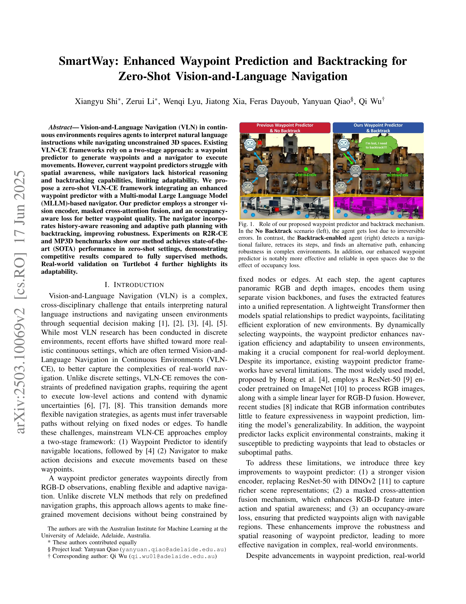

# SmartWay: Enhanced Waypoint Prediction and Backtracking for Zero-Shot Vision-and-Language Navigation

> **저자**: Xiangyu Shi, Zerui Li, Wenqi Lyu, Jiatong Xia, Feras Dayoub, Yanyuan Qiao, Qi Wu | **날짜**: 2025-03-13 | **URL**: [https://arxiv.org/abs/2503.10069](https://arxiv.org/abs/2503.10069)

---

## Essence

*Fig. 1. Role of our proposed waypoint predictor and backtrack mechanism.*

SmartWay는 향상된 waypoint predictor와 MLLM 기반 navigator를 통합한 zero-shot VLN-CE 프레임워크로, occupancy-aware loss와 history-aware reasoning, backtracking 메커니즘을 통해 연속 환경에서의 네비게이션 성능을 개선한다.

## Motivation

- **Known**: VLN-CE는 waypoint predictor와 navigator의 two-stage 프레임워크를 사용하며, 기존 waypoint predictor는 ResNet-50 인코더와 단순 RGB-D 융합으로 제한된 공간 인식 능력을 보인다. LLM 기반 네비게이션은 이산 환경에서는 진전이 있으나 연속 환경의 운동 제어에는 제한적이다.
- **Gap**: 기존 waypoint predictor는 약한 vision encoder와 명시적 환경 제약이 부족하고, 기존 LLM 기반 방법은 textual abstraction으로 인해 시각 정보를 간접적으로만 이해하며 역사 정보와 backtracking을 효과적으로 활용하지 못한다.
- **Why**: 실제 로봇 배포를 위해서는 데이터 부족 환경에서도 generalize할 수 있는 zero-shot 방법이 필요하며, backtracking 능력은 누적 오류를 완화하여 네비게이션 안정성을 크게 향상시킬 수 있다.
- **Approach**: DINOv2 vision encoder와 masked cross-attention 융합, occupancy-aware loss를 통해 waypoint predictor를 강화하고, MLLM을 기반으로 history-aware 프롬프팅과 adaptive path planning with backtracking을 도입하여 zero-shot VLN-CE를 구현한다.

## Achievement

*Fig. 1. Role of our proposed waypoint predictor and backtrack mechanism.*

- **Enhanced Waypoint Predictor**: DINOv2 인코더, masked cross-attention 메커니즘, occupancy-aware loss를 통해 공간 인식 능력과 waypoint 품질을 개선
- **MLLM 기반 Zero-shot 네비게이션**: History-aware Single-expert Prompt System으로 trajectory 정보를 효과적으로 통합하여 다중 모드 추론 능력 강화
- **Backtracking 메커니즘**: 새로운 backtracking 알고리즘으로 네비게이션 실패 감지 및 경로 재탐색으로 오류 전파 완화
- **SOTA 성능**: R2R-CE val-unseen에서 SR 29%, SPL 22.46%로 모든 zero-shot 방법 초과, supervised 방법과 경쟁 가능한 성능 달성
- **Real-world Validation**: Turtlebot 4에서 25개 다양한 instruction에 대해 learning-based baseline 초과 성능 입증

## How

- Vision encoder를 ResNet-50에서 DINOv2로 교체하여 더 풍부한 장면 표현 캡처
- RGB와 depth 특성 간 상호작용을 강화하기 위해 masked cross-attention 융합 메커니즘 적용
- Occupancy-aware loss 함수로 예측된 waypoint이 탐색 가능 영역과 정렬되도록 제약
- MLLM (예: Claude, GPT-4V)의 multimodal 이해 능력 활용하여 RGB-D 이미지 직접 처리
- History-aware Single-expert Prompt System으로 과거 trajectory, 현재 이미지, instruction을 통합한 프롬프트 구성
- Adaptive Path Planning으로 네비게이션 실패 감지 시 이전 waypoint로 돌아가는 backtracking 실행
- Habitat 시뮬레이터의 R2R-CE와 MP3D 벤치마크에서 평가

## Originality

- Continuous VLN에서 MLLM을 zero-shot 네비게이터로 활용한 최초 탐색
- RGB-D fusion을 위한 masked cross-attention 메커니즘의 novel 설계로 공간 인식 개선
- Occupancy-aware loss를 통한 명시적 환경 제약 모델링으로 waypoint 품질 보장
- MLLM 기반 VLN-CE 에이전트를 위한 첫 번째 backtracking 메커니즘 소개
- History-aware Single-expert Prompt System으로 trajectory 정보를 multimodal 컨텍스트에 효과적으로 통합

## Limitation & Further Study

- Real-world 평가가 제한적 (Turtlebot 4의 25개 instruction만 수행) - 더 다양한 실제 환경과 로봇 플랫폼에서의 검증 필요
- MLLM 기반 방법의 inference latency와 computational cost에 대한 분석 부재 - 실시간 로봇 제어를 위한 효율성 검토 필요
- Backtracking 메커니즘의 iteration 횟수 제한이나 최대 탐색 깊이 설정에 대한 상세 설명 부족
- Zero-shot 성능이 supervised 방법에는 아직 미달 - 더 강력한 MLLM이나 adaptation 기법 탐색 필요
- Occupancy-aware loss의 설계 원리와 hyperparameter sensitivity 분석 미흡
- 다양한 MLLM 모델 간 성능 비교 및 모델 크기의 영향 분석 필요

## Evaluation

- Novelty: 4/5
- Technical Soundness: 3/5
- Significance: 4/5
- Clarity: 4/5
- Overall: 4/5

**총평**: SmartWay는 enhanced waypoint predictor와 MLLM 기반 네비게이터, backtracking 메커니즘의 유기적 결합으로 zero-shot VLN-CE에서 SOTA 성능을 달성하며, 실제 로봇 배포 가능성을 입증한 의미 있는 연구이다. 다만 real-world 평가 확대와 computational cost 분석이 보완되면 더욱 견고할 것으로 판단된다.

## Related Papers

- 🔄 다른 접근: [[papers/1507_OpenBench_A_New_Benchmark_and_Baseline_for_Semantic_Navigati/review]] — OpenBench의 스마트 로지스틱스 네비게이션과 SmartWay의 zero-shot VLN-CE는 모두 실제 환경 네비게이션을 위한 서로 다른 접근법이다.
- 🔗 후속 연구: [[papers/1595_TRAVEL_Training-Free_Retrieval_and_Alignment_for_Vision-and-/review]] — TRAVEL의 training-free retrieval이 SmartWay의 zero-shot 프레임워크를 더 효율적인 검색 기반 방법으로 확장한다.
- 🏛 기반 연구: [[papers/1489_NaVid_Video-based_VLM_Plans_the_Next_Step_for_Vision-and-Lan/review]] — NaVid의 video-based VLM navigation이 SmartWay의 MLLM 기반 navigator의 기초 방법론을 제공한다.
- 🔄 다른 접근: [[papers/1507_OpenBench_A_New_Benchmark_and_Baseline_for_Semantic_Navigati/review]] — SmartWay의 zero-shot VLN-CE와 OpenBench의 스마트 로지스틱스는 모두 실제 환경에서의 네비게이션 문제를 다른 관점에서 접근한다.
