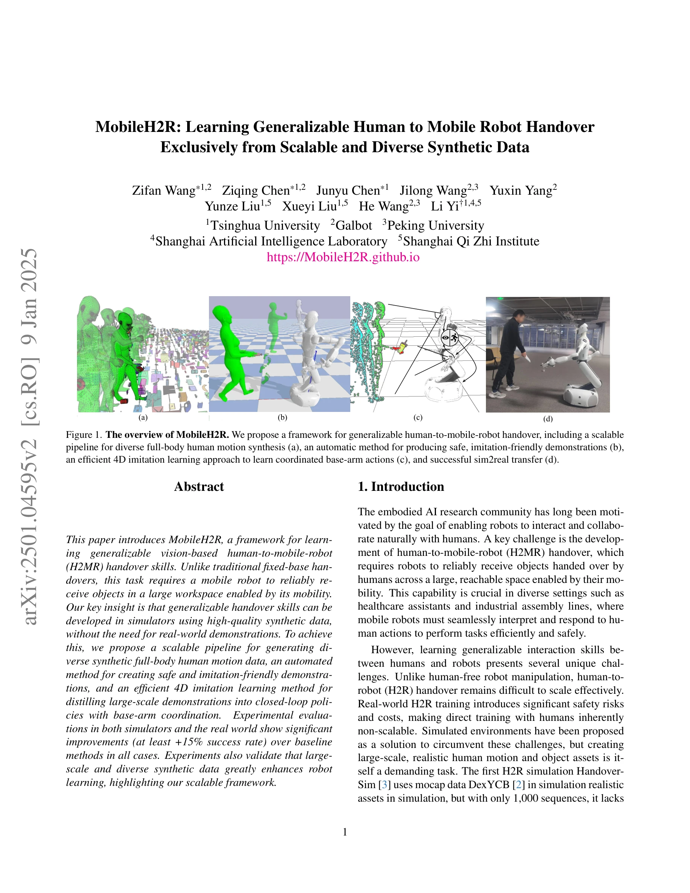
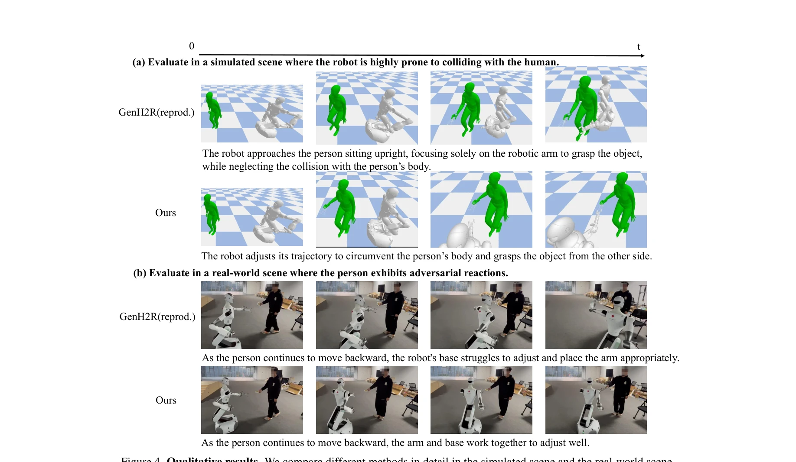
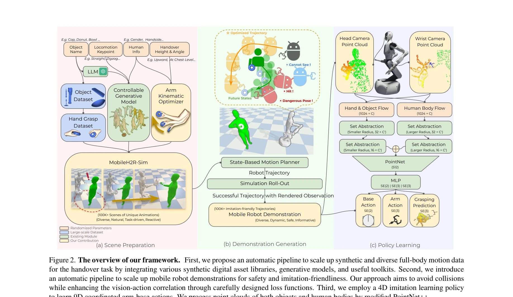

# MobileH2R: Learning Generalizable Human to Mobile Robot Handover Exclusively from Scalable and Diverse Synthetic Data

> **저자**: Zifan Wang, Ziqing Chen, Junyu Chen, Jilong Wang, Yuxin Yang, Yunze Liu, Xueyi Liu, He Wang, Li Yi | **날짜**: 2025-01-08 | **URL**: [https://arxiv.org/abs/2501.04595](https://arxiv.org/abs/2501.04595)

---

## Essence

*Figure 1. The overview of MobileH2R. We propose a framework for generalizable human-to-mobile-robot handover, including *

MobileH2R는 합성 데이터만을 이용하여 모바일 로봇이 인간으로부터 객체를 받을 수 있도록 하는 일반화된 비전 기반 핸드오버 스킬을 학습하는 프레임워크이다. 다양한 전신 인간 모션 합성, 안전한 시연 생성, 4D imitation learning을 통해 모바일 베이스와 암을 조율하는 정책을 학습한다.

## Motivation

- **Known**: 고정 베이스 H2R 핸드오버는 선행 연구를 통해 일정 수준 달성했으나, 큰 작업 공간에서 모바일 로봇이 동적으로 움직이며 객체를 받는 H2MR 핸드오버 작업은 미흡하다. 시뮬레이션 기반 학습은 안전성과 확장성 면에서 장점이 있으나 현실적인 합성 데이터 생성이 어렵다.
- **Gap**: 기존 H2R 데이터는 규모가 작고(예: 1,000개 시퀀스) 전신 인간 모션과 상호작용 행동을 충분히 포함하지 못하며, 고정 베이스 로봇만 다룬다. 모바일 로봇의 베이스-암 조율 제어와 안전한 시연 자동 생성 방법이 부족하다.
- **Why**: 모바일 로봇의 H2MR 핸드오버는 의료 보조, 산업 조립 등 실제 응용에서 필수 기능이며, 인간과의 상호작용 안전성이 중요하다. 대규모 합성 데이터로 시뮬레이터에서 학습하면 실제 배포 비용과 위험을 크게 줄일 수 있다.
- **Approach**: 저자들은 (1) 제너릭 모션 합성과 과제 특화 합성을 결합하여 100K 이상의 다양한 전신 핸드오버 모션을 생성하고, (2) motion planning으로 충돌 회피와 시인성을 보장하는 안전한 시연을 자동 생성하며, (3) 인간과 객체 point cloud 및 베이스-암 조율 출력을 다루는 4D imitation learning 정책을 학습한다.

## Achievement

*Figure 4. Qualitative results. We compare different methods in detail in the simulated scene and the real-world scene.*

- **대규모 합성 데이터 파이프라인**: 100K 이상의 다양하고 상호작용 가능한 전신 인간 모션을 자동으로 생성하는 확장 가능한 시스템 구축
- **안전한 시연 자동 생성**: motion planning을 통해 인간 신체 충돌 회피, 맹점 진입 방지, 명확한 객체 상태 시인성을 보장하는 imitation-friendly 시연 생성
- **4D imitation learning**: 인간 신체, 객체, 시간 정보를 포함하여 베이스-암 조율 제어를 학습하는 효율적 방법 제시
- **성능 개선**: 시뮬레이터와 실제 환경에서 기존 방법 대비 최소 15% 이상의 성공률 향상, 충돌 1/3 감소, 11.6% 성공률 향상 달성
- **Sim2Real 전이 성공**: mocap 데이터나 실제 시연 없이 합성 데이터만으로 실제 모바일 로봇 시스템으로의 효과적 전이 입증

## How

*Figure 2. The overview of our framework. First, we propose an automatic pipeline to scale up synthetic and diverse full-*

- 두 단계 전신 모션 합성: 제너릭 모션 합성 알고리즘으로 다양한 기본 모션 생성 후, task-specific 합성으로 핸드오버용 손-팔 움직임 특화
- 인터랙티브 인간 에이전트: 로봇 근처 거리에 반응하여 현실적인 상호작용 행동 생성
- Motion planning 기반 시연 생성: 충돌 회피, 안전 제약, 비전 신호 품질을 위한 여러 손실 함수로 최적화
- Set abstraction with variable sampling radii: 인간 신체와 객체 point cloud 간 크기 차이를 처리하여 feature 추출
- MLP 디코더로 베이스-암 조율 출력: 글로벌 representation에서 3D 베이스 제어(2D 병진, 1D 회전) 및 6D 그리퍼 제어 생성
- Head 카메라와 wrist 카메라 활용: 거리 단계별로 시각 입력 선택하여 폐쇄 루프 제어 구현

## Originality

- **모바일 로봇 베이스-암 조율 제어**: 고정 베이스 H2R에서 나아가 모바일 베이스의 2D 평면 움직임을 포함한 전체 제어 문제 정의 및 해결
- **전신 인간 모션 통합**: 기존 손-객체 point cloud만 사용하던 방식에서 전신 인간 정보를 입력으로 포함하는 4D learning 제시
- **자동 안전 시연 생성**: motion planning의 여러 제약 조건(충돌 회피, 맹점, 시인성)을 결합하여 안전하고 imitation-friendly한 시연 자동 생성 방법 개발
- **확장 가능한 합성 데이터 파이프라인**: 제너릭 + task-specific 합성 결합으로 100K 규모의 다양한 상호작용 장면 생성
- **mocap 없는 학습**: 기존 mocap 데이터(DexYCB) 의존 대신 순수 합성 모션으로 현실적 성능 달성

## Limitation & Further Study

- **시뮬레이션 환경 제약**: 시뮬레이터에서 생성한 합성 데이터의 시각적/물리적 현실성과 실제 환경의 차이가 sim2real gap 유발 가능성
- **인간 모델 단순화**: 다양한 인간 체형, 속도, 행동 특성을 충분히 반영하지 못할 가능성
- **객체 다양성 제한**: 핸드오버 대상 객체의 형태, 크기, 무게 변화에 대한 일반화 수준 미상
- **카메라 설정 고정**: Head와 wrist 카메라의 고정된 배치가 실제 배포 환경에서 변할 경우 대응 가능성 미지수
- **후속 연구**: (1) 더욱 복잡한 장애물 환경에서의 성능 평가, (2) 실제 인간 모션 데이터와의 혼합 학습, (3) 다양한 로봇 플랫폼으로의 일반화, (4) 실시간 적응형 제어 추가

## Evaluation

- Novelty: 4/5
- Technical Soundness: 4/5
- Significance: 4/5
- Clarity: 4/5
- Overall: 4/5

**총평**: MobileH2R는 모바일 로봇 핸드오버라는 실무적 중요 문제에 대해 대규모 합성 데이터, 자동 안전 시연, 4D 모방 학습을 유기적으로 결합한 포괄적 프레임워크를 제시한다. 15% 이상의 성능 개선과 실제 로봇으로의 성공적 전이를 입증하며, 인간-로봇 상호작용 분야에서 데이터 확장성과 안전성 측면에서 상당한 기여를 한다.

## Related Papers

- 🔄 다른 접근: [[papers/1437_Hand-Eye_Autonomous_Delivery_Learning_Humanoid_Navigation_Lo/review]] — 모바일 로봇 핸드오버를 위한 MobileH2R과 자율 배송을 위한 Hand-Eye 시스템이 모두 인간-로봇 상호작용 문제를 다룬다.
- 🏛 기반 연구: [[papers/1527_Learning_Humanoid_Arm_Motion_via_Centroidal_Momentum_Regular/review]] — 합성 데이터로 핸드오버 학습하는 MobileH2R의 시뮬레이션 기반 접근법이 Real2Render2Real의 데이터 스케일링 방법론을 기반으로 한다.
- 🧪 응용 사례: [[papers/1462_Human-Robot_Collaboration_for_the_Remote_Control_of_Mobile_H/review]] — 모바일 로봇 핸드오버 기술이 인간-로봇 협업을 위한 원격 제어 시스템에서 직접 활용될 수 있다.
- 🧪 응용 사례: [[papers/1364_Efficient_and_Scalable_Monocular_Human-Object_Interaction_Mo/review]] — human-object interaction 데이터가 mobile robot manipulation에 활용된다
- 🔗 후속 연구: [[papers/1499_OmniVLA_An_Omni-Modal_Vision-Language-Action_Model_for_Robot/review]] — 공간 표현 탐색 방법론을 OmniVLA의 omni-modal 목표 조건화 시스템에 통합하여 공간 이해를 강화할 수 있다
