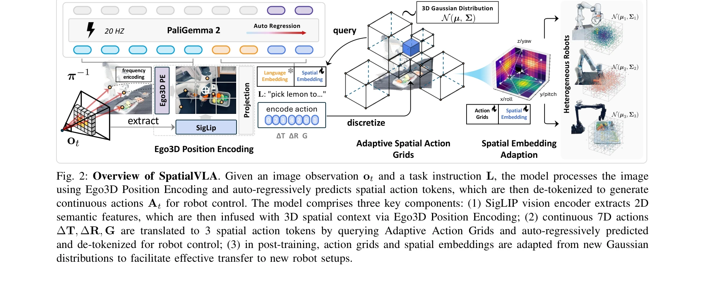
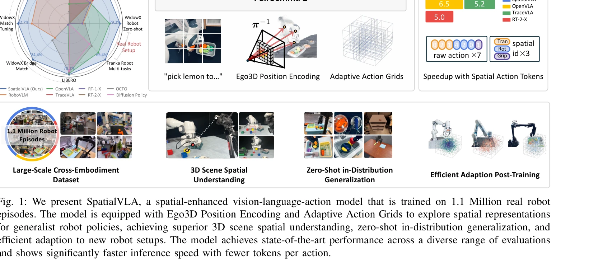

# SpatialVLA: Exploring Spatial Representations for Visual-Language-Action Model

> **저자**: Delin Qu, Haoming Song, Qizhi Chen, Yuanqi Yao, Xinyi Ye, Yan Ding, Zhigang Wang, JiaYuan Gu, Bin Zhao, Dong Wang, Xuelong Li | **날짜**: 2025-01-27 | **URL**: [https://arxiv.org/abs/2501.15830](https://arxiv.org/abs/2501.15830)

---

## Essence

*Fig. 2: Overview of SpatialVLA. Given an image observation ot and a task instruction L, the model processes the image*

로봇 조작을 위한 3D 공간 이해를 강화한 VLA 모델 SpatialVLA를 제안하며, Ego3D Position Encoding과 Adaptive Action Grids를 통해 이질적인 로봇 간 일반화 가능한 공간 표현을 학습한다.

## Motivation

- **Known**: 최근 Vision-Language-Action 모델들이 대규모 로봇 데이터셋으로 사전학습되어 다양한 로봇 조작 작업을 수행할 수 있으나, 기존 VLA 모델들은 2D 관찰에만 의존하고 3D 물리 환경에 대한 정확한 공간 이해가 부족하다.
- **Gap**: 이질적인 로봇 embodiment 간에 3D 공간 정렬이 이루어지지 않으며, 서로 다른 로봇의 행동 특성(자유도, 제어기, 작업공간)으로 인해 일반화 가능한 공간 행동 표현 학습이 어렵다.
- **Why**: 로봇 조작의 성공은 본질적으로 3D 공간 구조 이해에 달려있으며, 다양한 로봇 환경과 작업에 걸쳐 강력한 공간 지능을 갖춘 일반화 로봇 정책이 필요하다.
- **Approach**: Ego3D Position Encoding으로 2D 시각 특징에 3D 공간 정보를 주입하고, Adaptive Action Grids로 연속 로봇 행동을 적응적 이산화된 공간 격자로 표현하여 로봇 간 행동 공간을 통일한다.

## Achievement

*Fig. 1: We present SpatialVLA, a spatial-enhanced vision-language-action model that is trained on 1.1 Million real robot*

- **대규모 사전학습**: 110만 개의 실제 로봇 에피소드로 사전학습되어 다양한 로봇 환경과 작업에 걸쳐 일반화 가능한 조작 정책 학습
- **우수한 Zero-shot 성능**: 사전학습된 모델이 직접 다양한 작업을 zero-shot으로 수행 가능하며 우수한 복잡 로봇 궤적 추론 능력 시연
- **효율적인 적응**: Adaptive Action Grids의 재이산화를 통해 새로운 로봇 환경에 효율적으로 미세조정 가능
- **빠른 추론 속도**: 토큰당 공간 행동으로 인한 감소된 토큰 수로 20 Hz 이상의 빠른 추론 속도 달성
- **우수한 일반화 능력**: 시점/텍스처/조명 변화, 보지 못한 객체, 보지 못한 로봇 환경, 공간 배치 변화 등 다양한 시나리오에서 뛰어난 in-distribution 일반화 및 out-of-distribution 적응 능력

## How

*Fig. 2: Overview of SpatialVLA. Given an image observation ot and a task instruction L, the model processes the image*

- **Ego3D Position Encoding**: Egocentric 카메라 프레임에서 3D 위치 인코딩 도출으로 특정 로봇-카메라 캘리브레이션 불필요하고 다양한 로봇 embodiment에 보편 적용 가능
- **Adaptive Action Grids**: 전체 로봇 에피소드의 통계적 행동 분포에 따라 연속 7D 행동(Δ T, Δ R, G)을 3개의 공간 행동 토큰으로 이산화하고 이들에 대해 공간 행동 토큰 학습
- **Post-training 적응**: 새로운 로봇 환경의 Gaussian 분포로부터 행동 격자와 공간 임베딩을 적응적으로 재이산화하여 로봇 특화 공간 행동 학습
- **자동회귀 예측**: PaliGemma 2 기반 vision-language 모델에서 자동회귀 방식으로 공간 행동 토큰을 순차적으로 예측
- **Cross-embodiment 학습**: 1.1 Million의 다양한 로봇 에피소드로 다중 로봇 환경과 작업에 걸쳐 공간 정렬된 행동 표현 학습

## Originality

- **공간 표현의 체계적 설계**: Ego3D Position Encoding과 Adaptive Action Grids를 통해 관찰과 행동 양측에서 통합된 3D 공간 표현 제시로 기존 VLA 모델의 2D 한계 극복
- **로봇 무관 공간 정렬**: Egocentric 카메라 프레임 기반 접근으로 로봇 특화 캘리브레이션 없이 이질적 로봇 간 관찰 공간 정렬
- **적응적 행동 격자 재이산화**: 사전학습된 행동 격자를 새로운 로봇의 행동 분포에 따라 재이산화하는 유연한 적응 메커니즘 제안
- **대규모 Cross-embodiment 평가**: 24개의 실제 로봇 작업과 3개의 시뮬레이션 환경을 통한 광범위한 일반화 능력 검증

## Limitation & Further Study

- **카메라 의존성**: Ego3D Position Encoding이 egocentric 카메라 프레임에 의존하므로 카메라가 없는 로봇이나 다중 카메라 시스템에서의 적용 명확성 부족
- **이산화 해상도 제한**: Adaptive Action Grids의 이산화 해상도가 고정되어 매우 미세한 조작이 필요한 작업에서의 성능 제약 가능성
- **계산 효율성**: 110만 개 에피소드 사전학습에 필요한 계산 비용 상세 정보 부재
- **후속연구 방향**: 다중 모달리티 센서(힘 피드백, 촉각 정보) 통합, 더 복잡한 bimanual 조작, 동적 환경에서의 실시간 적응, 공간 표현의 이론적 분석 심화 필요

## Evaluation

- Novelty: 4/5
- Technical Soundness: 3/5
- Significance: 4/5
- Clarity: 4/5
- Overall: 4/5

**총평**: 본 논문은 VLA 모델에 체계적인 3D 공간 이해를 도입하고 이질적 로봇 간 일반화를 달성한 중요한 기여를 제시하며, 광범위한 실험을 통해 제안 방법의 효과를 입증했으나, 카메라 의존성과 이산화 해상도 제약 등의 한계가 존재한다.

## Related Papers

- 🏛 기반 연구: [[papers/1514_Perceiver-Actor_A_Multi-Task_Transformer_for_Robotic_Manipul/review]] — PerAct의 voxelized 3D 관찰이 SpatialVLA의 3D 공간 표현 학습의 기초 방법론을 제공한다.
- 🔗 후속 연구: [[papers/1291_3D-VLA_A_3D_Vision-Language-Action_Generative_World_Model/review]] — 3D-VLA의 3D vision-language-action model이 SpatialVLA의 공간 표현을 더 포괄적인 3D 생성 모델로 확장한다.
- 🔄 다른 접근: [[papers/1438_InternVLA-M1_A_Spatially_Guided_Vision-Language-Action_Frame/review]] — InternVLA-M1의 spatially guided framework와 SpatialVLA의 ego3D position encoding은 모두 VLA의 공간 이해를 위한 서로 다른 접근법이다.
- 🔗 후속 연구: [[papers/1514_Perceiver-Actor_A_Multi-Task_Transformer_for_Robotic_Manipul/review]] — SpatialVLA의 3D 공간 표현이 PerAct의 voxelized 3D 관찰을 더 일반화된 VLA 모델로 확장한다.
- 🔄 다른 접근: [[papers/1302_Adapt3R_Adaptive_3D_Scene_Representation_for_Domain_Transfer/review]] — SpatialVLA는 Adapt3R과 유사하게 공간 표현을 탐색하지만 Vision-Language-Action에 특화된 다른 방식을 사용한다
- 🏛 기반 연구: [[papers/1333_CLIPort_What_and_Where_Pathways_for_Robotic_Manipulation/review]] — SpatialVLA는 CLIPort의 공간적 표현을 Vision-Language-Action 모델로 확장하는 기반을 제공한다
- 🔄 다른 접근: [[papers/1383_EmbSpatial-Bench_Benchmarking_Spatial_Understanding_for_Embo/review]] — SpatialVLA도 vision-language-action에서 공간 표현 탐구를 다룬다.
- 🏛 기반 연구: [[papers/1491_NaVILA_Legged_Robot_Vision-Language-Action_Model_for_Navigat/review]] — 시각-언어-행동 모델의 공간적 표현이 legged 로봇 네비게이션의 기본 구조를 제공합니다.
