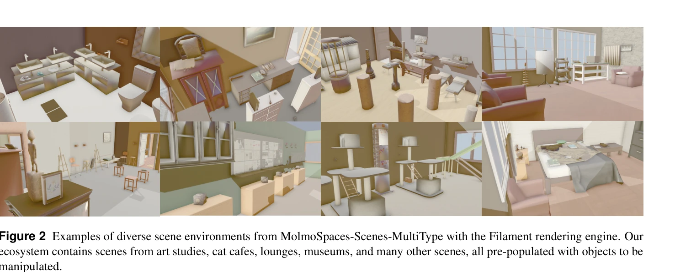

# MolmoSpaces: A Large-Scale Open Ecosystem for Robot Navigation and Manipulation

> **저자**: Yejin Kim, Wilbert Pumacay, Omar Rayyan, Max Argus, Winson Han, Eli VanderBilt, Jordi Salvador, Abhay Deshpande, Rose Hendrix, Snehal Jauhri, Shuo Liu, Nur Muhammad Mahi Shafiullah, Maya Guru, Ainaz Eftekhar, Karen Farley, Donovan Clay, Jiafei Duan, Arjun Guru, Piper Wolters, Alvaro Herrasti, Ying-Chun Lee, Georgia Chalvatzaki, Yuchen Cui, Ali Farhadi, Dieter Fox, Ranjay Krishna | **날짜**: 2026-02-11 | **URL**: [https://arxiv.org/abs/2602.11337](https://arxiv.org/abs/2602.11337)

---

## Essence

*Figure 1 MolmoSpaces is an open ecosystem consisting of a large number of simulation environments, 3D articulated object*

230k 이상의 다양한 실내 환경, 130k 개의 주석이 달린 객체 자산, 42M 그래프를 포함하는 대규모 개방형 로봇 시뮬레이션 생태계 MolmoSpaces를 제시하고, 이를 통해 로봇 네비게이션 및 조작 정책의 대규모 벤치마킹을 지원한다.

## Motivation

- **Known**: 기존 로봇 벤치마크는 장면 레이아웃, 객체 기하학, 작업 정의의 다양성이 부족하며, MuJoCo, Isaac, ManiSkill 등의 시뮬레이터들이 존재하지만 장면/객체 규모와 작업 다양성이 제한적이다.
- **Gap**: 실제 환경의 장기 꼬리 분포를 대표하는 규모와 다양성의 시뮬레이션 벤치마킹 인프라가 부재하며, 시뮬레이션 성능과 실제 성능의 강한 상관관계를 입증하는 대규모 에코시스템이 없다.
- **Why**: 일반적 로봇 정책의 성능을 측정하려면 수천 개의 다양한 환경과 객체에서의 평가가 필요하며, 물리 실험만으로는 이러한 규모의 엄밀한 평가를 수행할 수 없기 때문이다.
- **Approach**: AI2-THOR, ProcTHOR, Holodeck의 장면들을 통합하고 MuJoCo, IsaacSim, ManiSkill과 호환 가능한 대규모 시뮬레이션 에코시스템을 구축했으며, 8가지 기본 작업으로 구성된 MolmoSpaces-Bench 벤치마크를 설계했다.

## Achievement

*Figure 1 MolmoSpaces is an open ecosystem consisting of a large number of simulation environments, 3D articulated object*

- **대규모 에코시스템 구성**: 232k 실내 환경, 130k 객체 자산, 2.8k 객체 카테고리, 42M 안정적 그래프 제공
- **다중 시뮬레이터 호환성**: MuJoCo, IsaacSim, ManiSkill 간의 시뮬레이터 무관적 환경 지원
- **강한 Sim-to-Real 상관관계**: 피어슨 R = 0.96, 스피어만 ρ = 0.98의 높은 상관관계 입증
- **종합적 벤치마킹**: navigate-to, pick, pick-and-place 등 8가지 작업에서 최신 zero-shot 정책 평가
- **정책 민감도 분석**: 명령어 표현, 초기 관절 위치, 카메라 폐색에 대한 주요 민감성 식별
- **완전 개방형 에코시스템**: 자산, 코드, 벤치마킹 도구 모두 오픈소스로 제공

## How

*Figure 2 Examples of diverse scene environments from MolmoSpaces-Scenes-MultiType with the Filament rendering engine. Ou*

- AI2-THOR, ProcTHOR, Holodeck에서 수집한 다양한 장면들을 MuJoCo, IsaacSim, ManiSkill과 호환되도록 통합
- Objaverse와 GraspGen 기반의 대규모 객체 모델에 풍부한 의미론적 및 물리적 메타데이터 추가
- rigid 및 articulated 객체에 대한 전용 grasp 생성 파이프라인 구축
- navigate-to, pick, pick-and-place-color 등 8가지 기본 작업 정의 및 never-before-seen 환경에서 zero-shot 평가
- 실제 로봇 작업과의 상관관계 검증을 위해 object picking 작업에서 시뮬레이션-실제 성능 비교
- 명령어 표현, 초기 자세, 센서 입력 등의 파라미터를 체계적으로 변화시켜 정책 취약성 분석

## Originality

- 기존 벤치마크(RoboCasa, LIBERO, ManiSkill)와 달리 232k 환경으로 1,000배 이상 규모 확대하면서 동시에 다중 시뮬레이터 호환성 달성
- 42M 주석된 그래프를 제공하여 grasp 성공 평가의 ground-truth 감독 지원하는 최초 시도
- Sim-to-Real 상관관계를 정량적으로 입증한 대규모 연구로, 기존 연구들은 일반적인 가정에만 의존
- AI-생성 작업 정의와 스크립트된 데이터 생성 도구를 포함하여 커뮤니티 기반 확장 가능성 확보

## Limitation & Further Study

- 시뮬레이션-실제 간 강한 상관관계(R=0.96)를 보이지만 물리 재현의 완벽성 제약은 여전히 존재
- 다양한 명령어 표현과 초기 자세에 대한 정책 취약성을 식별했으나, 이러한 문제를 해결하기 위한 구체적 해법 제시 부족
- 현재 8가지 기본 작업에 중심이 있으며, 더 복잡한 장기 수평 조작 작업의 평가는 제한적
- 후속 연구는 (1) 식별된 취약성을 다루기 위한 더 다양한 학습 데이터 생성, (2) articulated 객체와의 상호작용 강화, (3) real-to-sim 전이학습 방법론 개발에 집중할 수 있음

## Evaluation

- Novelty: 4/5
- Technical Soundness: 3/5
- Significance: 4/5
- Clarity: 4/5
- Overall: 4/5

**총평**: MolmoSpaces는 기존 로봇 시뮬레이션 벤치마크를 규모와 다양성 측면에서 획기적으로 확장하면서도 강한 Sim-to-Real 상관관계를 입증하여, 로봇 학습 연구의 대규모 평가 및 데이터 생성을 위한 중요한 커뮤니티 인프라를 제공한다.

## Related Papers

- 🔄 다른 접근: [[papers/1508_Openfly_A_comprehensive_platform_for_aerial_vision-language/review]] — 둘 다 대규모 시뮬레이션 생태계를 제공하지만 1577은 실내 로봇 네비게이션에, 1508은 항공 VLN에 특화됨
- 🔗 후속 연구: [[papers/1469_ManiSkill3_GPU_Parallelized_Robotics_Simulation_and_Renderin/review]] — ManiSkill3의 GPU 시뮬레이션을 230k 환경과 42M 그래프로 확장하여 대규모 생태계를 구축함
- 🏛 기반 연구: [[papers/1420_Habitat_20_Training_Home_Assistants_to_Rearrange_their_Habit/review]] — Habitat 2.0의 가정용 보조 로봇 환경이 대규모 실내 로봇 시뮬레이션 생태계의 기반을 제공함
- 🔗 후속 연구: [[papers/1479_MoLe-VLA_Dynamic_Layer-skipping_Vision_Language_Action_Model/review]] — SpecPrune-VLA의 모델 가속화 기술과 MoLe-VLA의 동적 layer-skipping이 상호 보완적인 효율성 향상 방법이다.
- 🧪 응용 사례: [[papers/1483_MuBlE_MuJoCo_and_Blender_simulation_Environment_and_Benchmar/review]] — MolmoSpaces의 대규모 환경이 MuBlE의 시각-물리 통합 시뮬레이션의 실제 적용 사례를 보여줨
- 🏛 기반 연구: [[papers/1507_OpenBench_A_New_Benchmark_and_Baseline_for_Semantic_Navigati/review]] — MolmoSpaces의 대규모 개방형 로봇 네비게이션 생태계가 OpenBench 벤치마크의 기반 환경을 제공한다.
- 🔄 다른 접근: [[papers/1508_Openfly_A_comprehensive_platform_for_aerial_vision-language/review]] — 둘 다 대규모 시뮬레이션 환경을 제공하지만 1508은 항공 VLN에, 1577은 실내 로봇 네비게이션에 특화됨
- 🔗 후속 연구: [[papers/1329_CityNavAgent_Aerial_Vision-and-Language_Navigation_with_Hier/review]] — MolmoSpaces는 CityNavAgent의 공간 계획을 대규모 오픈 생태계로 확장한다
