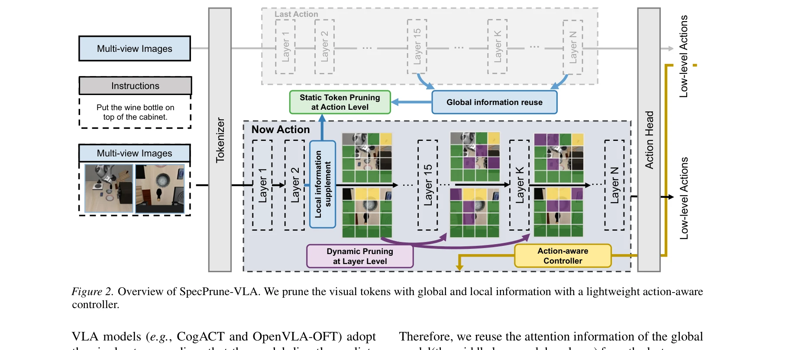
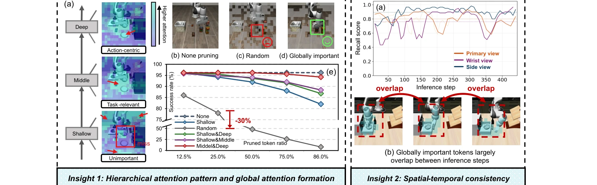

# SpecPrune-VLA: Accelerating Vision-Language-Action Models via Action-Aware Self-Speculative Pruning

> **저자**: Hanzhen Wang, Jiaming Xu, Yushun Xiang, Jiayi Pan, Yongkang Zhou, Yong-Lu Li, Guohao Dai | **날짜**: 2025-09-06 | **URL**: [https://arxiv.org/abs/2509.05614](https://arxiv.org/abs/2509.05614)

---

## Essence

*Figure 2. Overview of SpecPrune-VLA. We prune the visual tokens with global and local information with a lightweight act*

SpecPrune-VLA는 Vision-Language-Action 모델의 LLM 추론을 가속화하기 위해 시간-공간 일관성을 활용한 액션-인식 자체-추측 토큰 프루닝 기법을 제안한다. 두 단계 프루닝(액션 레벨 정적 프루닝과 레이어 레벨 동적 프루닝)과 액션-인식 컨트롤러를 통해 최대 1.70배 속도 향상을 달성한다.

## Motivation

- **Known**: 토큰 프루닝은 계산량이 많은 모델 가속의 전형적 기법이며, 최근 VLA 모델에 적용되기 시작했다. 기존 방법들은 현재 액션 단계의 로컬 정보만 고려하여 20% 이상의 성공률 하락을 초래하고 속도 향상이 제한적이다.
- **Gap**: 기존 VLA 가속 방법들은 로컬 정보만 활용하고 모델의 전역 문맥을 무시하여 성능 저하가 크다. 연속된 액션 생성 단계에서 입력 이미지의 높은 유사성이라는 VLA 특성을 활용하지 못하고 있다.
- **Why**: VLA 모델의 LLM이 전체 추론 시간의 70% 이상을 차지하는 병목으로, 이를 효과적으로 가속화하면 로봇의 실시간 성능을 크게 향상시킬 수 있다. 성공률 유지와 속도 향상의 균형을 맞추는 것이 실제 로봇 제어에 중요하다.
- **Approach**: 연속된 액션 생성 단계 간 입력 이미지의 높은 유사성(spatial-temporal consistency)을 활용하여 전역 정보와 로컬 정보를 결합한 토큰 선택 전략을 제안한다. 계층별 주의 패턴 분석을 통해 어떤 정보가 실제로 중요한지 파악하고, 이를 기반으로 두 단계 프루닝과 액션-인식 컨트롤러를 설계한다.

## Achievement

*Figure 3. Insight 1: (a) Layers of different depth focus on different information. (b)(c)(d) In pick and place task, ran*

- **액션 레벨 정적 프루닝**: 이전 생성 단계의 전역 주의 정보를 재사용하면서 프레임 비교와 자체-추측 토큰 선택으로 강화하여 LLM 포워드 초기에 60-70%의 시각 토큰 감소
- **레이어 레벨 동적 프루닝**: 각 깊이에서 토큰 중요도를 재평가하여 문맥 이해가 성숙함에 따라 계산을 적응적으로 정제하고 추가 20% 계산 감소
- **액션-인식 컨트롤러**: 엔드 이펙터 속도를 기반으로 액션을 coarse-grained와 fine-grained로 분류하여 프루닝 공격성을 적응적으로 조정
- **성능 달성**: LIBERO 시뮬레이션에서 OpenVLA-OFT 대비 최대 1.57배, π0 대비 1.31배 속도 향상, 실제 로봇 작업에서 1.70배 속도 향상, 무시할 수 있는 수준의 성공률 손실

## How

*Figure 2. Overview of SpecPrune-VLA. We prune the visual tokens with global and local information with a lightweight act*

- 계층별 주의 패턴 분석: 얕은 층은 배경과 관련 없는 영역, 중간 층은 의미있는 객체, 깊은 층은 액션-중심 토큰에 집중하는 패턴 발견
- 공간-시간 일관성 활용: 연속된 액션 생성 단계 간 전역 중요 토큰 집합의 높은 유사성(recall score) 확인
- 프레임 비교 전략: 현재 및 이전 프레임을 비교하여 동적 요소와 작업 관련 토큰 식별
- 자체-추측 토큰 선택: 모델의 얕은 층을 초안 생성, 깊은 층을 검증에 사용하는 speculative decoding 원리 적용
- 계층별 중요도 재평가: 각 깊이에서 토큰의 중요도 점수를 동적으로 업데이트하여 불필요한 토큰 제거
- 엔드 이펙터 속도 기반 분류: 액션의 속도(coarse vs fine-grained)를 판단하여 프루닝 강도 조정

## Originality

- VLA 모델의 spatial-temporal consistency를 처음으로 체계적으로 분석하고 활용한 프루닝 전략 제안
- 계층별 주의 패턴의 계층적 특성(shallow→broad, deep→action-centric)을 발견하고 이를 두 단계 프루닝에 통합
- self-speculative decoding 원리를 VLA 토큰 프루닝에 처음 적용하여 전역 정보 재사용 메커니즘 구현
- 액션 특성(엔드 이펙터 속도)을 프루닝 강도에 연결하는 액션-인식 컨트롤러로 작업 다양성에 대한 강건성 확보
- training-free 방식으로 OpenVLA-OFT와 π0 등 다양한 아키텍처에 적용 가능한 일반성 달성

## Limitation & Further Study

- LIBERO 시뮬레이션 환경에서의 검증이 주이며, 실제 로봇 작업은 제한된 수의 시나리오에서만 평가됨
- 프루닝 비율과 성능 간의 상세한 trade-off 분석 부족 (어느 정도의 프루닝이 최적인지 명확하지 않음)
- 다양한 VLA 아키텍처(RT-1, CogACT 등)에 대한 광범위한 적용성 검증 필요
- 액션-인식 컨트롤러의 엔드 이펙터 속도 임계값 설정이 작업/환경에 따라 다를 수 있는지 미검토
- 후속 연구: 더 정교한 액션 특성 기반 프루닝 전략, 강화학습을 활용한 프루닝 정책 학습, 다중 모달리티(촉각, 고정 카메라 등) 통합 고려

## Evaluation

- Novelty: 4/5
- Technical Soundness: 3/5
- Significance: 4/5
- Clarity: 4/5
- Overall: 4/5

**총평**: SpecPrune-VLA는 VLA 모델의 spatial-temporal consistency를 체계적으로 분석하고 이를 활용한 새로운 프루닝 방법을 제안하여 실질적인 속도 향상과 성능 유지를 동시에 달성했다. Training-free 방식의 일반성과 명확한 실험 검증이 강점이며, VLA 모델 최적화의 중요한 진전을 나타낸다.

## Related Papers

- 🔄 다른 접근: [[papers/1320_BitVLA_1-bit_Vision-Language-Action_Models_for_Robotics_Mani/review]] — VLA 모델 효율화의 다른 접근법으로 1비트 양자화와 토큰 프루닝의 성능-효율성 트레이드오프를 비교할 수 있다.
- 🔗 후속 연구: [[papers/1560_SARA-RT_Scaling_up_Robotics_Transformers_with_Self-Adaptive/review]] — Robotics Transformer의 효율적 배포에서 선형 주의 변환과 액션-인식 프루닝의 상호 보완적 최적화를 제공한다.
- 🏛 기반 연구: [[papers/1588_TinyVLA_Towards_Fast_Data-Efficient_Vision-Language-Action_M/review]] — 경량 VLA 모델의 빠른 추론에서 토큰 프루닝이 데이터 효율성과 함께 배포 성능을 최적화한다.
- 🔗 후속 연구: [[papers/1588_TinyVLA_Towards_Fast_Data-Efficient_Vision-Language-Action_M/review]] — 빠른 추론과 데이터 효율성에서 소형 VLA와 토큰 프루닝이 상호 보완적 최적화를 제공한다.
- ⚖️ 반론/비판: [[papers/1616_VLA-Adapter_An_Effective_Paradigm_for_Tiny-Scale_Vision-Lang/review]] — SpecPrune-VLA가 기존 모델 압축을, VLA-Adapter가 처음부터 경량 설계를 추구하는 대조적 효율화 전략이다
- 🏛 기반 연구: [[papers/1320_BitVLA_1-bit_Vision-Language-Action_Models_for_Robotics_Mani/review]] — SpecPrune-VLA의 pruning 기법이 BitVLA의 1-bit quantization과 함께 사용되어 더 효과적인 모델 압축을 달성할 수 있다.
- 🔄 다른 접근: [[papers/1363_Diffusion_Transformer_Policy/review]] — SpecPrune을 통한 VLA 모델 가속화가 diffusion transformer의 scaling 문제를 다른 관점에서 접근한다.
- 🔗 후속 연구: [[papers/1375_Efficient_Diffusion_Transformer_Policies_with_Mixture_of_Exp/review]] — SpecPrune의 VLA 가속화 기법이 MoDE의 효율적인 diffusion transformer 개념을 더욱 발전시킨다.
