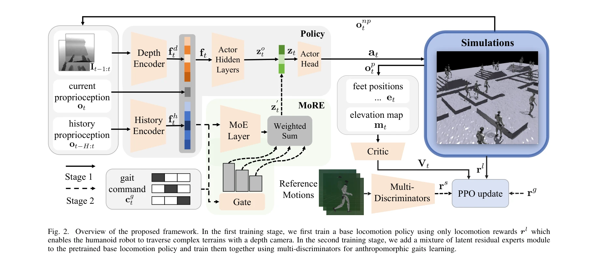
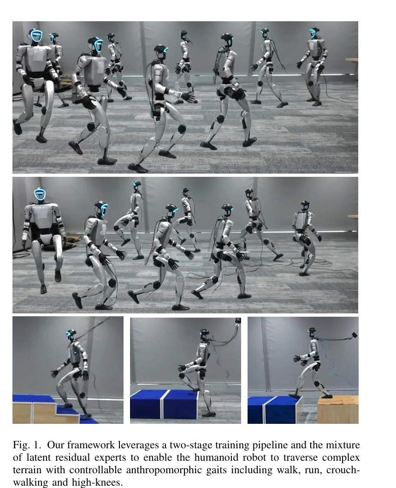

# MoRE: Mixture of Residual Experts for Humanoid Lifelike Gaits Learning on Complex Terrains

> **저자**: Dewei Wang, Xinmiao Wang, Xinzhe Liu, Jiyuan Shi, Yingnan Zhao, Chenjia Bai, Xuelong Li | **날짜**: 2025-06-10 | **URL**: [https://arxiv.org/abs/2506.08840](https://arxiv.org/abs/2506.08840)

---

## Essence

*Fig. 2.*

휴머노이드 로봇이 복잡한 지형을 인간답게 이동할 수 있도록 Mixture of Residual Experts (MoRE)와 다중 discriminator를 활용한 2단계 RL 학습 프레임워크를 제안한다.

## Motivation

- **Known**: RL 기반 휴머노이드 로봇은 강건한 이동 능력을 보이며, AMP(Adversarial Motion Prior)를 통해 인간답은 동작을 학습할 수 있다. 그러나 기존 방법들은 평탄한 지형과 고유감각(proprioception)에만 제한되어 있다.
- **Gap**: 기존 동작 모방 및 AMP 기반 방법들은 복잡한 지형 횡단 능력이 부족하고, 단일 참조 동작만 학습하며, 외부감각(exteroception) 센서를 활용하지 못해 다양한 지형 변화에 대응하기 어렵다.
- **Why**: 휴머노이드 로봇이 실제 환경에서 자율적으로 동작하려면 복잡한 지형 횡단 능력과 함께 인간답은 다양한 보행 패턴을 동시에 보유해야 하며, 이는 로봇 응용 분야의 실용성을 크게 높인다.
- **Approach**: 2단계 학습 파이프라인으로 먼저 깊이 카메라를 통해 복잡한 지형 횡단을 학습하고, 이후 Mixture of Experts 기반 residual module과 다중 discriminator를 활용하여 여러 인간답은 보행 패턴 간 전환을 가능하게 한다.

## Achievement

*Fig. 1. Our framework leverages a two-stage training pipeline and the mixture*

- **2단계 학습 패러다임**: 단일 정책으로 다중 보행 패턴 학습과 복잡한 지형 강건성을 동시에 달성
- **Residual Experts 아키텍처**: MoE 기반 구조로 보행 의존적 전환을 학습하고 다중 discriminator로부터 인간 동작 사전정보를 활용
- **전문화된 보행 보상**: 기저 높이 등 세밀한 행동 제어를 위한 보행별 맞춤형 보상 설계
- **실제 배포 검증**: Unitree G1 휴머노이드 로봇에서 걷기, 달리기, 웅크린 보행, 높은 무릎 들기 등 다양한 보행 패턴의 강건한 횡단 성능 입증

## How

*Fig. 2.*

- **Stage 1**: 깊이 카메라 입력과 proprioception만을 사용하여 기본 이동 정책을 학습하며, 복잡한 지형(계단, 슬로프, 갭 등)을 횡단할 수 있게 훈련
- **Stage 2**: Pretrained 정책에 MoE 기반 residual module을 추가하고, 보행 명령(gait command) 입력을 받아 expert 게이팅 네트워크가 가중 조합을 계산
- **다중 Discriminators**: 각 discriminator가 서로 다른 참조 동작에 대해 훈련되어 보행별 보상을 제공하며, 보행 명령에 따라 해당 discriminator 선택
- **Residual 정보 통합**: Residual module의 출력을 정책의 마지막 히든 레이어에 추가하여 이전 단계에서 습득한 이동 능력을 유지하면서 보행 특성 학습
- **보행별 보상 설계**: 기저 높이, 동작 추적, 안정성 등을 고려한 맞춤형 보상으로 다양한 인간답은 행동 특성 제어

## Originality

- Residual 학습과 MoE 구조를 결합하여 사전학습된 복잡 지형 정책을 유지하면서 다중 인간답은 보행을 학습하는 혁신적인 설계
- 다중 discriminator를 이용한 보행별 AMP 보상 메커니즘으로, 단일 참조 동작의 한계를 넘어 여러 보행 패턴 동시 학습 가능
- 2단계 파이프라인의 명확한 역할 분담: 지형 적응성(Stage 1)과 인간다움(Stage 2)의 상충을 효과적으로 해결
- 보행 명령 기반 동적 선택 메커니즘으로 seamless 전환 가능한 다중 보행 정책 구현

## Limitation & Further Study

- **실험 범위**: 시뮬레이션과 실제 배포가 단일 로봇(Unitree G1) 플랫폼에만 제한되어 다른 휴머노이드 구조에 대한 일반화 검증 부족
- **학습 데이터**: MoCap 데이터가 평탄한 지형의 동작만 제공하므로, 복잡한 지형에서의 인간다운 보행 기준이 명확하지 않음
- **계산 복잡도**: 다중 discriminator와 MoE 구조로 인한 학습 비용 및 배포 시 실시간 추론 성능 분석 미흡
- **후속 연구**: 다양한 로봇 형태와 더 복잡한 운동 능력(점프, 계단 오르기 중 회전 등)으로의 확장, 사용자 선호도 기반 보행 맞춤화, 도메인 임의화 범위 최적화

## Evaluation

- Novelty: 4/5
- Technical Soundness: 3/5
- Significance: 4/5
- Clarity: 4/5
- Overall: 4/5

**총평**: 본 논문은 복잡한 지형 횡단과 다중 인간답은 보행의 상충을 2단계 학습과 residual MoE 구조로 우아하게 해결한 창의적인 접근법을 제시하며, 실제 로봇 배포를 통해 검증한 강력한 연구다.

## Related Papers

- 🏛 기반 연구: [[papers/1267_AMP_Adversarial_Motion_Priors_for_Stylized_Physics-Based_Cha/review]] — 물리 기반 캐릭터 제어의 적대적 모션 사전 기법이 MoRE의 다중 전문가 학습 프레임워크의 이론적 기초를 제공합니다.
- 🔄 다른 접근: [[papers/1529_Learning_Humanoid_Locomotion_over_Challenging_Terrain/review]] — 도전적인 지형에서의 휴머노이드 보행 학습에 대해 잔여 전문가 혼합 방식과 다른 접근법을 제시합니다.
- 🔗 후속 연구: [[papers/1411_GR-RL_Going_Dexterous_and_Precise_for_Long-Horizon_Robotic_M/review]] — 복잡한 지형 탐색을 위한 복셀 그리드 기반 표현이 MoRE의 지형별 전문가 특화에 추가적인 공간 인식 능력을 제공할 수 있습니다.
- 🔄 다른 접근: [[papers/1410_Gait-Conditioned_Reinforcement_Learning_with_Multi-Phase_Cur/review]] — 둘 다 다양한 보행 모드를 다루지만 Gait-Conditioned는 명시적 조건화, MoRE는 residual expert 기반 접근을 사용한다.
- 🏛 기반 연구: [[papers/1538_RoboCerebra_A_Large-scale_Benchmark_for_Long-horizon_Robotic/review]] — SPRINT의 scalable policy pre-training이 RoboCerebra의 hierarchical planning-execution framework의 기초 방법론을 제공한다.
- 🔗 후속 연구: [[papers/1530_Learning_Humanoid_Navigation_from_Human_Data/review]] — SPRINT의 확장 가능한 사전학습 개념을 휴머노이드 내비게이션이라는 특수한 도메인에 구체적으로 적용한 발전된 형태임
- 🏛 기반 연구: [[papers/1535_Learning_Smooth_Humanoid_Locomotion_through_Lipschitz-Constr/review]] — 확장 가능한 정책 사전학습에서 제시된 평활성 제약 개념이 Lipschitz 제약을 통한 부드러운 locomotion 학습의 이론적 토대를 제공함
- 🏛 기반 연구: [[papers/1555_LHM-Humanoid_Learning_a_Unified_Policy_for_Long-Horizon_Huma/review]] — SPRINT의 확장 가능한 정책 사전학습 개념이 LHM-Humanoid의 장기간 통합 정책 학습에 이론적 토대를 제공함
