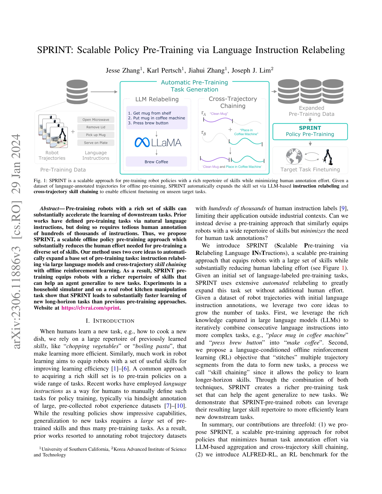
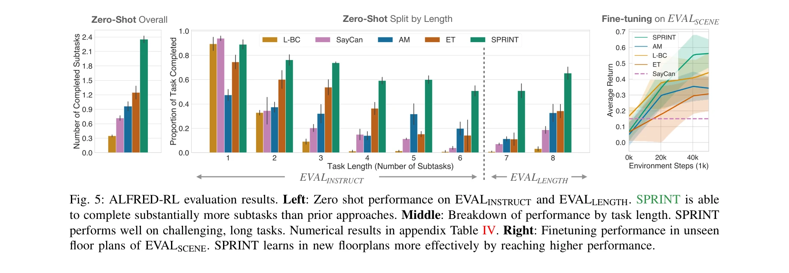
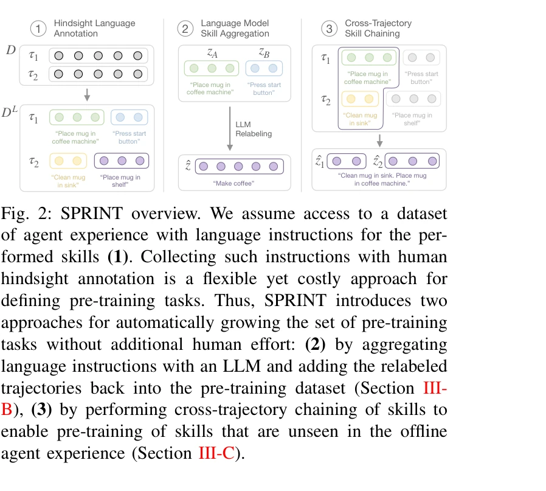

# SPRINT: Scalable Policy Pre-Training via Language Instruction Relabeling

> **저자**: Jesse Zhang, Karl Pertsch, Jiahui Zhang, Joseph J. Lim | **날짜**: 2023-06-20 | **URL**: [https://arxiv.org/abs/2306.11886](https://arxiv.org/abs/2306.11886)

---

## Essence

*Fig. 1: SPRINT is a scalable approach for pre-training robot policies with a rich repertoire of skills while minimizing *

SPRINT는 대규모 언어 모델(LLM)을 활용한 instruction relabeling과 offline RL 기반 cross-trajectory skill chaining을 통해 로봇 정책 사전학습을 위한 인간 주석 비용을 크게 줄이는 확장 가능한 접근법이다.

## Motivation

- **Known**: 기존 연구들은 자연어 instruction을 통해 로봇 정책을 사전학습하면 다운스트림 태스크 학습을 가속화할 수 있음을 보였으나, 수십만 개의 instruction을 수동으로 주석 처리해야 하는 문제가 있다.
- **Gap**: 자동화된 instruction 생성 방법들이 존재하지만 온라인 학습이나 손으로 정의한 문법 같은 확장성이 떨어지는 가정에 의존한다. 오프라인 환경에서 LLM을 활용한 scalable한 자동 instruction 생성 방법이 부족하다.
- **Why**: 로봇에게 더 풍부한 기술 레퍼토리를 제공하면 새로운 장기 지평 태스크를 더 효율적으로 학습할 수 있으며, 인간 주석 비용 감소는 산업 외 분야에서도 로봇 학습을 실용화할 수 있게 한다.
- **Approach**: SPRINT는 초기 language-annotated trajectory 데이터셋으로부터 시작하여 LLM 기반 instruction 집계와 offline RL 기반 skill chaining을 통해 자동으로 사전학습 태스크 집합을 확장한 후, 확장된 데이터로 instruction-conditioned 정책을 학습한다.

## Achievement

*Fig. 5: ALFRED-RL evaluation results. Left: Zero shot performance on EVALINSTRUCT and EVALLENGTH. SPRINT is able*

- **자동 instruction 생성**: LLM을 활용한 consecutive instruction 집계로 복합 태스크 자동 생성
- **Cross-trajectory skill chaining**: Offline RL 기반 여러 궤적의 기술 조합으로 학습 데이터에 없는 새로운 조합 기술 생성
- **ALFRED-RL 벤치마크**: 장기 지평 가사 작업 평가를 위한 RL 벤치마크 제시
- **우수한 성능**: ALFRED 시뮬레이터 및 실제 로봇 주방 조작 태스크에서 기존 사전학습 방법 대비 다운스트림 태스크 학습 효율성 향상

## How

*Fig. 2: SPRINT overview. We assume access to a dataset*

- Instruction-conditioned offline RL: 자연어 task description z가 주어졌을 때 π(a|s, z)를 학습하도록 보상 설계
- Language model instruction aggregation: LLaMA 같은 대규모 언어 모델을 통해 연속된 instruction을 더 복잡한 상위 레벨 instruction으로 결합
- Cross-trajectory skill chaining: 다양한 궤적 세그먼트를 stitching하여 데이터셋에 없는 새로운 기술 조합 생성
- 반복적 확장: 생성된 새로운 instruction들을 사전학습 데이터셋에 다시 추가하여 점진적으로 기술 다양성 증대

## Originality

- LLM 기반 instruction 집계를 사용한 새로운 자동 데이터 증강 방향 제시
- Language-conditioned offline RL을 통한 cross-trajectory skill chaining 목적함수 제안 (기존 무작위 상태 선택 방식 대비 의미있는 조합)
- Instruction 수준의 skill 표현으로 unsupervised 방법 대비 더 의미있는 기술 학습 가능
- ALFRED-RL 벤치마크로 구조화된 평가 환경 제공

## Limitation & Further Study

- LLM 기반 instruction 생성의 품질이 LLM의 성능에 의존하며, 생성된 instruction이 실제 가능한 기술인지 검증 메커니즘 부족
- Skill chaining이 항상 타당한 결과를 생성하는지 명확하지 않음 (예: 두 개의 연결되지 않은 기술의 조합)
- 실험이 ALFRED 시뮬레이터와 제한된 실제 로봇 환경에서만 수행되어 다양한 도메인으로의 일반화 가능성 미확인
- 계산 비용 분석 및 LLM 호출 횟수에 대한 실질적 논의 부족
- **후속 연구**: (1) 생성된 instruction의 실행 가능성 자동 검증 메커니즘 개발, (2) 더 다양한 로봇 도메인과 환경에서의 평가, (3) 기술 체인 합성 시 인과 관계 및 순서 제약 고려

## Evaluation

- Novelty: 4/5
- Technical Soundness: 3/5
- Significance: 4/5
- Clarity: 4/5
- Overall: 4/5

**총평**: SPRINT는 LLM과 offline RL을 창의적으로 결합하여 로봇 정책 사전학습의 인간 주석 비용을 획기적으로 감소시키는 실질적이고 확장 가능한 방법을 제시한다. 실험 결과도 우수하나, 생성된 instruction의 품질 보증과 다양한 도메인에서의 검증이 추가되면 더욱 강력한 기여가 될 것이다.

## Related Papers

- 🔄 다른 접근: [[papers/1534_RoboAgent_Generalization_and_Efficiency_in_Robot_Manipulatio/review]] — 로봇 정책 효율적 학습에서 SPRINT의 instruction relabeling과 RoboAgent의 semantic augmentation 방식을 인간 주석 비용 절감 측면에서 비교할 수 있다.
- 🔗 후속 연구: [[papers/1566_Scaling_Up_and_Distilling_Down_Language-Guided_Robot_Skill_A/review]] — 언어 가이드 로봇 스킬 증류 방법론을 SPRINT의 cross-trajectory skill chaining에 통합하여 더 복잡한 스킬 조합을 학습할 수 있다.
- 🏛 기반 연구: [[papers/1348_Data_Scaling_Laws_in_Imitation_Learning_for_Robotic_Manipula/review]] — 로봇 모방 학습에서 데이터 스케일링 법칙 연구가 SPRINT의 대규모 정책 사전학습에서 데이터 효율성의 이론적 기반을 제공한다.
- 🧪 응용 사례: [[papers/1513_Parallels_Between_VLA_Model_Post-Training_and_Human_Motor_Le/review]] — VLA 모델의 사후 훈련과 인간 운동 학습의 유사성 연구를 SPRINT의 offline RL 기반 사전학습 방법론과 연결하여 더 효과적인 학습 전략을 개발할 수 있다.
- 🔄 다른 접근: [[papers/1534_RoboAgent_Generalization_and_Efficiency_in_Robot_Manipulatio/review]] — 로봇 정책 사전학습에서 RoboAgent의 semantic augmentation 방식과 SPRINT의 instruction relabeling 방식을 효율성 측면에서 비교할 수 있다.
- 🏛 기반 연구: [[papers/1566_Scaling_Up_and_Distilling_Down_Language-Guided_Robot_Skill_A/review]] — SPRINT의 대규모 정책 사전학습과 instruction relabeling 방법론이 언어 가이드 로봇 스킬 확장 및 증류에 이론적 기반을 제공한다.
