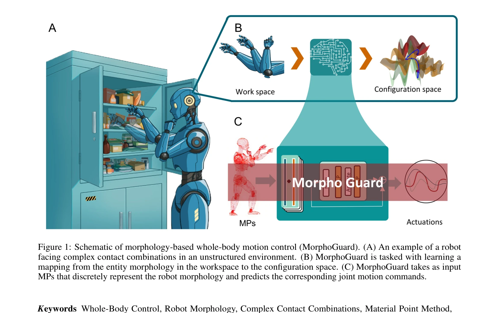
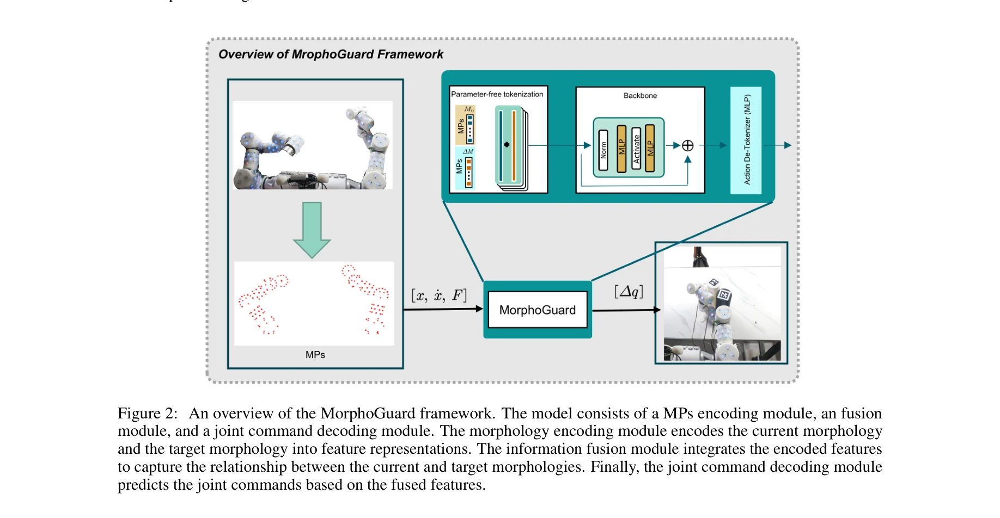

# MorphoGuard: A Morphology-Based Whole-Body Interactive Motion Controller

> **저자**:  | **날짜**: 2026-04-02 | **URL**: [https://arxiv.org/abs/2604.01517](https://arxiv.org/abs/2604.01517)

---

## Essence

*Figure 1: Schematic of morphology-based whole-body motion control (MorphoGuard). (A) An example of a robot*

로봇의 형태학적 표현을 기반으로 전신 제어를 수행하는 MorphoGuard를 제안하며, Material Point Method를 활용한 encoder-decoder 신경망으로 복잡한 다중 접촉 조합을 관리한다.

## Motivation

- **Known**: Whole-Body Control(WBC)은 고차원 로봇 시스템의 운동 조율을 개선할 수 있으며, 기존 학습 기반 방법들은 주로 다중 운동 체인의 끝점 최적화에 집중해왔다.
- **Gap**: 단일 운동 체인을 따라 동적 다중 접촉 조합(예: 팔꿈치로 문을 밀며 손으로 물체 파지)을 관리하는 연구는 제한적이며, 복합 접촉 표현과 관절 구성 결합 문제가 미해결 상태이다.
- **Why**: 일상적 과제에서 신체의 여러 부위를 협력하여 사용해야 하는 상황이 빈번하므로, 로봇이 임의의 신체 위치에서의 접촉을 명시적으로 관리할 수 있는 능력이 필수적이다.
- **Approach**: 로봇 형태를 Material Points(MPs)로 이산화하고 electronic skin과 바인딩하여 상호작용 자극을 캡처하며, encoder-decoder 구조로 현재 형태에서 목표 형태로의 매핑을 학습한다.

## Achievement

*Figure 2: An overview of the MorphoGuard framework. The model consists of a MPs encoding module, an fusion*

- **형태학적 표현 기반 제어**: Material Point Method를 로봇 형태 표현에 확장하여 시공간 일관성 있는 형태 표현 달성
- **다중 접촉 관리**: 단일 운동 체인 상의 임의의 접촉 조합을 명시적으로 처리하는 역기구학 매핑 구성
- **높은 정확도**: 약 1 cm의 접촉점 관리 오차와 0.5의 관절 제어 오차 달성
- **대규모 데이터셋**: 1.3M 학습 샘플을 포함한 이중팔 물리 및 시뮬레이션 플랫폼 구축

## How

*Figure 2: An overview of the MorphoGuard framework. The model consists of a MPs encoding module, an fusion*

- Material Points를 고정 위상 관계를 유지하는 유한 집합으로 로봇 형태를 공간 이산화
- Electronic skin을 MPs에 바인딩하여 상호작용 자극 신호 캡처
- Encoder 모듈로 현재 및 목표 형태를 특징 표현으로 인코딩
- Fusion 모듈로 인코딩된 특징들을 통합하여 형태 간 관계 포착
- Decoder 모듈로 융합된 특징으로부터 관절 명령 예측
- 이중팔 로봇을 통제된 관절 구성으로 추적시켜 형태-경계 조건 데이터 쌍 수집
- Backbone 아키텍처, fusion 전략, 모델 크기의 영향 체계적으로 조사

## Originality

- 단일 운동 체인 상의 복잡한 다중 접촉 조합을 명시적으로 처리하는 첫 시도
- Material Point Method를 로봇 형태 표현에 적용한 새로운 접근법
- 형태학적 일관성을 통해 관절 구성 결합 문제를 우회하는 혁신적 해결책
- Electronic skin과 MPs의 결합을 통한 상호작용 인지 모델링

## Limitation & Further Study

- 평가가 시뮬레이션 및 제한된 실제 환경에서만 수행되어 현실 환경 일반화 능력 검증 필요
- 1.3M 샘플의 광범위 데이터 수집이 필요하여 다른 로봇 플랫폼으로의 확장성 제한
- Electronic skin 장착의 구현 복잡성과 비용 문제가 실제 적용 시 고려 필요
- 후속 연구에서는 도메인 적응 기법이나 자기 지도 학습으로 데이터 효율성 개선 필요
- 다양한 로봇 형태에 대한 전이 학습 가능성 탐구 권장

## Evaluation

- Novelty: 4/5
- Technical Soundness: 4/5
- Significance: 4/5
- Clarity: 4/5
- Overall: 4/5

**총평**: MorphoGuard는 형태학적 표현을 기반으로 복잡한 다중 접촉 제어를 명시적으로 처리하는 혁신적 접근법을 제시하며, Material Point Method의 창의적 활용과 체계적인 실험을 통해 전신 로봇 제어 분야에 의미 있는 기여를 한다.

## Related Papers

- 🏛 기반 연구: [[papers/1313_Aspects_of_entanglement_with_background_electric_and_magneti/review]] — GPU 병렬화된 해석적 접촉 물리 엔진이 MorphoGuard의 복잡한 다중 접촉 시뮬레이션을 위한 효율적인 계산 기반을 제공합니다.
- 🔄 다른 접근: [[papers/1316_Contact-Aided_Invariant_Extended_Kalman_Filtering_for_Robot/review]] — 접촉 상태 추정을 위한 불변 확장 칼만 필터링 방식과 MPM 기반 신경망 접근법이 서로 다른 접촉 모델링 철학을 보여줍니다.
- 🔗 후속 연구: [[papers/1424_Geometry-Aware_Predictive_Safety_Filters_on_Humanoids_From_P/review]] — 기하학적 안전 필터가 형태학적 제어의 안전성을 보장하는 추가적인 레이어로 작용할 수 있습니다.
