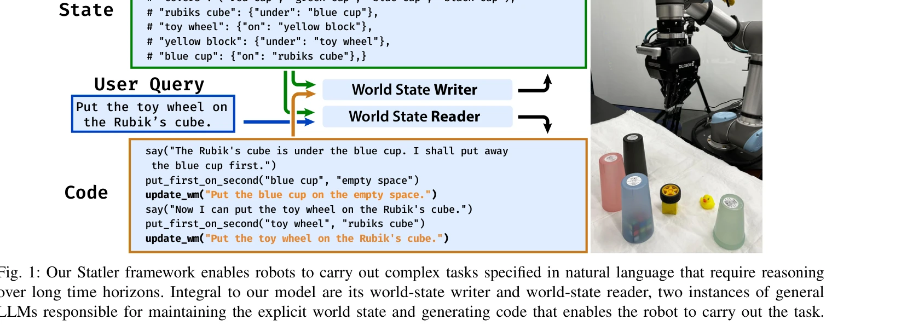
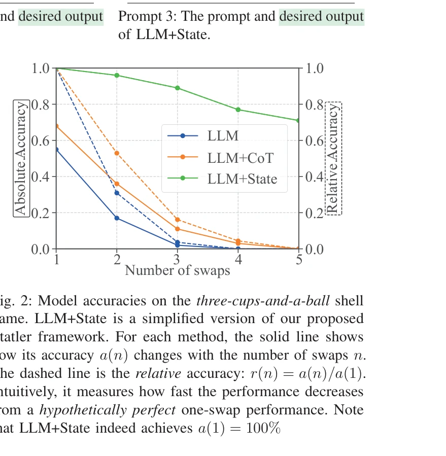

# Statler: State-Maintaining Language Models for Embodied Reasoning

> **저자**: Takuma Yoneda, Jiading Fang, Peng Li, Huanyu Zhang, Tianchong Jiang, Shengjie Lin, Ben Picker, David Yunis, Hongyuan Mei, Matthew R. Walter | **날짜**: 2023-06-30 | **URL**: [https://arxiv.org/abs/2306.17840](https://arxiv.org/abs/2306.17840)

---

## Essence

*Fig. 1: Our Statler framework enables robots to carry out complex tasks specified in natural language that require reaso*

Statler는 로봇 계획 작업에서 LLM이 세계 상태를 명시적으로 유지하고 추적하도록 하는 모델 기반 프레임워크로, 상태 기반 의사결정을 통해 장기 계획 능력을 향상시킨다.

## Motivation

- **Known**: 기존 LLM 기반 로보틱스 연구는 LLM을 정책 함수로 사용하여 과거 행동과 관찰만을 조건으로 미래 행동을 생성하는 모델 프리 접근법에 초점을 맞추어왔다.
- **Gap**: LLM이 장기 계획 작업에서 암묵적으로 세계 상태를 유지하기 어렵다는 문제와, 관찰 불가능한 잠재 동역학을 다루는 방법이 부족하다.
- **Why**: 명시적 세계 상태 추적은 부분 관찰성 문제 해결, 장기 계획 스케일링, 그리고 더 정보에 기반한 의사결정을 가능하게 하여 로봇의 복잡한 추론 능력을 대폭 향상시킨다.
- **Approach**: Statler는 world-state reader와 world-state writer 두 개의 prompted LLM으로 구성되어, reader가 현재 상태를 읽고 행동을 생성하면 writer가 행동에 따른 상태 전이를 업데이트하는 방식으로 작동한다.

## Achievement

*Fig. 2: Model accuracies on the three-cups-and-a-ball shell*

- **세계 상태 유지의 효과성**: 삼개-컵-공 게임에서 LLM+State 방식이 기존 LLM과 Chain-of-Thought 방법보다 현저히 높은 정확도를 달성하며, 스왑 횟수가 증가할수록 성능 격차가 확대됨
- **Code-as-Policies 대비 성능 향상**: 로봇 시뮬레이션 작업에서 Statler가 Code-as-Policies 같은 강력한 기존 방법들을 크게 능가함
- **확장 가능성**: 명시적 상태 유지로 인해 장기 계획 작업으로의 확장 잠재력을 보여줌
- **일반성**: 프롬프트가 도메인 불가지론적(domain-agnostic)으로 설계되어 다양한 분야에 적용 가능

## How

*Fig. 1: Our Statler framework enables robots to carry out complex tasks specified in natural language that require reaso*

- 초기 상태를 JSON 형식의 객체 지향 표현으로 정의
- world-state reader가 사용자 쿼리와 현재 상태를 입력받아 실행 가능한 코드(예: 파이썬 스니펫) 생성
- 생성된 코드에 update_wm 함수 호출을 포함시켜 상태 업데이트 필요 신호
- world-state writer가 수행된 행동 정보를 입력받아 새로운 세계 상태로 업데이트
- 각 구성요소에 대해 시연(demonstration) 기반 프롬프팅으로 LLM 유도
- Code-as-Policies의 계층적 코드 생성 능력을 유지하면서 상태 추적 메커니즘 추가

## Originality

- 기존 모델 프리 접근법과 달리 LLM 기반 로보틱스에 모델 기반 패러다임 도입
- 고전적 모델 기반 강화학습의 개념을 LLM의 상식 지식과 결합한 새로운 프레임워크
- LLM을 환경 모델로 활용하여 암묵적 상태 유지 어려움을 명시적 상태 추적으로 해결하는 창의적 설계
- symbolic world state tracking과 LLM의 유연성을 결합한 hybrid 접근

## Limitation & Further Study

- 세계 상태 추정이 완벽하지 않을 수 있으며, 복잡한 환경에서 상태 표현의 정확성 검증 부족
- JSON 기반 상태 표현이 모든 도메인에 적합한지에 대한 명확한 논의 미흡
- 실제 로봇 환경에서의 성능 평가 (현재는 주로 시뮬레이션에 기반)
- 대규모 복잡 도메인에서 프롬프트 설계 및 관리 작업량에 대한 분석 부재
- 후속 연구로 더 표현력 있는 상태 표현 방식 탐색, 부분 관찰성을 명시적으로 다루는 확률적 상태 추정, 실제 로봇 하드웨어에서의 검증이 필요

## Evaluation

- Novelty: 4/5
- Technical Soundness: 3/5
- Significance: 4/5
- Clarity: 4/5
- Overall: 4/5

**총평**: Statler는 LLM 기반 로봇 계획에 모델 기반 접근을 도입한 참신한 프레임워크로, 간단하면서도 효과적인 설계로 장기 계획 문제에서 강력한 성능 향상을 보여준다. 다만 실제 로봇 환경에서의 검증과 복잡 도메인 적응성에 대한 추가 연구가 필요하다.

## Related Papers

- 🏛 기반 연구: [[papers/1631_World_Models/review]] — Statler의 상태 추적 메커니즘이 World Models의 환경 상태 모델링 아이디어에서 발전된 형태로 볼 수 있음
- 🔄 다른 접근: [[papers/1459_LLM-State_Open_World_State_Representation_for_Long-horizon_T/review]] — 로봇의 상태 관리를 위해 Statler는 명시적 상태 추적을, LLM-State는 개방형 세계 상태 표현을 사용하는 서로 다른 접근법
- 🧪 응용 사례: [[papers/1312_ARNOLD_A_Benchmark_for_Language-Grounded_Task_Learning_With/review]] — Statler의 상태 기반 계획이 ARNOLD 벤치마크의 언어 기반 작업 학습 시나리오에 적용 가능
- 🔄 다른 접근: [[papers/1459_LLM-State_Open_World_State_Representation_for_Long-horizon_T/review]] — 두 논문 모두 상태 유지형 언어 모델을 다루지만, 하나는 객체 중심 표현에, 다른 하나는 체화된 추론에 집중합니다.
- 🔄 다른 접근: [[papers/1553_RoBridge_A_Hierarchical_Architecture_Bridging_Cognition_and/review]] — Statler의 state-maintaining language models와 RoBridge의 hierarchical architecture는 모두 embodied reasoning을 위한 서로 다른 구조적 접근법이다.
- 🔗 후속 연구: [[papers/1631_World_Models/review]] — World Models의 환경 생성 모델링이 Statler의 명시적 상태 유지 메커니즘의 이론적 기반을 제공하며 함께 읽으면 상태 기반 계획의 전체 스펙트럼을 이해할 수 있음
