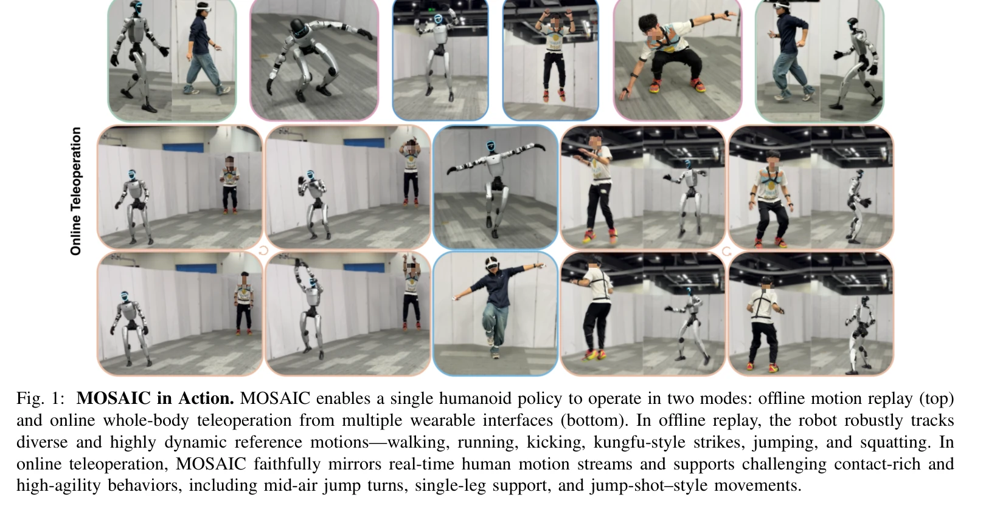
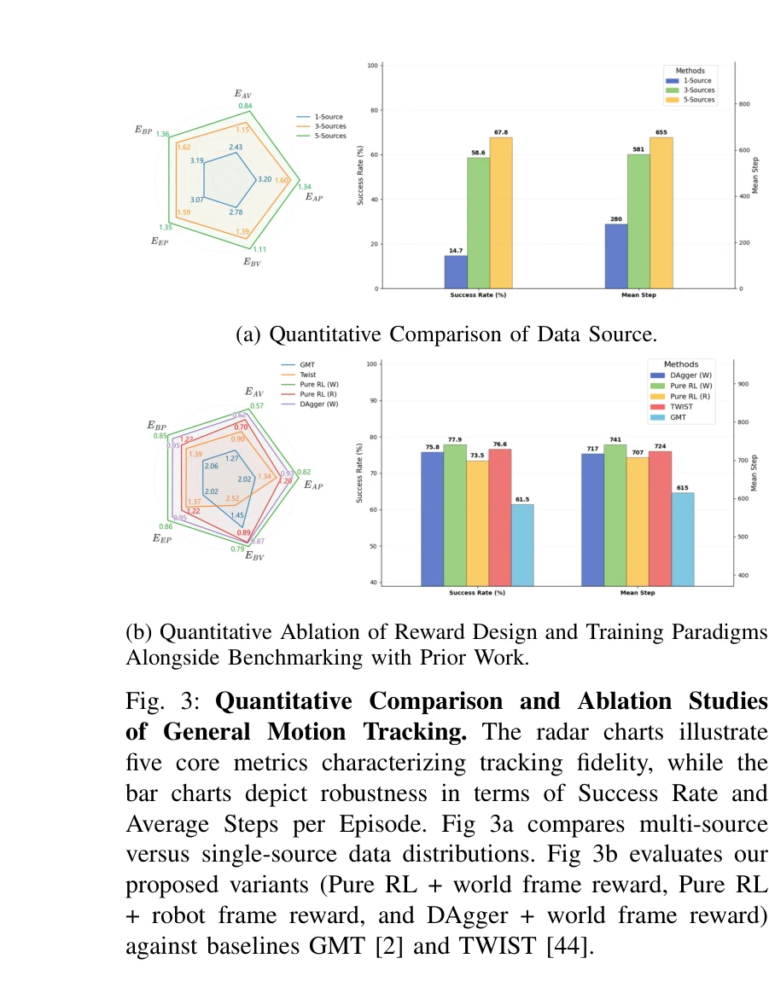

# MOSAIC: Bridging the Sim-to-Real Gap in Generalist Humanoid Motion Tracking and Teleoperation with Rapid Residual Adaptation

> **저자**: Zhenguo Sun, Bo-Sheng Huang, Yibo Peng, Xukun Li, Jingyu Ma, Yu Sun, Zhe Li, Haojun Jiang, Biao Gao, Zhenshan Bing, Xinlong Wang, Alois Knoll | **날짜**: 2026-02-11 | **DOI**: [10.48550/arXiv.2602.08594](https://doi.org/10.48550/arXiv.2602.08594)

---

## Essence

*Fig. 1: MOSAIC in Action. MOSAIC enables a single humanoid policy to operate in two modes: offline motion replay (top)*

MOSAIC는 강화학습으로 학습한 일반화된 인간형 로봇 동작 추적 정책과 rapid residual adaptation을 통해 시뮬레이션과 실제 로봇 간의 갭을 줄이는 통합 텔레오퍼레이션 시스템이다.

## Motivation

- **Known**: 최근 generalist humanoid motion tracker들이 데이터와 학습 스케일링을 통해 시뮬레이션 메트릭에서 강한 성능을 달성했으나, 실제 하드웨어에서 지속적인 텔레오퍼레이션 시 인터페이스와 dynamics 오류로 인해 취약성이 드러난다.
- **Gap**: 강한 시뮬레이션 추적 메트릭이 실제 로봇 성능으로 안정적으로 전환되지 않으며, 다양한 텔레오퍼레이션 인터페이스(IMU MoCap, VR tracker 등)의 latency, noise, retargeting bias 차이로 인해 장시간 로코모션 실패가 발생한다.
- **Why**: 인간형 로봇의 텔레오퍼레이션은 실시간 모션 추적의 안정성과 일반성이 모두 필수이며, 실제 배포 시 분 단위의 지속적인 추적 성능과 다양한 인터페이스 지원이 요구된다.
- **Approach**: 먼저 adaptive resampling과 world-frame motion consistency를 강조하는 RL 보상 함수로 일반화된 motion tracker를 학습한 후, 최소한의 인터페이스 특화 데이터로 학습한 정책을 residual correction module을 통해 증류하여 일반성을 유지하면서 빠른 적응을 실현한다.

## Achievement

*Fig. 3: Quantitative Comparison and Ablation Studies*

- **통합 시스템 구축**: 오프라인 동작 재생과 온라인 텔레오퍼레이션을 단일 정책으로 지원하며, 실제 로봇에서 분 단위의 안정적인 추적과 복잡한 contact-rich 행동(점프 턴, 한다리 지탱, 점프 슈팅 등)을 달성
- **Rapid residual adaptation**: ~30분의 인터페이스 특화 데이터로 새로운 텔레오퍼레이션 인터페이스에 빠르게 적응하며, naive fine-tuning이나 continual learning보다 우수한 성능
- **Teleoperation-oriented 학습**: global motion consistency를 명시적으로 강조하는 RL 보상 함수로 mobile teleoperation에 최적화된 추적기 학습
- **RobotBridge 배포 프레임워크**: motion reference, policy execution, simulator/robot backend, low-level controller 간의 인터페이스를 표준화하여 여러 로봇 플랫폼 간 이식성 제공
- **광범위한 검증**: systematic ablation, out-of-distribution benchmarking, 실제 로봇 실험으로 realistic latency와 noise 조건에서의 성능 검증
- **오픈소스 리소스**: 학습/배포/데이터수집 파이프라인, multi-source motion dataset, 사전학습 모델 체크포인트 공개

## How

*Fig. 2: MOSAIC System Overview. MOSAIC consists of a unified training–deployment pipeline for humanoid motion tracking*

- Multi-source motion bank에서 adaptive resampling strategy를 사용하여 데이터 불균형 완화
- World-frame position tracking, velocity tracking, contact stability 등을 포함하는 teleoperation-oriented 보상 함수 설계
- 일반화된 motion tracker 위에 interface-specific adaptation policy를 학습한 후, residual module을 통해 증류하여 plug-in 방식의 적응 구현
- RobotBridge를 통해 정책 실행, 시뮬레이터, 로봇 SDK, 저수준 컨트롤러 간의 일관된 인터페이스 제공
- 시뮬레이션에서 실제 로봇으로의 일관된 평가 파이프라인 구축

## Originality

- Teleoperation 성능을 최적화하는 RL 보상 함수 설계로, world-frame motion consistency를 명시적으로 강조하는 새로운 관점 제시
- Residual correction module을 통한 lightweight adaptation 방식으로, fine-tuning보다 일반성을 더 잘 보존하는 증류 전략
- Multi-source heterogeneous motion data를 처리하기 위한 adaptive resampling 기법과 stage-wise training 파이프라인
- 통합된 오프라인/온라인 평가와 배포를 위한 RobotBridge 프레임워크로 재현성과 이식성 향상
- 분 단위의 실제 인간형 로봇 텔레오퍼레이션 결과를 보여주며 시뮬레이션-실제 로봇 갭의 실질적 해결 제시

## Limitation & Further Study

- Residual adaptation이 ~30분의 데이터를 필요로 하므로, 초저용량(few-shot) 적응 설정에서의 성능은 명확하지 않음
- 다양한 인간형 로봇 플랫폼(다리 자유도, 구동 방식 등의 차이)에 대한 적응성과 전이 성능의 정량적 평가 부족
- Latency와 noise의 구체적인 범위(예: 100ms vs 500ms, noise 표준편차 범위)에 대한 상세한 성능 분석 부족
- 다른 최신 adaptation 방법(RMA, parameter-efficient fine-tuning 등)과의 직접적인 정량 비교 제한
- Contact-rich 동작에서의 안정성 한계와 미끄러짐(drift) 발생 조건에 대한 분석 필요

## Evaluation

- Novelty: 4/5
- Technical Soundness: 4/5
- Significance: 4/5
- Clarity: 4/5
- Overall: 4/5

**총평**: MOSAIC는 실제 배포에 초점을 맞춰 일반성과 적응성을 모두 확보한 인간형 로봇 텔레오퍼레이션 시스템으로, residual adaptation, teleoperation-oriented 학습, RobotBridge 프레임워크를 통해 시뮬레이션-현실 갭을 효과적으로 줄인다. 분 단위의 실제 로봇 실험 검증과 완전한 오픈소스 리소스 공개로 높은 재현성과 실용성을 제공한다.

## Related Papers

- 🏛 기반 연구: [[papers/1345_CoWs_on_Pasture_Baselines_and_Benchmarks_for_Language-Driven/review]] — 크로스 플랫폼 VLA 모델 스케일링 기법이 MOSAIC의 일반화된 휴머노이드 정책 학습을 위한 방법론적 기초를 제공합니다.
- 🔄 다른 접근: [[papers/1599_Opening_the_Sim-to-Real_Door_for_Humanoid_Pixel-to-Action_Po/review]] — 픽셀-투-액션 정책의 심-투-리얼 적용에서 rapid residual adaptation과 다른 도메인 적응 접근법을 제시합니다.
- 🔗 후속 연구: [[papers/1433_H-Zero_Cross-Humanoid_Locomotion_Pretraining_Enables_Few-sho/review]] — 크로스 휴머노이드 사전학습이 MOSAIC의 일반화 능력을 다양한 형태의 휴머노이드로 확장할 수 있는 가능성을 보여줍니다.
- 🏛 기반 연구: [[papers/1309_CLOT_Closed-Loop_Global_Motion_Tracking_for_Whole-Body_Human/review]] — MOSAIC의 sim-to-real 전이에 RSR 루프의 점진적 개선 방법론을 활용한다
- 🔗 후속 연구: [[papers/1429_HybridVLA_Collaborative_Diffusion_and_Autoregression_in_a_Un/review]] — Streaming Flow Policy의 단순화된 diffusion 접근법과 HybridVLA의 복합적 접근법이 상호 보완적이다.
- 🏛 기반 연구: [[papers/1431_Impact_of_Static_Friction_on_Sim2Real_in_Robotic_Reinforceme/review]] — Static friction-aware domain randomization은 MOSAIC의 sim-to-real gap 해결 방법론과 밀접한 관련이 있다.
