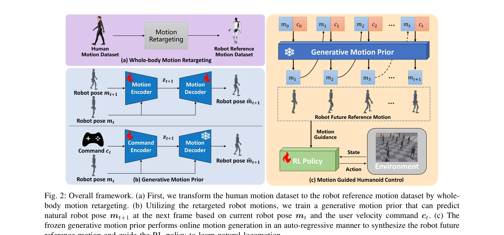
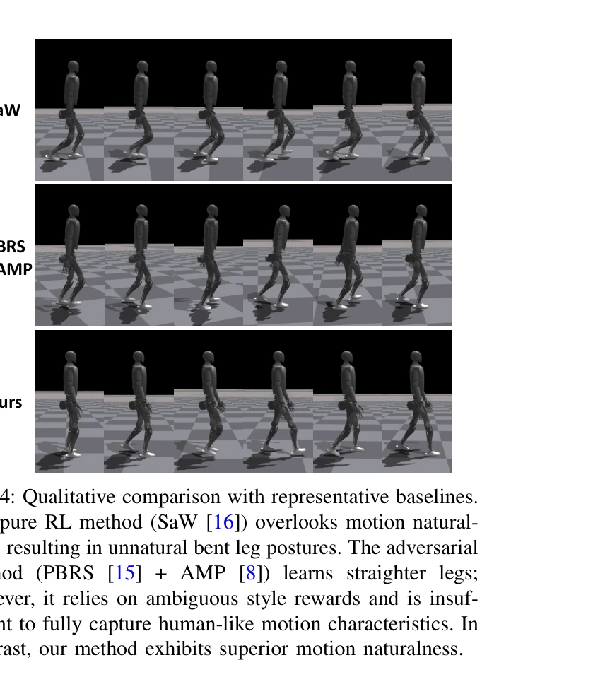

# Natural Humanoid Robot Locomotion with Generative Motion Prior

> **저자**: Haodong Zhang, Liang Zhang, Zhenghan Chen, Lu Chen, Yue Wang, Rong Xiong | **날짜**: 2025-03-12 | **URL**: [https://arxiv.org/abs/2503.09015](https://arxiv.org/abs/2503.09015)

---

## Essence

*Fig. 2: Overall framework. (a) First, we transform the human motion dataset to the robot reference motion dataset by who*

인간의 자연스러운 동작 데이터를 활용하여 휴머노이드 로봇의 자연스러운 보행을 학습하기 위해 Generative Motion Prior (GMP)를 제안한다. 오프라인으로 학습된 CVAE 기반 생성 모델이 정책 학습 중에 세밀한 전신 동작 궤적을 온라인으로 생성하여 안정적이고 해석 가능한 감독을 제공한다.

## Motivation

- **Known**: 기존 RL 기반 휴머노이드 제어 방법들은 동작 자연스러움을 무시하거나, Adversarial Motion Prior (AMP)를 통해 스칼라 스타일 보상으로 자연스러움을 유도한다. 하지만 AMP는 판별기의 불안정한 학습과 모드 붕괴 문제로 인해 훈련이 불안정하고 보상이 모호하다.
- **Gap**: 기존 AMP 방법은 세밀한 동작 수준의 감독을 제공하지 못하며, 판별기-정책 네트워크의 동시 학습으로 인한 불안정성과 해석 불가능한 스칼라 보상의 문제를 해결하지 못했다. 자연스러운 휴머노이드 보행을 위한 세밀하고 안정적인 동작 가이던스 메커니즘이 필요하다.
- **Why**: 휴머노이드 로봇의 자연스러운 보행은 인간 사회와의 상호작용 및 가정 진입에 필수적이며, 부자연스러운 동작은 로봇의 사회적 수용성을 저해한다. 세밀한 동작 감독을 통한 안정적 학습이 실용적 휴머노이드 시스템 개발의 핵심이다.
- **Approach**: 전신 동작 retargeting으로 인간 동작을 로봇에 전이한 후, CVAE 기반 생성 모델을 오프라인으로 학습하여 현재 로봇 자세와 속도 명령을 입력받아 미래의 자연스러운 로봇 동작을 예측한다. 정책 학습 중 고정된 생성 모델이 관절 각도와 키포인트 위치를 포함한 세밀한 동작 가이던스 보상을 제공한다.

## Achievement

*Fig. 4: Qualitative comparison with representative baselines.*

- **생성 모델 기반 안정적 학습 프레임워크**: 고정된 frozen generative model을 온라인 감독자로 활용하여 AMP의 불안정한 동시 학습 문제를 제거하고 훈련 안정성을 향상시킨다.
- **세밀한 전신 동작 가이던스**: CVAE를 통해 전신 참고 동작 궤적을 생성하고, 관절 각도와 키포인트 위치의 여러 동작 가이던스 보상으로 해석 가능하고 밀도 높은 감독을 제공한다.
- **우수한 동작 자연스러움 달성**: 시뮬레이션과 실제 환경 모두에서 기존 방법들을 능가하는 자연스럽고 인간답은 보행 동작을 구현한다.
- **첫 적용 사례**: 생성 모델의 능력을 활용한 자연스러운 휴머노이드 보행 학습의 첫 시도이다.

## How

*Fig. 2: Overall framework. (a) First, we transform the human motion dataset to the robot reference motion dataset by who*

- 전신 동작 retargeting: 인간 동작 데이터를 로봇의 운동학적 구조에 맞게 변환
- CVAE 기반 generative model 오프라인 학습: 현재 로봇 자세 m_t와 속도 명령 c_t를 조건으로 하여 미래 자세 m_{t+1}을 자동회귀(auto-regressive) 방식으로 예측
- 잠재 변수 z_{t+1} 샘플링: 예측의 다양성을 위해 CVAE의 잠재 공간에서 샘플링
- 동작 가이던스 보상 설계: 생성 모델의 예측 궤적과 실제 로봇 동작 간의 관절 각도 차이 및 키포인트 위치 차이를 측정하는 여러 보상 항 설계
- RL 정책 학습: 기본 작업 보상(locomotion velocity tracking)과 동작 가이던스 보상의 조합으로 정책 최적화
- 정책-생성 모델 분리: 생성 모델은 고정 유지하여 AMP의 동시 학습 불안정성 제거

## Originality

- Generative model의 새로운 활용: 기존 adversarial training 대신 고정된 생성 모델을 감독자로 활용하는 구조로 CVAE를 처음 로봇 보행 학습에 적용
- 세밀한 동작 수준 감독: 스칼라 스타일 보상 대신 관절 각도, 키포인트 위치 등 다차원의 세밀한 동작 궤적 가이던스 제공
- 정책-생성 모델 분리 설계: 오프라인 학습 후 frozen generative model 활용으로 불안정한 동시 학습 문제 근본 해결
- 전신 동작 retargeting과 생성 모델의 체계적 결합: 인간 동작 데이터에서 로봇 동작 예측까지의 완전한 파이프라인 구축

## Limitation & Further Study

- CVAE의 표현력 한계: 복잡하고 다양한 인간 동작을 제한된 잠재 공간으로 표현할 때 생성 다양성 및 정확도 제한 가능성
- Retargeting 품질 의존성: 전신 동작 retargeting의 품질이 최종 로봇 보행 성능에 직접 영향을 미치므로, 부정확한 retargeting 시 성능 저하
- 속도 명령 조건 제약: 현재 모델은 속도 명령을 기반으로 하여 복잡한 고차원 명령(예: 팔 제스처, 표정)에 대한 확장성 제한
- 실시간 계산 비용: 매 스텝마다 생성 모델 inference가 필요하므로 계산 오버헤드 분석 및 최적화 필요
- 후속 연구 방향**: diffusion model 등 더 표현력 있는 생성 모델 활용, 다양한 로봇 플랫폼에 대한 일반화 연구, 복합 환경(계단, 장애물 등)에서의 적응성 개선

## Evaluation

- Novelty: 4/5
- Technical Soundness: 3/5
- Significance: 4/5
- Clarity: 4/5
- Overall: 4/5

**총평**: 본 논문은 AMP의 불안정성을 극복하기 위해 고정된 CVAE 기반 생성 모델을 활용하는 창의적인 접근법을 제시하며, 세밀한 전신 동작 궤적 가이던스를 통해 자연스러운 휴머노이드 보행 학습의 새로운 기준을 제시한다. 시뮬레이션과 실제 로봇 실험을 통해 우수한 성과를 입증했으나, CVAE의 표현력 한계와 retargeting 품질 의존성은 후속 개선 과제로 남는다.

## Related Papers

- 🏛 기반 연구: [[papers/1350_Deep_Reinforcement_Learning_for_Robotics_A_Survey_of_Real-Wo/review]] — 표현적 휴머노이드 보행의 기반이 되는 자율적 다양한 locomotion 생성 방법론을 제공한다.
- 🔄 다른 접근: [[papers/1596_One_Policy_but_Many_Worlds_A_Scalable_Unified_Policy_for_Ver/review]] — 휴머노이드 지형 적응 보행의 다른 접근법으로 생성적 모션 프라이어와 통합 정책을 비교할 수 있다.
- 🔗 후속 연구: [[papers/1422_GENMO_A_GENeralist_Model_for_Human_MOtion/review]] — 일반적 인간 동작 생성 모델을 휴머노이드 자연스러운 보행으로 특화하여 발전시킨다.
- 🔄 다른 접근: [[papers/1399_FLAM_Foundation_Model-Based_Body_Stabilization_for_Humanoid/review]] — 둘 다 자연스러운 humanoid 동작을 추구하지만 FLAM은 foundation model 기반, Natural Humanoid는 generative motion prior 기반이다.
- 🔄 다른 접근: [[papers/1596_One_Policy_but_Many_Worlds_A_Scalable_Unified_Policy_for_Ver/review]] — 휴머노이드 지형 적응의 다른 접근법으로 통합 정책과 생성적 모션 프라이어를 비교할 수 있다.
- 🔄 다른 접근: [[papers/1597_One-shot_Adaptation_of_Humanoid_Whole-body_Motion_with_Walki/review]] — 휴머노이드 동작 생성의 다른 접근법으로 생성적 모션 프라이어와 보행 사전 기반 적응을 비교할 수 있다.
- 🧪 응용 사례: [[papers/1607_PDF-HR_Pose_Distance_Fields_for_Humanoid_Robots/review]] — 자연스러운 humanoid 움직임 생성에서 PDF-HR의 pose plausibility와 generative motion prior의 상호 보완적 역할을 한다
