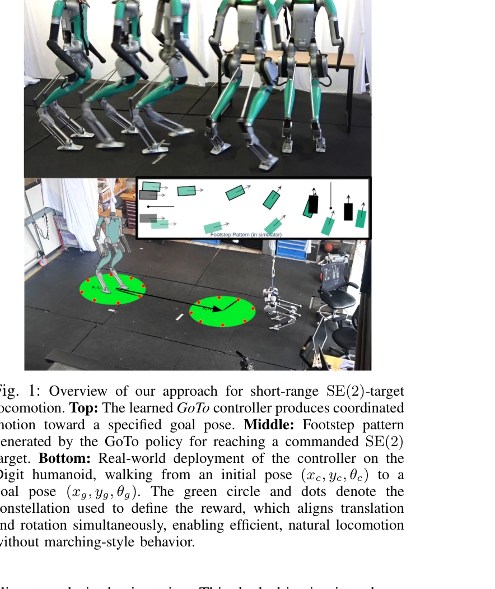
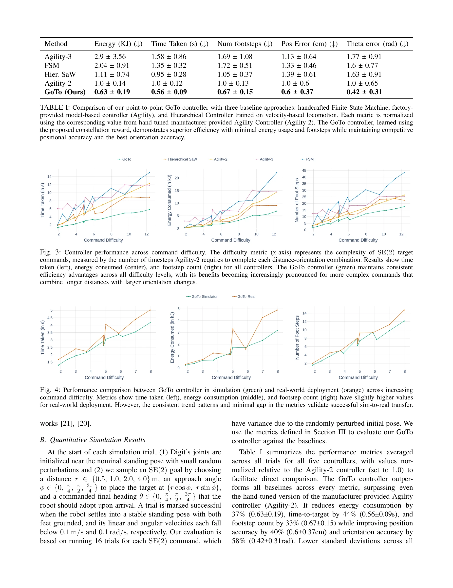
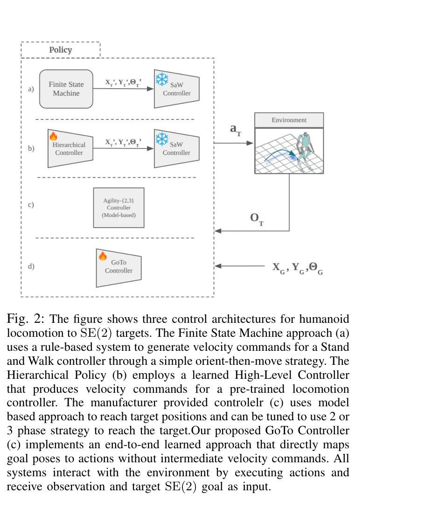

# No More Marching: Learning Humanoid Locomotion for Short-Range SE(2) Targets

> **저자**: Pranay Dugar, Mohitvishnu S. Gadde, Jonah Siekmann, Yesh Godse, Aayam Shrestha, Alan Fern | **날짜**: 2025-08-16 | **URL**: [https://arxiv.org/abs/2508.14098](https://arxiv.org/abs/2508.14098)

---

## Essence

*Fig. 1: Overview of our approach for short-range SE(2)-target*

단거리 SE(2) 목표 위치에 도달하는 인간형 로봇의 보행을 위해 constellation 기반 보상 함수를 사용한 강화학습 접근법을 제시하며, 시뮬레이션에서 실제 로봇으로의 성공적인 이전을 달성했다.

## Motivation

- **Known**: RL을 활용한 장거리 속도 추적 기반 인간형 로봇 보행이 발전했으나, 이를 단거리 SE(2) 목표 도달에 적용하면 비효율적인 행진식(marching-style) 행동이 발생한다.
- **Gap**: 기존 방법들은 속도 추적에 최적화되어 있어 위치와 방향을 동시에 고려하는 짧은 거리의 목표 도달 문제에 적합하지 않으며, 이를 위한 특화된 보상 함수 설계가 필요하다.
- **Why**: 인간형 로봇이 실제 작업 환경에서 빠르고 강건하며 에너지 효율적인 단거리 이동을 수행하려면 목표 지향적 보행 제어가 필수적이다.
- **Approach**: Point constellation을 사용한 기하학적 유사성 기반 보상 함수로 SE(2) 목표 도달을 직접 최적화하며, 이를 통해 위치와 회전 목표의 균형을 자동으로 조절한다.

## Achievement

*Fig. 4: Performance comparison between GoTo controller in simulation (green) and real-world deployment (orange) across i*

- **Constellation 기반 보상 함수**: 로봇 베이스에 부착된 2D 포인트 집합의 기하학적 정렬을 통해 위치와 회전을 통합하는 직관적이고 유연한 보상 설계
- **효율성 개선**: 표준 방법 대비 에너지 소비, 시간, 발걸음 수 측면에서 지속적으로 우수한 성능을 달성
- **Sim-to-real 전이**: Digit-v3 인간형 로봇 플랫폼으로의 성공적인 실제 배포 확인
- **벤치마킹 프레임워크**: SE(2) 목표 보행 성능을 에너지, 시간, 발걸음 수로 체계적으로 측정하는 평가 체계 도입

## How

*Fig. 2: The figure shows three control architectures for humanoid*

- Goal-conditioned MDP로 문제를 공식화하여 SE(2) 목표 위치와 방향을 동시에 고려
- 로봇 베이스에 가상의 2D point constellation을 정의하고 목표 자세의 constellation과의 정렬도로 보상 계산
- Constellation의 관성 모멘트를 조절하여 위치와 회전 정확도 간 trade-off 제어
- End-to-end 정책 학습 및 계층적 구조 (사전 학습된 속도 기반 컨트롤러 위의 정책) 두 가지 아키텍처 검증
- 다양한 SE(2) 목표 분포에 대한 광범위한 시뮬레이션 평가 수행
- 시뮬레이션에서 학습한 정책을 실제 로봇에 직접 배포

## Originality

- Motion planning의 point cloud 정렬 아이디어를 legged locomotion에 창의적으로 적용
- 기존 velocity-tracking 기반 접근과 달리 SE(2) 목표 도달을 직접 최적화하는 새로운 문제 정의
- Constellation의 기하학적 특성(관성 모멘트)을 통해 보상 설계의 파라미터화된 제어 방식 제시
- 단순한 보상 함수만으로도 복잡한 단거리 보행 행동을 효율적으로 학습 가능함을 입증

## Limitation & Further Study

- 실제 로봇 배포 평가가 Digit-v3 단일 플랫폼에만 수행되어 다양한 로봇 형태에 대한 일반화 검증 부족
- 장애물이 있는 환경에 대한 평가가 제시되지 않아 실제 작업 공간의 복잡성 반영 미흡
- Constellation 형태와 크기 선택에 대한 체계적인 설계 지침이 부족하며, 이것이 성능에 미치는 영향 분석 필요
- 후속 연구에서는 다양한 로봇 플랫폼으로의 확장, 동적 장애물 회피, 그리고 불확실성이 있는 실제 환경에서의 강건성 평가가 요구됨

## Evaluation

- Novelty: 4/5
- Technical Soundness: 3/5
- Significance: 4/5
- Clarity: 4/5
- Overall: 4/5

**총평**: 단거리 SE(2) 목표 보행이라는 실용적이고 중요한 문제에 대해 constellation 기반 보상 함수라는 간결하면서도 효과적인 해결책을 제시했으며, 시뮬레이션과 실제 로봇 모두에서 검증하여 산업적 응용 가치가 높다.

## Related Papers

- 🏛 기반 연구: [[papers/1583_No_More_Marching_Learning_Humanoid_Locomotion_for_Short-Rang/review]] — 텍스트 기반 보상 설계 기법이 constellation 기반 보상 함수 개발에 언어 모델을 활용할 수 있는 이론적 배경을 제공합니다.
- 🔄 다른 접근: [[papers/1284_Benchmarking_Potential_Based_Rewards_for_Learning_Humanoid_L/review]] — 잠재 기반 보상과 constellation 기반 보상 함수가 휴머노이드 보행 학습에서 서로 다른 보상 설계 철학을 제시합니다.
- 🔗 후속 연구: [[papers/1363_ECO_Energy-Constrained_Optimization_with_Reinforcement_Learn/review]] — 에너지 제약 최적화가 단거리 이동에서의 효율적인 보상 설계에 추가적인 제약 조건을 제공할 수 있습니다.
- 🏛 기반 연구: [[papers/1444_Language_to_Rewards_for_Robotic_Skill_Synthesis/review]] — Language to Rewards는 Text2Reward의 언어 기반 보상 설계 패러다임의 핵심 기반이 된다.
- ⚖️ 반론/비판: [[papers/1620_VLA-RL_Towards_Masterful_and_General_Robotic_Manipulation_wi/review]] — Text2Reward가 언어에서 보상으로, VLA-RL이 사전학습에서 강화학습으로의 서로 다른 방향의 개선 전략을 보여준다
- 🏛 기반 연구: [[papers/1609_Vision-Language-Action_Models_for_Robotics_A_Review_Towards/review]] — Text2Reward의 language-driven reward shaping이 VLA 모델들의 language 이해 능력 향상에 필요한 기반 방법론
