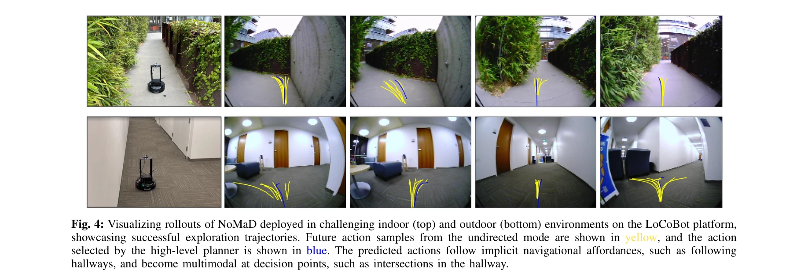
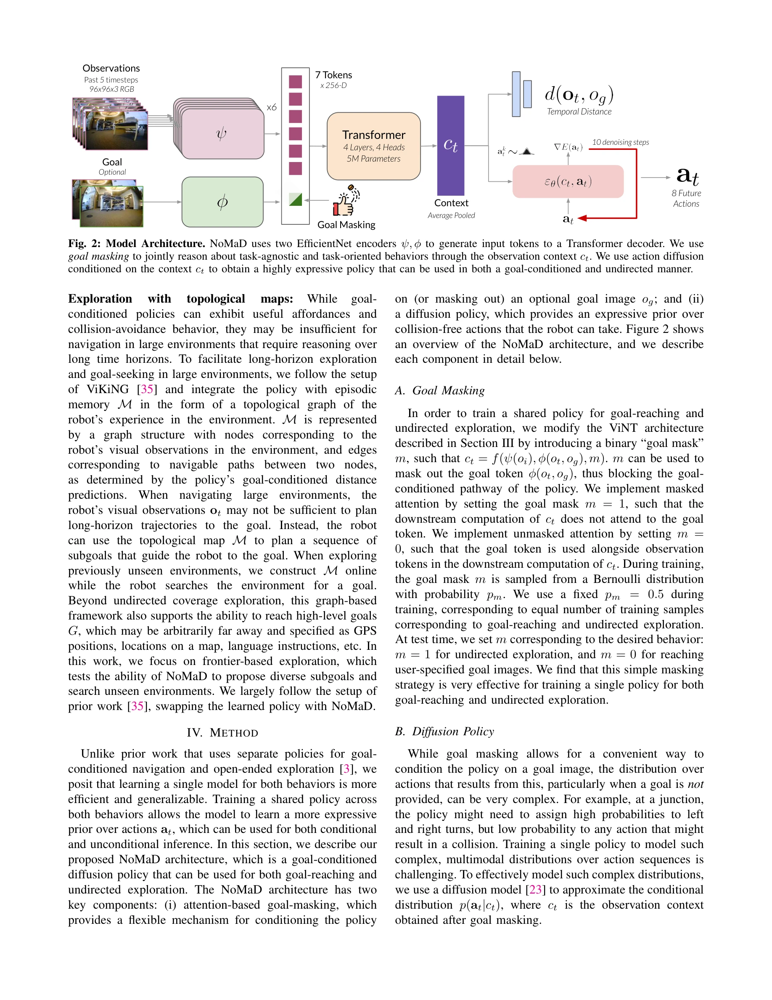

# NoMaD: Goal Masked Diffusion Policies for Navigation and Exploration

> **저자**: Ajay Sridhar, Dhruv Shah, Catherine Glossop, Sergey Levine | **날짜**: 2023-10-11 | **URL**: [https://arxiv.org/abs/2310.07896](https://arxiv.org/abs/2310.07896)

---

## Essence

*Fig. 1: NoMaD is the first flexibly conditioned diffusion model of robot actions that can perform both goal-conditioned *

NoMaD는 goal masking을 활용한 diffusion policy로, 로봇이 목표 지정 네비게이션과 목표 미지정 탐색을 하나의 통합 모델로 수행할 수 있게 하는 방법을 제시한다.

## Motivation

- **Known**: 기존에는 로봇 네비게이션을 위해 목표 지정 네비게이션과 탐색을 분리된 모델로 처리해왔으며, ViNT 같은 Transformer 기반 정책이 목표 조건부 네비게이션에서 좋은 성능을 보였다.
- **Gap**: 단일 모델로 목표 지정 행동과 탐색 행동을 동시에 처리할 수 있는 방법이 부재했으며, 기존 diffusion 기반 접근법들은 action이 아닌 subgoal image 생성에 초점을 맞추고 있다.
- **Why**: 통합된 정책은 더 나은 일반화 성능을 제공하고, 계산 효율성을 높이며, 온보드 컴퓨터에서 실행 가능하도록 모델 크기를 줄일 수 있다.
- **Approach**: Transformer 백본으로 시각 정보를 인코딩하고, goal masking 메커니즘으로 선택적 목표 조건을 처리하며, diffusion model decoder로 복잡한 multimodal action distribution을 모델링한다.

## Achievement

*Fig. 4: Visualizing rollouts of NoMaD deployed in challenging indoor (top) and outdoor (bottom) environments on the LoCo*

- **통합 정책 설계**: goal masking을 통해 단일 diffusion policy가 goal-conditioned와 task-agnostic 행동을 유연하게 처리
- **성능 개선**: ViNT 대비 undirected exploration에서 25% 이상 성능 향상 및 낮은 collision rate 달성
- **계산 효율성**: 15배 더 적은 매개변수로 state-of-the-art 대비 우수한 성능 달성 (5M vs 300M parameters)
- **실로봇 배포**: 실제 모바일 로봇 플랫폼에서 미지의 indoor/outdoor 환경에서 효과적인 네비게이션 시연
- **최초 달성**: goal-conditioned action diffusion model의 첫 실제 배포 및 task-agnostic과 task-oriented 행동의 통합 모델

## How

*Fig. 2: Model Architecture. NoMaD uses two EfficientNet encoders ψ, ϕ to generate input tokens to a Transformer decoder.*

- EfficientNet-B0 인코더 ψ를 사용해 각 RGB 관찰을 독립적으로 처리
- Goal fusion 인코더 ϕ(ot, og)로 관찰과 목표 이미지를 토큰화
- Multi-headed attention 레이어로 context vector ct 생성
- Goal masking을 통해 목표 이미지가 없을 때도 policy가 탐색 행동을 생성하도록 학습
- Diffusion model decoder로 context ct로부터 미래 action 시퀀스를 10 denoising step으로 생성
- Topological memory M과 high-level planner를 결합하여 장기 탐색 및 목표 추구 지원
- Supervised learning으로 최대 우도 목표에 따라 action과 temporal distance 예측

## Originality

- Goal masking 메커니즘으로 optional goal conditioning을 architecture 수준에서 통합 (기존: 외부 subgoal 생성 모델)
- Action diffusion을 goal-conditioned navigation에 적용한 최초 사례
- Task-agnostic과 task-specific 행동을 하나의 diffusion policy로 모델링하는 새로운 설계
- ViNT의 Transformer 백본을 diffusion decoder로 확장하여 multimodal action distribution을 명시적으로 표현

## Limitation & Further Study

- Goal masking의 효과가 정량적으로 상세히 분석되지 않음 (목표 부재 시 성능 저하 정도 미측정)
- Diffusion denoising step (10 step) 선택에 대한 이론적 근거 부재
- Real-world 실험이 특정 로봇 플랫폼(mobile ground robot)에 제한됨
- Topological map 구성 방식이 명확하게 설명되지 않음
- 후속 연구: multimodal action sampling 전략 개선, 더 복잡한 탐색 전략 학습, 다양한 로봇 형태에 대한 적응성 검증

## Evaluation

- Novelty: 4/5
- Technical Soundness: 3/5
- Significance: 4/5
- Clarity: 4/5
- Overall: 4/5

**총평**: NoMaD는 goal masking과 diffusion policy를 창의적으로 결합하여 목표 지정 네비게이션과 탐색을 통합한 최초의 실로봇 배포 시스템으로, 뛰어난 성능과 계산 효율성을 달성했다.

## Related Papers

- 🔄 다른 접근: [[papers/1490_NavigateDiff_Visual_Predictors_are_Zero-Shot_Navigation_Assi/review]] — NoMaD는 diffusion policy를 사용하고 NavigateDiff는 visual predictors를 사용하여 제로샷 네비게이션을 달성하는 다른 접근법
- 🔗 후속 연구: [[papers/1311_Cognition_to_Control_-_Multi-Agent_Learning_for_Human-Humano/review]] — NoMaD의 goal masking 아이디어가 ApexNav의 적응적 탐색 전략과 결합되어 더 효과적인 탐색-활용 균형을 달성할 수 있음
- 🏛 기반 연구: [[papers/1362_Diffusion_Policy_Visuomotor_Policy_Learning_via_Action_Diffu/review]] — NoMaD가 기반으로 하는 diffusion policy의 원리와 구현 방법을 Diffusion Policy 논문에서 제시
- 🔄 다른 접근: [[papers/1343_Cosmos-Reason1_From_Physical_Common_Sense_To_Embodied_Reason/review]] — ThinkAct는 Cosmos-Reason1과 유사한 추론 기반 접근법이지만 강화된 시각-언어-행동 추론에 특화되어 있다
- 🔄 다른 접근: [[papers/1362_ECHO_Edge-Cloud_Humanoid_Orchestration_for_Language-to-Motio/review]] — ThinkAct와 ECHO 모두 언어-행동 연결을 다루지만 전자는 추론 중심, 후자는 실시간 분산 처리에 집중한다.
- 🏛 기반 연구: [[papers/1521_RationalVLA_A_Rational_Vision-Language-Action_Model_with_Dua/review]] — ThinkAct의 reinforced vision-language-action reasoning이 rational VLA의 dual system 사고 과정에 방법론적 기반을 제공한다.
- 🔗 후속 연구: [[papers/1503_OneTwoVLA_A_Unified_Vision-Language-Action_Model_with_Adapti/review]] — ThinkAct의 reinforced vision-language-action reasoning이 OneTwoVLA의 adaptive reasoning 프레임워크를 강화학습으로 확장한다.
