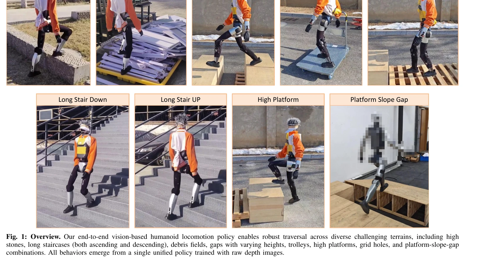
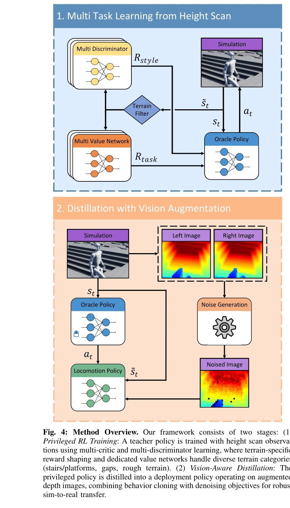

# Now You See That: Learning End-to-End Humanoid Locomotion from Raw Pixels

> **저자**: Wandong Sun, Yongbo Su, Leoric Huang, Alex Zhang, Dwyane Wei, Mu San, Daniel Tian, Ellie Cao, Finn Yan, Ethan Xie, Zongwu Xie | **날짜**: 2026-02-06 | **URL**: [https://arxiv.org/abs/2602.06382](https://arxiv.org/abs/2602.06382)

---

## Essence

*Fig. 1: Overview. Our end-to-end vision-based humanoid locomotion policy enables robust traversal across diverse challen*

원본 깊이 이미지로부터 휴머노이드 로봇의 end-to-end 시각 기반 보행을 학습하기 위해, 현실적인 깊이 센서 시뮬레이션과 vision-aware behavior distillation, 그리고 multi-critic/multi-discriminator 기반 지형 적응을 제안한다.

## Motivation

- **Known**: LiDAR 기반 elevation map과 depth camera 기반 접근법이 이차 로봇 보행에 사용되어 왔으나, 시뮬레이션-현실 간격과 다양한 지형에서의 충돌하는 학습 목표가 주요 과제로 남아있다.
- **Gap**: 깊이 센서의 구조화된 불완전성(stereo matching artifacts, 보정 불확실성)이 시뮬레이션에서 적절히 모델링되지 않으며, 단일 정책으로 이질적인 지형을 다루기 어렵다.
- **Why**: 시각 기반 휴머노이드 보행은 센티미터 단위 정확도가 필요한 세밀한 작업과 극한 환경을 동시에 처리해야 하는 embodied intelligence의 중요한 벤치마크이다.
- **Approach**: 특권적 관찰(높이 맵)로 학습한 정책을 noisy depth 관찰로 distill하되, 현실적 깊이 augmentation과 noise-invariant auxiliary tasks를 결합하고, 지형별 reward shaping과 multi-critic/multi-discriminator learning으로 통합 정책을 학습한다.

## Achievement

*Fig. 1: Overview. Our end-to-end vision-based humanoid locomotion policy enables robust traversal across diverse challen*

- **현실적 깊이 센서 시뮬레이션**: stereo matching artifacts, depth-dependent noise, optical distortions, calibration uncertainties를 포괄적으로 시뮬레이션하는 8단계 augmentation pipeline을 개발
- **Vision-aware behavior distillation**: latent space alignment와 noise-invariant auxiliary tasks를 결합하여 privileged observations에서 noisy depth inputs로의 효과적인 지식 전이 달성
- **다중 비평가/판별기 지형 학습**: terrain-specific reward shaping과 dedicated value networks/discriminators로 단일 통합 정책 내에서 각 지형의 고유 dynamics와 motion priors 포착
- **교차 플랫폼 검증**: 서로 다른 stereo depth cameras를 장착한 2개 휴머노이드 로봇에서 장기 계단 양방향 통행, 높은 플랫폼, 넓은 갭 등 극한 과제를 포함한 다양한 실내외 환경에서 강건한 성능 입증

## How

*Fig. 4: Method Overview. Our framework consists of two stages: (1)*

- **Stage 1: Privileged policy training** - 높이 맵 관찰을 사용하여 multi-critic RL과 multi-discriminator adversarial learning으로 terrain-specific reward shaping을 적용한 정책 학습
- **Stage 2: Vision-aware distillation** - 종합적인 깊이 augmentation (stereo fusion, depth-dependent noise, optical distortion, calibration uncertainty 등)을 적용하면서 behavior distillation 수행
- **깊이 augmentation pipeline** - Stereo depth fusion, depth-dependent noise, optical distortion, camera calibration uncertainty 등 8가지 연속 연산자로 현실적 센서 불완전성 재현
- **Noise-invariant auxiliary tasks** - CURL/DrAC 유형의 contrastive learning과 consistency regularization으로 augmentation 간 정책 일관성 강제
- **Multi-critic/multi-discriminator framework** - 각 지형별 dedicated value network와 discriminator를 유지하면서 shared feature encoder를 통해 효율적인 학습

## Originality

- Stereo matching artifacts를 포함한 **포괄적 깊이 센서 시뮬레이션**은 기존의 단순 perturbation 기반 domain randomization을 넘어서는 구조화된 접근
- **Vision-aware behavior distillation**이 latent space alignment와 noise-invariant auxiliary tasks를 명시적으로 결합하는 방식은 새로운 distillation 패러다임
- **Multi-critic/multi-discriminator를 통한 통합 정책 학습**은 기존의 별도 specialist policies 훈련 후 distillation 방식에 비해 효율적이고 우아한 접근
- End-to-end vision 기반 휴머노이드 보행에서 **극한 parkour와 세밀한 보행(장기 계단 통행)을 동시에 달성**하는 것은 선행 연구들에 비해 획기적

## Limitation & Further Study

- 깊이 센서 시뮬레이션이 특정 stereo camera 모델(예: RealSense)에 최적화되어 있어 다른 센서 타입(TOF, LiDAR)에 대한 일반화 가능성이 명확하지 않음
- 논문에서 제시된 실제 로봇 플랫폼의 구체적인 스펙(높이, 무게, 다리 길이 등)이 명확하지 않아 재현 가능성 평가 어려움
- Multi-critic/multi-discriminator 프레임워크의 계산 복잡도와 학습 시간에 대한 분석 부재
- 실내 환경 위주의 평가로 실외 극한 환경(자갈밭, 진흙, 눈 등)에서의 성능이 제한적일 가능성
- 향후 연구로 RGB-D fusion, event cameras 등 다양한 센서 모달리티로의 확장, 실시간 온라인 적응 메커니즘 개발이 필요

## Evaluation

- Novelty: 4/5
- Technical Soundness: 3/5
- Significance: 4/5
- Clarity: 4/5
- Overall: 4/5

**총평**: 본 논문은 깊이 센서의 현실적 불완전성을 포괄적으로 모델링하고 vision-aware distillation과 multi-terrain learning을 결합하여 end-to-end 시각 기반 휴머노이드 보행에서 극한 과제와 세밀한 작업을 동시에 달성한 우수한 연구이며, 실제 로봇에서의 교차 플랫폼 검증을 통해 실용성을 입증했다.

## Related Papers

- 🔄 다른 접근: [[papers/1352_DemoDiffusion_One-Shot_Human_Imitation_using_pre-trained_Dif/review]] — 깊이 인식 휴머노이드 보행의 다른 접근법으로 원본 픽셀과 깊이 전용 인식을 비교할 수 있다.
- 🔗 후속 연구: [[papers/1590_Toward_General-Purpose_Robots_via_Foundation_Models_A_Survey/review]] — 옴니 방향 충돌 회피에서 end-to-end 시각 기반 보행이 LiDAR 기반 방법을 보완한다.
- 🏛 기반 연구: [[papers/1449_Hiking_in_the_Wild_A_Scalable_Perceptive_Parkour_Framework_f/review]] — 야생에서의 지각적 파쿠르 프레임워크가 원본 픽셀에서 지형 적응 보행의 기반을 제공한다.
- 🔗 후속 연구: [[papers/1492_Neural_Brain_A_Neuroscience-inspired_Framework_for_Embodied/review]] — ThinkBot의 thought chain과 Neural Brain의 neuroscience-inspired reasoning이 embodied reasoning의 확장된 형태를 제시한다.
- 🔄 다른 접근: [[papers/1590_Toward_General-Purpose_Robots_via_Foundation_Models_A_Survey/review]] — 휴머노이드 충돌 회피의 다른 접근법으로 LiDAR 기반과 원본 픽셀 기반 인식을 비교할 수 있다.
