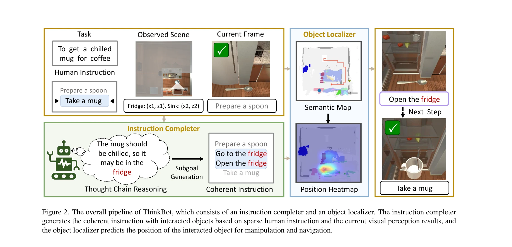

# ThinkBot: Embodied Instruction Following with Thought Chain Reasoning

> **저자**: Guanxing Lu, Ziwei Wang, Changliu Liu, Jiwen Lu, Yansong Tang | **날짜**: 2023-12-12 | **URL**: [https://arxiv.org/abs/2312.07062](https://arxiv.org/abs/2312.07062)

---

## Essence

*Figure 2. The overall pipeline of ThinkBot, which consists of an instruction completer and an object localizer. The inst*

ThinkBot은 희소한 인간 지시문에서 사고 체인 추론을 통해 누락된 행동 설명을 복구하여 embodied instruction following 작업을 수행하는 에이전트를 제안한다. 대규모 언어 모델 기반 instruction completer와 multimodal object localizer로 구성되어 일관된 지시문을 따라 복잡한 목표를 완수할 수 있다.

## Motivation

- **Known**: 기존 modular 방법들은 희소한 인간 지시문으로부터 직접 고수준 행동 시퀀스를 생성하고 저수준 제어기로 실행하는 방식을 사용한다. 하지만 인간의 지시문은 일반적으로 불완전하고 일관성이 없어서 에이전트가 실패하는 문제가 있다.
- **Gap**: 기존 방법들은 지시문에서 누락된 중간 행동 단계들을 고려하지 않아 인지적 비일관성이 발생한다. 특히 복잡한 장기 작업에서 이러한 누락된 설명으로 인해 에이전트가 올바른 행동 시퀀스를 생성하지 못한다.
- **Why**: 실제 가정용 로봇 작업에서 인간의 지시는 항상 완전하지 않으며, 이러한 희소성을 극복하는 것이 embodied instruction following의 실용성과 성공률을 크게 향상시킬 수 있다.
- **Approach**: LLM 기반 instruction completer를 설계하여 현재 환경 인식과 부분 완료된 부분 목표를 고려하며 누락된 행동을 복구한다. 또한 scene semantic map 기반의 multimodal object localizer를 통해 상호작용할 객체의 위치를 예측한다.

## Achievement

*Figure 2. The overall pipeline of ThinkBot, which consists of an instruction completer and an object localizer. The inst*

- **Instruction Completer**: 희소한 인간 지시문에서 사고 체인 추론을 통해 누락된 행동과 대상 객체를 복구하여 일관된 지시 시퀀스를 생성
- **Object Localizer**: Partially observed scene semantic map을 기반으로 multimodal transformer을 사용하여 객체 위치를 정확하게 예측
- **성능 향상**: ALFRED 벤치마크에서 기존 최고 수준 방법들 대비 success rate와 path-length-weighted success rate에서 현저한 개선 달성

## How

*Figure 2. The overall pipeline of ThinkBot, which consists of an instruction completer and an object localizer. The inst*

- LLM을 프롬프트로 활용하여 현재 환경의 인지된 객체와 완료된 부분 목표 정보를 포함한 instruction completion 수행
- Scene semantic map에서 추출한 객체 정보와 multimodal 특징을 이용하여 object localizer 학습
- Object correlation을 마이닝하여 객체 위치 예측 능력 향상
- 고수준 부분 목표를 사전 정의된 저수준 제어기로 실행하는 modular 접근 방식 유지
- 온라인 semantic map을 기반으로 네비게이션과 상호작용 가이드 제공

## Originality

- 희소한 지시문의 일관성 부족 문제를 명시적으로 식별하고 사고 체인 추론으로 해결하는 새로운 관점 제시
- LLM의 상식 추론 능력과 vision-based object localization을 결합하는 hybrid 접근 방식
- Partially observed scene에서 object correlation을 활용한 지역화 강화 방법
- 기존 modular 방법의 단점을 보완하면서도 프레임워크 유지

## Limitation & Further Study

- LLM의 공간 지역화 능력이 약하다는 인식 하에 별도의 object localizer 필요 → 두 모듈 간의 정보 공유 최적화 방법 연구 필요
- ALFRED 시뮬레이션 환경에서만 평가되어 현실 로봇 플랫폼으로의 전이 가능성 미검증
- Semantic map의 완전성에 의존하므로 센싱 오류나 불완전한 지각에 대한 견고성 분석 부재
- LLM 프롬프트 설계가 휴리스틱 기반이므로 다양한 task 도메인으로의 일반화 가능성 불명확
- 계산 비용 분석 미흡 → 실시간 로봇 제어에서의 실용성 평가 필요

## Evaluation

- Novelty: 4/5
- Technical Soundness: 3/5
- Significance: 4/5
- Clarity: 4/5
- Overall: 4/5

**총평**: ThinkBot은 희소한 지시문의 일관성 문제를 사고 체인 추론으로 우아하게 해결하는 창의적인 접근법을 제시하며, ALFRED 벤치마크에서 우수한 실험 결과를 달성했다. 다만 실제 로봇 환경으로의 검증과 모듈 간 정보 통합 최적화가 향후 과제이다.

## Related Papers

- 🔄 다른 접근: [[papers/1344_CoT-VLA_Visual_Chain-of-Thought_Reasoning_for_Vision-Languag/review]] — ThinkBot의 사고 체인 추론과 CoT-VLA의 visual chain-of-thought는 서로 다른 모달리티에서 단계별 추론을 구현하는 접근법
- 🔗 후속 연구: [[papers/1434_Inner_Monologue_Embodied_Reasoning_through_Planning_with_Lan/review]] — ThinkBot의 instruction following이 Inner Monologue의 계획-실행 프레임워크와 결합되어 더 견고한 embodied reasoning 시스템을 구성할 수 있음
- 🏛 기반 연구: [[papers/1288_3D_Diffusion_Policy_Generalizable_Visuomotor_Policy_Learning/review]] — ThinkBot의 행동 지시 생성이 BFM-Zero의 promptable behavior modeling 원리를 기반으로 발전된 형태
- 🔗 후속 연구: [[papers/1434_Inner_Monologue_Embodied_Reasoning_through_Planning_with_Lan/review]] — 내적 독백의 추론 체인을 더욱 체계화하여 구체적인 사고 과정을 시각화한 발전된 형태입니다.
- 🔗 후속 연구: [[papers/1547_Robotic_Control_via_Embodied_Chain-of-Thought_Reasoning/review]] — ThinkBot의 thought chain이 embodied chain-of-thought reasoning을 더 체계적인 사고 과정으로 확장한다.
- 🔗 후속 연구: [[papers/1344_CoT-VLA_Visual_Chain-of-Thought_Reasoning_for_Vision-Languag/review]] — ThinkBot은 CoT-VLA의 시각적 체인-오브-사고트를 사고 체인이 있는 구체화된 지시 따르기로 확장한다
