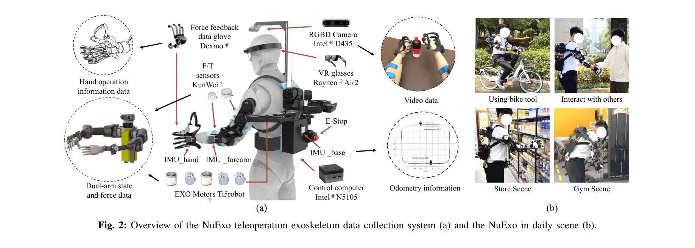
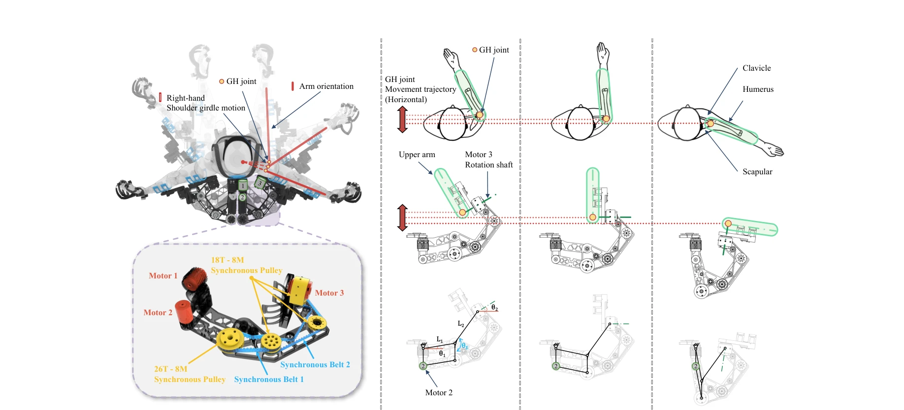

# NuExo: A Wearable Exoskeleton Covering all Upper Limb ROM for Outdoor Data Collection and Teleoperation of Humanoid Robots

> **저자**: Rui Zhong, Chuang Cheng, Junpeng Xu, Yantong Wei, Ce Guo, Daoxun Zhang, Wei Dai, Huimin Lu | **날짜**: 2025-03-13 | **URL**: [https://arxiv.org/abs/2503.10554](https://arxiv.org/abs/2503.10554)

---

## Essence

*Fig. 1: NuExo: A backpack-mounted active-joint humanoid robot*

상완부 전체 움직임 범위를 커버하며 다중 센싱을 지원하는 경량 웨어러블 외골격 로봇 NuExo를 제시하여, 휴머노이드 로봇의 텔레작동 및 스킬 학습을 위한 데이터 수집을 동시에 실현한다.

## Motivation

- **Known**: 기존 모션 캡처 및 텔레작동 시스템들은 정확도, 편의성, 다용성, 가볍기 중 일부를 만족하지만 네 가지를 동시에 달성하기 어렵다. 특히 상완부 재활 외골격에서 어깨의 해부학적 보상이 중요하다는 것이 알려져 있다.
- **Gap**: 기존 시스템은 정확한 추적(Accuracy), 인체공학적 편의성(Comfort), 다중 센싱 데이터 수집(Versatility), 야외 사용을 위한 경량화(Convenience)를 동시에 만족하지 못한다. 특히 어깨 관절 보상을 위해 5개 이상의 모터가 필요한 관계로 무게와 기계적 간섭 문제가 발생한다.
- **Why**: 휴머노이드 로봇의 모방 강화학습(imitation reinforcement learning)은 대규모 고품질 동작 데이터가 필수이며, 직관적이고 안정적인 데이터 수집 장치는 로봇 기술 발전의 핵심 경로이다.
- **Approach**: Synchronized linkage와 timing belt transmission을 활용한 혁신적인 어깨 메커니즘을 설계하여, 모터 개수를 줄이면서 상완부 ROM 100% 커버를 실현했다. IMU, F/T 센서, 카메라를 통합한 다중 센싱 시스템과 통일된 텔레작동 프레임워크를 개발했다.

## Achievement

*Fig. 2: Overview of the NuExo teleoperation exoskeleton data collection system (a) and the NuExo in daily scene (b).*

- **Novel shoulder mechanism**: Synchronized linkage와 timing belt transmission으로 어깨 해부학적 보상을 구현하면서 모터 개수 감소 및 기계적 간섭 제거
- **Full upper-limb ROM coverage**: Sternoclavicular 보상으로 천연 상완부 움직임 범위 100% 커버 달성
- **Lightweight design**: 5.2 kg의 백팩형 구조로 야외 일상 사용 가능
- **Multi-modal sensing integration**: F/T 센서, 관절 위치(인코더), egocentric 비전, IMU를 통합하여 풍부한 데이터 수집 지원
- **Unified teleoperation framework**: Calibration-free 컨트롤로 다양한 휴머노이드 플랫폼과 호환 가능
- **Versatility validation**: 서로 다른 휴머노이드 플랫폼과 다양한 오퍼레이터로 검증된 안정성과 정확도

## How

*Fig. 3: The schematic representation of the shoulder mechanical structure of the exoskeleton tracking the dynamically ch*

- **어깨 메커니즘 설계**: Linkage와 timing belt를 동기화하여 복합 어깨 움직임에 적응하면서 액추에이터 간섭 방지
- **다중 센싱 수집**: F/T 센서(KunWei®), IMU(손, 전완, 기저부), RGBD 카메라(Intel® D435) 탑재
- **통합 제어 시스템**: Intel® N5105 제어 컴퓨터와 Dexmo® 촉각 피드백 글러브를 이용한 폐루프 제어
- **VR/AR 인터페이스**: Rayneo® Air2 VR 글래스로 egocentric 시각 피드백 제공
- **ROM 측정 및 검증**: 다양한 사용자와 동적 시나리오에서 ROM 범위 측정 및 수집 데이터 정확도 비교
- **이기종 매핑**: 사람과 로봇 간 직관적 대응 관계 구축으로 zero-shot 조작 실현

## Originality

- **첫 번째 경량 backpack-mounted 해부학적 외골격**: Sternoclavicular 보상을 처음 웨어러블 형태로 구현하면서 무게 제약 극복
- **Linkage-timing belt 신용 어깨 메커니즘**: 기존 5개 모터 대신 4개 모터로 동등한 보상 성능 달성하는 혁신적 설계
- **Calibration-free unified teleoperation**: 다양한 휴머노이드 플랫폼과 호환 가능한 직관적 통일 프레임워크
- **포괄적 다중 센싱 통합**: 힘, 관절 위치, 시각, IMU를 모두 포함하면서 장기간 드리프트 없는 안정적 데이터 수집
- **야외 일상 사용 가능성**: 5.2 kg 경량화로 실제 비구조 환경에서의 적용성 입증

## Limitation & Further Study

- **단일 상완부 초점**: 전신 휴머노이드 로봇의 하반부 동작은 다루지 않음
- **손가락 세밀 제어 미지원**: Dexmo® 글러브 사용에도 불구하고 손가락 독립 제어에 제약 가능
- **배터리 지속시간 미명시**: 야외 사용 시 운영 시간 제한 관련 정보 부족
- **사용자 적응 학습곡선**: VR/AR 인터페이스와 다중 센싱 시스템의 초기 사용자 학습 난이도 미분석
- **후속 연구 방향**: 전신 외골격으로 확장, 더욱 경량화된 어깨 메커니즘, AI 기반 자동 캘리브레이션 시스템 개발

## Evaluation

- Novelty: 4/5
- Technical Soundness: 4/5
- Significance: 4/5
- Clarity: 4/5
- Overall: 4/5

**총평**: NuExo는 혁신적인 linkage-timing belt 어깨 메커니즘을 통해 경량성과 전체 ROM 커버를 동시에 달성하며, 다중 센싱과 통합 텔레작동 프레임워크로 휴머노이드 로봇의 스킬 학습 데이터 수집에 실질적인 솔루션을 제시한다.

## Related Papers

- 🔄 다른 접근: [[papers/1251_ACE_A_Cross-Platform_Visual-Exoskeletons_System_for_Low-Cost/review]] — 상완부 전체 움직임을 위한 웨어러블 외골격 NuExo와 저비용 시각-외골격 시스템 ACE가 동일한 웨어러블 인터페이스 문제를 다룬다.
- 🔗 후속 연구: [[papers/1454_HOMIE_Humanoid_Loco-Manipulation_with_Isomorphic_Exoskeleton/review]] — NuExo의 웨어러블 외골격 기술이 동형사상 외골격을 활용한 HOMIE 휴머노이드 조작 시스템으로 확장되었다.
- 🧪 응용 사례: [[papers/1479_HumanoidExo_Scalable_Whole-Body_Humanoid_Manipulation_via_We/review]] — 웨어러블 외골격 NuExo의 전신 움직임 캡처 기능이 HumanoidExo의 스케일러블 전신 조작에서 실제 활용될 수 있다.
- 🏛 기반 연구: [[papers/1454_HOMIE_Humanoid_Loco-Manipulation_with_Isomorphic_Exoskeleton/review]] — NuExo의 상체 외골격 기술이 HOMIE의 전신 외골격 시스템의 기반이 된다
- 🔗 후속 연구: [[papers/1479_HumanoidExo_Scalable_Whole-Body_Humanoid_Manipulation_via_We/review]] — NuExo의 상체 외골격을 전신 휴머노이드 데이터 수집으로 확장했다
