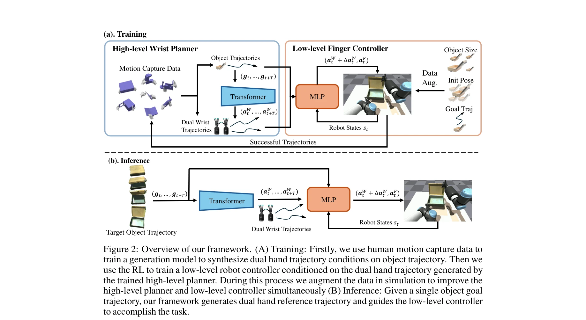
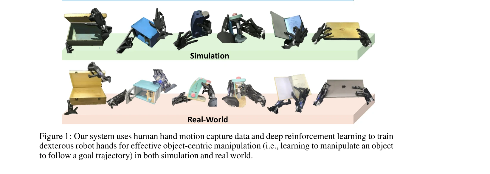

# Object-Centric Dexterous Manipulation from Human Motion Data

> **저자**: Yuanpei Chen, Chen Wang, Yaodong Yang, C. Karen Liu | **날짜**: 2024-11-06 | **URL**: [https://arxiv.org/abs/2411.04005](https://arxiv.org/abs/2411.04005)

---

## Essence

*Figure 2: Overview of our framework. (A) Training: Firstly, we use human motion capture data to*

Human hand motion capture 데이터로부터 학습한 high-level wrist planner과 deep reinforcement learning으로 훈련한 low-level finger controller를 계층적으로 결합하여, embodiment gap을 극복하면서 다자유도 로봇 손의 object-centric 조작을 실현한다.

## Motivation

- **Known**: Deep reinforcement learning을 통해 로봇 손가락 움직임을 학습할 수 있으며, human motion capture 데이터는 로봇 조작 학습을 위한 귀중한 자원으로 인식되고 있다.
- **Gap**: 기존 RL 방식은 높은 자유도의 액션 공간으로 인해 bimanual multi-finger hands 제어가 실제로 어렵고, 직접적인 human hand motion retargeting은 human-robot embodiment gap으로 인해 task 성공을 보장하지 못한다.
- **Why**: Human-level dexterity를 갖춘 bimanual multi-finger 로봇 시스템 개발은 로보틱스의 오랜 목표이며, 실제 로봇 데이터 수집 없이 large-scale human motion data를 활용할 수 있다면 스케일러블한 로봇 학습이 가능하다.
- **Approach**: Hierarchical policy learning framework로서, human motion capture dataset으로부터 wrist trajectory generative model(high-level planner)을 학습한 후, 생성된 wrist motion을 조건으로 하여 deep RL로 low-level finger controller를 훈련한다. 이를 통해 embodiment gap을 극복하면서도 action space complexity를 감소시킨다.

## Achievement

*Figure 1: Our system uses human hand motion capture data and deep reinforcement learning to train*

- **계층적 정책 학습 프레임워크**: Human wrist motion은 embodiment gap에 덜 민감하다는 관찰을 기반으로 high-level planner와 low-level controller의 이원적 구조를 제안하여 학습 효율성을 획기적으로 개선
- **광범위한 일반화 성능**: 10개 가정용 물체에 대한 광범위한 실험을 통해 novel object geometries와 unseen motion trajectories에 대한 강력한 일반화 능력을 입증
- **실제 로봇 시스템 전이**: Simulation에서 학습한 정책을 bimanual dexterous robot 시스템으로 성공적으로 전이하여 실제 환경에서의 적용 가능성을 입증
- **Human data 기반 학습**: ARCTIC 데이터셋(51시간의 hand-object manipulation sequences)을 활용하여 실제 로봇 데이터 수집의 부담을 제거

## How

*Figure 2: Overview of our framework. (A) Training: Firstly, we use human motion capture data to*

- High-level planner: Transformer 기반 generative model을 ARCTIC motion capture 데이터로 훈련하여 object goal trajectory를 조건으로 human-like wrist trajectory 생성
- Low-level controller: Deep RL(MLP 기반)을 통해 wrist trajectory와 current robot state를 입력으로 finger actions 학습, 동시에 residual wrist movement도 학습하여 최종 robot action 생성
- Reward design: Object state trajectory와 reference trajectory 간의 likelihood를 기반으로 설계하여 object-centric task 목표 달성
- Data augmentation loop: Simulation에서 successful trajectories를 수집하여 high-level planner와 low-level controller를 동시에 개선
- Sim-to-real transfer: Domain randomization과 contact dynamics modeling을 통해 simulation-to-reality gap 해소

## Originality

- Embodiment gap을 명시적으로 고려하여 wrist motion(general task knowledge)과 finger motion(embodiment-specific knowledge)을 분리 학습하는 아이디어는 혁신적
- Human motion data를 직접 retargeting하지 않고 high-level guidance로 활용하는 방식은 기존 position-based retargeting 방식과 차별화
- RL과 imitation learning의 강점을 계층적으로 결합하는 프레임워크는 새로운 접근법
- ARCTIC 같은 대규모 human motion dataset을 dexterous manipulation에 효과적으로 적용한 최초 사례 중 하나

## Limitation & Further Study

- Wrist trajectory generation 성능의 한계: High-level planner가 생성하는 wrist trajectory의 정확도는 low-level controller의 성능 상한선을 결정하는데, 이에 대한 분석 및 개선 방안이 부족
- Limited object diversity: 10개 가정용 물체로 평가했으나, 더 극단적인 물체 형태나 deformable objects로의 확장성 미검증
- Real-world 실험의 제한성: 상대적으로 제한된 수의 real-world task만 시연하여 실제 환경의 다양한 도전 요소(예: 부정확한 초기 상태, 예측 불가능한 동역학)에 대한 강건성이 완전히 입증되지 않음
- Computational cost: Transformer 기반 generative model + RL 훈련의 계산 비용 및 실시간 제어 가능성에 대한 논의 부재
- 후속 연구: Wrist trajectory generation의 정확도 향상을 위한 더 정교한 generative model 설계, deformable object 조작으로의 확장, 더 복잡한 다단계 조작 task에 대한 검증이 필요

## Evaluation

- Novelty: 4/5
- Technical Soundness: 3/5
- Significance: 4/5
- Clarity: 4/5
- Overall: 4/5

**총평**: 본 논문은 embodiment gap을 명시적으로 해결하기 위해 human motion data를 hierarchical policy learning의 high-level guidance로 활용하는 창의적인 접근법을 제시하며, 10개 물체에 대한 광범위한 실험과 real-world 전이를 통해 실용성을 입증했다. 다만 real-world 검증의 범위 확대와 계산 효율성 개선이 후속 과제이다.

## Related Papers

- 🏛 기반 연구: [[papers/1244_A_Humanoid_Visual-Tactile-Action_Dataset_for_Contact-Rich_Ma/review]] — human visual-tactile-action 데이터셋의 contact-rich 조작 경험을 로봇 손의 object-centric 조작 학습에 활용한다.
- 🔗 후속 연구: [[papers/1369_Do_As_I_Can_Not_As_I_Say_Grounding_Language_in_Robotic_Affor/review]] — 대규모 egocentric 조작 데이터를 다자유도 로봇 손의 계층적 제어 시스템으로 전환하는 방법을 제시한다.
- 🏛 기반 연구: [[papers/1335_Code-as-Monitor_Constraint-aware_Visual_Programming_for_Reac/review]] — DexCap의 손 동작 캡처 시스템에서 수집한 데이터를 로봇 손의 실제 조작 정책 학습에 적용한다.
- 🔗 후속 연구: [[papers/1451_HiWET_Hierarchical_World-Frame_End-Effector_Tracking_for_Lon/review]] — HiWET의 장기 조작 능력은 object-centric dexterous manipulation을 통해 더욱 정교한 물체 조작으로 발전할 수 있다.
