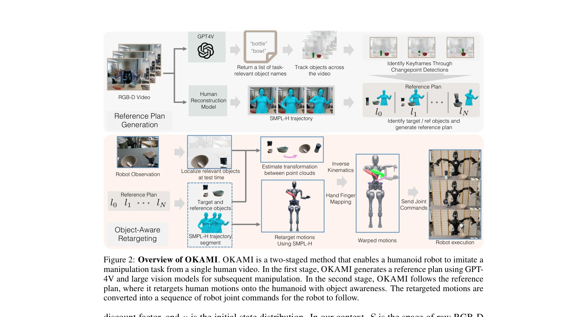
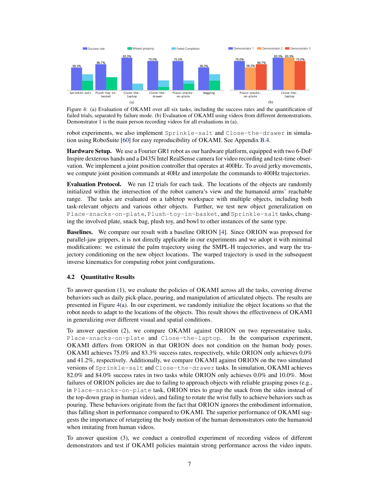

# OKAMI: Teaching Humanoid Robots Manipulation Skills through Single Video Imitation

> **저자**: Jinhan Li, Yifeng Zhu, Yuqi Xie, Zhenyu Jiang, Mingyo Seo, Georgios Pavlakos, Yuke Zhu | **날짜**: 2024-10-15 | **URL**: [https://arxiv.org/abs/2410.11792](https://arxiv.org/abs/2410.11792)

---

## Essence

*Figure 2: Overview of OKAMI. OKAMI is a two-staged method that enables a humanoid robot to imitate a*

OKAMI는 단일 RGB-D 비디오에서 휴머노이드 로봇의 조작 능력을 학습하는 방법으로, object-aware retargeting을 통해 인간의 동작을 다양한 물체 위치에 적응시켜 79.2%의 성공률을 달성한다.

## Motivation

- **Known**: 휴머노이드 로봇의 조작 학습은 일반적으로 teleoperation을 통한 대량의 시연이 필요하며, motion retargeting 기술은 컴퓨터 그래픽스에서 광범위하게 연구되었다.
- **Gap**: 기존 motion retargeting 방법들은 자유 공간 동작에만 초점을 맞추고 물체 상호작용의 맥락을 반영하지 못하며, 단일 비디오 시연으로부터 휴머노이드 로봇을 학습시키는 것은 미해결 문제이다.
- **Why**: 인간처럼 단일 비디오 시연으로부터 학습할 수 있는 로봇은 스케일 가능한 로봇 학습과 실생활 배포에 근본적으로 중요하며, Internet-scale 인간 활동 비디오 기반의 로봇 파운데이션 모델 개발을 가능하게 한다.
- **Approach**: OKAMI는 RGB-D 비디오로부터 manipulation plan을 생성하고, object-aware retargeting을 통해 인간 동작을 휴머노이드 로봇에 적응시키며, 생성된 궤적으로 visuomotor policy를 학습한다.

## Achievement

*Figure 4: (a) Evaluation of OKAMI over all six tasks, including the success rates and the quantification of*

- **Object-aware retargeting**: 물체의 맥락 정보를 활용하여 신체 동작과 손 포즈를 분리 retargeting함으로써 71.7% 성공률 달성 및 ORION 대비 58.3% 향상
- **Vision foundation model 통합**: GPT4V 및 tracking 기술을 사용하여 task-relevant object를 자동 식별하고 테스트 시간에 새로운 물체 인스턴스에 적응
- **Closed-loop policy 학습**: OKAMI 생성 궤적으로부터 behavioral cloning을 통해 79.2%의 평균 성공률을 달성하며 labor-intensive teleoperation 불필요
- **실제 로봇 검증**: 다양한 object layout, 시각적 배경, 새로운 물체 인스턴스에 대해 spatial 및 visual generalization 능력 입증

## How

*Figure 2: Overview of OKAMI. OKAMI is a two-staged method that enables a humanoid robot to imitate a*

- **Stage 1 - Reference Plan Generation**: RGB-D 비디오에서 SMPL-H를 사용한 인간 동작 재구성, GPT4V를 통한 task-relevant 물체 식별, changepoint detection을 통한 keyframe 추출
- **Stage 2 - Object-aware Retargeting**: 참조 계획을 task space에서 retarget한 후 물체 위치에 따라 궤적 warping, inverse kinematics로 관절각 계산, 손가락 매핑을 통한 hand-object interaction 재현
- **Test-time Adaptation**: 테스트 시간에 point cloud 기반 transformation estimation을 통해 현재 물체 위치를 감지하고 retarget된 궤적을 새로운 환경에 적응
- **Visuomotor Policy Training**: OKAMI가 생성한 open-loop 궤적에 대해 behavioral cloning으로 vision-based closed-loop 정책 학습

## Originality

- Object-aware retargeting 개념 도입: 기존 motion retargeting에 물체 맥락을 통합하여 조작 작업에 특화
- Body motion과 hand pose의 분리된 retargeting: 신체와 손을 독립적으로 처리하여 유연성과 정확도 향상
- Single video imitation을 위한 통합 파이프라인: vision foundation model, motion reconstruction, kinematic adaptation을 end-to-end로 연결
- Humanoid 로봇의 kinematic 유사성 활용: 인간-로봇 간 구조 유사성을 직접 활용하여 효율적인 적응 가능

## Limitation & Further Study

- SMPL-H 기반 재구성의 정확도가 occluded hands나 복잡한 interactions에서 제한될 수 있음
- Object localization이 실패하거나 물체가 명확하게 보이지 않는 경우 대한 robustness 미검증
- Dexterous hand의 복잡한 조작(in-hand manipulation 등)에 대한 손가락 매핑의 한계 미논의
- 현재는 bimanual dexterous hand를 가진 특정 휴머노이드 플랫폼에 제한되어 있으며, 다른 형태의 로봇으로의 일반화 가능성 미명확
- **후속 연구**: (1) 더 정확한 hand tracking과 reconstruction 방법 개발, (2) hand-object occlusion 처리, (3) long-horizon tasks와 multi-step planning 지원, (4) 다양한 로봇 형태에 대한 적응 메커니즘

## Evaluation

- Novelty: 4/5
- Technical Soundness: 3/5
- Significance: 4/5
- Clarity: 4/5
- Overall: 4/5

**총평**: OKAMI는 단일 비디오로부터 휴머노이드 조작 학습이라는 중요한 문제에 대해 object-aware retargeting이라는 혁신적이고 실용적인 해결책을 제시하며, 79.2% 성공률과 우수한 generalization으로 상당한 진전을 보여준다.

## Related Papers

- 🔄 다른 접근: [[papers/1515_Phantom_Training_Robots_Without_Robots_Using_Only_Human_Vide/review]] — 단일 RGB-D 비디오로 휴머노이드 조작을 학습하는 OKAMI와 인간 비디오만으로 로봇 정책을 훈련하는 Phantom이 동일한 비디오 기반 학습 문제를 다룬다.
- 🏛 기반 연구: [[papers/1566_Masquerade_Learning_from_In-the-wild_Human_Videos_using_Data/review]] — 단일 비디오에서 휴머노이드 조작 학습하는 OKAMI의 접근법이 야생 인간 비디오로 마스크된 학습을 하는 Masquerade의 기반이 된다.
- 🔗 후속 연구: [[papers/1352_DPL_Depth-only_Perceptive_Humanoid_Locomotion_via_Realistic/review]] — object-aware retargeting을 통한 OKAMI의 조작 학습이 사전훈련된 확산 모델을 활용한 DemoDiffusion으로 확장될 수 있다.
- 🔗 후속 연구: [[papers/1495_NORA_A_Small_Open-Sourced_Generalist_Vision_Language_Action/review]] — TinyVLA와 NORA가 모두 소형 VLA 모델로서 빠르고 데이터 효율적인 로봇 제어의 상호 보완적 접근을 제시한다.
