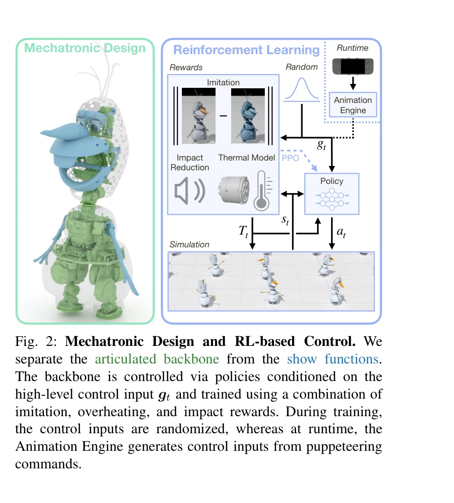
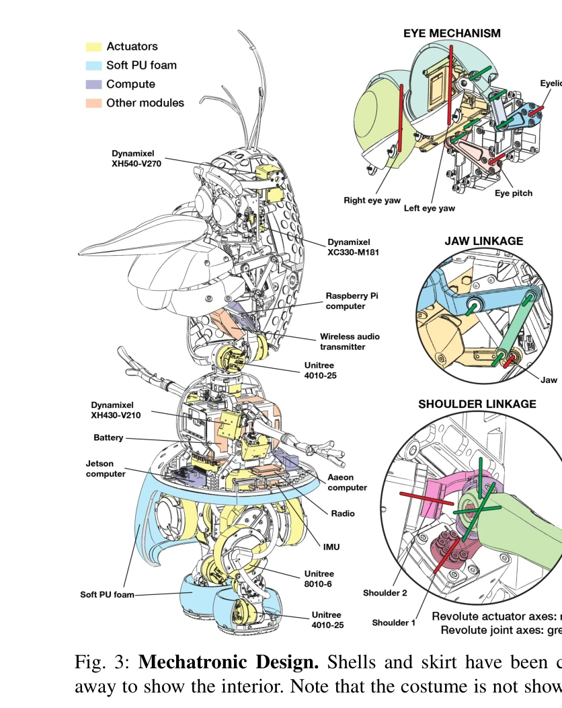

# Olaf: Bringing an Animated Character to Life in the Physical World

> **저자**: David Müller, Espen Knoop, Dario Mylonopoulos, Agon Serifi, Michael A. Hopkins, Ruben Grandia, Moritz Bächer | **날짜**: 2025-12-18 | **URL**: [https://arxiv.org/abs/2512.16705](https://arxiv.org/abs/2512.16705)

---

## Essence

*Fig. 1: Olaf Robot.*

애니메이션 캐릭터 올라프를 물리적 로봇으로 구현하기 위해 컴팩트한 메카트로닉 설계와 reinforcement learning 기반 제어를 결합하여 비물리적 움직임의 믿음성 있는 재현을 달성했다.

## Motivation

- **Known**: 다리 로봇의 설계와 제어는 기능성, 견고성, 효율성 중심으로 발전해왔으며, RL은 견고한 보행 제어 및 모방 학습에 성공적으로 적용되어 왔다.
- **Gap**: 애니메이션 캐릭터의 비물리적 비율과 움직임 스타일을 물리적 로봇으로 구현하면서 동시에 캐릭터의 믿음성을 유지하는 것은 메카닉 설계와 제어 모두에서 미해결 문제이다.
- **Why**: 로봇이 엔터테인먼트나 동반자 역할을 수행하는 도메인으로 확대되면서 기능성뿐 아니라 믿음성과 캐릭터 충실도가 핵심 요구사항이 되었다.
- **Approach**: 비대칭 6-DoF 다리 메커니즘과 구형 및 평면 linkage를 활용한 컴팩트 설계와 온도 모니터링 및 충격음 감소 보상 함수를 포함한 PPO 기반 RL 정책으로 접근했다.

## Achievement

*Fig. 2: Mechatronic Design and RL-based Control. We*

- **메카트로닉 설계**: 비대칭 6-DoF 다리 메커니즘, 구형 5-bar linkage 어깨, 평면 linkage 입과 눈을 통해 공간 제약 내에서 높은 충실도의 표현력 있는 움직임 구현
- **열인식 정책(Thermal-aware Policy)**: 작동기 온도를 입력으로 받아 과열을 방지하도록 학습하는 제어 정책 개발
- **충격음 감소 보상**: 발걸음 소음을 현저히 감소시키는 보상 함수로 캐릭터의 믿음성 보존
- **시뮬레이션과 실제 로봇 검증**: 개발된 설계와 제어 방법의 효율성을 시뮬레이션과 실제 하드웨어에서 모두 검증

## How

*Fig. 3: Mechatronic Design. Shells and skirt have been cut*

- 6-DoF leg mechanism을 비대칭으로 설계하여 좌측 다리는 rear-facing hip roll, 우측은 forward hip roll로 배치해 공간 효율성 극대화
- 원형 foam skirt로 다리를 숨기면서도 충분한 가동 범위 확보
- spherical 5-bar linkage를 이용한 원격 구동으로 어깨와 눈의 actuator를 torso 내부에 배치
- thermal model을 시뮬레이션에 통합하고 temperature value를 정책 입력으로 포함
- animation reference를 모방하는 imitation reward와 joint limit, collision penalty를 결합한 다중 보상 함수 설계
- animation engine과 RL 정책을 분리하여 animation tracking control input을 동적으로 생성
- PPO 알고리즘으로 standing과 walking 정책을 별도 학습

## Originality

- 기존 로봇 설계와 달리 기예술적 캐릭터 충실도를 1순위로 하면서 기능성을 보조적으로 취급하는 역전된 설계 철학
- 비대칭 다리 메커니즘은 캐릭터 비율 제약을 메카닉 혁신으로 해결하는 novel한 접근
- thermal-aware policy는 RL의 실세계 적용에서 작동기 안정성을 명시적으로 고려한 새로운 시도
- 충격음 감소를 정책 학습 목표에 직접 통합하여 움직임의 믿음성을 정량화한 혁신적 보상 설계

## Limitation & Further Study

- 컴팩트 설계로 인한 공간 제약이 가동 범위를 제한하며, 이는 기술적으로 동작하지만 비물리적 움직임의 완전한 재현에는 한계가 있을 수 있음
- thermal-aware policy는 올라프의 특정 하드웨어 구성에 맞춰 설계되어 다른 로봇이나 환경에의 일반화 가능성 검토 필요
- 충격음 감소 보상의 효과가 바닥재 유형이나 걷기 속도 변화에 따라 어떻게 변하는지에 대한 분석 부재
- 후속 연구: 더 다양한 표정과 상호작용 동작 추가, 장시간 운영 시 열 관리 최적화, 다양한 지형에서의 견고성 검증

## Evaluation

- Novelty: 4/5
- Technical Soundness: 4/5
- Significance: 4/5
- Clarity: 4/5
- Overall: 4/5

**총평**: 이 논문은 애니메이션 캐릭터를 물리적 로봇으로 구현하는 복합적 도전 과제를 메카트로닉 설계 혁신과 맞춤형 RL 정책으로 우아하게 해결하였으며, 특히 thermal-aware control과 소음 감소 보상이라는 새로운 기여로 엔터테인먼트 로봇의 현실화를 크게 앞당겼다.

## Related Papers

- 🏛 기반 연구: [[papers/1350_Deep_Reinforcement_Learning_for_Robotics_A_Survey_of_Real-Wo/review]] — 표현적 휴머노이드 보행을 위한 자율적 디자인 접근법이 애니메이션 캐릭터 구현을 위한 움직임 생성의 이론적 기초를 제공합니다.
- 🔄 다른 접근: [[papers/1267_AMP_Adversarial_Motion_Priors_for_Stylized_Physics-Based_Cha/review]] — 물리 기반 캐릭터 애니메이션에서 적대적 모션 사전과 강화학습 기반 제어가 서로 다른 접근 방식을 제시합니다.
- 🔗 후속 연구: [[papers/1332_CLIP-Fields_Weakly_Supervised_Semantic_Fields_for_Robotic_Me/review]] — 오픈소스 접근 가능한 휴머노이드 플랫폼이 올라프와 같은 특수 캐릭터 로봇의 개발을 위한 하드웨어 기반을 확장할 수 있습니다.
- 🔄 다른 접근: [[papers/1546_Learning_to_Walk_in_Costume_Adversarial_Motion_Priors_for_Ae/review]] — 두 논문 모두 엔터테인먼트용 캐릭터의 물리적 구현을 다루지만, 미학적 제약 vs 애니메이션 캐릭터 구현이라는 서로 다른 접근법을 제시함
